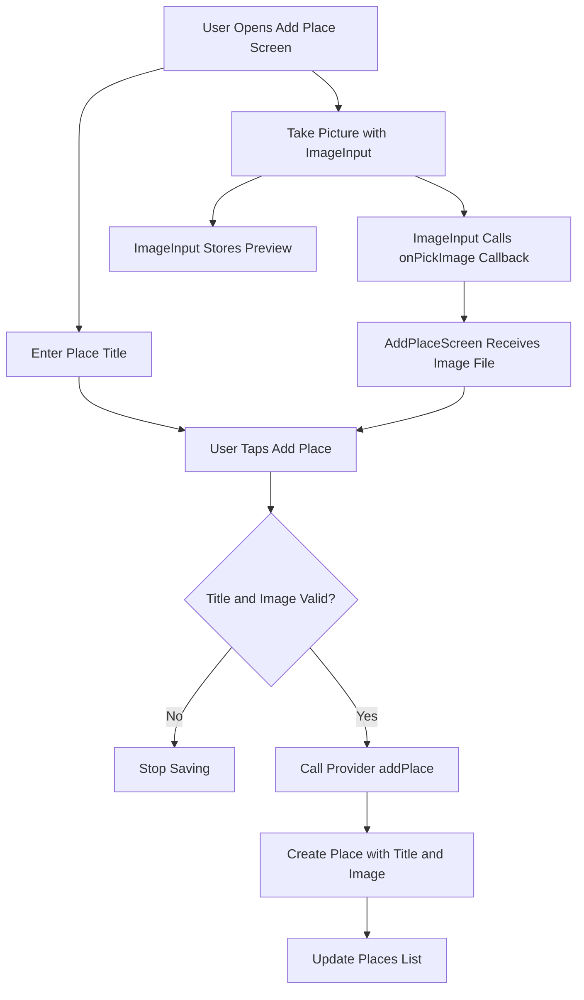
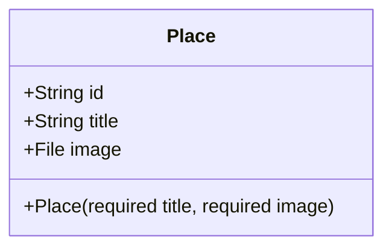
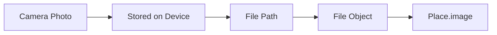
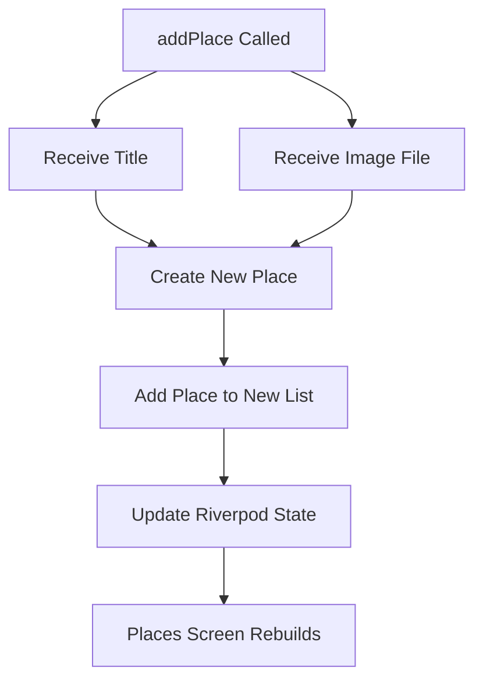
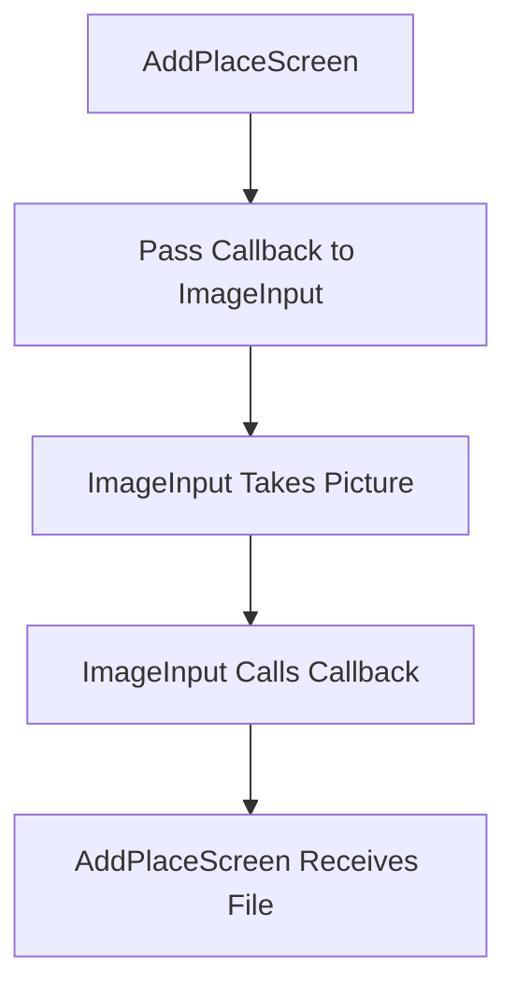
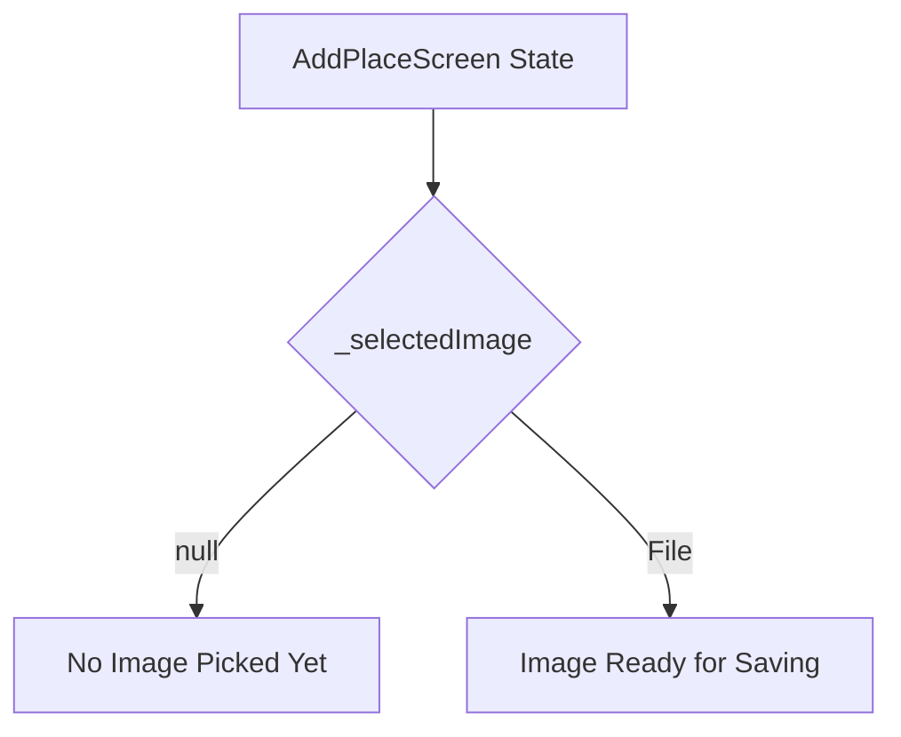
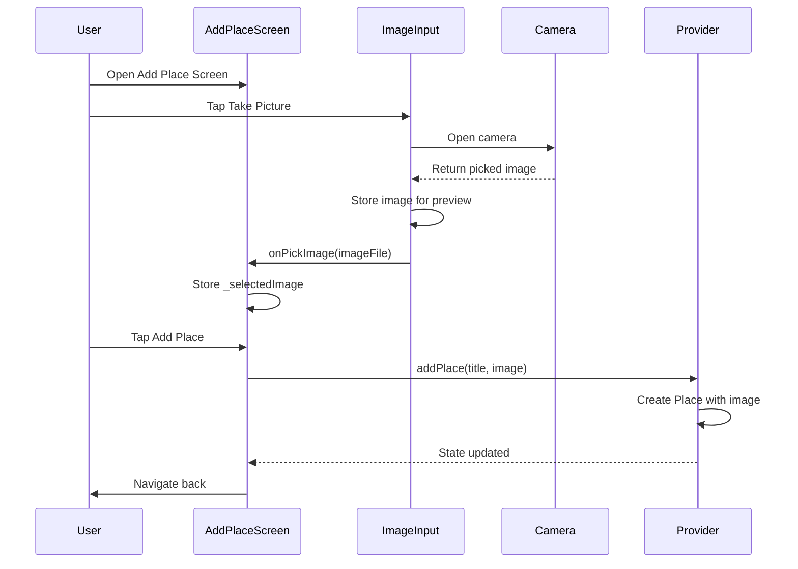
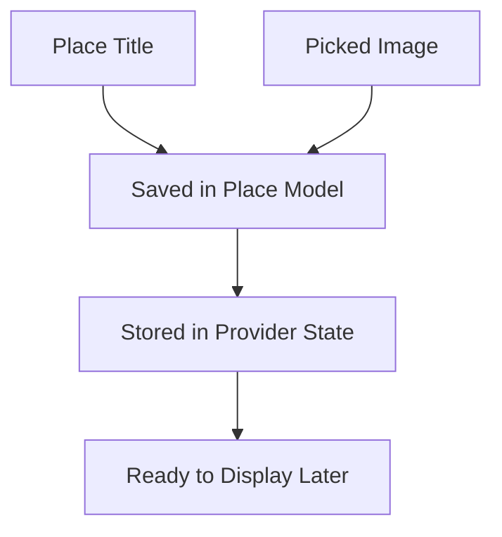

# Adding the Picked Image to the Model and Add Place Form

## Overview

This lecture updates the Favorite Places app so that the image taken by the user is saved together with the place title.

Previously, the `ImageInput` widget could open the device camera and show a preview of the selected image. However, the selected image only existed inside the `ImageInput` widget. It was not passed back to the Add Place form and was not stored in the `Place` model.

In this lecture, the app is updated so that:

* The `Place` model stores an image.
* The `ImageInput` widget sends the selected image to its parent.
* The `AddPlaceScreen` stores the selected image temporarily.
* The provider receives both the title and image when creating a new place.

---

## Learning Goals

By the end of this lecture, you should be able to:

* Add a `File` field to a Dart model
* Import and use `dart:io`
* Pass data from a child widget to a parent widget using a callback
* Store selected image data in form state
* Validate that both title and image are provided
* Update a Riverpod provider method to accept multiple values
* Create a `Place` object that includes an image

---

## Updated Data Flow



---

# 1. Updating the Place Model

The `Place` model should now store an image in addition to the `id` and `title`.

Open:

```text
lib/models/place.dart
```

---

## Updated `place.dart`

```dart
import 'dart:io';

import 'package:uuid/uuid.dart';

const uuid = Uuid();

class Place {
  Place({
    required this.title,
    required this.image,
  }) : id = uuid.v4();

  final String id;
  final String title;
  final File image;
}
```

> Note: If your project uses `name` instead of `title`, keep using `name` consistently.

---

## Code Explanation

### Importing `dart:io`

```dart
import 'dart:io';
```

The `File` type comes from Dart's `io` library.

Since the image taken with the camera is stored as a local file on the device, the model needs a `File` field.

---

## New Image Field

```dart
final File image;
```

Each `Place` now stores a reference to the selected image file.

The model now contains:

| Field   | Type     | Purpose                         |
| ------- | -------- | ------------------------------- |
| `id`    | `String` | Unique identifier               |
| `title` | `String` | Place title entered by the user |
| `image` | `File`   | Photo taken for the place       |

---

## Updated Place Model Structure



---

# 2. Why Store the Image as a File?

The app stores the image as a `File`, not as raw image bytes.

This is useful because:

* The image already exists as a file on the device.
* The app can display it with `Image.file`.
* The model stores a lightweight reference to the file.
* The full image data does not need to be loaded into memory immediately.



---

# 3. Updating the Provider

The provider currently creates a place using only the title.

Now it must also receive an image.

Open:

```text
lib/providers/user_places.dart
```

---

## Updated `user_places.dart`

```dart
import 'dart:io';

import 'package:flutter_riverpod/flutter_riverpod.dart';

import '../models/place.dart';

class UserPlacesNotifier extends StateNotifier<List<Place>> {
  UserPlacesNotifier() : super(const []);

  void addPlace(String title, File image) {
    final newPlace = Place(
      title: title,
      image: image,
    );

    state = [newPlace, ...state];
  }
}

final userPlacesProvider =
    StateNotifierProvider<UserPlacesNotifier, List<Place>>(
  (ref) => UserPlacesNotifier(),
);
```

---

## Provider Method Update

Before:

```dart
void addPlace(String title) {
  final newPlace = Place(title: title);
  state = [newPlace, ...state];
}
```

After:

```dart
void addPlace(String title, File image) {
  final newPlace = Place(
    title: title,
    image: image,
  );

  state = [newPlace, ...state];
}
```

The provider now requires both:

* The entered title
* The selected image file

---

## Provider Update Flow



---

# 4. Passing the Image from Child to Parent

The selected image is created inside the `ImageInput` widget.

However, the Add Place form needs that image when saving the place.

To pass the image upward, the app uses a callback function.



---

# 5. Updating the ImageInput Widget

Open:

```text
lib/widgets/image_input.dart
```

The `ImageInput` widget should now accept a callback.

---

## Updated `ImageInput` Constructor

```dart
class ImageInput extends StatefulWidget {
  const ImageInput({
    super.key,
    required this.onPickImage,
  });

  final void Function(File image) onPickImage;

  @override
  State<ImageInput> createState() {
    return _ImageInputState();
  }
}
```

---

## Callback Type

```dart
final void Function(File image) onPickImage;
```

This means `onPickImage` is a function that:

* Returns nothing: `void`
* Accepts one argument: `File image`

The parent widget will provide this function.

---

## Calling the Callback

After the image is picked and converted to a `File`, call the callback:

```dart
widget.onPickImage(imageFile);
```

This sends the selected image from `ImageInput` to `AddPlaceScreen`.

---

## Updated `_takePicture`

```dart
void _takePicture() async {
  final imagePicker = ImagePicker();

  final pickedImage = await imagePicker.pickImage(
    source: ImageSource.camera,
    maxWidth: 600,
  );

  if (pickedImage == null) {
    return;
  }

  final imageFile = File(pickedImage.path);

  setState(() {
    _selectedImage = imageFile;
  });

  widget.onPickImage(imageFile);
}
```

---

## Why Use `widget.onPickImage`?

Inside a `State` class, constructor properties from the `StatefulWidget` are accessed through the `widget` property.

```dart
widget.onPickImage(imageFile);
```

This means:

```text
Call the callback function that was passed into ImageInput.
```

---

# 6. Final `image_input.dart`

```dart
import 'dart:io';

import 'package:flutter/material.dart';
import 'package:image_picker/image_picker.dart';

class ImageInput extends StatefulWidget {
  const ImageInput({
    super.key,
    required this.onPickImage,
  });

  final void Function(File image) onPickImage;

  @override
  State<ImageInput> createState() {
    return _ImageInputState();
  }
}

class _ImageInputState extends State<ImageInput> {
  File? _selectedImage;

  void _takePicture() async {
    final imagePicker = ImagePicker();

    final pickedImage = await imagePicker.pickImage(
      source: ImageSource.camera,
      maxWidth: 600,
    );

    if (pickedImage == null) {
      return;
    }

    final imageFile = File(pickedImage.path);

    setState(() {
      _selectedImage = imageFile;
    });

    widget.onPickImage(imageFile);
  }

  @override
  Widget build(BuildContext context) {
    Widget content = TextButton.icon(
      onPressed: _takePicture,
      icon: const Icon(Icons.camera),
      label: const Text('Take Picture'),
    );

    if (_selectedImage != null) {
      content = GestureDetector(
        onTap: _takePicture,
        child: Image.file(
          _selectedImage!,
          fit: BoxFit.cover,
          width: double.infinity,
          height: double.infinity,
        ),
      );
    }

    return Container(
      decoration: BoxDecoration(
        border: Border.all(
          width: 1,
          color: Theme.of(context).colorScheme.primary.withOpacity(0.2),
        ),
      ),
      height: 250,
      width: double.infinity,
      alignment: Alignment.center,
      child: content,
    );
  }
}
```

---

# 7. Updating the Add Place Screen

The Add Place screen must now store the selected image in its own state.

Open:

```text
lib/screens/add_place.dart
```

---

## Add a Selected Image Variable

Inside `_AddPlaceScreenState`, add:

```dart
File? _selectedImage;
```

Because `File` is used, import `dart:io`.

```dart
import 'dart:io';
```

---

## Why Nullable?

```dart
File? _selectedImage;
```

The value is nullable because initially the user has not taken a picture yet.



---

# 8. Receiving the Image from ImageInput

Update the `ImageInput` widget usage.

```dart
ImageInput(
  onPickImage: (image) {
    _selectedImage = image;
  },
),
```

The anonymous function receives the image file from the child widget and stores it in the parent screen state.

---

## Why No `setState()` Here?

The Add Place screen does not need to visually change when the image is selected.

The preview UI is handled inside `ImageInput`, and that widget already uses `setState()`.

Therefore, this is enough:

```dart
_selectedImage = image;
```

No rebuild is required in `AddPlaceScreen`.

---

# 9. Updating the Save Logic

The save method now needs to validate both title and image.

```dart
void _savePlace() {
  final enteredTitle = _titleController.text;

  if (enteredTitle.isEmpty || _selectedImage == null) {
    return;
  }

  ref.read(userPlacesProvider.notifier).addPlace(
        enteredTitle,
        _selectedImage!,
      );

  Navigator.of(context).pop();
}
```

---

## Validation Logic

```dart
if (enteredTitle.isEmpty || _selectedImage == null) {
  return;
}
```

This prevents saving if:

* The title is empty
* No image was selected

A stricter version can use `trim()`:

```dart
if (enteredTitle.trim().isEmpty || _selectedImage == null) {
  return;
}
```

This also rejects whitespace-only titles.

---

## Why Use `_selectedImage!`?

After this validation:

```dart
if (enteredTitle.isEmpty || _selectedImage == null) {
  return;
}
```

Dart still needs confirmation that `_selectedImage` is not null when passed into `addPlace`.

So the non-null assertion operator is used:

```dart
_selectedImage!
```

This tells Dart:

```text
At this point, this value is definitely not null.
```

---

# 10. Final `add_place.dart`

```dart
import 'dart:io';

import 'package:flutter/material.dart';
import 'package:flutter_riverpod/flutter_riverpod.dart';

import '../providers/user_places.dart';
import '../widgets/image_input.dart';

class AddPlaceScreen extends ConsumerStatefulWidget {
  const AddPlaceScreen({super.key});

  @override
  ConsumerState<AddPlaceScreen> createState() {
    return _AddPlaceScreenState();
  }
}

class _AddPlaceScreenState extends ConsumerState<AddPlaceScreen> {
  final _titleController = TextEditingController();
  File? _selectedImage;

  void _savePlace() {
    final enteredTitle = _titleController.text;

    if (enteredTitle.trim().isEmpty || _selectedImage == null) {
      return;
    }

    ref.read(userPlacesProvider.notifier).addPlace(
          enteredTitle,
          _selectedImage!,
        );

    Navigator.of(context).pop();
  }

  @override
  void dispose() {
    _titleController.dispose();
    super.dispose();
  }

  @override
  Widget build(BuildContext context) {
    return Scaffold(
      appBar: AppBar(
        title: const Text('Add new Place'),
      ),
      body: SingleChildScrollView(
        padding: const EdgeInsets.all(12),
        child: Column(
          children: [
            TextField(
              controller: _titleController,
              style: TextStyle(
                color: Theme.of(context).colorScheme.onBackground,
              ),
              decoration: const InputDecoration(
                labelText: 'Title',
              ),
            ),
            const SizedBox(height: 10),
            ImageInput(
              onPickImage: (image) {
                _selectedImage = image;
              },
            ),
            const SizedBox(height: 16),
            ElevatedButton.icon(
              onPressed: _savePlace,
              icon: const Icon(Icons.add),
              label: const Text('Add Place'),
            ),
          ],
        ),
      ),
    );
  }
}
```

---

# 11. Complete Image Save Flow



---

# 12. Current App Behavior

After this lecture, the app can:

* Let the user enter a place title
* Let the user take a picture
* Preview the selected image
* Store the selected image in the Add Place form
* Validate that title and image exist
* Pass both title and image to the provider
* Create a `Place` object that includes an image

However, the list and detail screens still need to be updated to display the saved image.

---

## Current Feature Status



---

# 13. Key Points

* The `Place` model now includes a required `File image` field.
* The model imports `dart:io` to use `File`.
* The provider's `addPlace` method now accepts both title and image.
* The `ImageInput` widget accepts an `onPickImage` callback.
* The callback sends the picked image to `AddPlaceScreen`.
* `AddPlaceScreen` stores the image in `File? _selectedImage`.
* The save method validates both title and image.
* `_selectedImage!` is used after validation to pass a non-null file.
* No `setState()` is needed in `AddPlaceScreen` when storing the picked image because the parent UI does not need to rebuild.

---

## Notes

Adding the image to the model improves data integrity. A favorite place should now always have both a title and an image.

The callback pattern is a clean way to pass data from a child widget to a parent widget. In this app, `ImageInput` manages the image preview locally, while `AddPlaceScreen` stores the selected image so it can be saved with the place.

This separation keeps the code clear:

* `ImageInput` handles taking and previewing the image.
* `AddPlaceScreen` handles form submission.
* `UserPlacesNotifier` handles updating app-wide state.

---

## Summary

This lecture connects the selected camera image to the rest of the app.

The `Place` model now stores an image, the provider creates places with both title and image, and the Add Place form receives the picked image through a callback from the `ImageInput` widget.

The next step is to display the saved image in the places list and detail screen.
