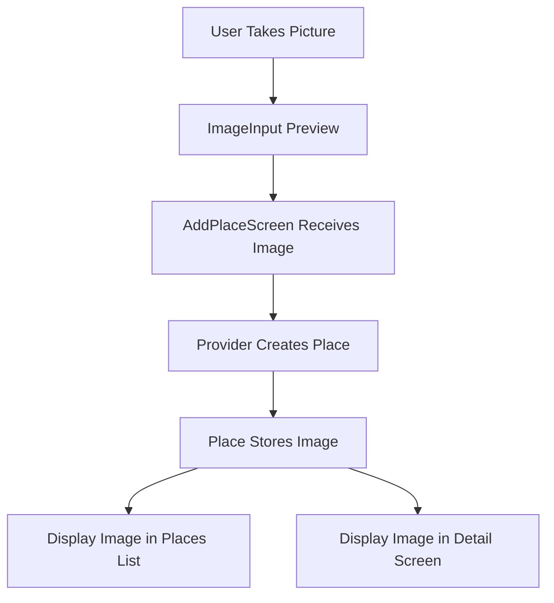
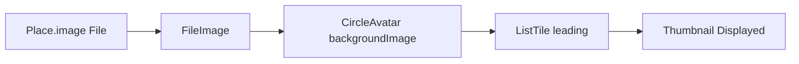
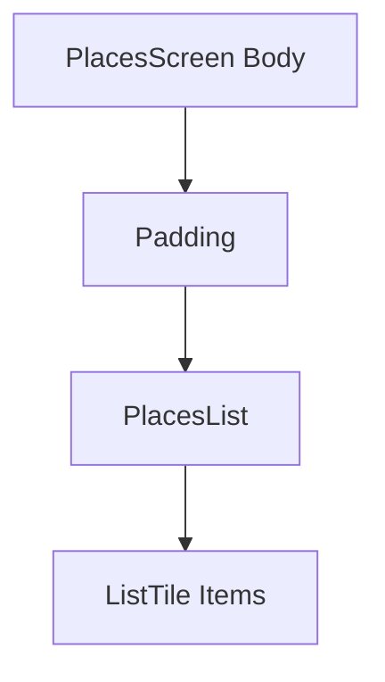
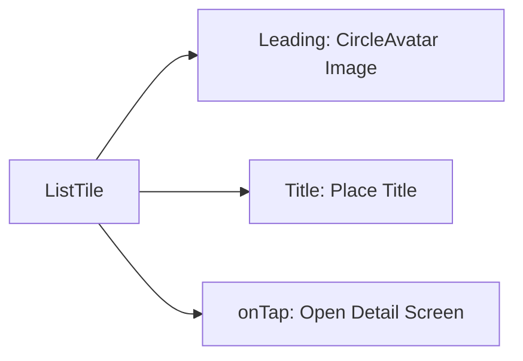
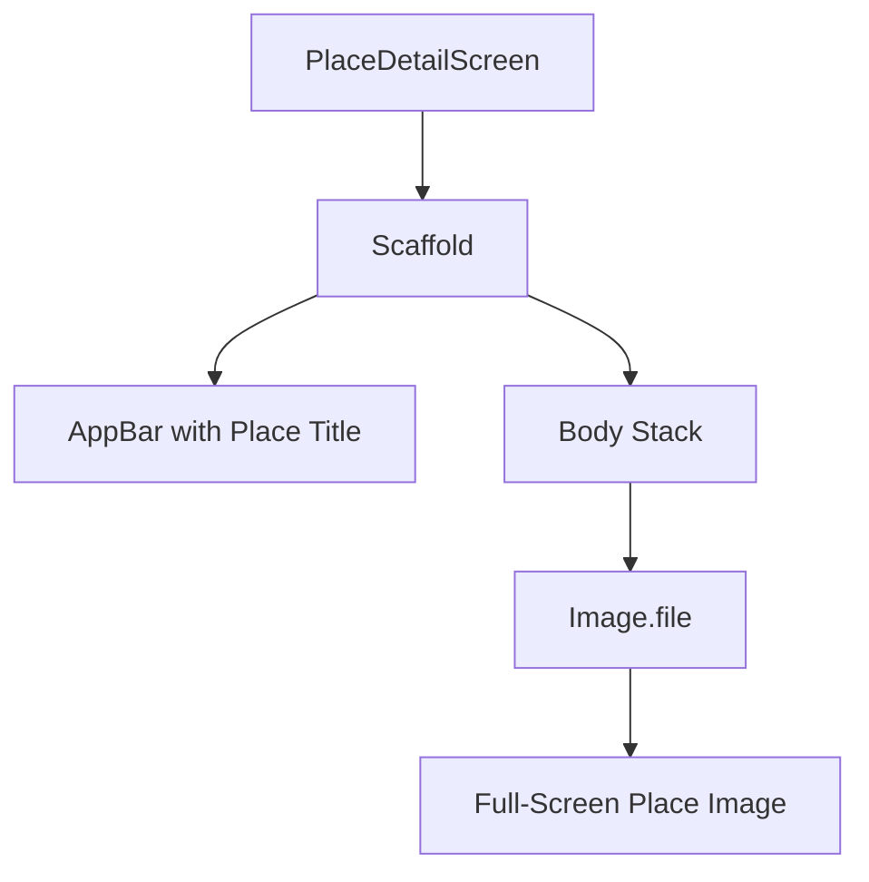
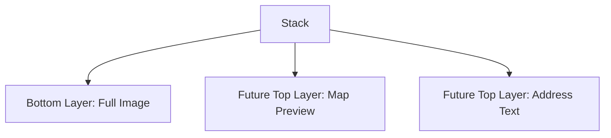
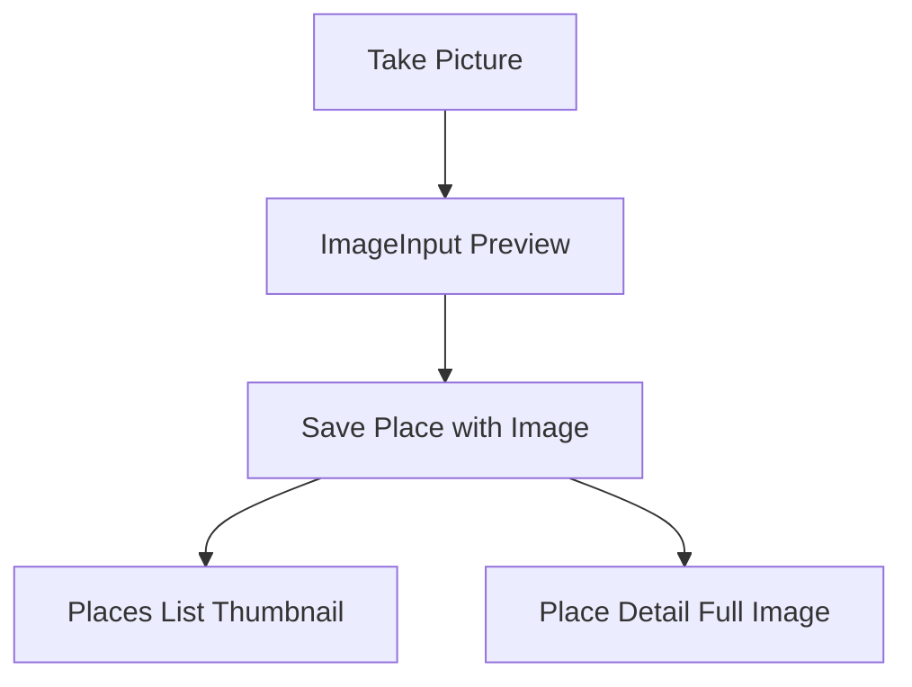
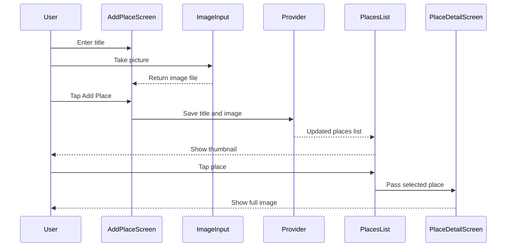

# Previewing the Picked Image

## Overview

This lecture updates the Favorite Places app so that picked images are displayed throughout the UI.

In the previous lecture, the selected image was added to the `Place` model and saved through the provider. Now that each `Place` object contains an image, the app can display that image in the places list and on the detail screen.

The Places list will show a small circular thumbnail for each place. The Place Detail screen will show the selected image as a large full-screen background image.

---

## Learning Goals

By the end of this lecture, you should be able to:

* Display a local image file in Flutter
* Use `FileImage` as an `ImageProvider`
* Add a circular image thumbnail to a `ListTile`
* Use the `leading` parameter of `ListTile`
* Add padding around a list
* Display a full-screen image with `Image.file`
* Use `Stack` to prepare for overlaying more UI content later

---

## Current App Status

Before this lecture, the app can already:

* Let the user enter a place title
* Open the camera
* Take a picture
* Preview the picture inside the `ImageInput` widget
* Save the title and image into the `Place` model
* Store the place in Riverpod state

Now, the goal is to display the saved image in the rest of the app.



---

# 1. Displaying an Image Thumbnail in the Places List

Open the file:

```text id="h8m6sc"
lib/widgets/places_list.dart
```

Each place is displayed using a `ListTile`.

Previously, the `ListTile` only displayed the place title.

Now, it will also display the place image as a circular thumbnail.

---

## Updated `ListTile`

```dart id="6ymar7"
return ListTile(
  leading: CircleAvatar(
    radius: 26,
    backgroundImage: FileImage(places[index].image),
  ),
  title: Text(
    places[index].title,
    style: Theme.of(context).textTheme.titleMedium!.copyWith(
          color: Theme.of(context).colorScheme.onBackground,
        ),
  ),
  onTap: () {
    Navigator.of(context).push(
      MaterialPageRoute(
        builder: (ctx) => PlaceDetailScreen(
          place: places[index],
        ),
      ),
    );
  },
);
```

> Note: If your model uses `name` instead of `title`, replace `places[index].title` with `places[index].name`.

---

## Code Explanation

### `leading`

```dart id="zo1vrk"
leading: CircleAvatar(...)
```

The `leading` parameter places a widget at the start of the `ListTile`.

This is commonly used for:

* Icons
* Avatars
* Thumbnails
* Profile pictures

In this app, it displays the place image.

---

### `CircleAvatar`

```dart id="5nb2u1"
CircleAvatar(
  radius: 26,
  backgroundImage: FileImage(places[index].image),
)
```

`CircleAvatar` displays circular content.

Here, it creates a round image thumbnail for each place.

| Property          | Purpose                             |
| ----------------- | ----------------------------------- |
| `radius: 26`      | Controls the size of the circle     |
| `backgroundImage` | Displays an image inside the circle |
| `FileImage(...)`  | Loads the image from a local file   |

---

# 2. Why Use `FileImage` Instead of `Image.file`?

Inside `CircleAvatar`, the `backgroundImage` parameter does not expect a widget.

It expects an `ImageProvider`.

That is why this code uses:

```dart id="mgush3"
FileImage(places[index].image)
```

instead of:

```dart id="4vot31"
Image.file(places[index].image)
```

---

## `Image.file` vs `FileImage`

| API                | Type          | Use Case                                                   |
| ------------------ | ------------- | ---------------------------------------------------------- |
| `Image.file(file)` | Widget        | Display an image directly in the widget tree               |
| `FileImage(file)`  | ImageProvider | Provide an image to another widget, such as `CircleAvatar` |

---

## Thumbnail Rendering Flow



---

# 3. Adding Padding Around the Places List

The list can look cramped if the first item is too close to the app bar.

To fix this, wrap `PlacesList` with a `Padding` widget in `places.dart`.

Open:

```text id="fc73s2"
lib/screens/places.dart
```

---

## Updated Body in `PlacesScreen`

```dart id="rdj616"
body: Padding(
  padding: const EdgeInsets.all(8),
  child: PlacesList(
    places: userPlaces,
  ),
),
```

This adds spacing around the whole list.

---

## Padding Flow



---

# 4. Updated Places List UI

After adding the thumbnail, each list item now contains:

* A circular image on the left
* The place title
* Tap navigation to the detail screen



---

# 5. Displaying the Image on the Detail Screen

Now the selected place image should also be shown on the Place Detail Screen.

Open:

```text id="v3evoc"
lib/screens/place_detail.dart
```

Previously, the body only displayed the place title in the center.

Since the title is already shown in the app bar, the body can now display the image instead.

---

## Updated `PlaceDetailScreen`

```dart id="9zdub9"
import 'package:flutter/material.dart';

import '../models/place.dart';

class PlaceDetailScreen extends StatelessWidget {
  const PlaceDetailScreen({
    super.key,
    required this.place,
  });

  final Place place;

  @override
  Widget build(BuildContext context) {
    return Scaffold(
      appBar: AppBar(
        title: Text(place.title),
      ),
      body: Stack(
        children: [
          Image.file(
            place.image,
            fit: BoxFit.cover,
            width: double.infinity,
            height: double.infinity,
          ),
        ],
      ),
    );
  }
}
```

> Note: If your model uses `name`, replace `place.title` with `place.name`.

---

# 6. Why Use `Image.file` Here?

In the detail screen, the image itself is directly displayed as a widget.

Therefore, use:

```dart id="xk4oj1"
Image.file(place.image)
```

This reads the image from the local file stored in the `Place` model.

---

## Image Display Configuration

```dart id="2ugw5d"
Image.file(
  place.image,
  fit: BoxFit.cover,
  width: double.infinity,
  height: double.infinity,
)
```

| Property                  | Purpose                                                    |
| ------------------------- | ---------------------------------------------------------- |
| `place.image`             | The local file to display                                  |
| `fit: BoxFit.cover`       | Scales and crops the image so it fills the available space |
| `width: double.infinity`  | Makes the image use the full available width               |
| `height: double.infinity` | Makes the image use the full available height              |

---

## Full-Screen Image Flow



---

# 7. Why Use a Stack?

The detail screen uses a `Stack`.

```dart id="b1qr2e"
body: Stack(
  children: [
    Image.file(...),
  ],
),
```

At this moment, the stack only contains the image.

However, it prepares the screen for future UI elements that will be placed on top of the image, such as:

* A map preview
* A formatted address
* Location details
* Action buttons

---

## Future Detail Screen Layout



The first child in a `Stack` is placed at the bottom. Later children appear on top.

---

# 8. Complete Image Preview Flow

The app now displays the image in three places:

1. Inside the `ImageInput` widget after taking a picture
2. As a circular thumbnail in the Places list
3. As a large image on the Place Detail screen



---

# 9. Current App Behavior

After this lecture, the app can:

* Take a photo for a place
* Preview the photo before saving
* Save the image in the `Place` model
* Show the image as a circular thumbnail in the list
* Show the image as a full-screen image on the detail screen
* Keep the title in the app bar of the detail screen

---

## User Flow



---

# 10. Key Points

* `Place.image` can now be displayed in the UI.
* `ListTile.leading` is used to show a thumbnail.
* `CircleAvatar` creates a circular image preview.
* `FileImage` is used because `CircleAvatar.backgroundImage` expects an `ImageProvider`.
* `Image.file` is used in the detail screen because a full image widget is needed.
* `BoxFit.cover` makes the image fill the available space while preserving aspect ratio.
* The Places list is wrapped in `Padding` for better spacing.
* The detail screen uses a `Stack` to prepare for future overlays.

---

## Notes

`BoxFit.cover` is useful for photo previews because it fills the available space without distorting the image. Some parts of the image may be cropped, but the result usually looks cleaner than forcing the entire image to fit.

The `Stack` widget may seem unnecessary right now because it only contains one child. However, it is useful preparation for later lectures, where location and map information will be layered on top of the place image.

---

## Summary

This lecture updates the app so that saved place images are visible throughout the interface.

The Places list now shows a circular thumbnail for each place, and the Place Detail screen displays the selected image as a full-screen background image.

With image previewing complete, the app is ready for the next feature: selecting and displaying a location.
