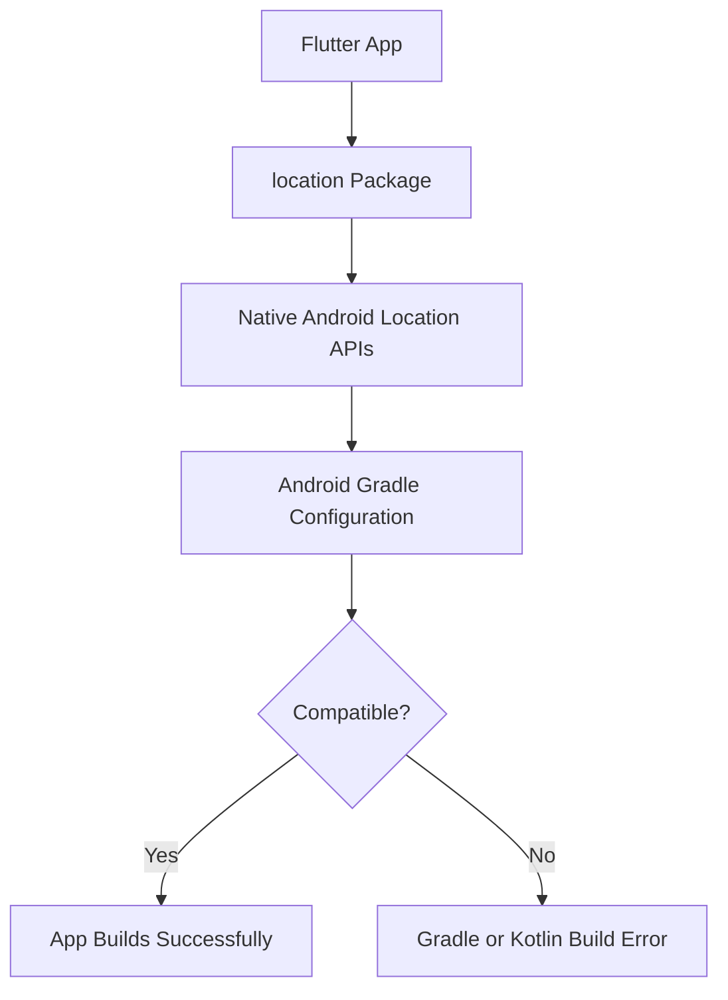
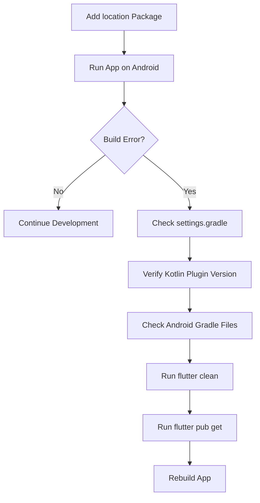
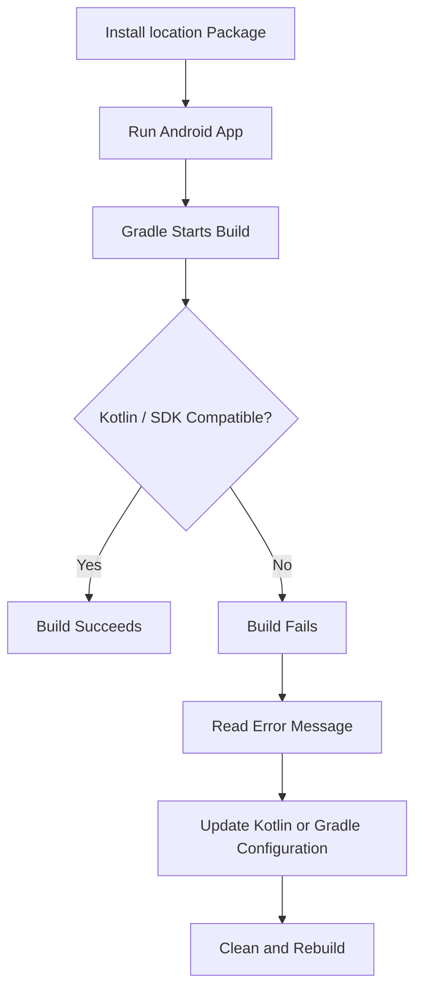

# Important: `location` Package and Android

## Overview

This lecture provides an important note about using the `location` package on Android.

In the next lecture, the app will add the `location` package to get the user's current location. However, after installing this package, some Android projects may run into build errors related to Kotlin, Gradle, or Android SDK configuration.

This lecture explains what to check if that happens.

---

## Why This Matters

The `location` package uses native Android functionality.

Because of that, it depends not only on Dart and Flutter code, but also on the Android project configuration.

If the Android configuration is outdated or incompatible, the app may fail to build even if the Dart code is correct.



---

## Common Android Issue

After adding the `location` package, you might see an Android build error.

This can happen because the package may require a newer Android or Kotlin setup than the one currently configured in your project.

One important file to check is:

```text
android/settings.gradle
```

In that file, make sure the Kotlin Android plugin version matches the version required by your project.

Example:

```gradle
id "org.jetbrains.kotlin.android" version "1.9.21" apply false
```

The version number may be different in your project.

---

## Kotlin Version Check

You should compare the Kotlin version in:

```text
android/settings.gradle
```

with the Kotlin version used elsewhere in your Android configuration.

Depending on your Flutter project structure, you may also find Kotlin-related configuration in:

```text
android/build.gradle
```

or newer Gradle plugin configuration files.

The key idea is that the Kotlin version should be consistent and compatible.

---

## Android Files to Check

| File                       | Purpose                                                         |
| -------------------------- | --------------------------------------------------------------- |
| `android/settings.gradle`  | May define the Kotlin Android plugin version                    |
| `android/build.gradle`     | May contain older project-level Gradle and Kotlin configuration |
| `android/app/build.gradle` | Contains app-level Android SDK settings                         |
| `pubspec.yaml`             | Contains the Flutter package dependency                         |

---

## Recommended Checks

Before or after installing the `location` package, check the Android configuration.



---

## Useful Commands

After changing Android Gradle or Kotlin configuration, run:

```bash
flutter clean
flutter pub get
```

Then restart the app:

```bash
flutter run
```

This ensures Flutter rebuilds the native Android project with the updated settings.

---

## Possible Fix

If you encounter a Kotlin-related build error, open:

```text
android/settings.gradle
```

Then check this line:

```gradle
id "org.jetbrains.kotlin.android" version "1.9.21" apply false
```

Make sure the version reflects the Kotlin version expected by your current project setup.

If your project uses a different Kotlin version, adjust the version accordingly.

---

## Important Note About Versions

The exact required versions can change over time.

That is why you should always check:

* The `location` package page on pub.dev
* The package changelog
* The build error message shown in your terminal
* Your current Flutter and Android Gradle setup

Usually, the build error message tells you which version needs to be updated.

---

## Common Build Problem Flow



---

## Key Points

* The `location` package will be added in the next lecture.
* This package allows the app to access the user's location.
* On Android, native packages can require extra Gradle or Kotlin configuration.
* If you get an Android build error, check `android/settings.gradle`.
* Make sure the Kotlin Android plugin version is compatible.
* One possible required line is:

```gradle
id "org.jetbrains.kotlin.android" version "1.9.21" apply false
```

* After editing Android configuration files, run:

```bash
flutter clean
flutter pub get
```

---

## Notes

This is not part of the app's Flutter UI logic. It is Android platform configuration.

That means the issue is not usually caused by widgets, Riverpod, or Dart code. Instead, it is caused by the native Android build setup.

This kind of problem is common when using Flutter packages that access native device features such as:

* Location
* Camera
* Maps
* Bluetooth
* Notifications
* Local storage
* Sensors

---

## Summary

Before using the `location` package on Android, be aware that you may need to update your Android Gradle or Kotlin configuration.

If the app fails to build after adding the package, check `android/settings.gradle` and make sure the Kotlin Android plugin version is compatible with your project.

Once the Android setup is correct, the app will be ready to access the user's location in the next lecture.
