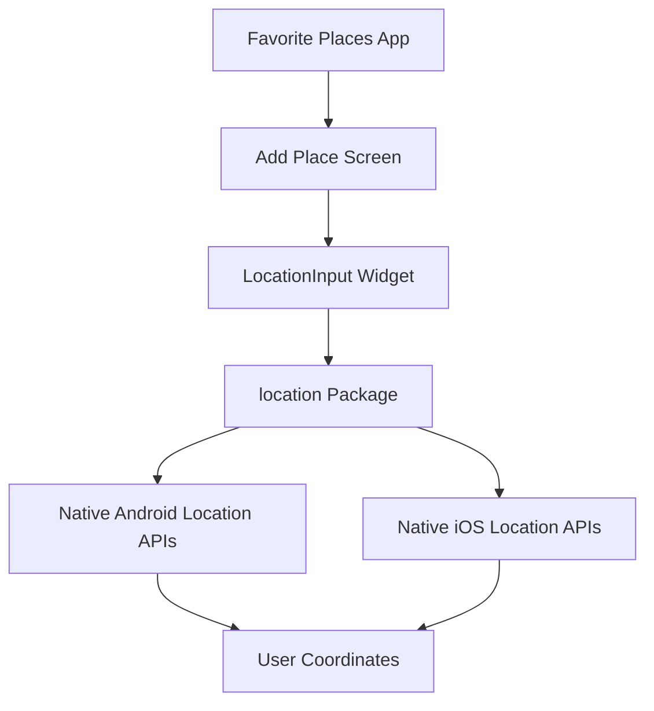
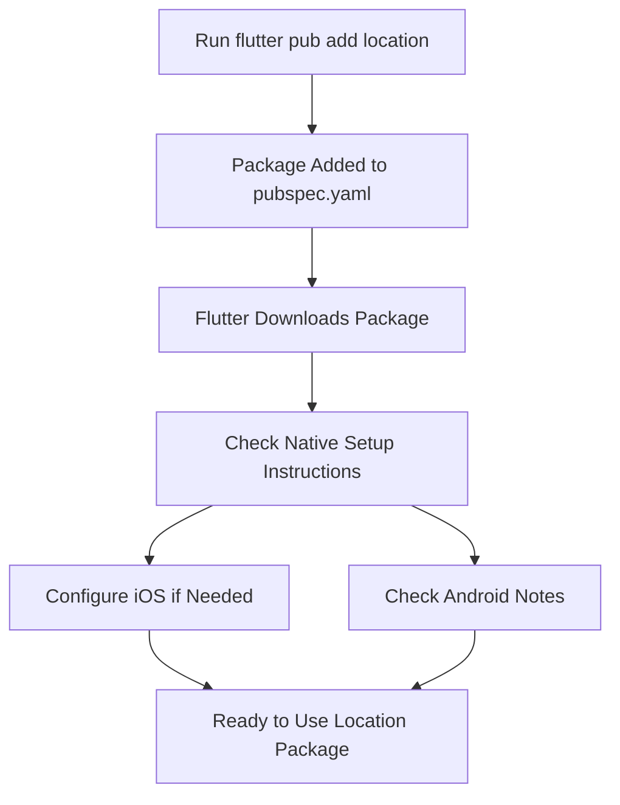
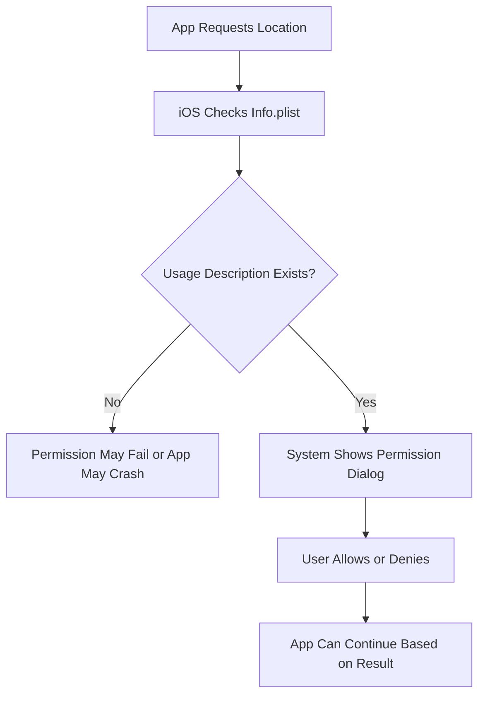
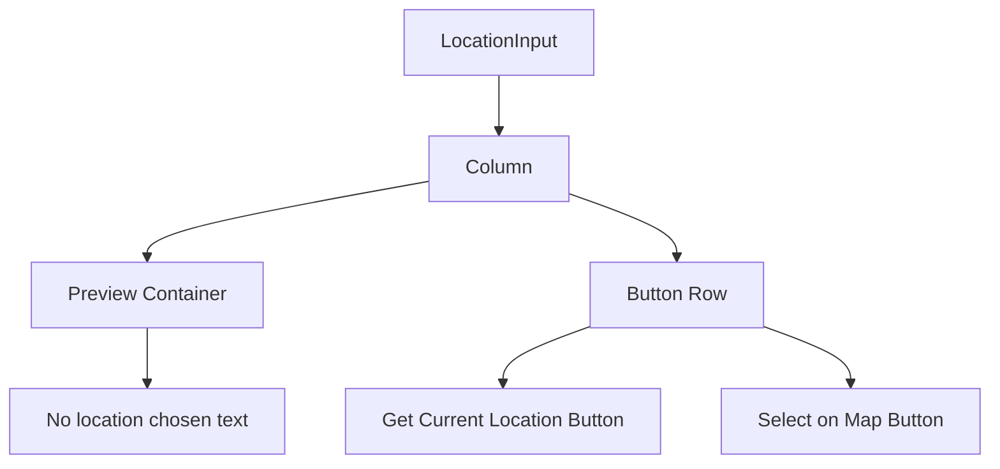
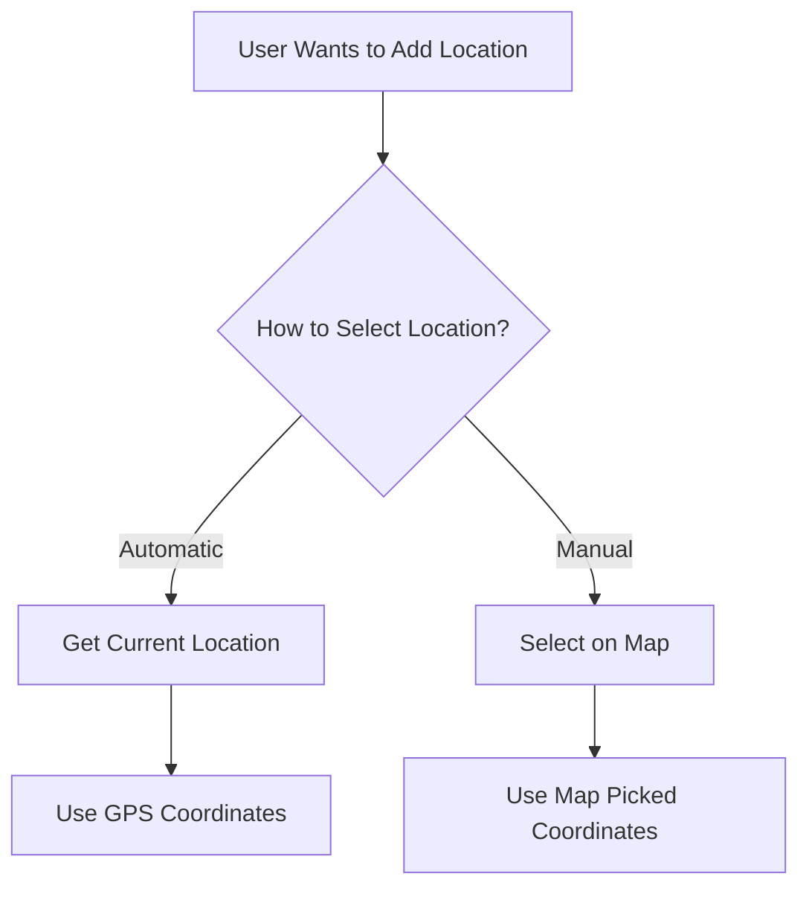
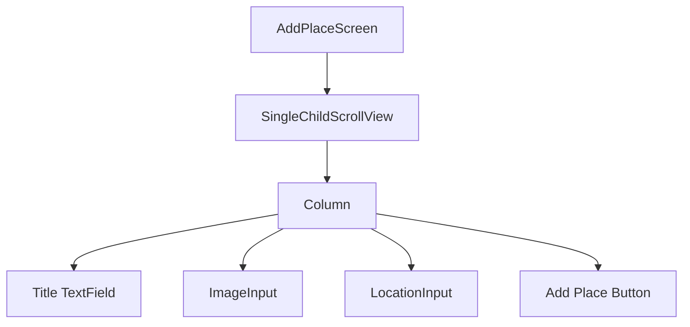
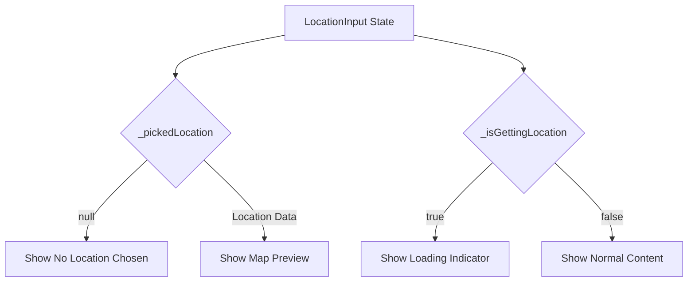
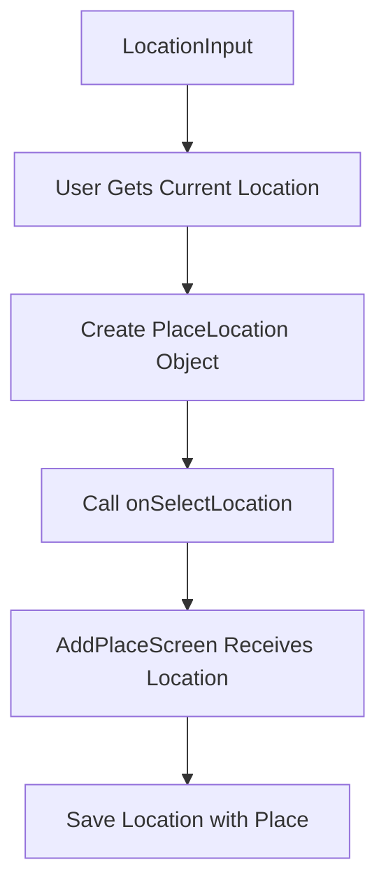
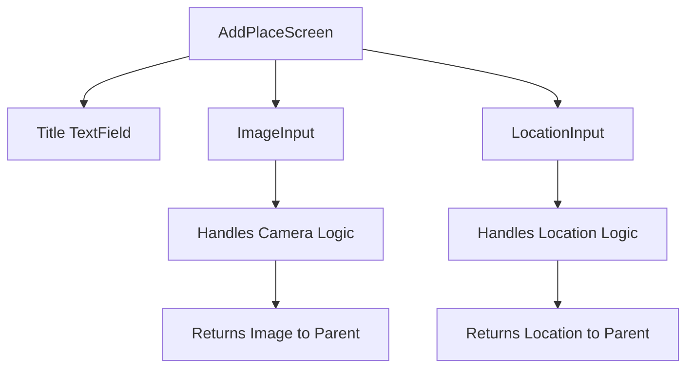
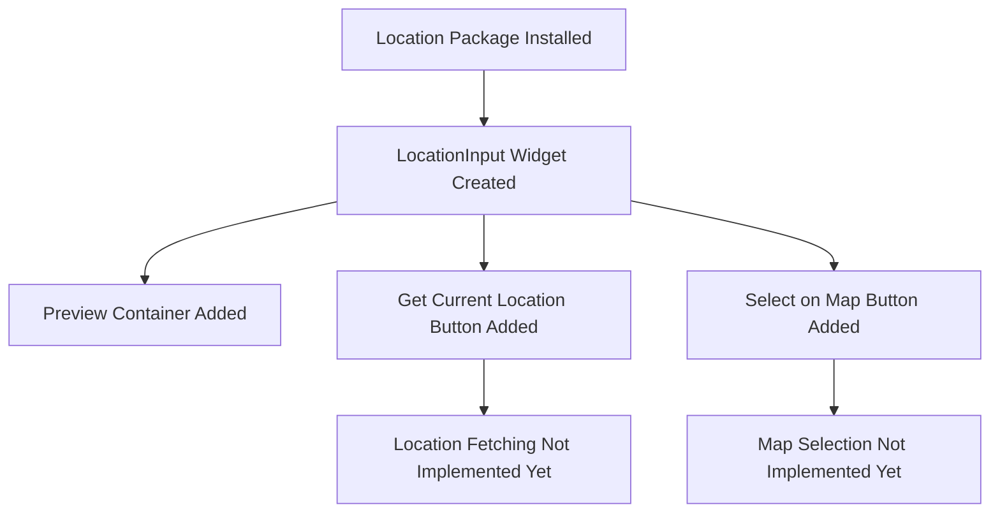

# Adding the `location` Package and Starting with the Get Location Input Widget

## Overview

This lecture starts the location feature for the Favorite Places app.

After adding image support, the next step is to let users attach a location to each favorite place. The app will eventually support two ways of choosing a location:

1. Automatically getting the user's current GPS location
2. Letting the user manually select a location on a map

To get the user's current location, the app uses the `location` package. This package provides an easier way to access native location services from Flutter without writing Android or iOS code manually.

In this lecture, the package is installed and a new custom `LocationInput` widget is created.

---

## Learning Goals

By the end of this lecture, you should be able to:

* Install the `location` package
* Understand why location packages need native setup
* Configure iOS location permission text
* Create a reusable `LocationInput` widget
* Build a placeholder preview container
* Add buttons for current location and map selection
* Prepare the UI for fetching the user's GPS location

---

## Why Use the `location` Package?

Flutter does not provide a simple built-in widget for getting the user's GPS location.

The `location` package helps with:

* Checking whether location services are enabled
* Requesting location permissions
* Getting the user's current location
* Working with native Android and iOS location APIs



---

# 1. Installing the Package

Run this command in the project terminal:

```bash
flutter pub add location
```

This adds the package to `pubspec.yaml`.

Example:

```yaml
dependencies:
  location: ^latest_version
```

The exact version may be different depending on when you install the package.

---

## Installation Flow



---

# 2. Native Platform Setup

Because the `location` package accesses native device services, you should always check the official package instructions.

Location access involves user privacy, so the operating system may require permission descriptions and runtime permission requests.

---

## iOS Setup

For iOS, add a location usage description to:

```text
ios/Runner/Info.plist
```

Add this key inside the main `<dict>` block:

```xml
<key>NSLocationWhenInUseUsageDescription</key>
<string>The location for your favorite place.</string>
```

This text will be shown to the user when iOS asks for location permission.

---

## iOS Permission Flow



---

## Android Setup

For this app's basic foreground location usage, the package may work without additional Android configuration.

However, Android setup requirements can change depending on:

* Package version
* Android SDK version
* Whether background location is used
* Gradle and Kotlin configuration

If your app needs location while running in the background, additional Android setup is required.

The Android configuration file is usually:

```text
android/app/src/main/AndroidManifest.xml
```

Possible permissions for location-based apps include:

```xml
<uses-permission android:name="android.permission.ACCESS_FINE_LOCATION" />
<uses-permission android:name="android.permission.ACCESS_COARSE_LOCATION" />
```

Always check the package documentation and your build error messages before changing Android files.

---

# 3. Creating the Location Input Widget

Create a new file in the `widgets/` folder:

```text
lib/widgets/location_input.dart
```

This file will contain a custom `LocationInput` widget.

---

## Project Folder Update

```text
lib/
├── models/
│   └── place.dart
├── providers/
│   └── user_places.dart
├── screens/
│   ├── add_place.dart
│   ├── places.dart
│   └── place_detail.dart
└── widgets/
    ├── image_input.dart
    ├── location_input.dart
    └── places_list.dart
```

---

# 4. Basic LocationInput Structure

The `LocationInput` widget is a `StatefulWidget`.

It needs internal state because it will later track:

* Whether a location was picked
* Whether the app is currently fetching the location
* What preview should be displayed

```dart
import 'package:flutter/material.dart';

class LocationInput extends StatefulWidget {
  const LocationInput({super.key});

  @override
  State<LocationInput> createState() {
    return _LocationInputState();
  }
}

class _LocationInputState extends State<LocationInput> {
  void _getCurrentLocation() {
    // Location fetching logic will be added later.
  }

  void _selectOnMap() {
    // Map selection logic will be added later.
  }

  @override
  Widget build(BuildContext context) {
    return Column(
      children: [
        Container(
          height: 170,
          width: double.infinity,
          alignment: Alignment.center,
          decoration: BoxDecoration(
            border: Border.all(
              width: 1,
              color: Theme.of(context).colorScheme.primary.withOpacity(0.2),
            ),
          ),
          child: Text(
            'No location chosen.',
            textAlign: TextAlign.center,
            style: Theme.of(context).textTheme.bodyLarge!.copyWith(
                  color: Theme.of(context).colorScheme.onBackground,
                ),
          ),
        ),
        Row(
          mainAxisAlignment: MainAxisAlignment.spaceEvenly,
          children: [
            TextButton.icon(
              onPressed: _getCurrentLocation,
              icon: const Icon(Icons.location_on),
              label: const Text('Get Current Location'),
            ),
            TextButton.icon(
              onPressed: _selectOnMap,
              icon: const Icon(Icons.map),
              label: const Text('Select on Map'),
            ),
          ],
        ),
      ],
    );
  }
}
```

---

# 5. LocationInput Layout

The widget contains two main sections:

1. A preview container
2. A row of action buttons



---

# 6. Preview Container

The preview container will later show a map snapshot or location preview.

For now, it displays fallback text.

```dart
Container(
  height: 170,
  width: double.infinity,
  alignment: Alignment.center,
  decoration: BoxDecoration(
    border: Border.all(
      width: 1,
      color: Theme.of(context).colorScheme.primary.withOpacity(0.2),
    ),
  ),
  child: Text(
    'No location chosen.',
    textAlign: TextAlign.center,
    style: Theme.of(context).textTheme.bodyLarge!.copyWith(
          color: Theme.of(context).colorScheme.onBackground,
        ),
  ),
)
```

---

## Preview Container Properties

| Property                      | Purpose                                         |
| ----------------------------- | ----------------------------------------------- |
| `height: 170`                 | Gives the preview area a fixed height           |
| `width: double.infinity`      | Makes the preview area fill the available width |
| `alignment: Alignment.center` | Centers the placeholder text                    |
| `decoration`                  | Adds a border around the preview                |
| `child`                       | Shows fallback content for now                  |

---

# 7. Location Buttons

Below the preview container, the widget displays two buttons.

```dart
Row(
  mainAxisAlignment: MainAxisAlignment.spaceEvenly,
  children: [
    TextButton.icon(
      onPressed: _getCurrentLocation,
      icon: const Icon(Icons.location_on),
      label: const Text('Get Current Location'),
    ),
    TextButton.icon(
      onPressed: _selectOnMap,
      icon: const Icon(Icons.map),
      label: const Text('Select on Map'),
    ),
  ],
)
```

---

## Button Responsibilities

| Button                 | Purpose                                                |
| ---------------------- | ------------------------------------------------------ |
| `Get Current Location` | Automatically fetch the user's current GPS coordinates |
| `Select on Map`        | Open a map so the user can manually choose a location  |

At this point, both methods are placeholders. Their logic will be implemented in later lectures.

---

## Location Selection Options



---

# 8. Adding LocationInput to AddPlaceScreen

Open:

```text
lib/screens/add_place.dart
```

Import the new widget:

```dart
import '../widgets/location_input.dart';
```

Then add it below the image input.

```dart
const SizedBox(height: 10),
const ImageInput(
  // onPickImage callback if required in your current code
),
const SizedBox(height: 10),
const LocationInput(),
const SizedBox(height: 16),
ElevatedButton.icon(
  onPressed: _savePlace,
  icon: const Icon(Icons.add),
  label: const Text('Add Place'),
),
```

If your `ImageInput` requires an `onPickImage` callback, keep your existing callback code and simply insert `LocationInput` below it.

---

## Add Place Screen Layout



---

# 9. Future Location State

Later, the widget will store the picked location.

A future version may include:

```dart
PlaceLocation? _pickedLocation;
bool _isGettingLocation = false;
```

These variables will allow the widget to know:

* Whether a location has been selected
* Whether a loading spinner should be shown
* Which map preview should be displayed



---

# 10. Future Callback Pattern

Like `ImageInput`, the location widget will eventually need to send selected location data back to the Add Place form.

A future constructor may look like this:

```dart
class LocationInput extends StatefulWidget {
  const LocationInput({
    super.key,
    required this.onSelectLocation,
  });

  final void Function(PlaceLocation location) onSelectLocation;

  @override
  State<LocationInput> createState() {
    return _LocationInputState();
  }
}
```

This callback allows `LocationInput` to pass the selected location to its parent screen.

---

## Future Callback Flow



---

# 11. Why This Widget Is Similar to ImageInput

The `LocationInput` widget follows the same idea as `ImageInput`.

| Widget          | Purpose                  | Local State         | Sends Data to Parent |
| --------------- | ------------------------ | ------------------- | -------------------- |
| `ImageInput`    | Pick or take an image    | Selected image file | Image file           |
| `LocationInput` | Get or select a location | Picked location     | Location object      |

Both widgets encapsulate feature-specific UI and logic, keeping the Add Place screen cleaner.

---

## Input Widget Pattern



---

# 12. Current App Result

After this lecture, the Add Place screen shows:

* Title input
* Image input
* Location preview area
* Get Current Location button
* Select on Map button
* Add Place button

The location buttons do not fetch or select a location yet. That will be implemented in upcoming lectures.

---

## Current Feature Status



---

# 13. Key Points

* The `location` package is installed with `flutter pub add location`.
* Native feature packages often require platform-specific setup.
* iOS requires a location usage description in `Info.plist`.
* The new widget file is `lib/widgets/location_input.dart`.
* `LocationInput` is a `StatefulWidget`.
* It displays a preview container.
* The preview currently shows `No location chosen.`
* The widget has two buttons:

  * `Get Current Location`
  * `Select on Map`
* The buttons are arranged with a `Row`.
* `MainAxisAlignment.spaceEvenly` distributes the buttons evenly.
* `LocationInput` is added to the Add Place form.

---

## Notes

The location feature is built in stages.

This lecture only creates the setup and UI shell. The actual logic for checking location services, requesting permissions, and retrieving coordinates will be added next.

This approach keeps the implementation easier to understand because the UI structure is separated from the native device logic.

---

## Summary

This lecture installs the `location` package and creates the first version of the `LocationInput` widget.

The Add Place screen now has a dedicated area for choosing a location, including a preview container and two buttons: one for getting the current GPS location and one for selecting a location on a map.

The next step is to implement the logic that actually fetches the user's current location.
