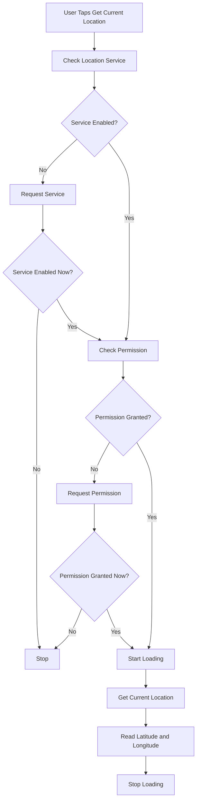
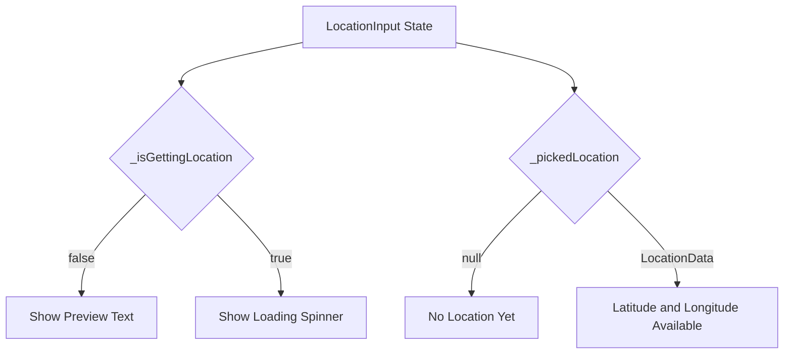
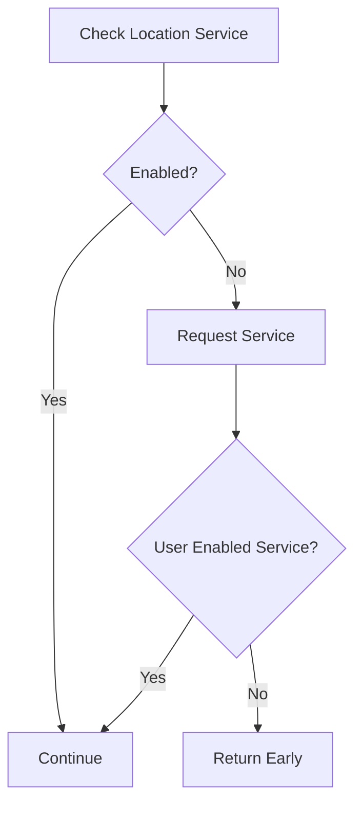
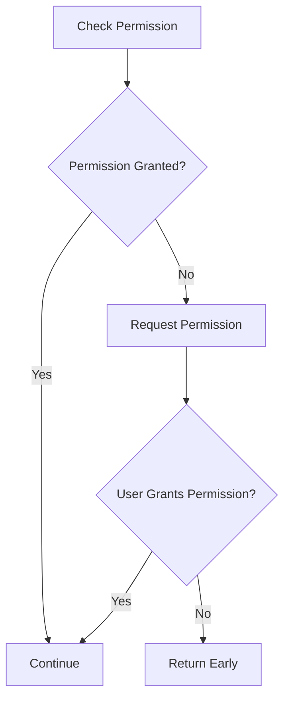
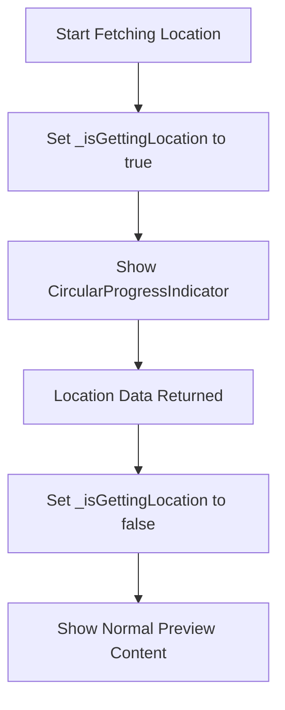
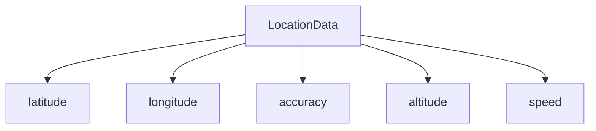
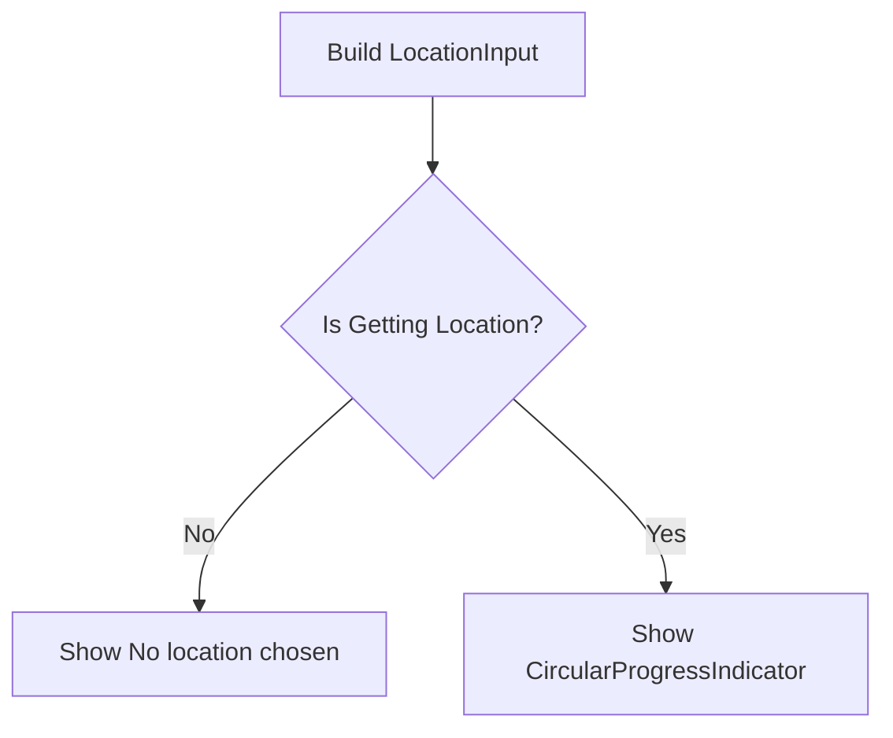
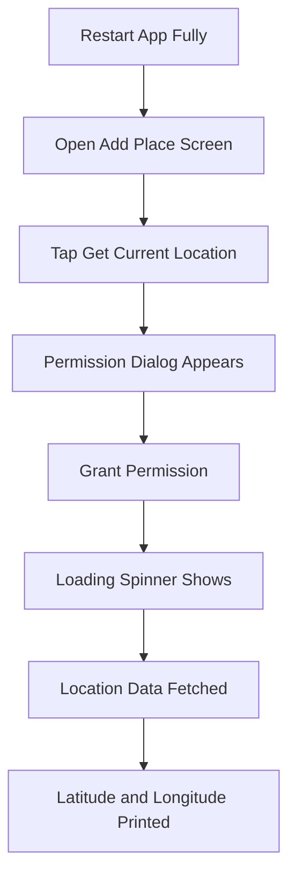
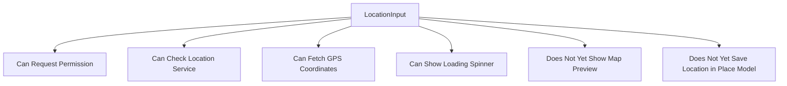

# Getting the User's Current Location

## Overview

This lecture implements the first real location feature inside the `LocationInput` widget.

The goal is to fetch the user's current GPS coordinates when the user taps the **Get Current Location** button. This is done with the `location` package.

Because location access is a native device feature, the implementation must handle asynchronous operations, service availability, and runtime permissions. The widget also displays a loading spinner while the location is being fetched.

---

## Learning Goals

By the end of this lecture, you should be able to:

* Use the `location` package to access GPS coordinates
* Check whether location services are enabled
* Request location permission from the user
* Fetch the user's current location
* Use `async` and `await` for native device operations
* Display a loading indicator while fetching location data
* Read latitude and longitude from `LocationData`
* Understand why a full app restart may be needed after adding native plugins

---

## Feature Flow



---

# 1. Importing the Location Package

Open:

```text
lib/widgets/location_input.dart
```

Import the `location` package:

```dart
import 'package:location/location.dart';
```

This gives access to important classes such as:

* `Location`
* `PermissionStatus`
* `LocationData`

---

## Optional Alias Import

In larger apps, you may prefer using an alias to avoid naming conflicts.

```dart
import 'package:location/location.dart' as loc;
```

Then you can write:

```dart
final locationService = loc.Location();
```

This is useful if your app later creates its own model class named `PlaceLocation`.

---

# 2. Adding Location State

Inside `_LocationInputState`, add two state variables.

```dart
LocationData? _pickedLocation;
var _isGettingLocation = false;
```

---

## State Variables

| Variable             | Type            | Purpose                                         |
| -------------------- | --------------- | ----------------------------------------------- |
| `_pickedLocation`    | `LocationData?` | Stores the fetched location data                |
| `_isGettingLocation` | `bool`          | Tracks whether location fetching is in progress |

---

## Location State Flow



---

# 3. Creating `_getCurrentLocation`

Add a new method inside `_LocationInputState`.

```dart
void _getCurrentLocation() async {
  final locationService = Location();

  var serviceEnabled = await locationService.serviceEnabled();

  if (!serviceEnabled) {
    serviceEnabled = await locationService.requestService();

    if (!serviceEnabled) {
      return;
    }
  }

  var permissionGranted = await locationService.hasPermission();

  if (permissionGranted == PermissionStatus.denied) {
    permissionGranted = await locationService.requestPermission();

    if (permissionGranted != PermissionStatus.granted) {
      return;
    }
  }

  setState(() {
    _isGettingLocation = true;
  });

  final locationData = await locationService.getLocation();

  setState(() {
    _pickedLocation = locationData;
    _isGettingLocation = false;
  });

  print(locationData.latitude);
  print(locationData.longitude);
}
```

---

# 4. Code Explanation

## Creating the Location Service

```dart
final locationService = Location();
```

This creates a `Location` object from the `location` package.

This object is used to:

* Check whether location services are enabled
* Request location services
* Check permissions
* Request permissions
* Fetch the current location

---

## Checking Location Service

```dart
var serviceEnabled = await locationService.serviceEnabled();
```

This checks whether location services are enabled on the device.

Location services and app permissions are different things.

A user may give your app permission, but GPS/location services could still be disabled on the device.

---

## Requesting Location Service

```dart
if (!serviceEnabled) {
  serviceEnabled = await locationService.requestService();

  if (!serviceEnabled) {
    return;
  }
}
```

If location services are disabled, the app asks the user to enable them.

If the user does not enable location services, the method stops.

---

## Location Service Flow



---

# 5. Checking Location Permission

After checking whether the device location service is enabled, the app checks whether it has permission.

```dart
var permissionGranted = await locationService.hasPermission();
```

This returns a permission status.

---

## Requesting Permission

```dart
if (permissionGranted == PermissionStatus.denied) {
  permissionGranted = await locationService.requestPermission();

  if (permissionGranted != PermissionStatus.granted) {
    return;
  }
}
```

If permission is denied, the app asks the user for permission.

If the user still does not grant permission, the method stops.

---

## Permission Flow



---

# 6. Showing a Loading Spinner

Fetching the user's location can take some time.

To improve the user experience, the widget shows a loading indicator while the app waits for GPS data.

Before calling `getLocation()`, set `_isGettingLocation` to `true`.

```dart
setState(() {
  _isGettingLocation = true;
});
```

After the location has been fetched, set it back to `false`.

```dart
setState(() {
  _pickedLocation = locationData;
  _isGettingLocation = false;
});
```

---

## Loading State Flow



---

# 7. Fetching the Current Location

The actual location is fetched with:

```dart
final locationData = await locationService.getLocation();
```

This returns a `LocationData` object.

The object contains location information such as:

* Latitude
* Longitude
* Accuracy
* Altitude
* Speed
* Heading

For this app, the most important values are latitude and longitude.

```dart
print(locationData.latitude);
print(locationData.longitude);
```

---

## Location Data



---

# 8. Updating the Preview Content

In the `build` method, create a variable for the preview content.

```dart
Widget previewContent = Text(
  'No location chosen.',
  textAlign: TextAlign.center,
  style: Theme.of(context).textTheme.bodyLarge!.copyWith(
        color: Theme.of(context).colorScheme.onBackground,
      ),
);
```

Then, if the app is currently getting the location, replace the preview text with a spinner.

```dart
if (_isGettingLocation) {
  previewContent = const CircularProgressIndicator();
}
```

Use that variable inside the preview container.

```dart
child: previewContent,
```

---

## Preview Logic



---

# 9. Updated `LocationInput` Widget

```dart
import 'package:flutter/material.dart';
import 'package:location/location.dart';

class LocationInput extends StatefulWidget {
  const LocationInput({super.key});

  @override
  State<LocationInput> createState() {
    return _LocationInputState();
  }
}

class _LocationInputState extends State<LocationInput> {
  LocationData? _pickedLocation;
  var _isGettingLocation = false;

  void _getCurrentLocation() async {
    final locationService = Location();

    var serviceEnabled = await locationService.serviceEnabled();

    if (!serviceEnabled) {
      serviceEnabled = await locationService.requestService();

      if (!serviceEnabled) {
        return;
      }
    }

    var permissionGranted = await locationService.hasPermission();

    if (permissionGranted == PermissionStatus.denied) {
      permissionGranted = await locationService.requestPermission();

      if (permissionGranted != PermissionStatus.granted) {
        return;
      }
    }

    setState(() {
      _isGettingLocation = true;
    });

    final locationData = await locationService.getLocation();

    setState(() {
      _pickedLocation = locationData;
      _isGettingLocation = false;
    });

    print(locationData.latitude);
    print(locationData.longitude);
  }

  void _selectOnMap() {
    // Map selection logic will be added later.
  }

  @override
  Widget build(BuildContext context) {
    Widget previewContent = Text(
      'No location chosen.',
      textAlign: TextAlign.center,
      style: Theme.of(context).textTheme.bodyLarge!.copyWith(
            color: Theme.of(context).colorScheme.onBackground,
          ),
    );

    if (_isGettingLocation) {
      previewContent = const CircularProgressIndicator();
    }

    return Column(
      children: [
        Container(
          height: 170,
          width: double.infinity,
          alignment: Alignment.center,
          decoration: BoxDecoration(
            border: Border.all(
              width: 1,
              color: Theme.of(context).colorScheme.primary.withOpacity(0.2),
            ),
          ),
          child: previewContent,
        ),
        Row(
          mainAxisAlignment: MainAxisAlignment.spaceEvenly,
          children: [
            TextButton.icon(
              onPressed: _getCurrentLocation,
              icon: const Icon(Icons.location_on),
              label: const Text('Get Current Location'),
            ),
            TextButton.icon(
              onPressed: _selectOnMap,
              icon: const Icon(Icons.map),
              label: const Text('Select on Map'),
            ),
          ],
        ),
      ],
    );
  }
}
```

---

# 10. Connecting the Button

The **Get Current Location** button should call `_getCurrentLocation`.

```dart
TextButton.icon(
  onPressed: _getCurrentLocation,
  icon: const Icon(Icons.location_on),
  label: const Text('Get Current Location'),
),
```

When the user taps this button, the app starts the location permission and fetching flow.

---

# 11. Testing the Location Feature

After adding a package that uses native device features, stop the running app and restart it fully.

Hot reload may not be enough.

```text
Stop the app → Start it again
```

Then test the feature:

1. Open the Add Place screen.
2. Tap **Get Current Location**.
3. Grant location permission when asked.
4. Wait for the loading spinner.
5. Check the debug console for latitude and longitude.

---

## Testing Flow



---

# 12. Platform Notes

## Android

On Android, the emulator can usually simulate a location.

You may need to set the emulator location manually through the emulator controls.

## iOS

On iOS, location testing works best on a real device.

The simulator can simulate locations, but real-device testing is more accurate.

## Full Restart

After installing or changing native plugins, always consider doing a full restart.

This avoids errors caused by native code not being rebuilt.

---

# 13. Current App Behavior

After this lecture, the app can:

* Request location service access
* Request app-level location permission
* Fetch the user's current GPS location
* Show a loading spinner while fetching
* Print latitude and longitude in the debug console

The app does not yet show a map preview or human-readable address. That will be added later.

---

## Current Feature Status



---

# 14. Key Points

* `Location()` creates a location service object.
* `serviceEnabled()` checks whether device location services are enabled.
* `requestService()` asks the user to enable location services.
* `hasPermission()` checks whether the app has permission.
* `requestPermission()` asks the user for location permission.
* `getLocation()` fetches the current GPS location.
* `LocationData.latitude` contains the latitude.
* `LocationData.longitude` contains the longitude.
* `_isGettingLocation` controls the loading spinner.
* `setState()` is required when updating loading state.
* A full app restart may be needed after adding native plugins.

---

## Notes

Location access has two separate requirements:

1. The device location service must be enabled.
2. The app must have permission to access location data.

Both conditions must be satisfied before `getLocation()` can successfully return location data.

Fetching GPS data is asynchronous and may take a few seconds, so showing a `CircularProgressIndicator` provides useful feedback to the user.

---

## Summary

This lecture implements current-location fetching with the `location` package.

The app now checks whether location services are enabled, requests permission if needed, fetches the user's current coordinates, and shows a loading spinner while waiting.

The next step is to use the fetched latitude and longitude to display a location preview and eventually save the location with the place.
