# Using the Google Maps API Setup

## Overview

This lecture introduces the Google Maps API setup required for the map-related features in the Favorite Places app.

After the app can fetch the user's latitude and longitude, the next step is to convert those coordinates into useful visual and readable information.

The app will use Google Maps services for two main purposes:

1. Converting coordinates into a human-readable address
2. Generating a static map preview image

To use these features, you need to create a Google Cloud project, enable the required APIs, and generate an API key.

---

## Learning Goals

By the end of this lecture, you should understand:

* Why Google Maps APIs are needed
* How latitude and longitude can be converted into an address
* How a static map preview can be generated
* How to create or access a Google Maps API key
* Which APIs should be enabled for this module
* Why billing setup is required
* Why API keys should be protected in real apps

---

## Why Google Maps Is Needed

The location package gives the app raw GPS coordinates.

Example:

```text id="k8uznx"
Latitude: 10.762622
Longitude: 106.660172
```

These values are useful for computers, but not very friendly for users.

The app should eventually show:

* A readable address
* A visual map preview
* A selected map location

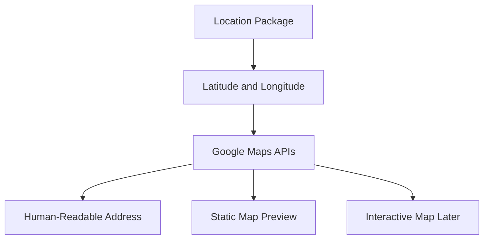

---

## Location Feature Pipeline

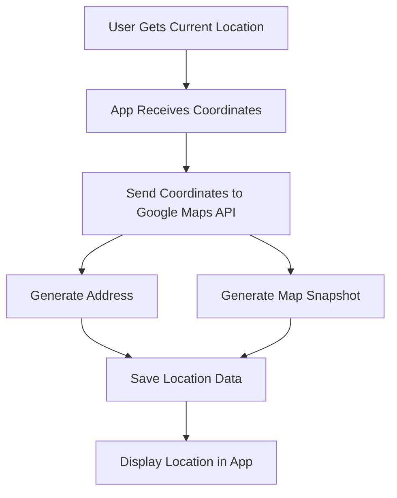

---

# 1. Google Cloud Console

To use Google Maps APIs, go to the Google Cloud Console.

```text id="wwwg34"
console.cloud.google.com
```

You need a Google account to continue.

From there, you can create or select a Google Cloud project for this Flutter app.

---

## Setup Flow

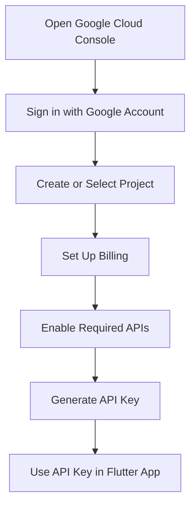

---

# 2. Billing Requirement

Google usually requires a billing account before you can use Google Maps APIs.

Even if your usage is within the free tier, billing still needs to be enabled.

For learning and development, Google Maps usually provides free monthly credits, which are enough for small projects and course exercises.

However, you still need to connect a billing account.

---

## Important Billing Note

```text id="n1g48y"
Google Maps APIs require billing to be enabled, even for free-tier usage.
```

If you do not have a credit card or cannot enable billing, you may need to follow along without implementing the Google Maps features directly.

---

# 3. Required APIs

For this module, the following Google Maps APIs are needed.

| API                  | Purpose                                            |
| -------------------- | -------------------------------------------------- |
| Maps Static API      | Generates static map preview images                |
| Geocoding API        | Converts coordinates into human-readable addresses |
| Maps SDK for Android | Enables Google Maps on Android                     |
| Maps SDK for iOS     | Enables Google Maps on iOS                         |
| Places API           | May be used for place-related map data             |

---

## API Usage Diagram

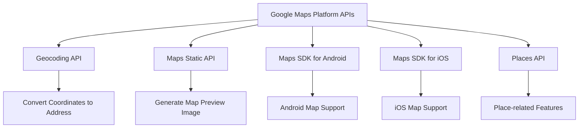

---

# 4. Enabling APIs

Inside the Google Maps Platform or Google Cloud Console:

1. Open your project.
2. Go to the APIs section.
3. Search for the required APIs.
4. Enable each API.

If an API is already enabled, it will appear under enabled APIs.

If it is not enabled yet, you can find it under additional APIs and enable it manually.

---

## Required API Checklist

```text id="k2w9my"
[ ] Geocoding API
[ ] Maps Static API
[ ] Maps SDK for Android
[ ] Maps SDK for iOS
[ ] Places API
```

---

# 5. Creating an API Key

After enabling the required APIs, you need an API key.

In the Google Cloud Console:

1. Go to **Credentials**.
2. Click **Create Credentials**.
3. Choose **API key**.
4. Copy the generated key.

The API key allows your app to call Google Maps services.

---

## API Key Flow

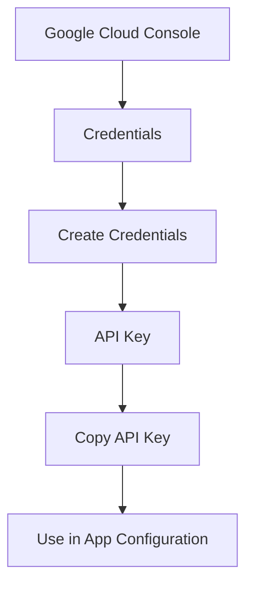

---

# 6. Finding an Existing API Key

If Google already generated an API key for you during setup, you can find it again later.

Go to:

```text id="gw1qip"
Google Cloud Console → APIs & Services → Credentials
```

There, you should see your existing Maps API key.

You can open it and copy the key again if needed.

---

# 7. Restricting the API Key

For security, you should restrict your API key.

Restrictions can prevent unwanted usage if the key is exposed.

Recommended restrictions include:

* Restricting the key to specific APIs
* Restricting Android usage by package name and SHA-1 certificate
* Restricting iOS usage by bundle identifier
* Avoiding unrestricted public keys in production

---

## API Key Security Diagram

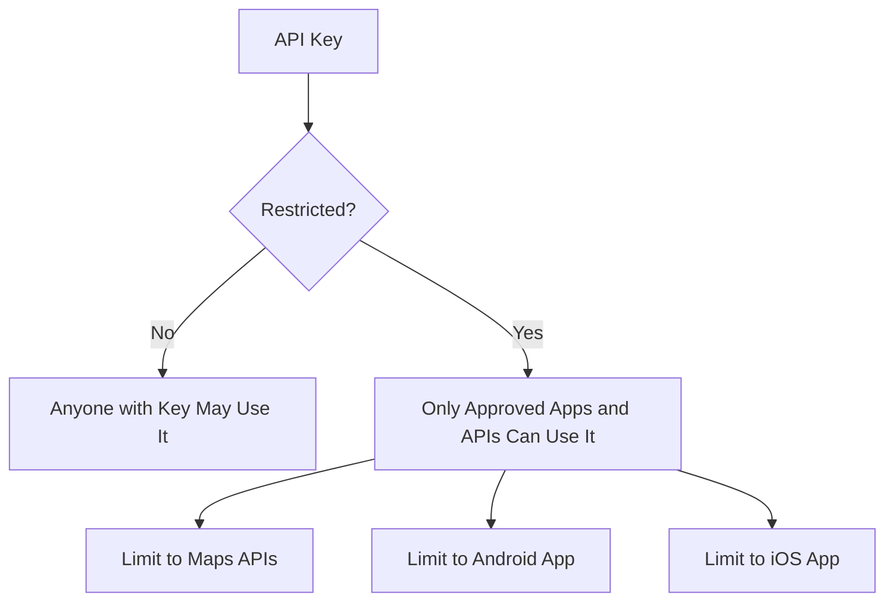

---

## Security Warning

```text id="h04kal"
Never commit unrestricted API keys to a public Git repository.
```

For production apps, use safer approaches such as:

* Environment variables
* Build-time secrets
* Native config files excluded from Git
* Server-side proxying where appropriate
* API restrictions in Google Cloud Console

---

# 8. Android API Key Setup

For Android, the API key is usually added in:

```text id="60qbvg"
android/app/src/main/AndroidManifest.xml
```

The key is added inside the `<application>` element as a `<meta-data>` tag.

Example:

```xml id="9dxefm"
<application
    android:label="favorite_places"
    android:name="${applicationName}"
    android:icon="@mipmap/ic_launcher">

    <meta-data
        android:name="com.google.android.geo.API_KEY"
        android:value="YOUR_API_KEY_HERE" />

</application>
```

Replace:

```text id="31sn6s"
YOUR_API_KEY_HERE
```

with your actual Google Maps API key.

---

## Android Setup Diagram

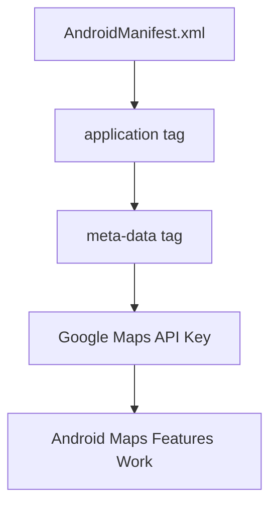

---

# 9. iOS API Key Setup

For iOS, the API key is typically configured in:

```text id="lc2h81"
ios/Runner/AppDelegate.swift
```

A Google Maps setup usually requires calling:

```swift id="f6y1uv"
GMSServices.provideAPIKey("YOUR_API_KEY_HERE")
```

The exact setup depends on the Google Maps Flutter package being used later.

---

## Example iOS Setup

```swift id="58si2u"
import UIKit
import Flutter
import GoogleMaps

@UIApplicationMain
@objc class AppDelegate: FlutterAppDelegate {
  override func application(
    _ application: UIApplication,
    didFinishLaunchingWithOptions launchOptions: [UIApplication.LaunchOptionsKey: Any]?
  ) -> Bool {
    GMSServices.provideAPIKey("YOUR_API_KEY_HERE")
    GeneratedPluginRegistrant.register(with: self)
    return super.application(application, didFinishLaunchingWithOptions: launchOptions)
  }
}
```

---

## iOS Setup Diagram

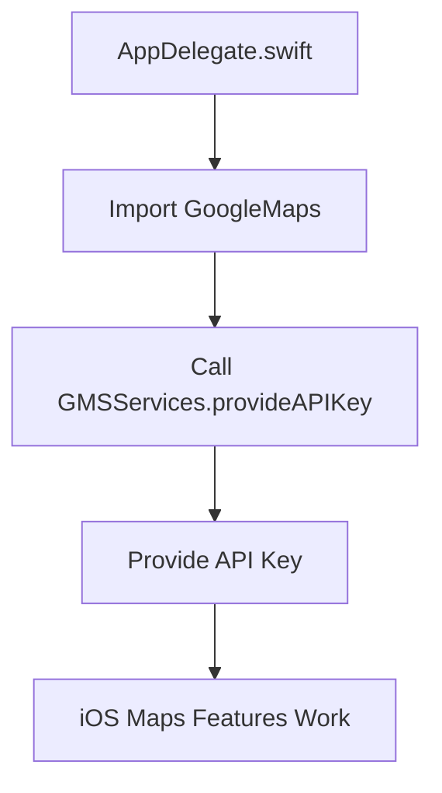

---

# 10. What the API Key Will Be Used For

In this module, the API key will be used for map-related features.

## 1. Reverse Geocoding

Reverse geocoding converts coordinates into a readable address.

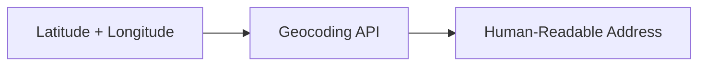

Example:

```text id="6pdwm4"
10.762622, 106.660172
```

can become something like:

```text id="yup708"
A street address in Ho Chi Minh City, Vietnam
```

---

## 2. Static Map Preview

The Maps Static API generates an image URL for a map preview.

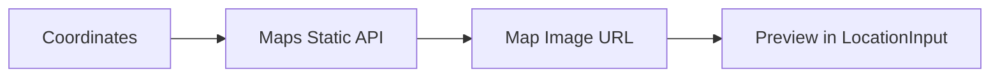

This preview can be displayed in the location input container after the user chooses a location.

---

## 3. Interactive Maps

Later, the app may use Google Maps SDKs to show interactive maps on Android and iOS.

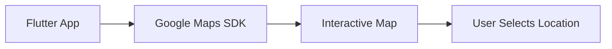

---

# 11. Current App Location Goal

The app currently has:

* A location button
* GPS coordinate fetching
* Latitude and longitude output

The next step is to use Google Maps to turn those coordinates into something visible and meaningful.

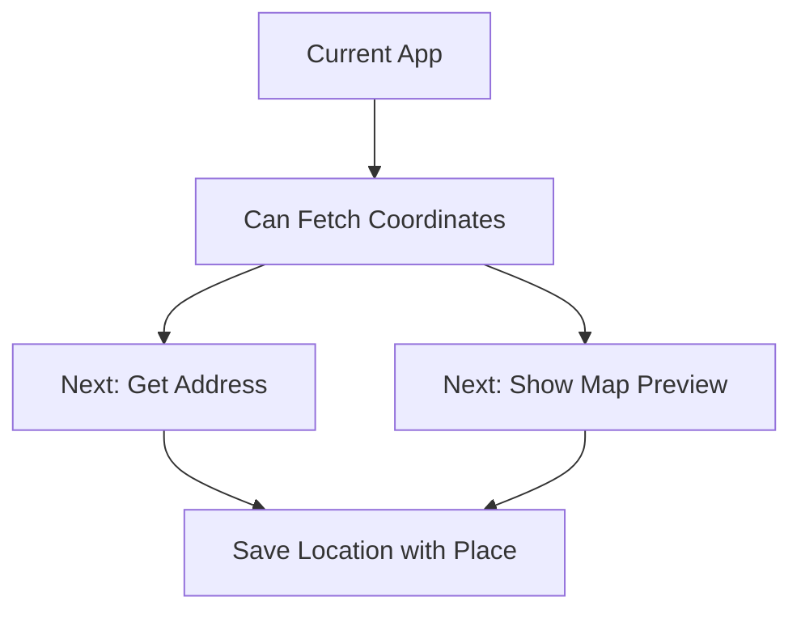

---

# 12. Common Problems

## Problem: Blank map

Possible causes:

* Maps SDK not enabled
* Wrong API key
* API key restricted incorrectly
* Billing not enabled
* API key not added to native configuration file

---

## Problem: Geocoding request fails

Possible causes:

* Geocoding API not enabled
* Billing not enabled
* Invalid API key
* Request URL is incorrect

---

## Problem: Static map image does not load

Possible causes:

* Maps Static API not enabled
* API key is missing
* Key restriction blocks the request
* Billing account is not active

---

# 13. Google Maps Setup Checklist

```text id="aoj3t3"
[ ] Create or select a Google Cloud project
[ ] Enable billing
[ ] Enable Geocoding API
[ ] Enable Maps Static API
[ ] Enable Maps SDK for Android
[ ] Enable Maps SDK for iOS
[ ] Enable Places API if needed
[ ] Create an API key
[ ] Restrict the API key
[ ] Add API key to Android configuration
[ ] Add API key to iOS configuration
[ ] Avoid committing the key publicly
```

---

# 14. Key Points

* Google Maps will be used to work with location data.
* The app already gets latitude and longitude from the `location` package.
* Google Maps APIs can convert coordinates into an address.
* Google Maps APIs can generate a static map preview.
* A Google account and billing setup are required.
* Required APIs include Maps Static API, Geocoding API, and Maps SDKs.
* API keys can be created and managed from the Credentials page.
* API keys should be restricted for security.
* Android and iOS require native configuration for map SDK usage.
* Without correct setup, maps may appear blank or API calls may fail.

---

## Notes

Google Maps setup is a project-level configuration step. Once the APIs are enabled and the API key is configured, the app can use Google Maps services in later lectures.

The exact Google Cloud Console UI may change over time, so the buttons and layout might look slightly different. The general flow remains the same: create a project, enable billing, enable APIs, create an API key, and configure the app.

---

## Summary

This lecture prepares the app for Google Maps integration.

The app will use Google Maps to convert GPS coordinates into readable addresses and to generate static map previews.

To make that possible, you need a Google Cloud project, billing enabled, the required APIs activated, and an API key configured for Android and iOS.

With this setup complete, the next step is to start using the API key in the Flutter app to generate map snapshots and location data.
