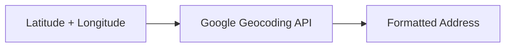
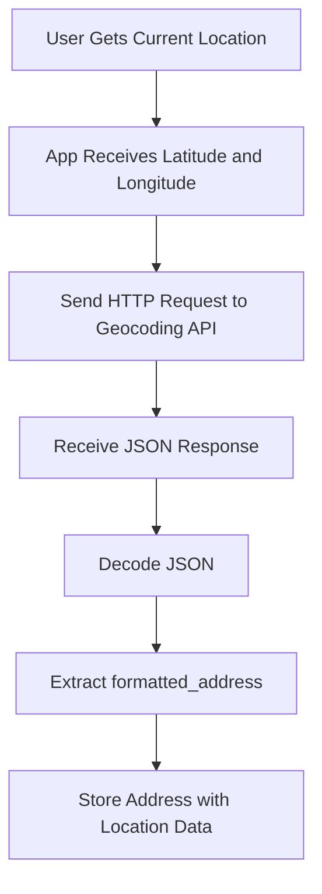
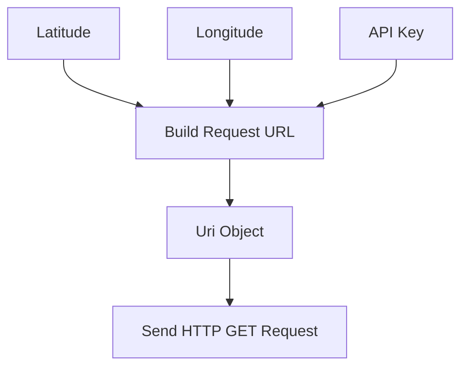
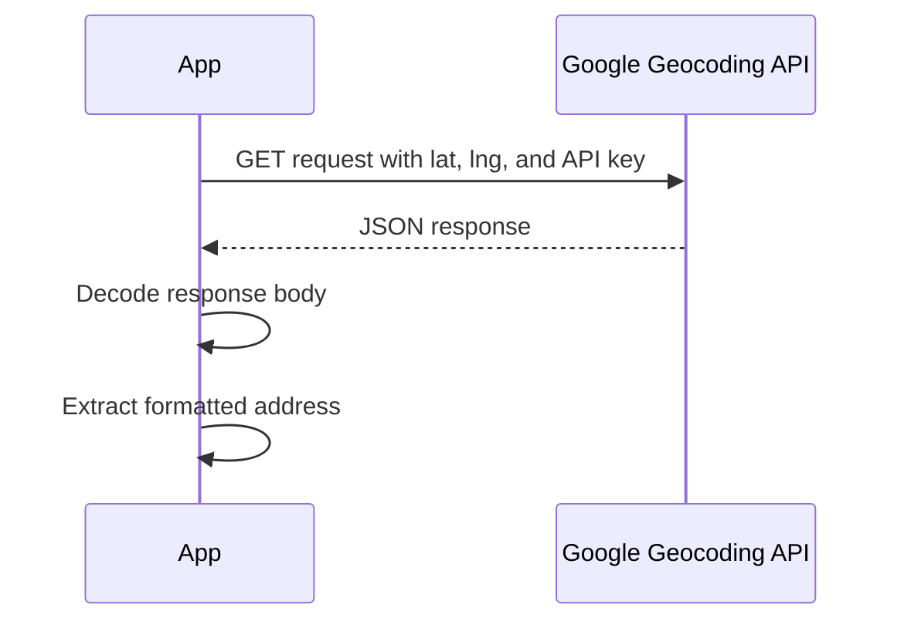
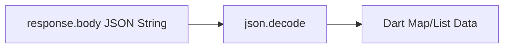
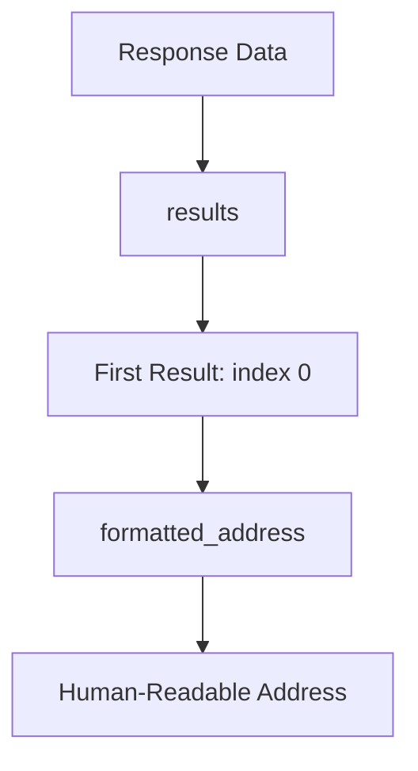
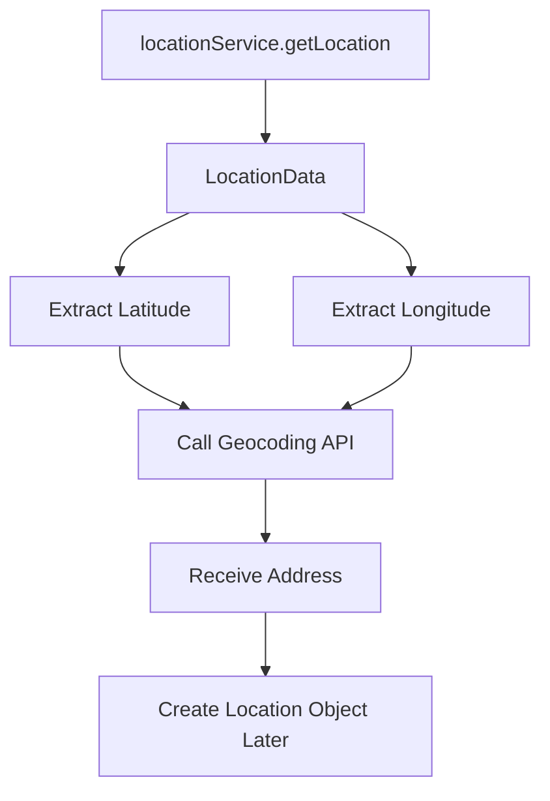
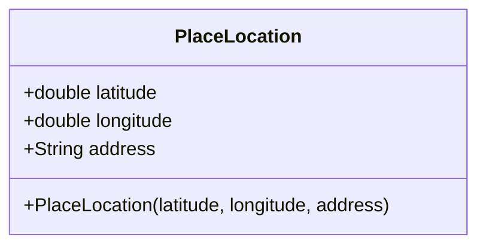
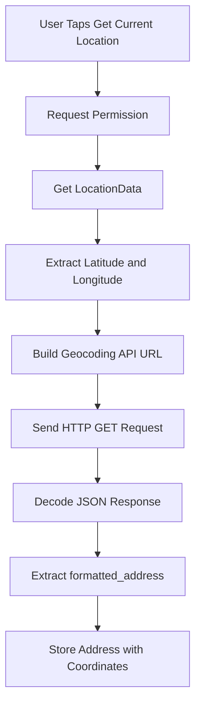

# Using Google's Geocoding API

## Overview

This lecture introduces the **Google Geocoding API** and shows how to use it to convert raw GPS coordinates into a human-readable address.

In the previous lecture, the app was able to fetch the user's current latitude and longitude. However, coordinates alone are not very useful for most users. A user-friendly app should display a readable address instead.

To solve this, the app sends an HTTP request to Google's Geocoding API. The API returns location data in JSON format, and the app extracts the `formatted_address` value from the response.

---

## Learning Goals

By the end of this lecture, you should be able to:

* Understand what reverse geocoding is
* Use Google's Geocoding API to convert coordinates into an address
* Install and use the `http` package
* Send a GET request from Flutter
* Parse JSON data with `dart:convert`
* Extract a formatted address from the API response
* Prepare the location data for saving in the app

---

## What Is Reverse Geocoding?

Reverse geocoding means converting latitude and longitude coordinates into a human-readable address.



Example:

```text
Latitude: 10.762622
Longitude: 106.660172
```

can become:

```text
A human-readable address in Ho Chi Minh City, Vietnam
```

---

## Why This Is Needed

The `location` package gives the app raw GPS data.

That data may look like this:

```text
10.762622, 106.660172
```

This is technically accurate, but not easy for users to understand.

Instead, the app should show something like:

```text
123 Example Street, Ho Chi Minh City, Vietnam
```

So the app needs to send the coordinates to Google and ask for a readable address.

---

## Feature Flow



---

# 1. Installing the HTTP Package

To send HTTP requests, install the `http` package.

Run:

```bash
flutter pub add http
```

After installation, the package should appear in `pubspec.yaml`.

```yaml
dependencies:
  http: ^latest_version
```

The exact version may be different depending on when you install it.

---

## Why Use the HTTP Package?

The Geocoding API is accessed through a URL.

That means the Flutter app must send a network request.

The `http` package provides convenient methods such as:

```dart
http.get(...)
```

which can be used to send GET requests.

---

# 2. Importing Required Packages

Open:

```text
lib/widgets/location_input.dart
```

Add these imports:

```dart
import 'dart:convert';

import 'package:http/http.dart' as http;
```

## Import Explanation

| Import                   | Purpose                              |
| ------------------------ | ------------------------------------ |
| `dart:convert`           | Decodes JSON data                    |
| `package:http/http.dart` | Sends HTTP requests                  |
| `as http`                | Adds an alias to keep the code clear |

---

# 3. Geocoding API URL

The Google Geocoding API endpoint looks like this:

```text
https://maps.googleapis.com/maps/api/geocode/json?latlng=LAT,LNG&key=API_KEY
```

You must replace:

| Placeholder | Meaning                  |
| ----------- | ------------------------ |
| `LAT`       | The latitude value       |
| `LNG`       | The longitude value      |
| `API_KEY`   | Your Google Maps API key |

---

## Example URL Structure

```dart
final url = Uri.parse(
  'https://maps.googleapis.com/maps/api/geocode/json?latlng=$lat,$lng&key=$apiKey',
);
```

The comma between `$lat` and `$lng` is important.

```text
latlng=$lat,$lng
```

Do not remove it.

---

# 4. Extracting Latitude and Longitude

After fetching the user's current location, extract the latitude and longitude values.

```dart
final lat = locationData.latitude;
final lng = locationData.longitude;
```

These values will be inserted into the Geocoding API URL.

Since these values may be nullable, production code should check them before using them.

Example:

```dart
if (lat == null || lng == null) {
  return;
}
```

---

# 5. Creating the Request URL

Create a `Uri` object for the Geocoding API request.

```dart
const apiKey = 'YOUR_API_KEY';

final url = Uri.parse(
  'https://maps.googleapis.com/maps/api/geocode/json?latlng=$lat,$lng&key=$apiKey',
);
```

Replace:

```text
YOUR_API_KEY
```

with your actual Google Maps API key.

---

## API Request Flow



---

# 6. Sending the GET Request

Use the `http.get()` method to send the request.

```dart
final response = await http.get(url);
```

Because this is a network request, it must be awaited.

The method returns a `Response` object.

The JSON response body is available through:

```dart
response.body
```

---

## HTTP Request Flow



---

# 7. Decoding the JSON Response

The response body is a JSON string.

To work with it in Dart, decode it:

```dart
final resData = json.decode(response.body);
```

This converts the JSON string into Dart data structures such as maps and lists.

---

## JSON Decoding Flow



---

# 8. Understanding the API Response

The Geocoding API response contains a top-level `results` key.

That key stores a list of possible address matches.

A simplified response looks like this:

```json
{
  "results": [
    {
      "formatted_address": "Example Street, Example City, Example Country"
    }
  ],
  "status": "OK"
}
```

The formatted address is found at:

```dart
resData['results'][0]['formatted_address']
```

---

## Response Structure



---

# 9. Extracting the Address

Extract the formatted address like this:

```dart
final address = resData['results'][0]['formatted_address'];
```

This gives the best matching address returned by Google.

The first result is usually the most relevant one.

---

## Safer Version

In production, you should check if the response contains results before reading index `0`.

```dart
if (resData['results'].isEmpty) {
  return;
}

final address = resData['results'][0]['formatted_address'];
```

This prevents runtime errors if Google returns no results.

---

# 10. Example Helper Function

You can place the geocoding logic inside a helper function.

```dart
Future<String> _getAddressFromCoords(double lat, double lng) async {
  const apiKey = 'YOUR_API_KEY';

  final url = Uri.parse(
    'https://maps.googleapis.com/maps/api/geocode/json?latlng=$lat,$lng&key=$apiKey',
  );

  final response = await http.get(url);
  final resData = json.decode(response.body);

  final address = resData['results'][0]['formatted_address'] as String;

  return address;
}
```

This function receives latitude and longitude, sends a request, and returns the formatted address.

---

# 11. Using It Inside `_getCurrentLocation`

Inside `_getCurrentLocation`, after receiving `locationData`, call the Geocoding API.

```dart
final lat = locationData.latitude;
final lng = locationData.longitude;

if (lat == null || lng == null) {
  return;
}

final address = await _getAddressFromCoords(lat, lng);
```

Now the app has:

* Latitude
* Longitude
* Human-readable address

---

## Updated Location Data Flow



---

# 12. Updating the PlaceLocation Model

The app should store coordinates together with the readable address.

A `PlaceLocation` model can be added or updated like this:

```dart
class PlaceLocation {
  const PlaceLocation({
    required this.latitude,
    required this.longitude,
    required this.address,
  });

  final double latitude;
  final double longitude;
  final String address;
}
```

---

## PlaceLocation Structure



---

## Why Store the Address?

The address makes the location useful for users.

Without it, the app can only display raw numbers.

| Data      | Useful For            |
| --------- | --------------------- |
| Latitude  | Map positioning       |
| Longitude | Map positioning       |
| Address   | User-readable display |

---

# 13. Complete Reverse Geocoding Flow



---

# 14. Key Points

* The Geocoding API converts coordinates into a readable address.
* This process is called reverse geocoding.
* The API request uses latitude, longitude, and an API key.
* The `http` package is used to send a GET request.
* `Uri.parse()` converts the URL string into a `Uri`.
* `json.decode()` converts the response body into Dart data.
* The formatted address is stored under:

```dart
resData['results'][0]['formatted_address']
```

* The `PlaceLocation` model should store:

  * `latitude`
  * `longitude`
  * `address`

---

## Notes

The Geocoding API can return multiple results. In this lecture, the first result is used because it is usually the most relevant match.

In a production app, you should add error handling for:

* Failed network requests
* Invalid API keys
* Empty results
* Missing `formatted_address`
* API quota limits
* Permission denial
* Disabled location services

You should also avoid hardcoding API keys directly in public source code.

---

## Summary

This lecture uses Google's Geocoding API to convert raw GPS coordinates into a human-readable address.

The app sends an HTTP GET request with the user's latitude and longitude, decodes the JSON response, and extracts the `formatted_address`.

This address can then be stored together with the coordinates in a `PlaceLocation` model and used later in the app's UI.
