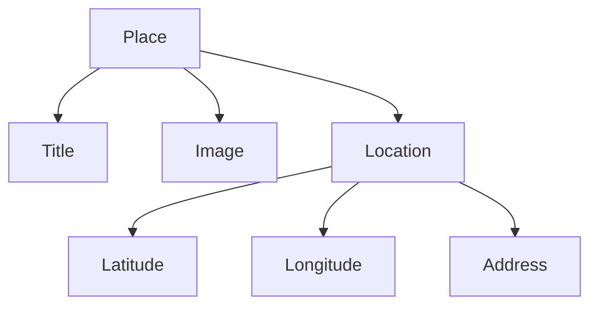
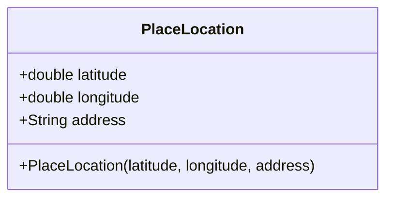
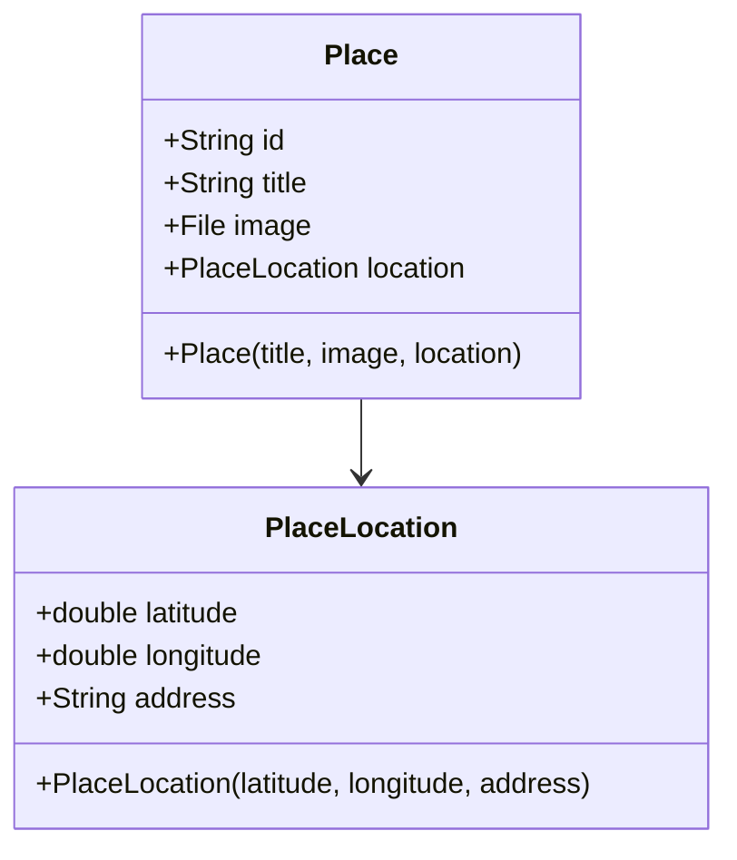
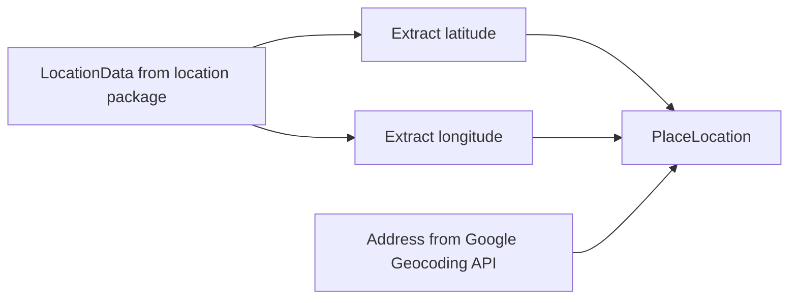
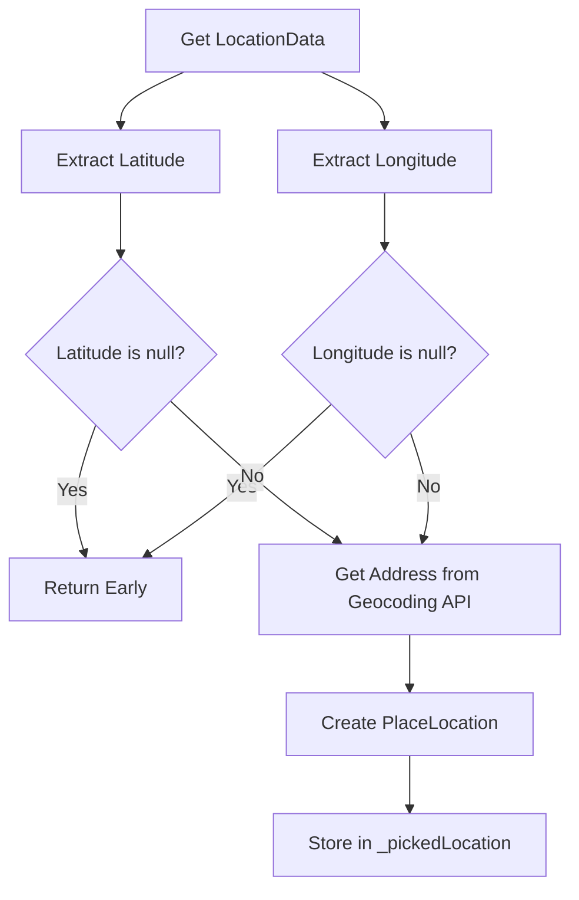
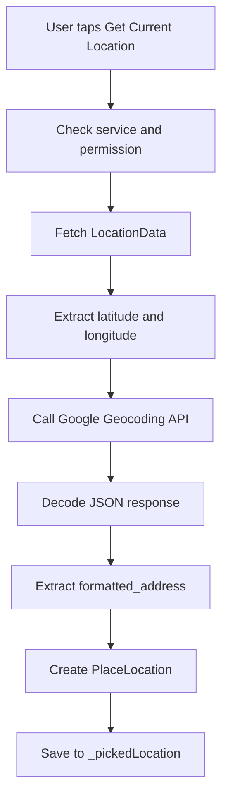
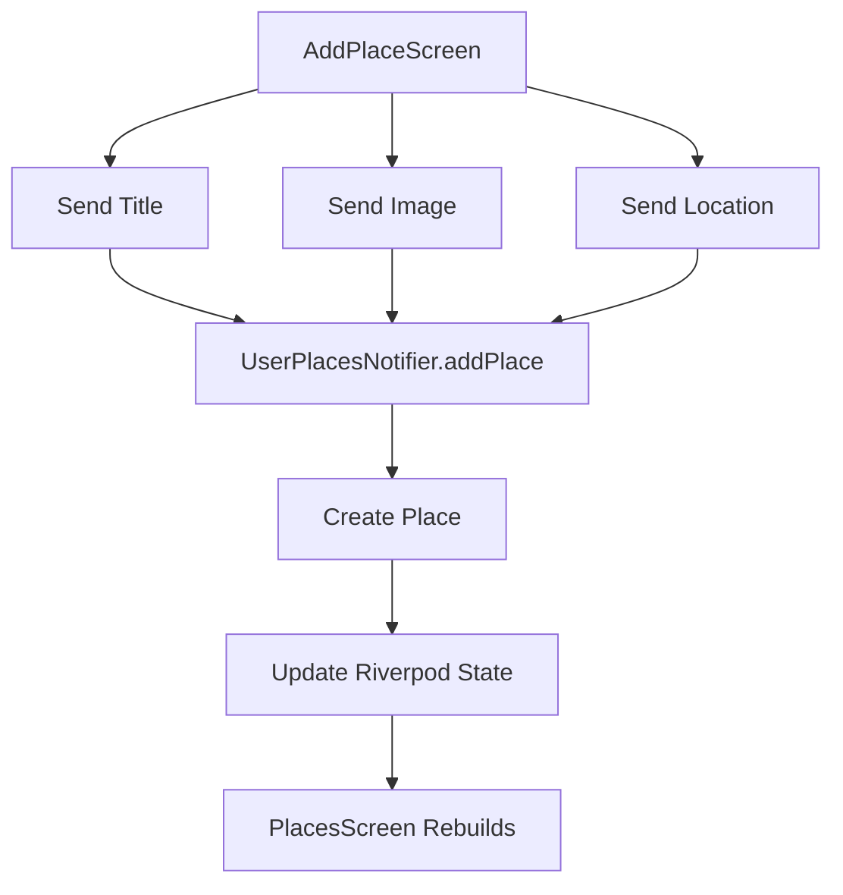
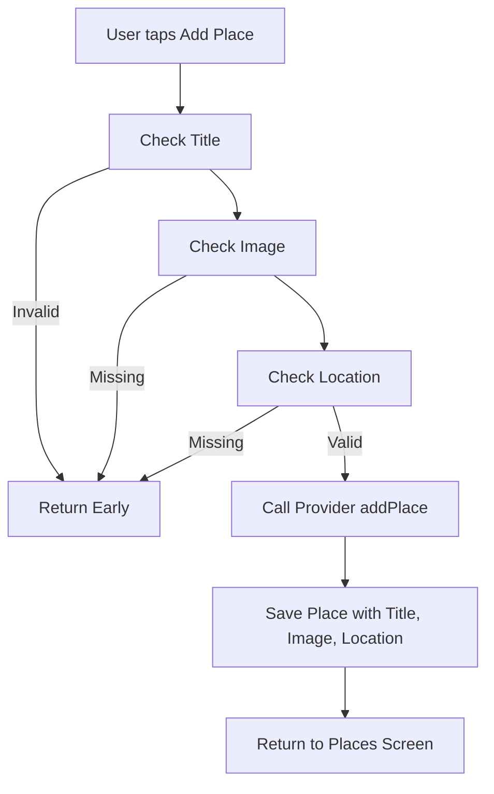
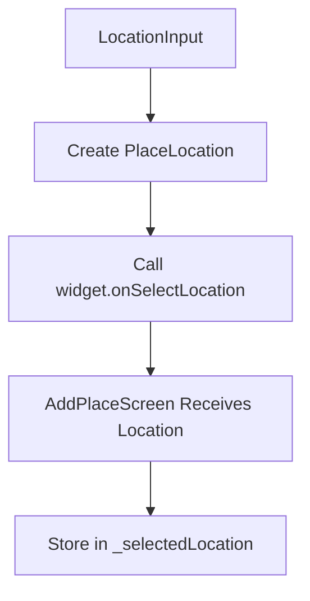
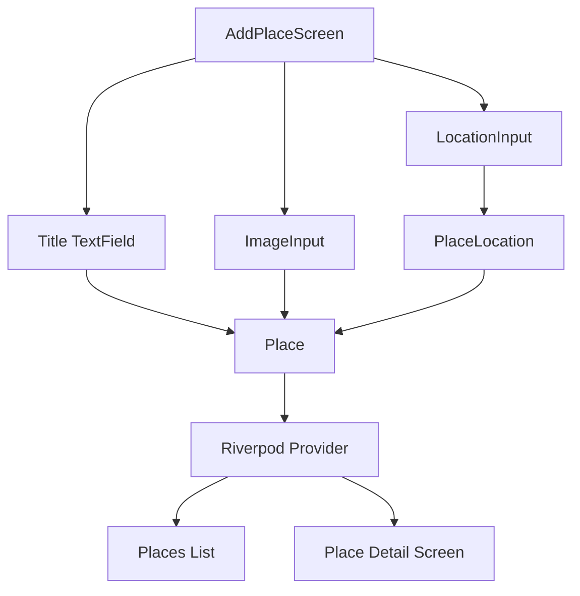

# Storing the Location Data in the Model

## Overview

This lecture updates the Favorite Places app so that each saved place can store complete location data.

Previously, the app could fetch the user's latitude and longitude and use Google's Geocoding API to convert those coordinates into a human-readable address. However, that location data was not yet part of the `Place` model.

In this lecture, a new `PlaceLocation` model is added. This model groups together the latitude, longitude, and address of a selected location. The main `Place` model is then updated so that every place stores its title, image, and location together.

---

## Learning Goals

By the end of this lecture, you should be able to:

* Create a separate model class for location data
* Store latitude, longitude, and address together
* Add a location field to the `Place` model
* Use nullable checks for GPS values
* Create a `PlaceLocation` object after fetching coordinates and address
* Prepare the app to save location data together with each place

---

## Why Add a Separate Location Model?

A location is not just one value.

It contains multiple related pieces of data:

* Latitude
* Longitude
* Human-readable address

Instead of storing all of these directly inside the `Place` class as separate fields, the app creates a dedicated `PlaceLocation` class.



This keeps the model cleaner and easier to understand.

---

# 1. Creating the PlaceLocation Model

Open:

```text
lib/models/place.dart
```

Add a new model class called `PlaceLocation`.

```dart
class PlaceLocation {
  const PlaceLocation({
    required this.latitude,
    required this.longitude,
    required this.address,
  });

  final double latitude;
  final double longitude;
  final String address;
}
```

---

## PlaceLocation Fields

| Field       | Type     | Purpose                                                     |
| ----------- | -------- | ----------------------------------------------------------- |
| `latitude`  | `double` | Stores the north-south GPS coordinate                       |
| `longitude` | `double` | Stores the east-west GPS coordinate                         |
| `address`   | `String` | Stores the human-readable address from Google Geocoding API |

---

## PlaceLocation Structure



---

# 2. Updating the Place Model

The `Place` model should now store a `PlaceLocation`.

```dart
import 'dart:io';

import 'package:uuid/uuid.dart';

const uuid = Uuid();

class PlaceLocation {
  const PlaceLocation({
    required this.latitude,
    required this.longitude,
    required this.address,
  });

  final double latitude;
  final double longitude;
  final String address;
}

class Place {
  Place({
    required this.title,
    required this.image,
    required this.location,
  }) : id = uuid.v4();

  final String id;
  final String title;
  final File image;
  final PlaceLocation location;
}
```

> Note: If your project uses `name` instead of `title`, keep using `name` consistently.

---

## Updated Place Fields

| Field      | Type            | Purpose                             |
| ---------- | --------------- | ----------------------------------- |
| `id`       | `String`        | Unique ID generated with `uuid`     |
| `title`    | `String`        | The place title entered by the user |
| `image`    | `File`          | The photo taken for the place       |
| `location` | `PlaceLocation` | The selected location data          |

---

## Updated Model Structure



---

# 3. Updating LocationInput to Use PlaceLocation

Open:

```text
lib/widgets/location_input.dart
```

Previously, the widget may have stored location data using a type from the `location` package.

Now, it should store your custom `PlaceLocation` model instead.

Import the model:

```dart
import '../models/place.dart';
```

Then update the picked location variable:

```dart
PlaceLocation? _pickedLocation;
```

---

## Why Use PlaceLocation Instead of LocationData?

The `location` package returns a `LocationData` object.

That object contains raw device location information.

However, the app needs a custom object that contains only the data it wants to save:

* Latitude
* Longitude
* Address



---

# 4. Creating a PlaceLocation Object

After fetching the location and address, create a `PlaceLocation`.

```dart
final lat = locationData.latitude;
final lng = locationData.longitude;

if (lat == null || lng == null) {
  return;
}

final address = resData['results'][0]['formatted_address'];

setState(() {
  _pickedLocation = PlaceLocation(
    latitude: lat,
    longitude: lng,
    address: address,
  );
  _isGettingLocation = false;
});
```

---

## Why Check for Null?

The `latitude` and `longitude` values from `LocationData` can be nullable.

```dart
final lat = locationData.latitude;
final lng = locationData.longitude;
```

That means they might not contain valid values.

Before creating a `PlaceLocation`, check them:

```dart
if (lat == null || lng == null) {
  return;
}
```

This prevents the app from creating an invalid location object.

---

## Location Creation Flow



---

# 5. Updated _getCurrentLocation Flow

The `_getCurrentLocation` method now does more than just fetch GPS data.

It should:

1. Check location service availability
2. Request location permission
3. Fetch latitude and longitude
4. Send a request to Google Geocoding API
5. Extract the formatted address
6. Create a `PlaceLocation`
7. Store it in widget state



---

# 6. Updating the Provider

The provider should also accept location data when creating a new place.

Open:

```text
lib/providers/user_places.dart
```

Update `addPlace` so it receives a `PlaceLocation`.

```dart
import 'dart:io';

import 'package:flutter_riverpod/flutter_riverpod.dart';

import '../models/place.dart';

class UserPlacesNotifier extends StateNotifier<List<Place>> {
  UserPlacesNotifier() : super(const []);

  void addPlace(String title, File image, PlaceLocation location) {
    final newPlace = Place(
      title: title,
      image: image,
      location: location,
    );

    state = [newPlace, ...state];
  }
}

final userPlacesProvider =
    StateNotifierProvider<UserPlacesNotifier, List<Place>>(
  (ref) => UserPlacesNotifier(),
);
```

---

## Provider Update Flow



---

# 7. Updating AddPlaceScreen

The Add Place screen must collect the selected location from `LocationInput`.

Inside `_AddPlaceScreenState`, add:

```dart
PlaceLocation? _selectedLocation;
```

Then pass a callback to `LocationInput`:

```dart
LocationInput(
  onSelectLocation: (location) {
    _selectedLocation = location;
  },
),
```

The callback stores the picked location in the form state.

---

## Updating Save Validation

The app should only save a place if all required data exists:

* Title
* Image
* Location

```dart
void _savePlace() {
  final enteredTitle = _titleController.text;

  if (enteredTitle.trim().isEmpty ||
      _selectedImage == null ||
      _selectedLocation == null) {
    return;
  }

  ref.read(userPlacesProvider.notifier).addPlace(
        enteredTitle,
        _selectedImage!,
        _selectedLocation!,
      );

  Navigator.of(context).pop();
}
```

---

## Save Validation Flow



---

# 8. Updating LocationInput Callback

The `LocationInput` widget should accept a callback function from its parent.

```dart
class LocationInput extends StatefulWidget {
  const LocationInput({
    super.key,
    required this.onSelectLocation,
  });

  final void Function(PlaceLocation location) onSelectLocation;

  @override
  State<LocationInput> createState() {
    return _LocationInputState();
  }
}
```

After creating `_pickedLocation`, call the callback:

```dart
widget.onSelectLocation(_pickedLocation!);
```

This sends the selected location back to `AddPlaceScreen`.

---

## Callback Flow



---

# 9. Complete Data Model Flow

After this lecture, each saved place contains three major pieces of user data.



---

# 10. Current Place Object

A saved `Place` object now looks conceptually like this:

```text
Place
├── id
├── title
├── image
└── location
    ├── latitude
    ├── longitude
    └── address
```

---

# 11. Key Points

* A new `PlaceLocation` class is added to `place.dart`.
* `PlaceLocation` stores `latitude`, `longitude`, and `address`.
* The `Place` model now has a required `location` field.
* `LocationInput` stores a `PlaceLocation?` instead of raw location package data.
* Latitude and longitude should be checked for `null` before creating a `PlaceLocation`.
* The provider's `addPlace` method should accept title, image, and location.
* The Add Place form should validate that title, image, and location are all provided before saving.

---

## Notes

Grouping location data in a separate `PlaceLocation` model makes the app easier to extend later.

For example, if you later want to add more location-related data, such as a postal code, city, country, or map preview URL, you can add those fields to `PlaceLocation` without cluttering the main `Place` model.

At this stage, the app can store the full location data, but it still does not show a map preview. That will be added next.

---

## Summary

This lecture updates the app's data model so each saved place can store complete location data.

A new `PlaceLocation` model stores latitude, longitude, and address. The `Place` model now includes a required `location` field, and the provider and Add Place form are updated to pass location data when creating a new place.

The app can now save a place with its title, image, and selected location.
