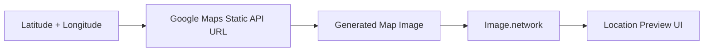
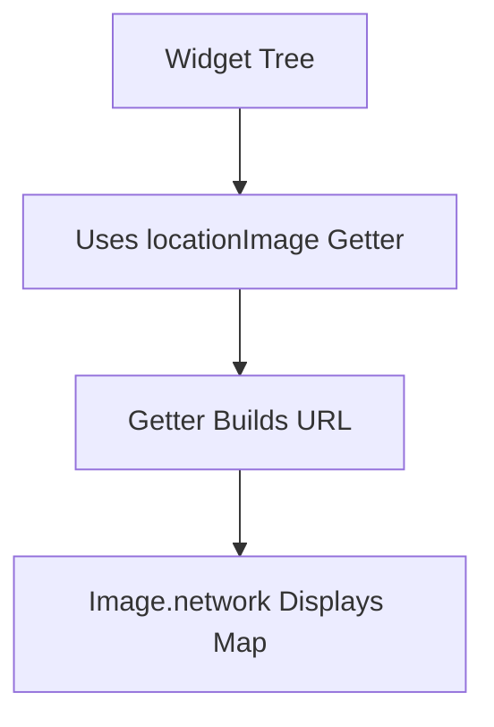
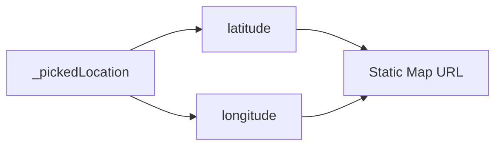
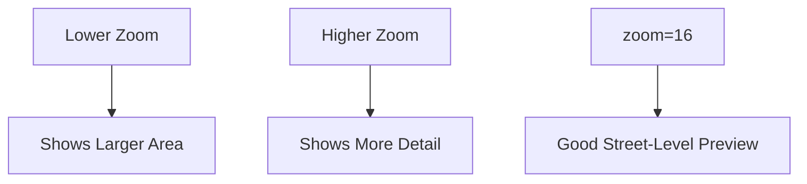
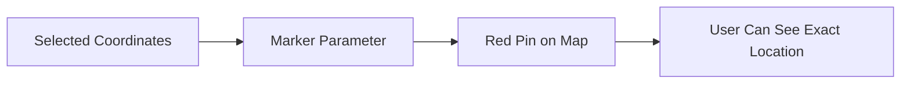
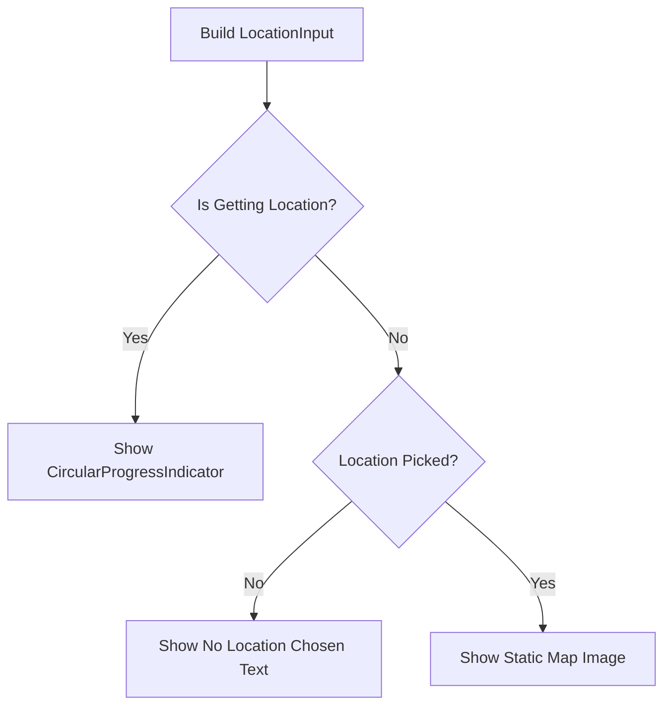
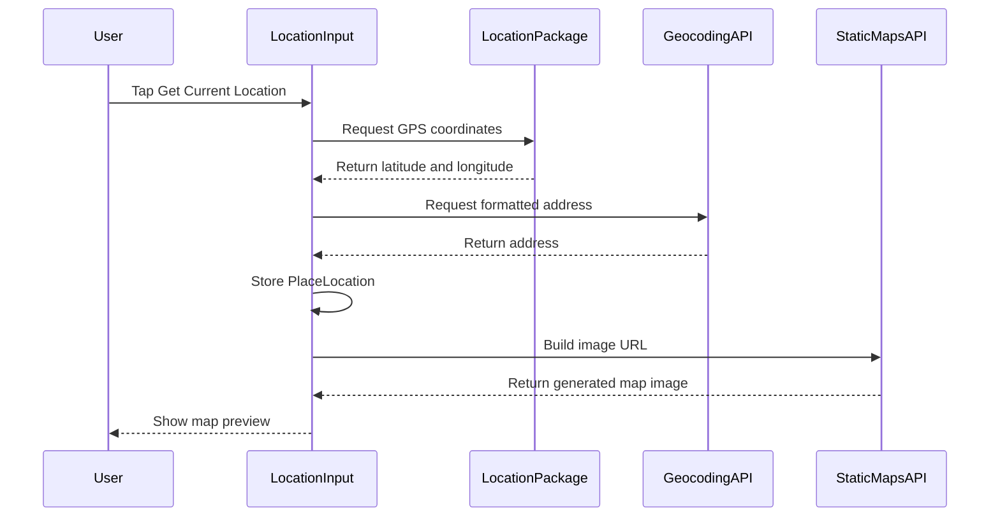
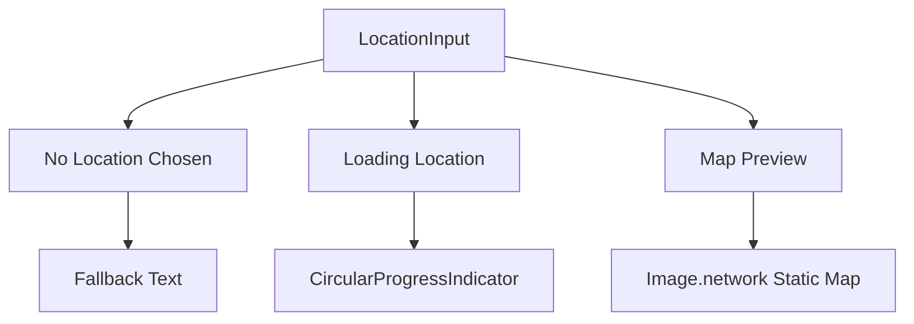

# Displaying a Location Preview Map Snapshot via Google

## Overview

This lecture shows how to display a static map preview after the user picks a location.

In the previous lectures, the app was able to:

* Get the user's current latitude and longitude
* Convert those coordinates into a human-readable address
* Store the result as a `PlaceLocation` object

Now, the app will use the **Google Maps Static API** to generate a map snapshot image. This image is displayed inside the `LocationInput` preview container.

Instead of embedding a full interactive map, this approach uses a simple image URL and displays it with `Image.network`.

---

## Learning Goals

By the end of this lecture, you should be able to:

* Understand what the Google Maps Static API does
* Build a static map image URL with latitude and longitude
* Add a marker to a static map image
* Display a network image with `Image.network`
* Show a map preview only after a location has been picked
* Use a getter to keep long URL logic out of the widget tree

---

## What Is the Maps Static API?

The Google Maps Static API generates an image of a map based on URL parameters.

Instead of returning JSON data, it returns an image.

That means the app can display the result directly using Flutter's `Image.network`.



---

## Static Map URL Format

A basic Google Maps Static API URL looks like this:

```text
https://maps.googleapis.com/maps/api/staticmap?center=LAT,LNG&zoom=16&size=600x300&maptype=roadmap&markers=color:red%7Clabel:A%7CLAT,LNG&key=API_KEY
```

The app replaces:

| Placeholder | Meaning                  |
| ----------- | ------------------------ |
| `LAT`       | The selected latitude    |
| `LNG`       | The selected longitude   |
| `API_KEY`   | Your Google Maps API key |

---

## Example Static Map Parameters

| Parameter | Purpose                               |
| --------- | ------------------------------------- |
| `center`  | Controls the center point of the map  |
| `zoom`    | Controls how close the map is         |
| `size`    | Controls the generated image size     |
| `maptype` | Controls the map style                |
| `markers` | Adds a visible pin on the map         |
| `key`     | Authenticates the request with Google |

---

# 1. Creating a Location Preview Getter

Inside `_LocationInputState`, add a getter that builds the map image URL.

```dart
String get locationImage {
  if (_pickedLocation == null) {
    return '';
  }

  final lat = _pickedLocation!.latitude;
  final lng = _pickedLocation!.longitude;

  const apiKey = 'YOUR_API_KEY';

  return 'https://maps.googleapis.com/maps/api/staticmap'
      '?center=$lat,$lng'
      '&zoom=16'
      '&size=600x300'
      '&maptype=roadmap'
      '&markers=color:red%7Clabel:A%7C$lat,$lng'
      '&key=$apiKey';
}
```

---

## Why Use a Getter?

The static map URL is long and hard to read.

Instead of placing it directly inside the widget tree, the app uses a getter.



This keeps the `build` method cleaner.

---

## Null Check

```dart
if (_pickedLocation == null) {
  return '';
}
```

The app only builds a map URL if a location has already been selected.

This prevents errors caused by trying to access latitude and longitude before they exist.

---

# 2. Extracting Latitude and Longitude

The latitude and longitude come from `_pickedLocation`.

```dart
final lat = _pickedLocation!.latitude;
final lng = _pickedLocation!.longitude;
```

The `!` operator is used because the getter already checked that `_pickedLocation` is not `null`.

---

## Coordinate Flow



---

# 3. Configuring the Map Center

The `center` parameter controls where the map image is centered.

```text
?center=$lat,$lng
```

This ensures the generated map focuses on the selected location.

---

# 4. Configuring the Zoom Level

```text
&zoom=16
```

The zoom value controls how close the map appears.

A value of `16` gives a street-level view that works well for showing a specific place.



---

# 5. Configuring the Image Size

```text
&size=600x300
```

This tells Google to generate an image that is:

* `600` pixels wide
* `300` pixels tall

The generated image will later be fitted into the Flutter preview container.

---

# 6. Configuring the Map Type

```text
&maptype=roadmap
```

The `roadmap` map type displays the standard Google Maps road view.

Other possible map types may include satellite or terrain, but `roadmap` is a good default for this app.

---

# 7. Adding a Marker

The marker parameter adds a visible pin to the map.

```text
&markers=color:red%7Clabel:A%7C$lat,$lng
```

This marker configuration means:

| Part        | Meaning                                          |
| ----------- | ------------------------------------------------ |
| `color:red` | The marker color is red                          |
| `label:A`   | The marker contains the label `A`                |
| `%7C`       | Encoded separator character                      |
| `$lat,$lng` | The marker is placed at the selected coordinates |

---

## Marker Flow



---

# 8. Displaying the Static Map Preview

In the `build` method, update `previewContent`.

The default preview content is still the fallback text.

```dart
Widget previewContent = Text(
  'No location chosen.',
  textAlign: TextAlign.center,
  style: Theme.of(context).textTheme.bodyLarge!.copyWith(
        color: Theme.of(context).colorScheme.onBackground,
      ),
);
```

If a location is currently being fetched, show a loading spinner.

```dart
if (_isGettingLocation) {
  previewContent = const CircularProgressIndicator();
}
```

If a location has been picked, show the static map image.

```dart
if (_pickedLocation != null) {
  previewContent = Image.network(
    locationImage,
    fit: BoxFit.cover,
    width: double.infinity,
    height: double.infinity,
  );
}
```

---

## Preview Content Logic



---

# 9. Why Use `Image.network`?

The Maps Static API gives the app a URL that points to an image.

Flutter can display that image with:

```dart
Image.network(locationImage)
```

This is different from previous image handling:

| Image Source        | Widget          |
| ------------------- | --------------- |
| Local camera file   | `Image.file`    |
| Online map snapshot | `Image.network` |

---

# 10. Image Display Configuration

```dart
Image.network(
  locationImage,
  fit: BoxFit.cover,
  width: double.infinity,
  height: double.infinity,
)
```

| Property                  | Purpose                               |
| ------------------------- | ------------------------------------- |
| `locationImage`           | The map snapshot URL                  |
| `fit: BoxFit.cover`       | Makes the image fill the preview area |
| `width: double.infinity`  | Uses all available width              |
| `height: double.infinity` | Uses all available height             |

---

# 11. Updated `LocationInput` Preview Section

```dart
@override
Widget build(BuildContext context) {
  Widget previewContent = Text(
    'No location chosen.',
    textAlign: TextAlign.center,
    style: Theme.of(context).textTheme.bodyLarge!.copyWith(
          color: Theme.of(context).colorScheme.onBackground,
        ),
  );

  if (_isGettingLocation) {
    previewContent = const CircularProgressIndicator();
  }

  if (_pickedLocation != null) {
    previewContent = Image.network(
      locationImage,
      fit: BoxFit.cover,
      width: double.infinity,
      height: double.infinity,
    );
  }

  return Column(
    children: [
      Container(
        height: 170,
        width: double.infinity,
        alignment: Alignment.center,
        decoration: BoxDecoration(
          border: Border.all(
            width: 1,
            color: Theme.of(context).colorScheme.primary.withOpacity(0.2),
          ),
        ),
        child: previewContent,
      ),
      Row(
        mainAxisAlignment: MainAxisAlignment.spaceEvenly,
        children: [
          TextButton.icon(
            onPressed: _getCurrentLocation,
            icon: const Icon(Icons.location_on),
            label: const Text('Get Current Location'),
          ),
          TextButton.icon(
            onPressed: _selectOnMap,
            icon: const Icon(Icons.map),
            label: const Text('Select on Map'),
          ),
        ],
      ),
    ],
  );
}
```

---

# 12. Complete Static Map Preview Flow



---

# 13. Current UI Behavior

After this lecture, the location input can show three different states.



---

# 14. Testing the Preview

To test the feature:

1. Run the app.
2. Open the Add Place screen.
3. Tap **Get Current Location**.
4. Wait for the location to load.
5. The preview container should show a map snapshot.

On the Android emulator, the default location is often near Google's campus in California, unless you configure a custom emulator location.

---

# 15. Temporary Model Note

If the app currently has compile errors because the `Place` model was updated to require location data, you may need to temporarily adjust or complete all related constructor calls before testing.

In the lecture, the location field was temporarily commented out in the `Place` model to test the preview feature first.

In a complete version, the app should keep the location field and update all save logic accordingly.

---

# 16. Key Points

* The Google Maps Static API generates a map image from a URL.
* The app builds the URL using latitude, longitude, zoom, size, map type, marker, and API key.
* `Image.network` displays the generated map image.
* The map preview is shown only after `_pickedLocation` is set.
* `BoxFit.cover` makes the map image fill the preview container.
* A getter keeps the long map URL out of the widget tree.
* A marker is added to clearly show the selected location.
* This is a lightweight preview, not an interactive map.

---

## Notes

The Maps Static API is useful when you only need a visual confirmation of a location. It is simpler and lighter than embedding a full interactive map.

This preview works well inside the Add Place form because users only need to confirm that the correct location was selected.

Later, an interactive map can be added for manual location selection.

Also, avoid hardcoding API keys in public repositories. For real apps, use environment-based configuration or another secure key management strategy.

---

## Summary

This lecture adds a static map preview to the `LocationInput` widget.

After the user picks a location, the app builds a Google Maps Static API URL using the selected latitude and longitude. Flutter then displays that URL with `Image.network`.

The result is a lightweight map snapshot that visually confirms the selected place before it is saved.
