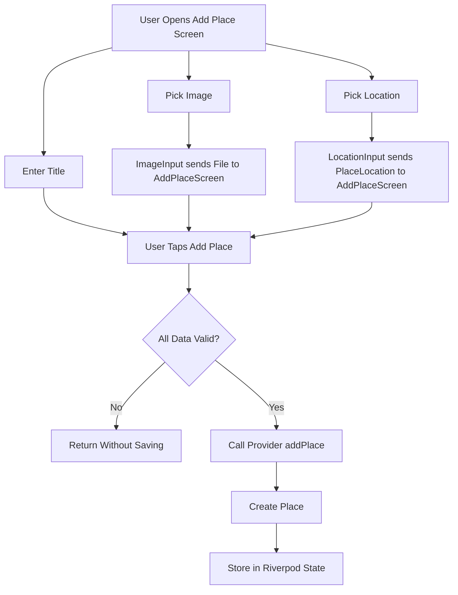
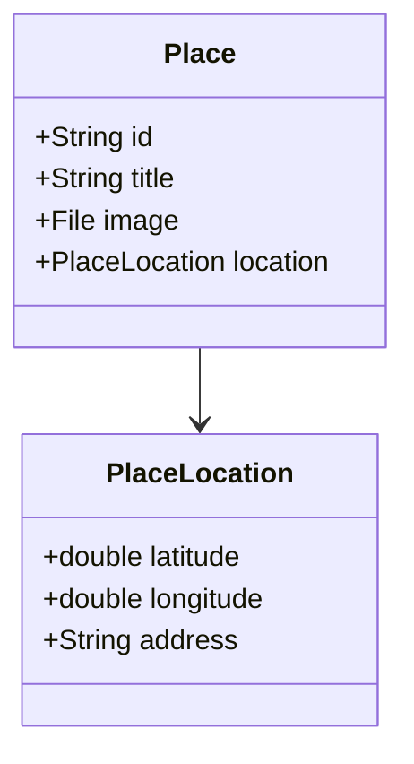
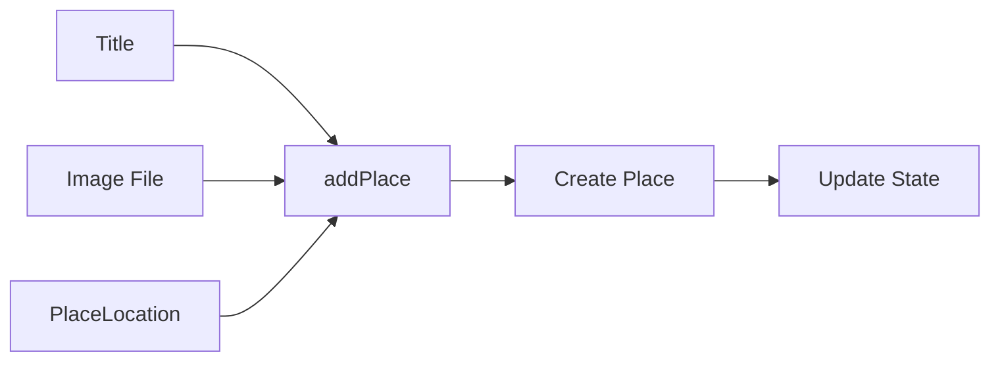
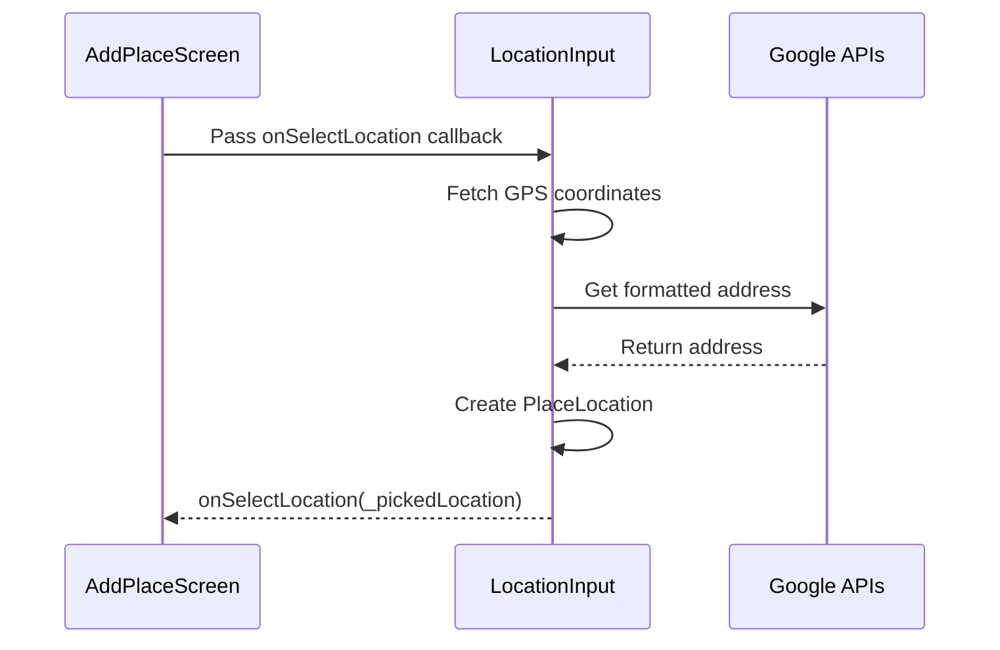
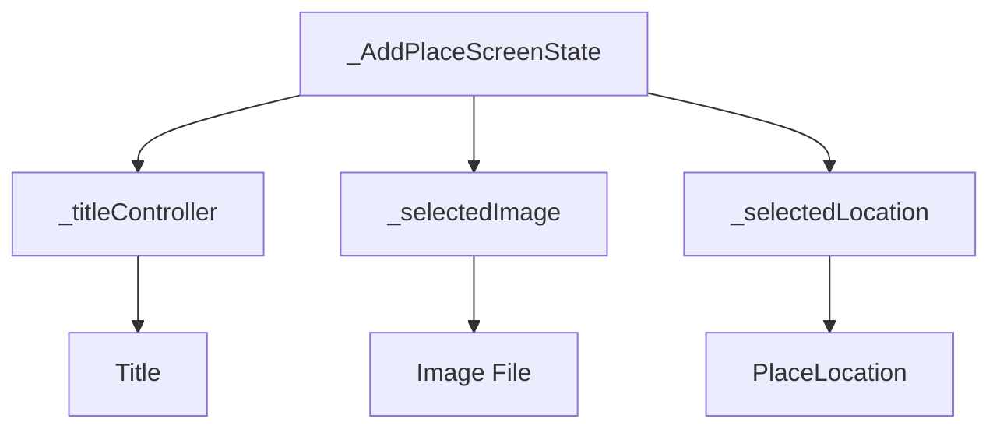
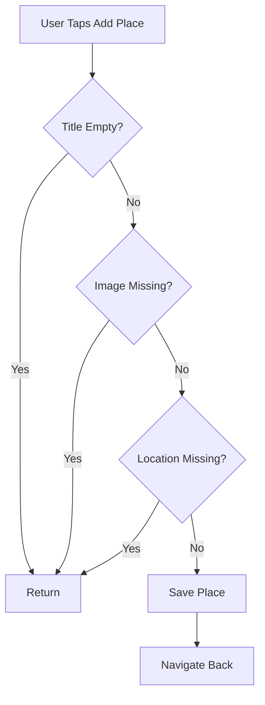
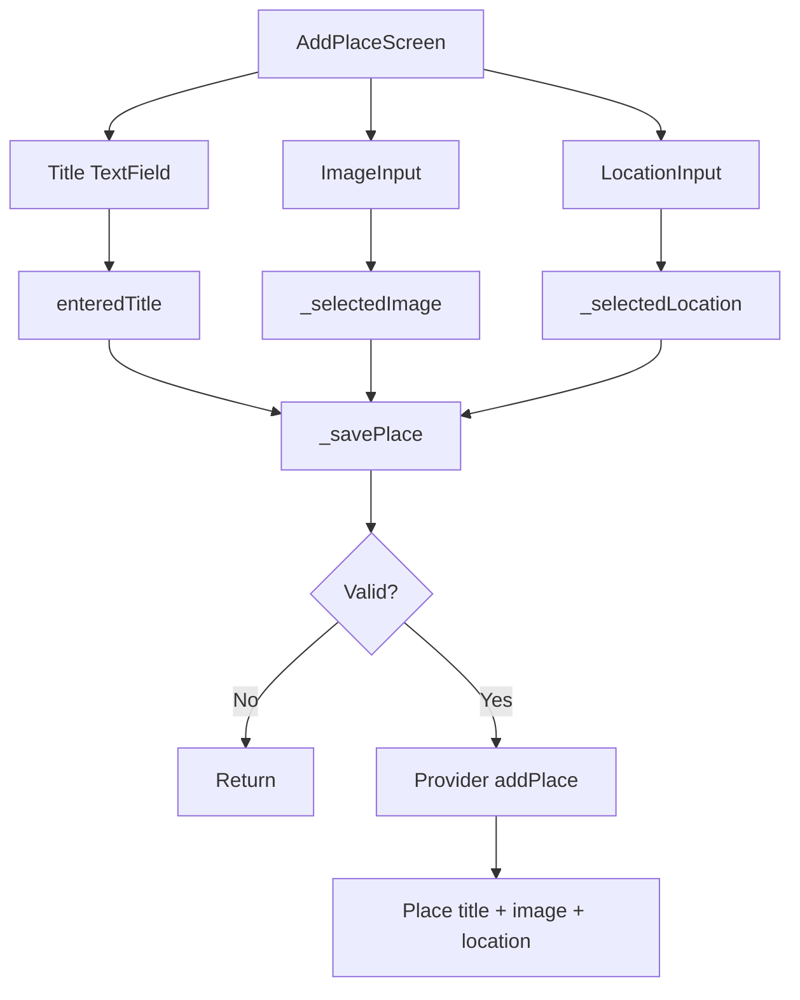
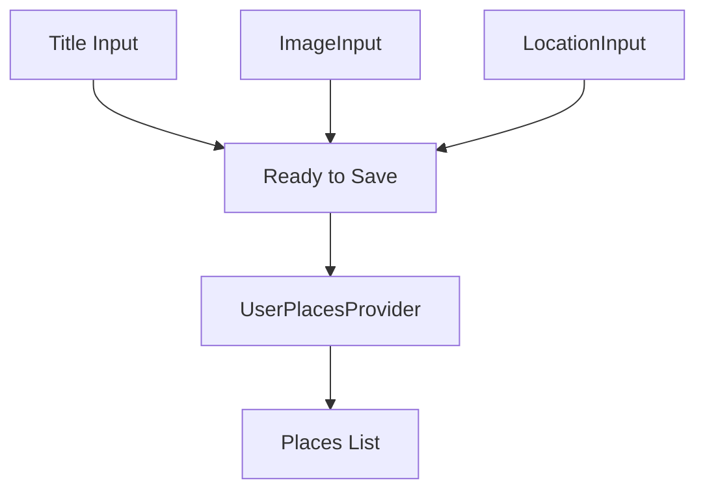

# Using the Picked Location in the Form

## Overview

This lecture connects the picked location from the `LocationInput` widget to the `AddPlaceScreen` form.

Previously, the `LocationInput` widget could fetch the user's current location, convert it into a `PlaceLocation`, and display a static map preview. However, the selected location was still only managed inside the `LocationInput` widget.

Now, the selected location is passed back to the parent `AddPlaceScreen` through a callback. The form then validates that a title, image, and location are all provided before saving the new place.

---

## Learning Goals

By the end of this lecture, you should be able to:

* Pass location data from a child widget to a parent widget
* Use a callback function with a custom model type
* Store a selected `PlaceLocation` in form state
* Update the provider to receive location data
* Validate that a location was selected before saving
* Save a complete `Place` object with title, image, and location

---

## Complete Add Place Flow



---

# 1. Restoring Location in the Place Model

Open:

```text id="e2ewc3"
lib/models/place.dart
```

Make sure the `Place` model includes the `location` field again.

```dart id="9iwib2"
import 'dart:io';

import 'package:uuid/uuid.dart';

const uuid = Uuid();

class PlaceLocation {
  const PlaceLocation({
    required this.latitude,
    required this.longitude,
    required this.address,
  });

  final double latitude;
  final double longitude;
  final String address;
}

class Place {
  Place({
    required this.title,
    required this.image,
    required this.location,
  }) : id = uuid.v4();

  final String id;
  final String title;
  final File image;
  final PlaceLocation location;
}
```

> Note: If your project uses `name` instead of `title`, keep using `name` consistently.

---

## Updated Place Structure



---

# 2. Updating the Provider

Open:

```text id="vaypvr"
lib/providers/user_places.dart
```

The provider must now receive the location when creating a new place.

---

## Updated `addPlace`

```dart id="1lrszx"
void addPlace(String title, File image, PlaceLocation location) {
  final newPlace = Place(
    title: title,
    image: image,
    location: location,
  );

  state = [newPlace, ...state];
}
```

---

## Full Provider Example

```dart id="rnss7b"
import 'dart:io';

import 'package:flutter_riverpod/flutter_riverpod.dart';

import '../models/place.dart';

class UserPlacesNotifier extends StateNotifier<List<Place>> {
  UserPlacesNotifier() : super(const []);

  void addPlace(String title, File image, PlaceLocation location) {
    final newPlace = Place(
      title: title,
      image: image,
      location: location,
    );

    state = [newPlace, ...state];
  }
}

final userPlacesProvider =
    StateNotifierProvider<UserPlacesNotifier, List<Place>>(
  (ref) => UserPlacesNotifier(),
);
```

---

## Provider Data Flow



---

# 3. Adding a Callback to LocationInput

The `LocationInput` widget must notify its parent when a location has been selected.

Open:

```text id="sn31ew"
lib/widgets/location_input.dart
```

Update the widget constructor.

```dart id="e06c8a"
class LocationInput extends StatefulWidget {
  const LocationInput({
    super.key,
    required this.onSelectLocation,
  });

  final void Function(PlaceLocation location) onSelectLocation;

  @override
  State<LocationInput> createState() {
    return _LocationInputState();
  }
}
```

---

## Callback Type Explanation

```dart id="6c28hf"
final void Function(PlaceLocation location) onSelectLocation;
```

This means `onSelectLocation` is a function that:

* Returns nothing: `void`
* Receives one argument: `PlaceLocation location`

The parent screen will pass this function into `LocationInput`.

---

# 4. Calling the Callback After Picking a Location

After the location has been fetched, converted to an address, and stored in `_pickedLocation`, call the callback.

```dart id="7drn6a"
setState(() {
  _pickedLocation = PlaceLocation(
    latitude: lat,
    longitude: lng,
    address: address,
  );
  _isGettingLocation = false;
});

widget.onSelectLocation(_pickedLocation!);
```

The `!` is safe here because `_pickedLocation` was just assigned a value.

---

## Location Callback Flow



---

# 5. Updating AddPlaceScreen State

Open:

```text id="th8i7x"
lib/screens/add_place.dart
```

Import the model if it is not already imported.

```dart id="dps764"
import '../models/place.dart';
```

Inside `_AddPlaceScreenState`, add a new nullable variable.

```dart id="fv60zc"
PlaceLocation? _selectedLocation;
```

This stores the location received from `LocationInput`.

---

## AddPlaceScreen State



---

# 6. Passing the Callback to LocationInput

In the `build` method, update the `LocationInput` widget.

```dart id="q7h8ju"
LocationInput(
  onSelectLocation: (location) {
    _selectedLocation = location;
  },
),
```

This receives the selected location and stores it in `_selectedLocation`.

---

## With `setState`

You can also wrap the assignment in `setState`.

```dart id="ev9l12"
LocationInput(
  onSelectLocation: (location) {
    setState(() {
      _selectedLocation = location;
    });
  },
),
```

In this specific case, the parent UI may not visibly change when `_selectedLocation` is updated. However, using `setState()` is still acceptable and keeps the form state update explicit.

---

# 7. Updating Save Validation

The app should not save a place unless all required fields are present.

The required data is:

* Title
* Image
* Location

```dart id="i2hg6e"
void _savePlace() {
  final enteredTitle = _titleController.text;

  if (enteredTitle.trim().isEmpty ||
      _selectedImage == null ||
      _selectedLocation == null) {
    return;
  }

  ref.read(userPlacesProvider.notifier).addPlace(
        enteredTitle,
        _selectedImage!,
        _selectedLocation!,
      );

  Navigator.of(context).pop();
}
```

---

## Validation Flow



---

# 8. Why Use Non-Null Assertions?

After validation, Dart still sees `_selectedImage` and `_selectedLocation` as nullable variables.

So the code uses `!`.

```dart id="ac6230"
_selectedImage!
_selectedLocation!
```

This tells Dart:

```text id="nle6x0"
These values are definitely not null at this point.
```

This is safe because the method already returned if either value was missing.

---

# 9. Updated AddPlaceScreen Example

```dart id="rhv04n"
import 'dart:io';

import 'package:flutter/material.dart';
import 'package:flutter_riverpod/flutter_riverpod.dart';

import '../models/place.dart';
import '../providers/user_places.dart';
import '../widgets/image_input.dart';
import '../widgets/location_input.dart';

class AddPlaceScreen extends ConsumerStatefulWidget {
  const AddPlaceScreen({super.key});

  @override
  ConsumerState<AddPlaceScreen> createState() {
    return _AddPlaceScreenState();
  }
}

class _AddPlaceScreenState extends ConsumerState<AddPlaceScreen> {
  final _titleController = TextEditingController();

  File? _selectedImage;
  PlaceLocation? _selectedLocation;

  void _savePlace() {
    final enteredTitle = _titleController.text;

    if (enteredTitle.trim().isEmpty ||
        _selectedImage == null ||
        _selectedLocation == null) {
      return;
    }

    ref.read(userPlacesProvider.notifier).addPlace(
          enteredTitle,
          _selectedImage!,
          _selectedLocation!,
        );

    Navigator.of(context).pop();
  }

  @override
  void dispose() {
    _titleController.dispose();
    super.dispose();
  }

  @override
  Widget build(BuildContext context) {
    return Scaffold(
      appBar: AppBar(
        title: const Text('Add new Place'),
      ),
      body: SingleChildScrollView(
        padding: const EdgeInsets.all(12),
        child: Column(
          children: [
            TextField(
              controller: _titleController,
              style: TextStyle(
                color: Theme.of(context).colorScheme.onBackground,
              ),
              decoration: const InputDecoration(
                labelText: 'Title',
              ),
            ),
            const SizedBox(height: 10),
            ImageInput(
              onPickImage: (image) {
                _selectedImage = image;
              },
            ),
            const SizedBox(height: 10),
            LocationInput(
              onSelectLocation: (location) {
                _selectedLocation = location;
              },
            ),
            const SizedBox(height: 16),
            ElevatedButton.icon(
              onPressed: _savePlace,
              icon: const Icon(Icons.add),
              label: const Text('Add Place'),
            ),
          ],
        ),
      ),
    );
  }
}
```

---

# 10. Complete Form Data Flow



---

# 11. Final Saved Place Data

After this lecture, a saved place contains:

```text id="gu5gp7"
Place
├── id
├── title
├── image
└── location
    ├── latitude
    ├── longitude
    └── address
```

---

# 12. Current App Behavior

After this lecture, the app can:

* Pick an image
* Pick the current location
* Generate a map preview
* Store the selected image in the form
* Store the selected location in the form
* Validate that title, image, and location exist
* Save a complete `Place` object through the provider

---

## Current Feature Status



---

# 13. Key Points

* The `Place` model must include a required `location` field.
* The provider's `addPlace` method now accepts a `PlaceLocation`.
* `AddPlaceScreen` stores the selected location in `_selectedLocation`.
* `LocationInput` receives an `onSelectLocation` callback.
* `LocationInput` calls `widget.onSelectLocation(_pickedLocation!)` after creating the location.
* The form validates that title, image, and location are all provided.
* `_selectedLocation!` is used only after validation confirms it is not null.

---

## Notes

This lecture uses the same child-to-parent communication pattern that was already used for the image input.

The difference is that `ImageInput` sends a `File`, while `LocationInput` sends a `PlaceLocation`.

This keeps both input widgets reusable and focused:

* `ImageInput` manages camera and image preview logic.
* `LocationInput` manages GPS, geocoding, and map preview logic.
* `AddPlaceScreen` collects the final form data and saves it.

---

## Summary

This lecture wires the picked location into the Add Place form.

The `LocationInput` widget now sends its selected `PlaceLocation` back to `AddPlaceScreen` through an `onSelectLocation` callback. The form stores it in `_selectedLocation`, validates that it exists, and passes it to the provider when saving a new place.

The Favorite Places app can now save a complete place with a title, image, and location.
