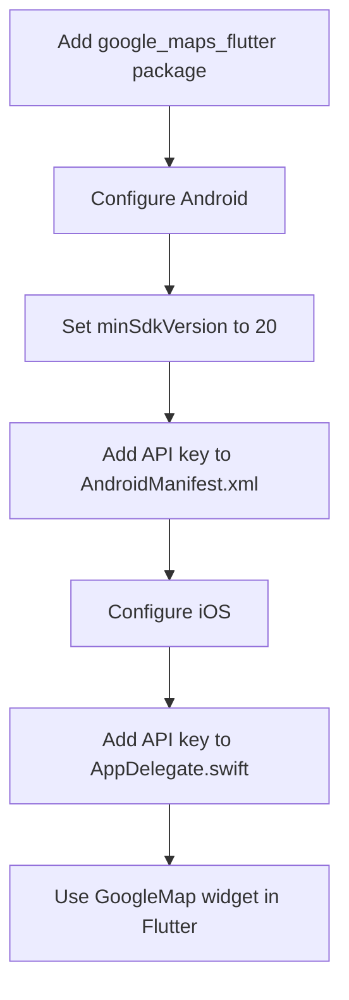
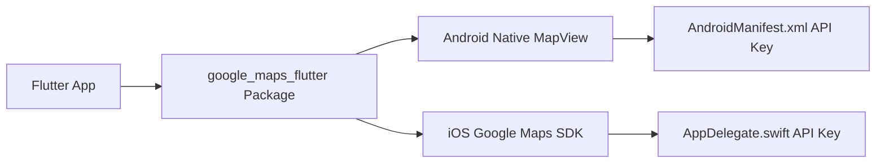

# Installing and Configuring the Google Maps Package

## Overview

This lecture explains how to install and configure the `google_maps_flutter` package in a Flutter project.

The package allows you to embed an interactive Google Maps view directly inside your Flutter app. Unlike a static map image, this map can be panned, zoomed, and interacted with by the user.

Because Google Maps is powered by native platform SDKs, the package requires additional setup for both Android and iOS. The same Google API key used earlier for Static Maps and Geocoding can also be reused for this package.

---

## Why Use `google_maps_flutter`?

The `google_maps_flutter` package provides the `GoogleMap` widget, which lets you display a live Google Map inside your Flutter widget tree.

It is useful when you want users to:

* View a place on an interactive map
* Pan and zoom around a location
* Select a location manually
* Display markers on specific coordinates
* Build map-based features inside your app

---

## Installation Flow



---

## Step 1: Add the Package

First, install the package by running:

```bash
flutter pub add google_maps_flutter
```

Or manually add it to `pubspec.yaml`:

```yaml
dependencies:
  google_maps_flutter: ^2.0.0
```

You can use the latest version available on pub.dev.

After adding the package, run:

```bash
flutter pub get
```

---

## Step 2: Enable Google Maps APIs

Before using the package, make sure your Google Cloud project is properly configured.

You need:

* A Google Cloud project
* A valid API key
* Maps SDK for Android enabled
* Maps SDK for iOS enabled

If you already used Google Maps Static API and Geocoding API in previous lectures, you can reuse the same API key.

---

## Step 3: Android Configuration

### 3.1 Update Minimum SDK Version

Open the following file:

```text
android/app/build.gradle
```

Inside the `defaultConfig` block, set the minimum SDK version to at least `20`:

```gradle
android {
    defaultConfig {
        minSdkVersion 20
    }
}
```

This is required because the Google Maps Flutter package depends on native Android map functionality that requires this minimum SDK version.

---

### 3.2 Add the API Key to AndroidManifest.xml

Open this file:

```text
android/app/src/main/AndroidManifest.xml
```

Inside the `<application>` tag, add the following `<meta-data>` entry:

```xml
<application
    android:label="your_app_name"
    android:name="${applicationName}"
    android:icon="@mipmap/ic_launcher">

    <meta-data
        android:name="com.google.android.geo.API_KEY"
        android:value="YOUR_API_KEY" />

</application>
```

Replace only `YOUR_API_KEY` with your actual Google Maps API key.

Do not change this part:

```xml
android:name="com.google.android.geo.API_KEY"
```

Only update the value:

```xml
android:value="YOUR_API_KEY"
```

---

## Step 4: iOS Configuration

For iOS, open:

```text
ios/Runner/AppDelegate.swift
```

Then configure the Google Maps SDK by providing your API key.

Example:

```swift
import UIKit
import Flutter
import GoogleMaps

@UIApplicationMain
@objc class AppDelegate: FlutterAppDelegate {
  override func application(
    _ application: UIApplication,
    didFinishLaunchingWithOptions launchOptions: [UIApplication.LaunchOptionsKey: Any]?
  ) -> Bool {
    GMSServices.provideAPIKey("YOUR_API_KEY")
    GeneratedPluginRegistrant.register(with: self)
    return super.application(application, didFinishLaunchingWithOptions: launchOptions)
  }
}
```

Replace:

```swift
"YOUR_API_KEY"
```

with your actual Google Maps API key.

---

## Android vs iOS Setup

| Platform | File                       | Required Configuration                            |
| -------- | -------------------------- | ------------------------------------------------- |
| Android  | `android/app/build.gradle` | Set `minSdkVersion` to `20`                       |
| Android  | `AndroidManifest.xml`      | Add Google Maps API key using `<meta-data>`       |
| iOS      | `AppDelegate.swift`        | Call `GMSServices.provideAPIKey()`                |
| iOS      | `ios/` directory           | CocoaPods may need to install native dependencies |

---

## Native Configuration Structure



---

## Step 5: Using the GoogleMap Widget

After completing the native setup, you can use the `GoogleMap` widget in your Flutter app.

Basic example:

```dart
import 'package:flutter/material.dart';
import 'package:google_maps_flutter/google_maps_flutter.dart';

class MapScreen extends StatelessWidget {
  const MapScreen({super.key});

  @override
  Widget build(BuildContext context) {
    const initialPosition = CameraPosition(
      target: LatLng(37.422, -122.084),
      zoom: 16,
    );

    return Scaffold(
      appBar: AppBar(
        title: const Text('Google Map'),
      ),
      body: const GoogleMap(
        initialCameraPosition: initialPosition,
      ),
    );
  }
}
```

The `GoogleMap` widget requires an `initialCameraPosition`.

This position defines:

* The starting latitude and longitude
* The initial zoom level
* The first visible area of the map

---

## Important Concepts

### `GoogleMap`

The main widget used to display an interactive map.

```dart
GoogleMap(
  initialCameraPosition: CameraPosition(
    target: LatLng(37.422, -122.084),
    zoom: 16,
  ),
)
```

---

### `CameraPosition`

Defines where the map camera should point.

```dart
CameraPosition(
  target: LatLng(latitude, longitude),
  zoom: 16,
)
```

---

### `LatLng`

Represents a geographic coordinate.

```dart
LatLng(37.422, -122.084)
```

The first value is latitude.

The second value is longitude.

---

## Notes

The `google_maps_flutter` package uses native platform views.

On Android, it embeds a native `MapView`.

On iOS, it uses the Google Maps SDK for iOS.

This makes the map highly performant, but it also means the setup is more complex than a normal pure-Dart Flutter package.

Because the map is rendered using native views, there may sometimes be minor rendering quirks when using Flutter overlays or complex UI layers above the map.

---

## Tips

* Always check the package documentation on pub.dev because setup steps may change between versions.
* Make sure the Maps SDK for Android and Maps SDK for iOS are enabled in Google Cloud Console.
* Use the same API key as your Static Maps and Geocoding APIs if possible.
* On Android emulators, use an emulator image with Google Play support.
* For iOS, make sure CocoaPods is installed.
* After adding native iOS dependencies, you may need to run:

```bash
cd ios
pod install
```

---

## Common Mistakes

| Mistake                                   | Problem                                  |
| ----------------------------------------- | ---------------------------------------- |
| Forgetting to enable Maps SDK for Android | Map may not load on Android              |
| Forgeting to enable Maps SDK for iOS      | Map may not load on iOS                  |
| Wrong API key placement                   | App cannot authenticate with Google Maps |
| `minSdkVersion` too low                   | Android build may fail                   |
| Not running `pod install` on iOS          | iOS dependencies may not be available    |
| Using an emulator without Google Play     | Maps may not render correctly            |

---

## Final Summary

To use Google Maps in Flutter, install the `google_maps_flutter` package and configure the native platform files.

On Android, set the minimum SDK version to `20` and add the API key to `AndroidManifest.xml`.

On iOS, provide the API key in `AppDelegate.swift` using `GMSServices.provideAPIKey()`.

Once both platforms are configured, you can use the `GoogleMap` widget to display an interactive Google Maps view inside your Flutter app.
