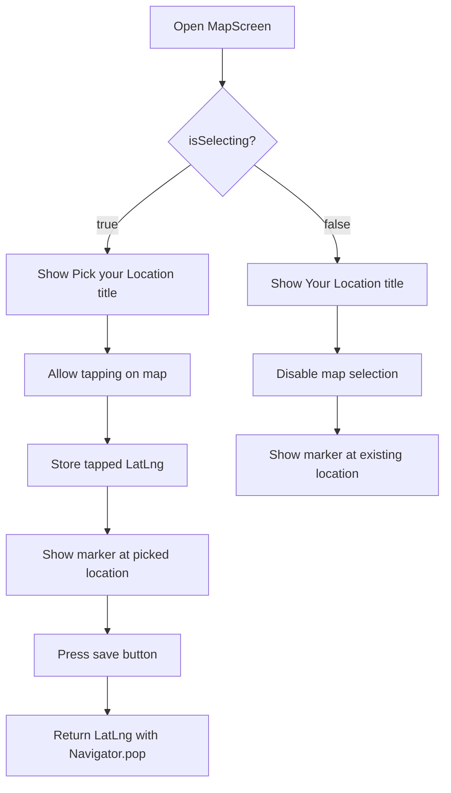
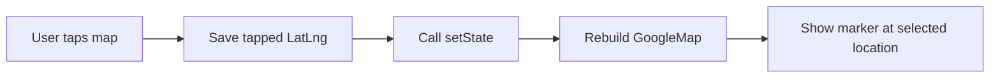
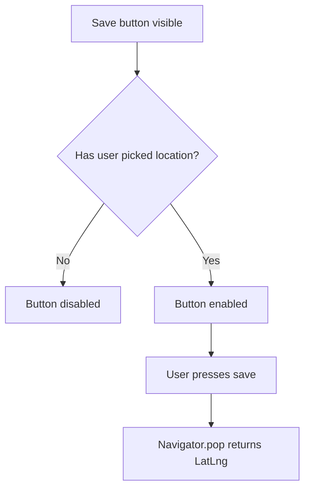
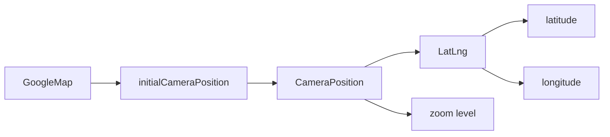
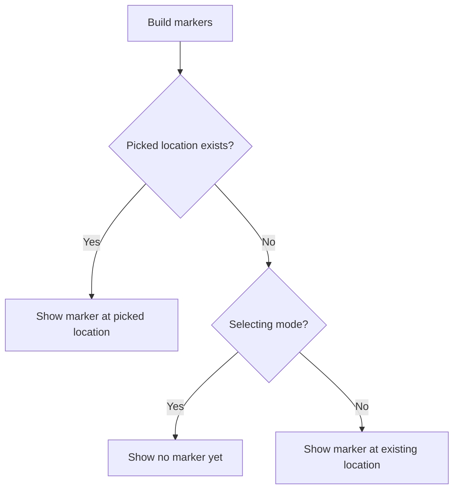
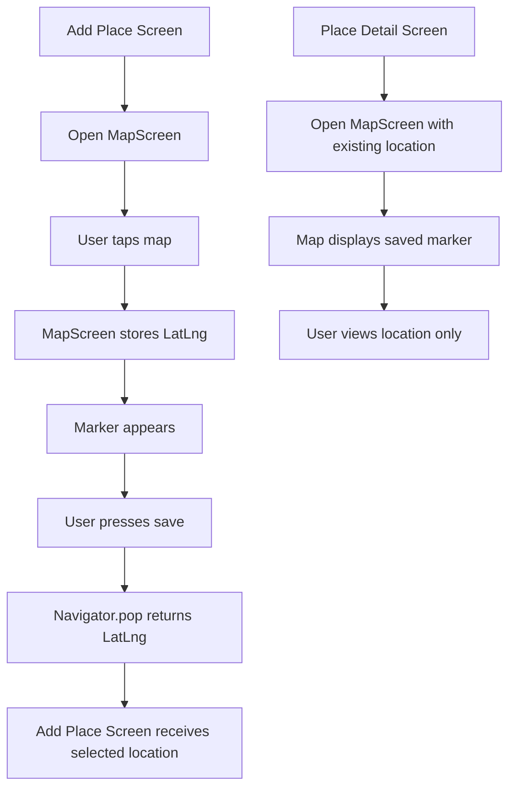

# Adding a Map Screen

## Overview

This lecture creates a reusable `MapScreen` widget that displays an interactive Google Map using the `GoogleMap` widget from the `google_maps_flutter` package.

The screen has two main purposes:

1. Display an already selected place location on a full-screen map.
2. Allow the user to manually select a location by tapping on the map.

To support both use cases, the screen accepts an optional `location` value and an `isSelecting` boolean. If no location is provided, a default location is used.

---

## What This Screen Does

The `MapScreen` can work in two modes:

| Mode           | Purpose                      | User Interaction                                  |
| -------------- | ---------------------------- | ------------------------------------------------- |
| Selection mode | Pick a new location          | User taps on the map and saves the selected point |
| View mode      | Display an existing location | User only views the place on the map              |

---

## Map Screen Flow



---

## Step 1: Create the Map Screen File

Create a new file inside the `screens` folder:

```text
lib/screens/map.dart
```

This file will contain the `MapScreen` widget.

---

## Step 2: Import Required Packages

```dart
import 'package:flutter/material.dart';
import 'package:google_maps_flutter/google_maps_flutter.dart';

import '../models/place.dart';
```

### Explanation

| Import                     | Purpose                                                                    |
| -------------------------- | -------------------------------------------------------------------------- |
| `flutter/material.dart`    | Provides `Scaffold`, `AppBar`, `IconButton`, and other Flutter UI widgets  |
| `google_maps_flutter.dart` | Provides `GoogleMap`, `CameraPosition`, `LatLng`, `Marker`, and `MarkerId` |
| `place.dart`               | Provides the `PlaceLocation` model                                         |

---

## Step 3: Create the `MapScreen` Widget

```dart
class MapScreen extends StatefulWidget {
  const MapScreen({
    super.key,
    this.location = const PlaceLocation(
      latitude: 37.422,
      longitude: -122.084,
      address: '',
    ),
    this.isSelecting = true,
  });

  final PlaceLocation location;
  final bool isSelecting;

  @override
  State<MapScreen> createState() => _MapScreenState();
}
```

---

## Why `StatefulWidget`?

`MapScreen` is a `StatefulWidget` because the selected location can change when the user taps on the map.

When the user taps a new position, the screen needs to update and show a marker at the newly selected location.



---

## Constructor Parameters

### `location`

```dart
final PlaceLocation location;
```

The `location` value defines the initial map position.

It is not marked as `required` because the screen can also be opened before the user has selected any location.

Instead, it has a default value:

```dart
this.location = const PlaceLocation(
  latitude: 37.422,
  longitude: -122.084,
  address: '',
),
```

This default location points to the Google offices.

---

### `isSelecting`

```dart
final bool isSelecting;
```

The `isSelecting` value controls whether the user is allowed to pick a new location.

By default, it is set to `true`:

```dart
this.isSelecting = true,
```

That means if the screen is opened without extra configuration, it assumes the user wants to select a location.

---

## Step 4: Create the State Class

```dart
class _MapScreenState extends State<MapScreen> {
  LatLng? _pickedLocation;

  @override
  Widget build(BuildContext context) {
    // UI code here
  }
}
```

---

## `_pickedLocation`

```dart
LatLng? _pickedLocation;
```

This variable stores the location selected by the user.

It is nullable because the user may not have tapped the map yet.

| Value         | Meaning                           |
| ------------- | --------------------------------- |
| `null`        | No location has been selected yet |
| `LatLng(...)` | The user has selected a location  |

---

## Step 5: Build the Screen Layout

The screen uses a `Scaffold` because it is a full page.

```dart
return Scaffold(
  appBar: AppBar(
    title: Text(widget.isSelecting ? 'Pick your Location' : 'Your Location'),
  ),
  body: GoogleMap(
    initialCameraPosition: CameraPosition(
      target: LatLng(
        widget.location.latitude,
        widget.location.longitude,
      ),
      zoom: 16,
    ),
  ),
);
```

---

## Dynamic AppBar Title

```dart
title: Text(widget.isSelecting ? 'Pick your Location' : 'Your Location'),
```

The title changes depending on the mode.

| Condition              | Title                |
| ---------------------- | -------------------- |
| `isSelecting == true`  | `Pick your Location` |
| `isSelecting == false` | `Your Location`      |

This makes the same screen reusable for different situations.

---

## Step 6: Add a Save Button

When the screen is used for selecting a location, the user needs a way to confirm the selected position.

```dart
actions: [
  if (widget.isSelecting)
    IconButton(
      icon: const Icon(Icons.save),
      onPressed: _pickedLocation == null
          ? null
          : () => Navigator.of(context).pop(_pickedLocation),
    ),
],
```

---

## Save Button Logic



---

## Returning the Selected Location

```dart
Navigator.of(context).pop(_pickedLocation);
```

This closes the `MapScreen` and sends the selected `LatLng` value back to the previous screen.

This is useful when opening the map from an Add Place screen.

Example concept:

```dart
final selectedLocation = await Navigator.of(context).push<LatLng>(
  MaterialPageRoute(
    builder: (ctx) => const MapScreen(),
  ),
);
```

The returned value can then be used to store the selected latitude and longitude.

---

## Step 7: Add the Google Map

```dart
body: GoogleMap(
  onTap: widget.isSelecting ? _selectLocation : null,
  initialCameraPosition: CameraPosition(
    target: LatLng(
      widget.location.latitude,
      widget.location.longitude,
    ),
    zoom: 16,
  ),
  markers: (_pickedLocation == null && widget.isSelecting)
      ? {}
      : {
          Marker(
            markerId: const MarkerId('m1'),
            position: _pickedLocation ??
                LatLng(
                  widget.location.latitude,
                  widget.location.longitude,
                ),
          ),
        },
),
```

---

## `initialCameraPosition`

```dart
initialCameraPosition: CameraPosition(
  target: LatLng(
    widget.location.latitude,
    widget.location.longitude,
  ),
  zoom: 16,
),
```

The `initialCameraPosition` defines where the map should be centered when it first appears.

It requires a `CameraPosition`.

The `CameraPosition` requires a `LatLng`.

---

## Camera Position Structure



---

## `LatLng`

```dart
LatLng(widget.location.latitude, widget.location.longitude)
```

`LatLng` represents a geographic coordinate.

| Value        | Meaning   |
| ------------ | --------- |
| First value  | Latitude  |
| Second value | Longitude |

---

## `zoom`

```dart
zoom: 16,
```

The `zoom` value controls how close the map camera is.

| Zoom Level  | Result                             |
| ----------- | ---------------------------------- |
| Lower zoom  | Shows a larger area                |
| Higher zoom | Shows a more detailed, closer area |

A zoom level of `16` is useful for showing a specific street-level location.

---

## Step 8: Add Tap-to-Select Behavior

```dart
onTap: widget.isSelecting ? _selectLocation : null,
```

If `isSelecting` is `true`, tapping the map calls `_selectLocation`.

If `isSelecting` is `false`, tapping the map does nothing.

---

## `_selectLocation` Method

```dart
void _selectLocation(LatLng position) {
  setState(() => _pickedLocation = position);
}
```

This method receives the tapped map position and stores it in `_pickedLocation`.

Calling `setState()` rebuilds the UI, so the marker appears at the selected location.

---

## Step 9: Add Markers

The `markers` parameter receives a `Set<Marker>`.

```dart
markers: (_pickedLocation == null && widget.isSelecting)
    ? {}
    : {
        Marker(
          markerId: const MarkerId('m1'),
          position: _pickedLocation ??
              LatLng(
                widget.location.latitude,
                widget.location.longitude,
              ),
        ),
      },
```

---

## Why Use a Set?

The `markers` property requires a set, not a list.

A set is written with curly braces:

```dart
{
  Marker(...),
}
```

A set is similar to a list, but it does not allow duplicate values.

| Collection Type | Syntax           | Allows Duplicates?  |
| --------------- | ---------------- | ------------------- |
| List            | `[]`             | Yes                 |
| Set             | `{}`             | No                  |
| Map             | `{ key: value }` | Keys must be unique |

---

## Marker Logic



---

## `Marker`

```dart
Marker(
  markerId: const MarkerId('m1'),
  position: _pickedLocation ??
      LatLng(
        widget.location.latitude,
        widget.location.longitude,
      ),
)
```

A `Marker` visually pins a location on the map.

It requires:

| Property   | Purpose                                      |
| ---------- | -------------------------------------------- |
| `markerId` | Unique identifier for the marker             |
| `position` | The coordinate where the marker is displayed |

---

## `MarkerId`

```dart
markerId: const MarkerId('m1'),
```

Each marker needs a unique ID.

Since this screen only displays one marker at a time, using a fixed ID like `'m1'` is fine.

If the app displayed multiple markers, each marker would need a different ID.

---

## Complete Code Example

```dart
import 'package:flutter/material.dart';
import 'package:google_maps_flutter/google_maps_flutter.dart';

import '../models/place.dart';

class MapScreen extends StatefulWidget {
  const MapScreen({
    super.key,
    this.location = const PlaceLocation(
      latitude: 37.422,
      longitude: -122.084,
      address: '',
    ),
    this.isSelecting = true,
  });

  final PlaceLocation location;
  final bool isSelecting;

  @override
  State<MapScreen> createState() {
    return _MapScreenState();
  }
}

class _MapScreenState extends State<MapScreen> {
  LatLng? _pickedLocation;

  void _selectLocation(LatLng position) {
    setState(() {
      _pickedLocation = position;
    });
  }

  @override
  Widget build(BuildContext context) {
    return Scaffold(
      appBar: AppBar(
        title: Text(
          widget.isSelecting ? 'Pick your Location' : 'Your Location',
        ),
        actions: [
          if (widget.isSelecting)
            IconButton(
              icon: const Icon(Icons.save),
              onPressed: _pickedLocation == null
                  ? null
                  : () {
                      Navigator.of(context).pop(_pickedLocation);
                    },
            ),
        ],
      ),
      body: GoogleMap(
        onTap: widget.isSelecting ? _selectLocation : null,
        initialCameraPosition: CameraPosition(
          target: LatLng(
            widget.location.latitude,
            widget.location.longitude,
          ),
          zoom: 16,
        ),
        markers: (_pickedLocation == null && widget.isSelecting)
            ? {}
            : {
                Marker(
                  markerId: const MarkerId('m1'),
                  position: _pickedLocation ??
                      LatLng(
                        widget.location.latitude,
                        widget.location.longitude,
                      ),
                ),
              },
      ),
    );
  }
}
```

---

## How the Screen Is Reused

### Use Case 1: Pick a New Location

When opening the map from an Add Place screen, no specific location needs to be passed.

```dart
Navigator.of(context).push(
  MaterialPageRoute(
    builder: (ctx) => const MapScreen(),
  ),
);
```

Because `isSelecting` defaults to `true`, the user can tap the map and save a location.

---

### Use Case 2: View an Existing Location

When opening the map from a Place Detail screen, pass the existing location and disable selection.

```dart
Navigator.of(context).push(
  MaterialPageRoute(
    builder: (ctx) => MapScreen(
      location: place.location,
      isSelecting: false,
    ),
  ),
);
```

This displays the place location but does not allow the user to pick a new one.

---

## Full Usage Flow



---

## Key Points

* `MapScreen` is a reusable full-screen map page.
* It uses the `GoogleMap` widget from `google_maps_flutter`.
* It can either display an existing location or allow users to pick a new one.
* `location` provides the starting map position.
* `isSelecting` controls whether the user can tap and select a location.
* `_pickedLocation` stores the location selected by the user.
* `Navigator.pop(_pickedLocation)` returns the selected coordinate to the previous screen.
* A `Marker` is used to visually show the selected or existing location.

---

## Common Mistakes

| Mistake                                    | Problem                                                                 |
| ------------------------------------------ | ----------------------------------------------------------------------- |
| Forgetting to import `google_maps_flutter` | `GoogleMap`, `LatLng`, and `Marker` are not available                   |
| Making `location` required                 | The screen cannot be opened for first-time selection without a location |
| Not using `setState()` after tapping       | The marker will not update                                              |
| Always enabling `onTap`                    | Users can change the map even in view-only mode                         |
| Returning nothing from `Navigator.pop()`   | The previous screen cannot receive the selected location                |
| Forgetting `markerId`                      | Marker creation fails because every marker needs an ID                  |

---

## Summary

The `MapScreen` is a dual-purpose screen for working with Google Maps in Flutter.

It can show an existing location or allow the user to pick a new location by tapping on the map.

The selected location is stored as a `LatLng`, displayed with a `Marker`, and returned to the previous screen using `Navigator.pop`.

This creates a clean and reusable map workflow for both adding new places and viewing saved places.
