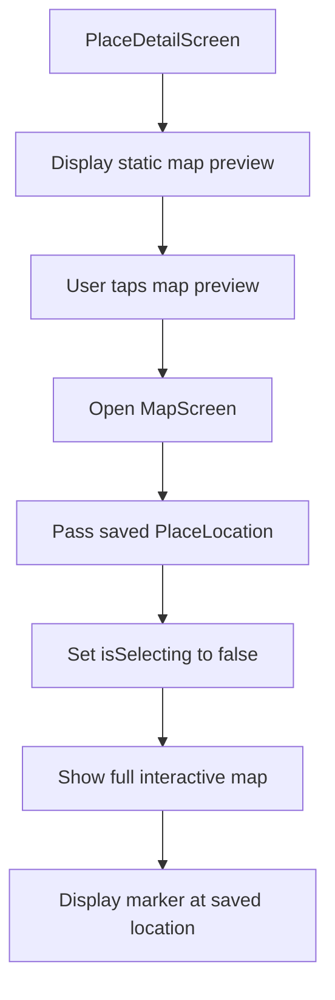
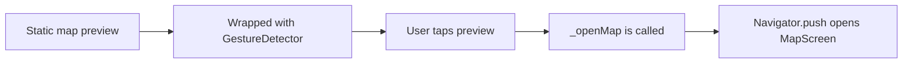
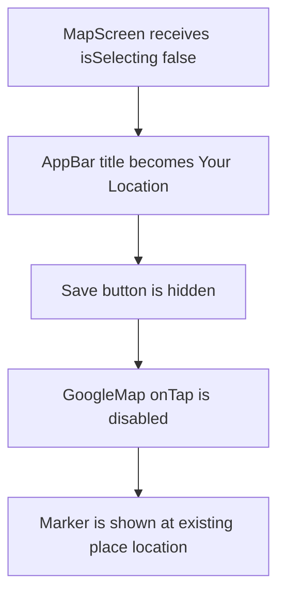

# Displaying the Picked Place on a Dynamic Map

## Overview

This lecture connects the `PlaceDetailScreen` to the reusable `MapScreen`.

Previously, the Place Details screen displayed a static map preview image based on the saved place coordinates. In this lecture, that preview becomes tappable. When the user taps it, the app opens a full-screen interactive Google Map.

This allows users to view the saved place location on a dynamic, pannable, and zoomable map.

---

## Goal

The goal is to let users tap the map preview in the place details screen and open the selected place on a full-screen Google Map.

The map should only be used for viewing in this case, not for selecting a new location.

---

## Feature Flow



---

## Why Use the Existing `MapScreen`?

The `MapScreen` was designed to support two modes:

| Mode           | Purpose                                  |
| -------------- | ---------------------------------------- |
| Selection mode | User taps the map to pick a new location |
| View mode      | User views an already saved location     |

For the Place Details screen, we use view mode.

That means:

* The saved location should be shown on the map.
* The map should center on the saved coordinates.
* A marker should appear at the saved location.
* The save button should not be shown.
* Tapping the map should not select a new location.

---

## Step 1: Import the Map Screen

In `place_detail.dart`, import the map screen file.

```dart
import 'package:flutter/material.dart';

import '../models/place.dart';
import 'map.dart';
```

The exact import path may be different depending on your project structure.

---

## Step 2: Add a Method to Open the Map

Inside `PlaceDetailScreen`, create a helper method named `_openMap`.

```dart
void _openMap() {
  Navigator.of(context).push(
    MaterialPageRoute(
      builder: (ctx) => MapScreen(
        location: place.location,
        isSelecting: false,
      ),
    ),
  );
}
```

---

## Explanation

```dart
location: place.location,
```

This passes the saved place location into the `MapScreen`.

Without this, the map would use the default location from the `MapScreen` constructor.

---

```dart
isSelecting: false,
```

This tells the `MapScreen` that the user is only viewing a location.

As a result:

* The save button is hidden.
* The map tap handler is disabled.
* The existing location marker is displayed.

---

## Step 3: Make the Static Map Preview Tappable

The static map preview image does not have an `onTap` parameter by default.

To detect taps, wrap it with a `GestureDetector`.

```dart
GestureDetector(
  onTap: _openMap,
  child: Image.network(
    locationImage,
    width: double.infinity,
    height: 150,
    fit: BoxFit.cover,
  ),
),
```

---

## Why Use `GestureDetector`?

`GestureDetector` is used when you want to add gesture behavior to a widget that does not support it directly.

For example, `Image.network` does not have an `onTap` property.

So instead of writing:

```dart
Image.network(
  locationImage,
  onTap: _openMap, // This does not exist
)
```

You wrap it:

```dart
GestureDetector(
  onTap: _openMap,
  child: Image.network(locationImage),
)
```

---

## Tap Handling Flow



---

## Complete Code Example

```dart
import 'package:flutter/material.dart';

import '../models/place.dart';
import 'map.dart';

class PlaceDetailScreen extends StatelessWidget {
  const PlaceDetailScreen({
    super.key,
    required this.place,
  });

  final Place place;

  String get locationImage {
    final lat = place.location.latitude;
    final lng = place.location.longitude;
    const apiKey = 'YOUR_API_KEY';

    return 'https://maps.googleapis.com/maps/api/staticmap'
        '?center=$lat,$lng'
        '&zoom=16'
        '&size=600x300'
        '&maptype=roadmap'
        '&markers=color:red%7Clabel:A%7C$lat,$lng'
        '&key=$apiKey';
  }

  void _openMap(BuildContext context) {
    Navigator.of(context).push(
      MaterialPageRoute(
        builder: (ctx) => MapScreen(
          location: place.location,
          isSelecting: false,
        ),
      ),
    );
  }

  @override
  Widget build(BuildContext context) {
    return Scaffold(
      appBar: AppBar(
        title: Text(place.title),
      ),
      body: Stack(
        children: [
          Image.file(
            place.image,
            width: double.infinity,
            height: double.infinity,
            fit: BoxFit.cover,
          ),
          Positioned(
            bottom: 0,
            left: 0,
            right: 0,
            child: Column(
              children: [
                Text(
                  place.location.address,
                  textAlign: TextAlign.center,
                ),
                const SizedBox(height: 16),
                GestureDetector(
                  onTap: () => _openMap(context),
                  child: Image.network(
                    locationImage,
                    width: double.infinity,
                    height: 150,
                    fit: BoxFit.cover,
                  ),
                ),
              ],
            ),
          ),
        ],
      ),
    );
  }
}
```

---

## Alternative Example with `CircleAvatar`

If your UI displays the static map preview inside a `CircleAvatar`, you can also wrap the `CircleAvatar` with `GestureDetector`.

```dart
GestureDetector(
  onTap: () => _openMap(context),
  child: CircleAvatar(
    radius: 70,
    backgroundImage: NetworkImage(locationImage),
  ),
),
```

This makes the circular map preview tappable.

---

## View-Only Map Behavior

When the map is opened from the Place Details screen, the `MapScreen` receives:

```dart
MapScreen(
  location: place.location,
  isSelecting: false,
)
```

This affects the `MapScreen` like this:



---

## No Return Value Needed

When opening the map from the Place Details screen, no result needs to be returned.

The user is only viewing the location.

Therefore, this is enough:

```dart
Navigator.of(context).push(
  MaterialPageRoute(
    builder: (ctx) => MapScreen(
      location: place.location,
      isSelecting: false,
    ),
  ),
);
```

There is no need to use `await` here.

---

## Selection Mode vs View Mode

| Behavior              | Selection Mode       | View Mode            |
| --------------------- | -------------------- | -------------------- |
| Used from             | Add Place screen     | Place Details screen |
| `isSelecting`         | `true`               | `false`              |
| User can tap map      | Yes                  | No                   |
| Save button visible   | Yes                  | No                   |
| Returns `LatLng`      | Yes                  | No                   |
| Shows existing marker | Only after selection | Yes                  |

---

## Important Code Connection

The Place Details screen passes data into the `MapScreen`.

```dart
MapScreen(
  location: place.location,
  isSelecting: false,
)
```

Then the `MapScreen` uses that location here:

```dart
initialCameraPosition: CameraPosition(
  target: LatLng(
    widget.location.latitude,
    widget.location.longitude,
  ),
  zoom: 16,
),
```

And displays a marker here:

```dart
markers: {
  Marker(
    markerId: const MarkerId('m1'),
    position: LatLng(
      widget.location.latitude,
      widget.location.longitude,
    ),
  ),
},
```

---

## User Interaction Result

After this feature is implemented, the user can:

1. Open a saved place.
2. See the place image and address.
3. Tap the static map preview.
4. Open a full-screen Google Map.
5. Pan and zoom around the saved location.
6. See a marker at the stored coordinates.
7. Go back to the Place Details screen.

---

## Common Mistakes

| Mistake                                         | Problem                                                          |
| ----------------------------------------------- | ---------------------------------------------------------------- |
| Forgetting to pass `place.location`             | The map opens at the default location instead of the saved place |
| Forgetting `isSelecting: false`                 | The save button may appear and the map may allow selection       |
| Not wrapping the preview with `GestureDetector` | The static map preview cannot be tapped                          |
| Expecting a return value                        | This screen is view-only, so no result is needed                 |
| Missing `map.dart` import                       | `MapScreen` will not be recognized                               |

---

## Summary

The Place Details screen now opens the reusable `MapScreen` when the static map preview is tapped.

By passing the saved `place.location` and setting `isSelecting: false`, the app displays a full-screen interactive Google Map in view-only mode.

This lets users explore the saved place location on a dynamic map while reusing the same `MapScreen` that will later support manual location selection.
