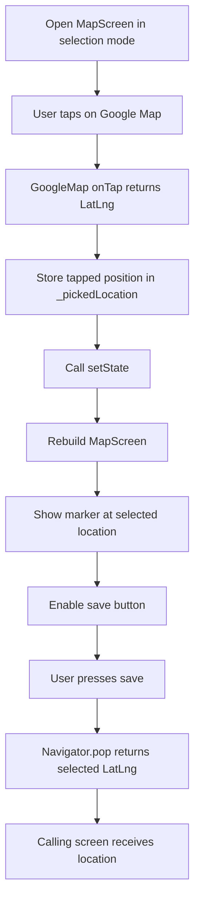
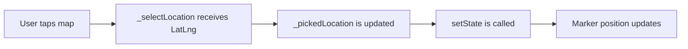
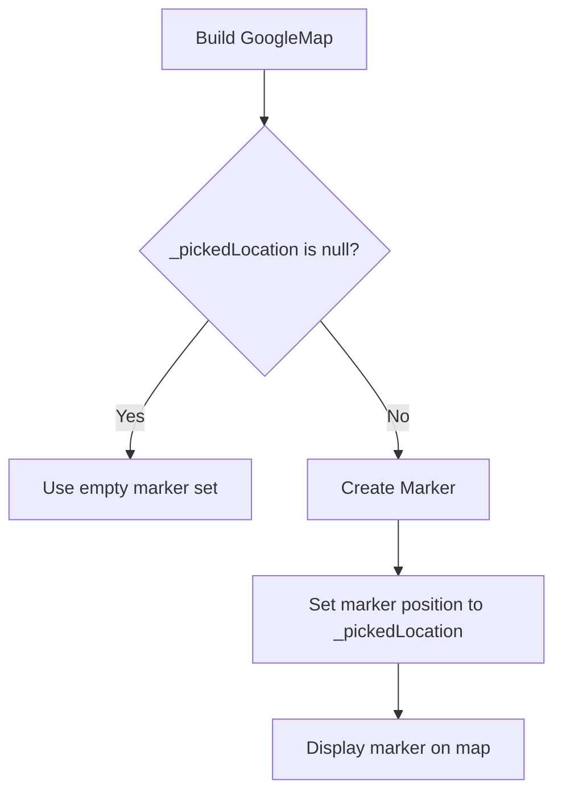
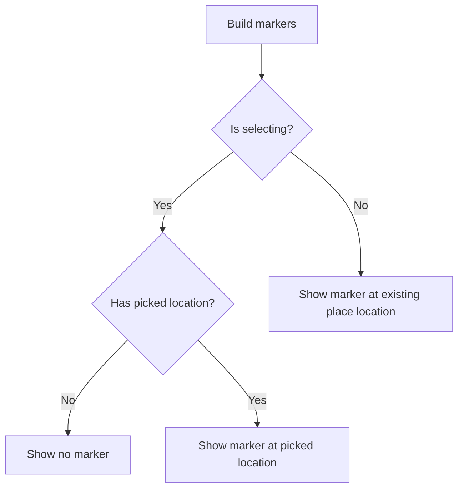
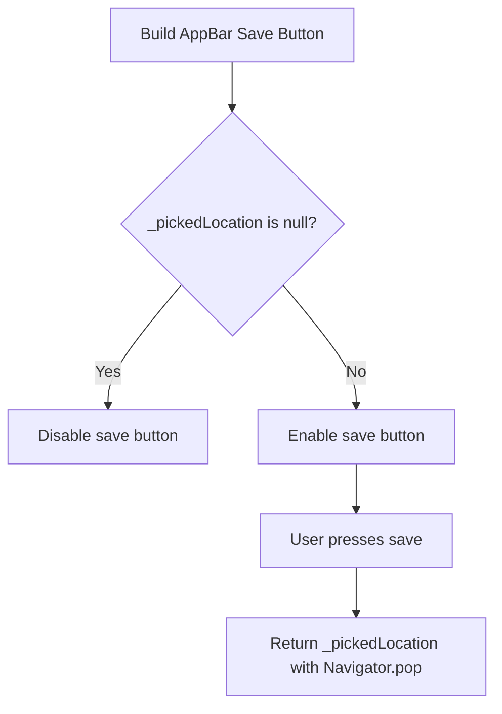

# Handling Map Taps for Selecting a Location Manually

## Overview

This lecture completes the manual location selection feature in the `MapScreen`.

The user can now tap anywhere on the interactive Google Map to choose a location. The tapped coordinate is stored as a `LatLng` value in the screen state. A marker is then displayed at that selected position.

When the user presses the save button in the `AppBar`, the selected `LatLng` is returned to the previous screen using `Navigator.pop`.

---

## Goal

The goal is to allow users to manually select a location on the map instead of only using their current GPS location.

This is useful when:

* The current GPS location is inaccurate
* The user wants to select a nearby place
* The user wants to save a location without physically being there
* The app needs flexible manual location picking

---

## Feature Flow



---

## Step 1: Store the Picked Location

Inside `_MapScreenState`, create a nullable `LatLng` variable.

```dart
LatLng? _pickedLocation;
```

This variable stores the coordinate selected by the user.

It is nullable because the user may not have tapped the map yet.

| State                     | Meaning                                               |
| ------------------------- | ----------------------------------------------------- |
| `_pickedLocation == null` | No location has been selected yet                     |
| `_pickedLocation != null` | The user has tapped the map and selected a coordinate |

---

## Step 2: Add the Tap Handler

Create a method that receives the tapped map position.

```dart
void _selectLocation(LatLng position) {
  setState(() {
    _pickedLocation = position;
  });
}
```

The `position` argument is automatically provided by the `GoogleMap` widget when the user taps the map.

Calling `setState()` tells Flutter to rebuild the widget so the marker can appear or move to the new position.

---

## Tap Handling Logic



---

## Step 3: Connect `onTap` to the Google Map

The `GoogleMap` widget provides an `onTap` parameter.

```dart
GoogleMap(
  onTap: widget.isSelecting ? _selectLocation : null,
  initialCameraPosition: CameraPosition(
    target: LatLng(
      widget.location.latitude,
      widget.location.longitude,
    ),
    zoom: 16,
  ),
)
```

---

## Why Check `isSelecting`?

The `MapScreen` is used in two modes:

| Mode                   | `isSelecting` | Tap Behavior               |
| ---------------------- | ------------- | -------------------------- |
| Pick new location      | `true`        | Tapping selects a location |
| View existing location | `false`       | Tapping does nothing       |

This line controls the behavior:

```dart
onTap: widget.isSelecting ? _selectLocation : null,
```

If `isSelecting` is `true`, the map reacts to taps.

If `isSelecting` is `false`, `onTap` is set to `null`, so the map is view-only.

---

## Step 4: Show a Marker After the User Taps

The selected position should be shown with a map marker.

```dart
markers: _pickedLocation == null
    ? {}
    : {
        Marker(
          markerId: const MarkerId('m1'),
          position: _pickedLocation!,
        ),
      },
```

If `_pickedLocation` is `null`, an empty marker set is passed.

If `_pickedLocation` has a value, a marker is displayed at that coordinate.

---

## Marker Flow



---

## Step 5: Keep the Screen Reusable

The `MapScreen` is also used for viewing an already saved location.

So the marker logic should handle both cases:

1. Selection mode: show no marker until the user taps.
2. View mode: show a marker at the existing saved location.

A more complete marker expression looks like this:

```dart
markers: (_pickedLocation == null && widget.isSelecting)
    ? {}
    : {
        Marker(
          markerId: const MarkerId('m1'),
          position: _pickedLocation ??
              LatLng(
                widget.location.latitude,
                widget.location.longitude,
              ),
        ),
      },
```

---

## Explanation of the Marker Condition

```dart
(_pickedLocation == null && widget.isSelecting)
```

This checks two things:

* The user has not picked a location yet.
* The screen is currently being used for selection.

If both are true, no marker should be shown yet.

That means in selection mode, the marker only appears after the first tap.

---

## Why View Mode Still Shows a Marker

If `widget.isSelecting` is `false`, the screen is being used to view an existing location.

In that case, even if `_pickedLocation` is `null`, the app should still show a marker at the saved place location.

That is why the fallback is used:

```dart
position: _pickedLocation ??
    LatLng(
      widget.location.latitude,
      widget.location.longitude,
    ),
```

---

## The Null-Coalescing Operator `??`

The `??` operator means:

> Use the value on the left if it is not null. Otherwise, use the value on the right.

Example:

```dart
position: _pickedLocation ??
    LatLng(
      widget.location.latitude,
      widget.location.longitude,
    ),
```

This means:

* Use `_pickedLocation` if the user has selected a location.
* Otherwise, use the existing `widget.location`.

---

## Marker Logic for Both Modes



---

## Step 6: Disable the Save Button Until a Location Is Picked

The save button should only work after the user has tapped the map.

```dart
IconButton(
  icon: const Icon(Icons.save),
  onPressed: _pickedLocation == null
      ? null
      : () => Navigator.of(context).pop(_pickedLocation),
),
```

When `onPressed` is set to `null`, Flutter automatically disables the button and shows it in a disabled visual state.

---

## Save Button Logic



---

## Step 7: Return the Picked Location

When the user presses save, return the selected coordinate:

```dart
Navigator.of(context).pop(_pickedLocation);
```

This closes the `MapScreen` and sends the selected `LatLng` back to the screen that opened it.

Usually, this will be the Add Place screen.

---

## Example Caller Code

The calling screen can receive the result with `await`.

```dart
final pickedLocation = await Navigator.of(context).push<LatLng>(
  MaterialPageRoute(
    builder: (ctx) => const MapScreen(),
  ),
);
```

After receiving the `LatLng`, the app can use it to:

* Store latitude and longitude
* Generate a static map preview
* Run reverse geocoding
* Retrieve a human-readable address

---

## Complete Code Example

```dart
import 'package:flutter/material.dart';
import 'package:google_maps_flutter/google_maps_flutter.dart';

import '../models/place.dart';

class MapScreen extends StatefulWidget {
  const MapScreen({
    super.key,
    this.location = const PlaceLocation(
      latitude: 37.422,
      longitude: -122.084,
      address: '',
    ),
    this.isSelecting = true,
  });

  final PlaceLocation location;
  final bool isSelecting;

  @override
  State<MapScreen> createState() {
    return _MapScreenState();
  }
}

class _MapScreenState extends State<MapScreen> {
  LatLng? _pickedLocation;

  void _selectLocation(LatLng position) {
    setState(() {
      _pickedLocation = position;
    });
  }

  @override
  Widget build(BuildContext context) {
    return Scaffold(
      appBar: AppBar(
        title: Text(
          widget.isSelecting ? 'Pick your Location' : 'Your Location',
        ),
        actions: [
          if (widget.isSelecting)
            IconButton(
              icon: const Icon(Icons.save),
              onPressed: _pickedLocation == null
                  ? null
                  : () {
                      Navigator.of(context).pop(_pickedLocation);
                    },
            ),
        ],
      ),
      body: GoogleMap(
        onTap: widget.isSelecting ? _selectLocation : null,
        initialCameraPosition: CameraPosition(
          target: LatLng(
            widget.location.latitude,
            widget.location.longitude,
          ),
          zoom: 16,
        ),
        markers: (_pickedLocation == null && widget.isSelecting)
            ? {}
            : {
                Marker(
                  markerId: const MarkerId('m1'),
                  position: _pickedLocation ??
                      LatLng(
                        widget.location.latitude,
                        widget.location.longitude,
                      ),
                ),
              },
      ),
    );
  }
}
```

---

## Important Concepts

### `GoogleMap.onTap`

```dart
onTap: widget.isSelecting ? _selectLocation : null,
```

The `onTap` callback is triggered when the user taps on the map.

It automatically provides a `LatLng` object.

---

### `LatLng`

```dart
LatLng(latitude, longitude)
```

`LatLng` represents a geographic coordinate.

It stores:

* Latitude
* Longitude

---

### `setState`

```dart
setState(() {
  _pickedLocation = position;
});
```

`setState()` updates the widget state and triggers a rebuild.

Without `setState()`, the selected marker would not appear on the map.

---

### `Marker`

```dart
Marker(
  markerId: const MarkerId('m1'),
  position: _pickedLocation!,
)
```

A marker visually pins a coordinate on the map.

---

### `Navigator.pop`

```dart
Navigator.of(context).pop(_pickedLocation);
```

This returns data to the previous screen while closing the current screen.

---

## Selection Mode Behavior

| User Action        | App Response                       |
| ------------------ | ---------------------------------- |
| Opens map          | Map shows default initial location |
| Has not tapped yet | No marker is shown                 |
| Taps map           | Marker appears at tapped location  |
| Taps another place | Marker moves to new location       |
| Presses save       | Selected `LatLng` is returned      |
| Presses back       | No location is returned            |

---

## View Mode Behavior

| User Action                  | App Response                     |
| ---------------------------- | -------------------------------- |
| Opens map from place details | Map centers on saved location    |
| Map loads                    | Marker appears at saved location |
| Taps map                     | Nothing changes                  |
| Save button                  | Hidden                           |
| Presses back                 | Returns to details screen        |

---

## Common Mistakes

| Mistake                                        | Problem                                                       |
| ---------------------------------------------- | ------------------------------------------------------------- |
| Forgetting `setState()`                        | Marker does not update after tapping                          |
| Always showing a marker                        | Selection mode shows a marker before the user chooses a place |
| Not checking `isSelecting`                     | View-only map still allows selecting a new location           |
| Save button always enabled                     | User can save without selecting a location                    |
| Returning nothing from `Navigator.pop()`       | Calling screen cannot receive the selected coordinates        |
| Using `_pickedLocation!` without checking null | App may crash if no location was selected                     |

---

## Summary

Manual map selection is implemented by connecting the `GoogleMap` widget's `onTap` callback to a state update method.

When the user taps the map, the tapped `LatLng` is stored in `_pickedLocation`, the UI rebuilds, and a marker appears at the selected position.

The save button remains disabled until a location has been selected. Once enabled, pressing it closes the map screen and returns the selected `LatLng` to the calling screen with `Navigator.pop`.
