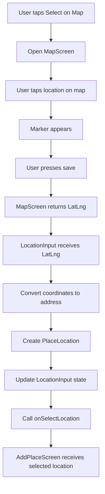
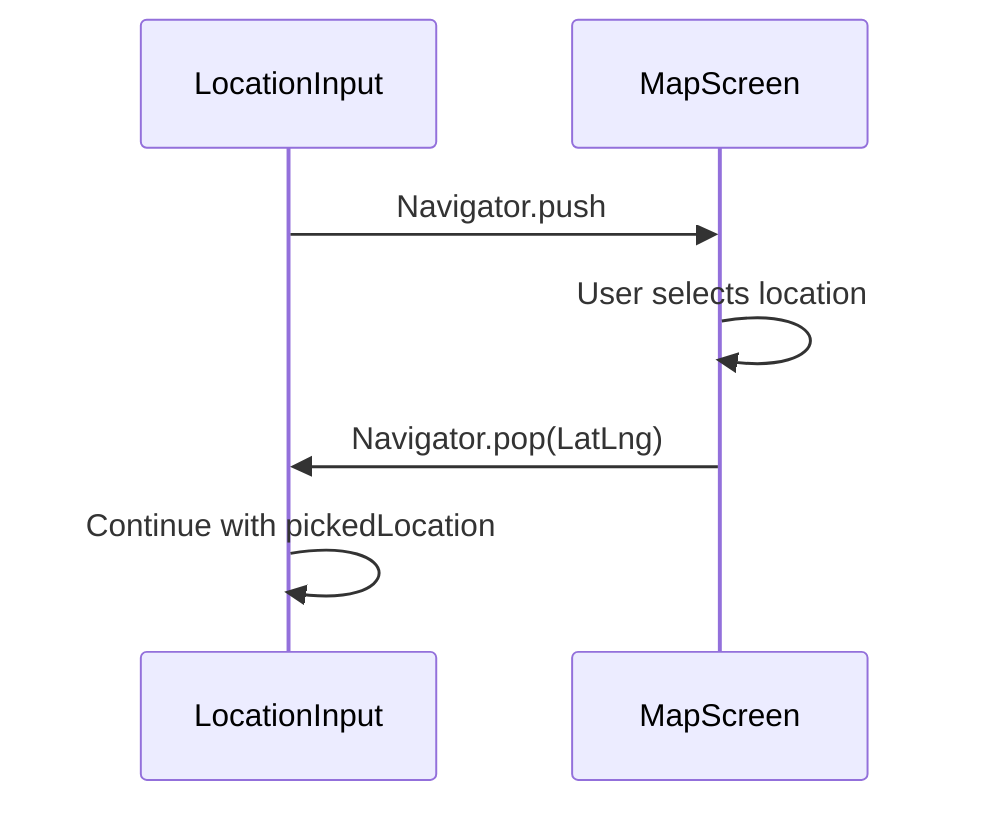
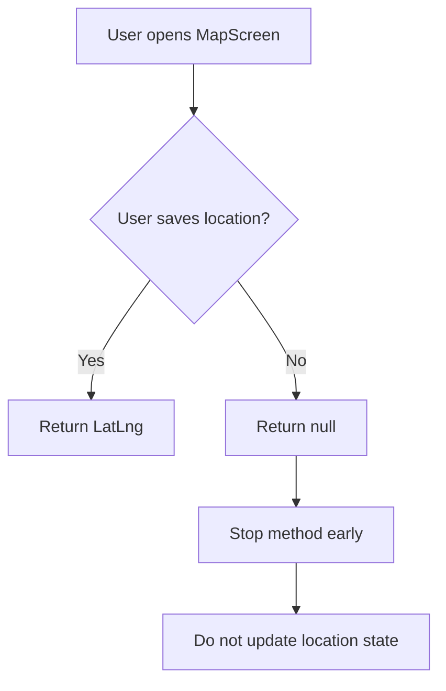
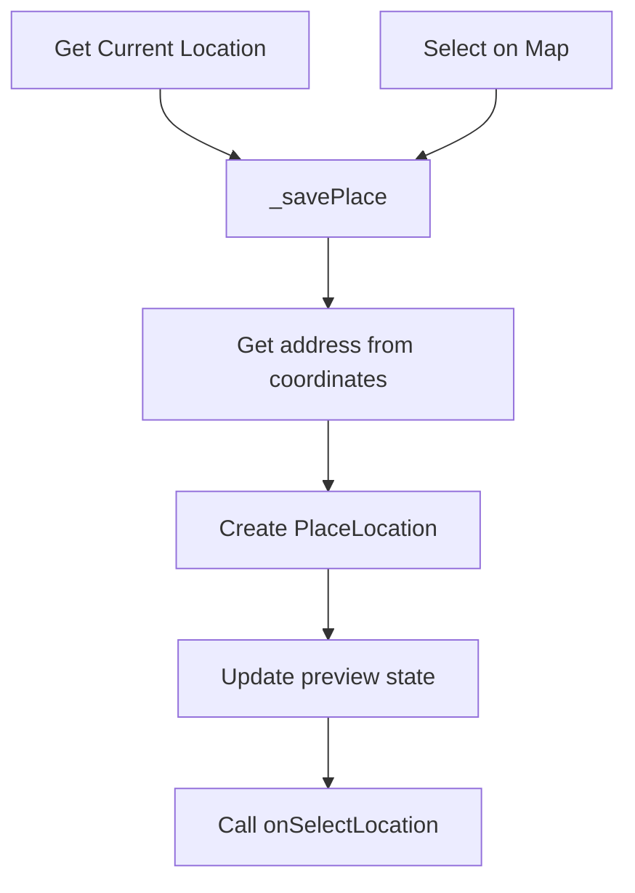
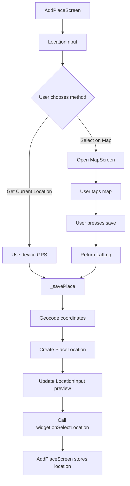

# Using the Map Screen in the Add Place Form

## Overview

This lecture connects the `MapScreen` to the `LocationInput` widget.

Previously, the app could get the user's current GPS location. Now, users can also manually select a location by tapping the **Select on Map** button.

When the user taps this button, the app opens the interactive `MapScreen`. After the user selects a location and presses the save button, the selected `LatLng` is returned to the `LocationInput` widget.

The returned coordinates are then converted into a human-readable address using the Geocoding API. Finally, a `PlaceLocation` object is created and passed back to the parent `AddPlaceScreen`.

---

## Goal

The goal is to support two ways of choosing a place location:

1. Use the device's current GPS location.
2. Manually select a location on the map.

Both approaches should produce the same final result: a complete `PlaceLocation` object containing latitude, longitude, and address.

---

## Feature Flow



---

## Step 1: Import Required Files

Inside the `location_input.dart` file, import the map screen and the Google Maps package.

```dart id="agsqps"
import 'package:google_maps_flutter/google_maps_flutter.dart';

import '../models/place.dart';
import '../screens/map.dart';
```

### Why These Imports Are Needed

| Import                     | Purpose                                              |
| -------------------------- | ---------------------------------------------------- |
| `google_maps_flutter.dart` | Provides the `LatLng` type returned from `MapScreen` |
| `place.dart`               | Provides the `PlaceLocation` model                   |
| `map.dart`                 | Provides the `MapScreen` widget                      |

---

## Step 2: Connect the Select on Map Button

The `LocationInput` widget already has a **Select on Map** button.

Connect its `onPressed` parameter to a new method called `_selectOnMap`.

```dart id="1x4b5g"
TextButton.icon(
  icon: const Icon(Icons.map),
  label: const Text('Select on Map'),
  onPressed: _selectOnMap,
),
```

When the user presses this button, `_selectOnMap` will open the full-screen map.

---

## Step 3: Open the Map Screen

Create the `_selectOnMap` method inside the `LocationInput` state class.

```dart id="zepuuy"
void _selectOnMap() async {
  final pickedLocation = await Navigator.of(context).push<LatLng>(
    MaterialPageRoute(
      builder: (ctx) => const MapScreen(),
    ),
  );

  if (pickedLocation == null) {
    return;
  }

  _savePlace(
    pickedLocation.latitude,
    pickedLocation.longitude,
  );
}
```

---

## Explanation

```dart id="fm9tp4"
final pickedLocation = await Navigator.of(context).push<LatLng>(
  MaterialPageRoute(
    builder: (ctx) => const MapScreen(),
  ),
);
```

This opens the `MapScreen` and waits for a result.

The result will be a `LatLng` object if the user selected a location and pressed save.

It will be `null` if the user went back without saving.

---

## Why Use `await`?

The map screen opens as a new route. The current screen must wait until that route is closed.



Without `await`, the `LocationInput` widget would not receive the selected location result.

---

## Step 4: Add a Generic Return Type

```dart id="04y7py"
Navigator.of(context).push<LatLng>(
  MaterialPageRoute(
    builder: (ctx) => const MapScreen(),
  ),
);
```

The `<LatLng>` generic tells Dart what kind of value this route is expected to return.

This makes the returned value type-safe.

Instead of Dart treating the result as `Object?`, it understands that the result is `LatLng?`.

---

## Step 5: Handle Cancelled Selection

The user may open the map and then press the back button without saving.

In that case, `pickedLocation` will be `null`.

```dart id="57p4jq"
if (pickedLocation == null) {
  return;
}
```

This prevents the app from trying to use invalid coordinates.

---

## Cancel Flow



---

## Step 6: Reuse Location Saving Logic

Both location selection methods need the same final steps:

1. Get latitude and longitude.
2. Convert the coordinates into an address.
3. Create a `PlaceLocation`.
4. Update the widget state.
5. Notify the parent widget.

Instead of duplicating this logic, create a shared helper method.

```dart id="ldd2f5"
Future<void> _savePlace(double latitude, double longitude) async {
  final address = await _getAddressFromCoords(latitude, longitude);

  setState(() {
    _pickedLocation = PlaceLocation(
      latitude: latitude,
      longitude: longitude,
      address: address,
    );
    _isGettingLocation = false;
  });

  widget.onSelectLocation(_pickedLocation!);
}
```

---

## Why Create `_savePlace`?

Before this change, the current-location button probably handled everything directly inside `_getCurrentLocation`.

But now there are two ways to get coordinates:

| Method                | Source of Coordinates |
| --------------------- | --------------------- |
| `_getCurrentLocation` | Device GPS            |
| `_selectOnMap`        | User-selected map tap |

Both produce latitude and longitude values.

So both can call the same `_savePlace` method.

---

## Shared Logic Diagram



---

## Step 7: Update `_getCurrentLocation`

After extracting the shared logic into `_savePlace`, the GPS-based method can become simpler.

```dart id="ht8v3r"
void _getCurrentLocation() async {
  LocationPermission permission = await Geolocator.checkPermission();

  if (permission == LocationPermission.denied) {
    permission = await Geolocator.requestPermission();
  }

  if (permission == LocationPermission.denied ||
      permission == LocationPermission.deniedForever) {
    return;
  }

  setState(() {
    _isGettingLocation = true;
  });

  final position = await Geolocator.getCurrentPosition();

  _savePlace(
    position.latitude,
    position.longitude,
  );
}
```

Now `_getCurrentLocation` only focuses on retrieving the device coordinates.

The shared `_savePlace` method handles the rest.

---

## Step 8: Use the Returned `LatLng`

Inside `_selectOnMap`, pass the returned coordinates to `_savePlace`.

```dart id="63x7w5"
_savePlace(
  pickedLocation.latitude,
  pickedLocation.longitude,
);
```

This keeps the logic consistent with GPS-based location picking.

---

## Complete `_selectOnMap` Example

```dart id="uzd5mv"
void _selectOnMap() async {
  final pickedLocation = await Navigator.of(context).push<LatLng>(
    MaterialPageRoute(
      builder: (ctx) => const MapScreen(),
    ),
  );

  if (pickedLocation == null) {
    return;
  }

  _savePlace(
    pickedLocation.latitude,
    pickedLocation.longitude,
  );
}
```

---

## Complete Shared Saving Method

```dart id="eyou3a"
Future<void> _savePlace(double latitude, double longitude) async {
  final address = await _getAddressFromCoords(latitude, longitude);

  setState(() {
    _pickedLocation = PlaceLocation(
      latitude: latitude,
      longitude: longitude,
      address: address,
    );
    _isGettingLocation = false;
  });

  widget.onSelectLocation(_pickedLocation!);
}
```

---

## Step 9: Ensure `MapScreen` Is in Selection Mode

When opening the map from the Add Place form, this is enough:

```dart id="pvv8vm"
builder: (ctx) => const MapScreen(),
```

You do not need to pass `isSelecting: true`, because the `MapScreen` already uses `true` as the default value.

You also do not need to pass a location, because the default map starting location is acceptable for manual selection.

---

## Step 10: Disable Map Tapping in View Mode

The `MapScreen` should only allow tapping when it is used for selection.

Inside `map.dart`, make sure `onTap` is conditionally enabled.

```dart id="3lt003"
onTap: widget.isSelecting ? _selectLocation : null,
```

This means:

| Condition                     | Result                        |
| ----------------------------- | ----------------------------- |
| `widget.isSelecting == true`  | User can tap and move marker  |
| `widget.isSelecting == false` | Map tap selection is disabled |

---

## Boolean Inversion Note

The lecture also explains that you may see code like this:

```dart id="5eqzi8"
!widget.isSelecting
```

The `!` operator inverts a boolean value.

| Original Value | After `!` |
| -------------- | --------- |
| `true`         | `false`   |
| `false`        | `true`    |

So this:

```dart id="ri37zf"
widget.isSelecting ? _selectLocation : null
```

is usually clearer than writing the same idea with negation.

---

## Final Location Selection Flow



---

## Result in the App

After this feature is implemented:

1. The user opens the Add Place form.
2. The user takes or selects an image.
3. The user taps **Select on Map**.
4. The `MapScreen` opens.
5. The user taps a location on the map.
6. A marker appears at the tapped location.
7. The user presses the save button.
8. The map closes.
9. The selected coordinates are converted into an address.
10. The location preview is shown in the form.
11. The completed `PlaceLocation` is passed to the parent screen.

---

## Important Concepts

### Returning Data from a Screen

```dart id="suecnb"
Navigator.of(context).pop(_pickedLocation);
```

The `MapScreen` returns data when it closes.

---

### Receiving Data from a Screen

```dart id="cfph6e"
final pickedLocation = await Navigator.of(context).push<LatLng>(
  MaterialPageRoute(
    builder: (ctx) => const MapScreen(),
  ),
);
```

The calling widget receives the returned value by awaiting `Navigator.push`.

---

### Shared Helper Method

```dart id="advjgc"
Future<void> _savePlace(double latitude, double longitude) async {
  // Convert coordinates to address
  // Create PlaceLocation
  // Notify parent widget
}
```

A shared method prevents duplicated logic between current-location selection and map selection.

---

## Common Mistakes

| Mistake                                    | Problem                                                   |
| ------------------------------------------ | --------------------------------------------------------- |
| Not using `await` with `Navigator.push`    | The returned `LatLng` cannot be captured                  |
| Forgetting `<LatLng>` generic              | Dart may infer a less useful return type                  |
| Not checking for `null`                    | App may crash when user presses back without saving       |
| Duplicating geocoding logic                | Code becomes harder to maintain                           |
| Forgetting to import `google_maps_flutter` | `LatLng` is not recognized                                |
| Forgetting to call `onSelectLocation`      | Parent form does not receive the selected location        |
| Leaving map taps enabled in view mode      | Users can move markers when they should only view the map |

---

## Summary

The **Select on Map** button now opens the reusable `MapScreen`.

The user can tap the map, place a marker, and save the selected location. The `MapScreen` returns a `LatLng` value through `Navigator.pop`.

Back in `LocationInput`, the selected coordinates are received with `await Navigator.push<LatLng>`, converted into an address, stored inside a `PlaceLocation`, and passed to the parent `AddPlaceScreen` through the `onSelectLocation` callback.

This completes the manual location selection workflow.
