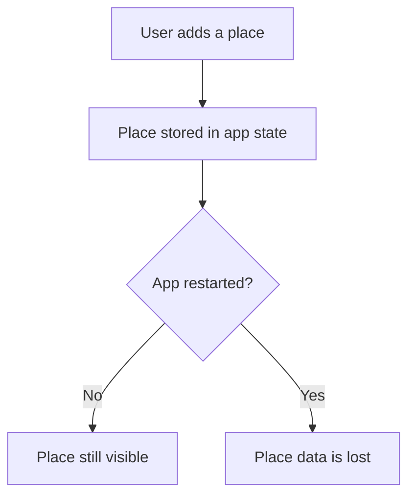
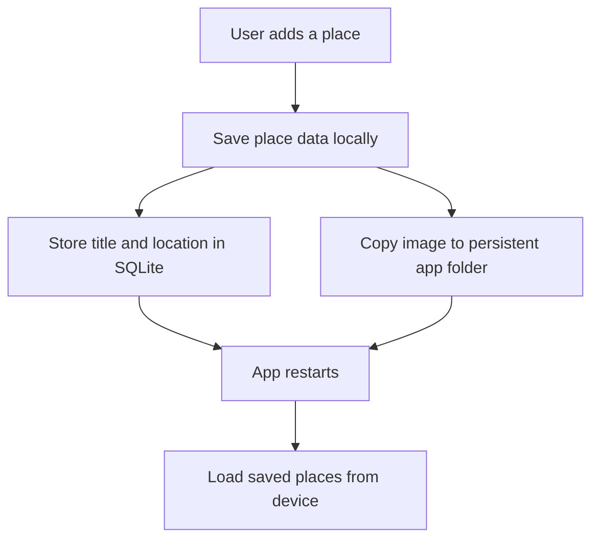
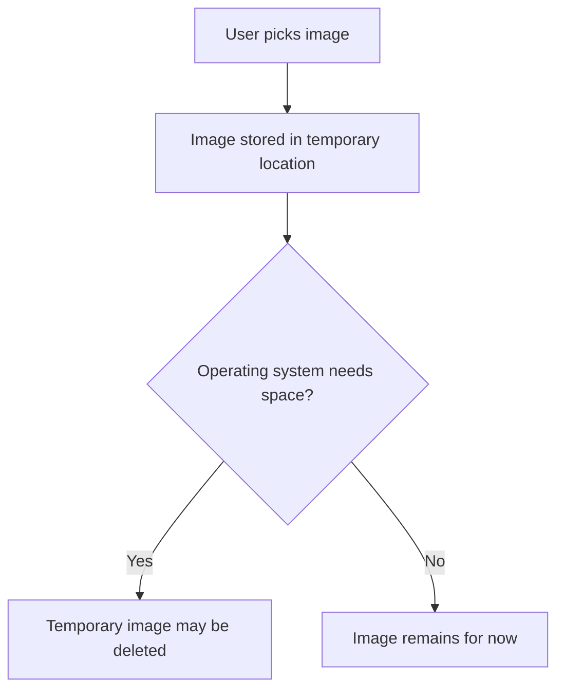
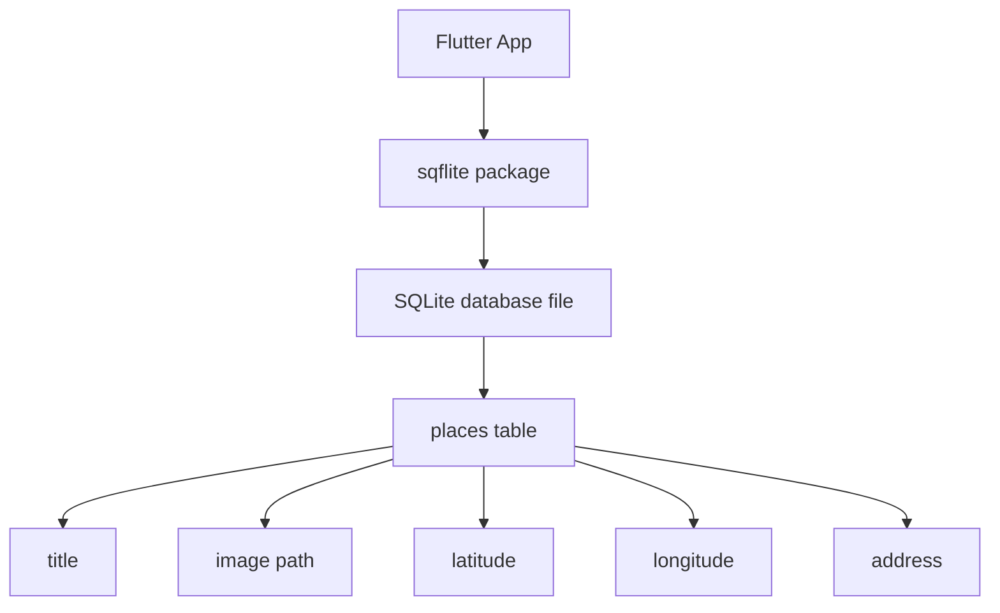
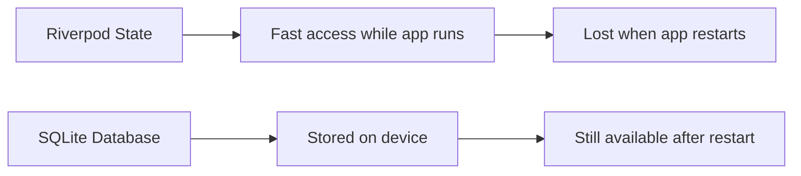
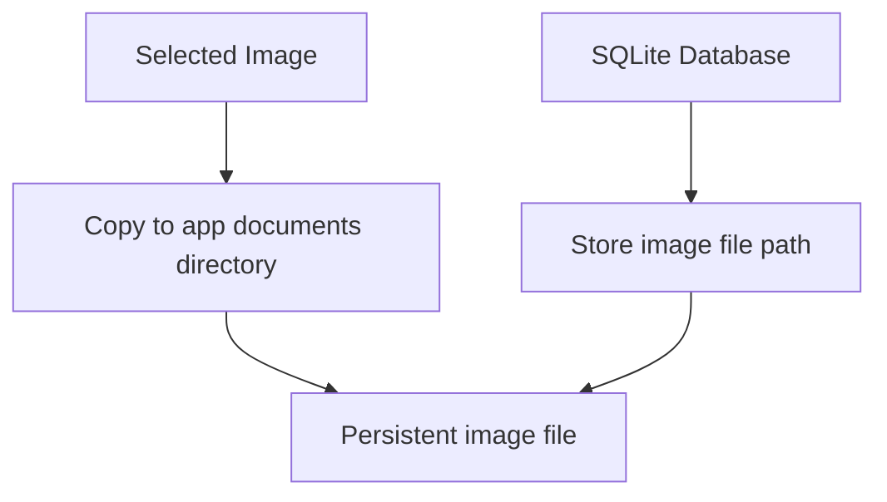
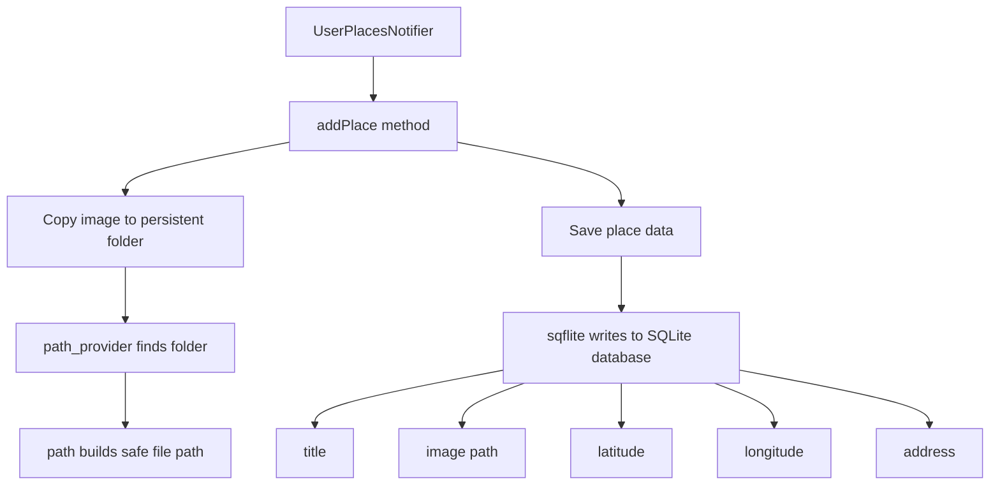
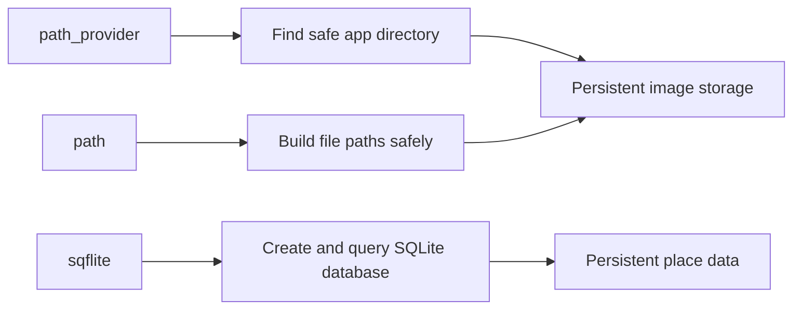

# Installing Packages for Local On-Device Data Storage

## Overview

This lecture introduces the packages required to store app data locally on the user's device.

Until now, places added in the app only existed in memory. That means if the app was restarted, all added places would be lost.

To solve this, the app needs persistent local storage. The data should be saved directly on the device so that places remain available even after closing and reopening the app.

This lecture installs three important packages:

1. `path_provider`
2. `path`
3. `sqflite`

Together, these packages allow the app to store structured place data in a local SQLite database and safely save image files in a persistent app directory.

---

## Why Local Storage Is Needed

The Favorite Places app stores multiple pieces of data for each place:

* Title
* Image
* Latitude
* Longitude
* Human-readable address

Currently, this data is only stored in the app state.



To prevent this, the data must be written to persistent storage on the device.

---

## Local Storage Goal

The goal is to make sure that saved places survive app restarts.



---

## Packages Installed

| Package         | Purpose                                      |
| --------------- | -------------------------------------------- |
| `path_provider` | Finds platform-specific storage directories  |
| `path`          | Helps construct safe file paths              |
| `sqflite`       | Provides SQLite database support for Flutter |

---

## Step 1: Install `path_provider`

Install the `path_provider` package:

```bash id="ta4ayb"
flutter pub add path_provider
```

---

## What `path_provider` Does

The `path_provider` package gives the app access to safe directories on the device.

Different platforms use different file system paths.

For example:

| Platform | App Storage Location                   |
| -------- | -------------------------------------- |
| Android  | Android app-specific storage directory |
| iOS      | iOS app documents directory            |

Instead of manually guessing those paths, `path_provider` provides functions for retrieving them correctly.

---

## Why It Is Needed for Images

Images selected with `image_picker` are often stored in a temporary location.

That means the operating system may delete them later to free up space.



Because of this, the app should copy the selected image into a persistent app directory.

`path_provider` helps find that directory.

---

## Step 2: Install `path`

Install the `path` package:

```bash id="3zznpb"
flutter pub add path
```

---

## What `path` Does

The `path` package helps build file paths safely across platforms.

Different operating systems use different path separators.

| Platform                      | Example Path Separator |
| ----------------------------- | ---------------------- |
| Android / iOS / macOS / Linux | `/`                    |
| Windows                       | `\`                    |

Instead of manually combining strings, the `path` package provides helper functions such as `join`.

Example:

```dart id="07rmsu"
import 'package:path/path.dart' as path;

final fullPath = path.join(directory.path, fileName);
```

This ensures that file paths are created correctly on every platform.

---

## Step 3: Install `sqflite`

Install the `sqflite` package:

```bash id="d9lvft"
flutter pub add sqflite
```

---

## What `sqflite` Does

The `sqflite` package allows a Flutter app to create and use a SQLite database on the device.

SQLite is:

* Local
* Serverless
* File-based
* Lightweight
* Relational
* Suitable for structured app data

The database is stored as a file on the device, usually with a `.db` extension.

---

## SQLite Storage Concept



---

## Why Use SQLite?

The Favorite Places app has structured data.

Each place has multiple fields:

| Field       | Example                     |
| ----------- | --------------------------- |
| `id`        | Unique place ID             |
| `title`     | `My Favorite Park`          |
| `image`     | Path to image file          |
| `latitude`  | `37.422`                    |
| `longitude` | `-122.084`                  |
| `address`   | `1600 Amphitheatre Parkway` |

This kind of data fits well into a database table.

---

## Example Database Table

A local SQLite table for places could look like this:

| id   | title           | image                   | lat      | lng        | address             |
| ---- | --------------- | ----------------------- | -------- | ---------- | ------------------- |
| `p1` | `Google Office` | `/app/documents/p1.jpg` | `37.422` | `-122.084` | `Mountain View, CA` |
| `p2` | `Coffee Shop`   | `/app/documents/p2.jpg` | `10.776` | `106.700`  | `Ho Chi Minh City`  |

---

## Why Not Only Store Data in Memory?

In-memory state is temporary.

For example, Riverpod state can hold places while the app is running, but once the app process ends, the data disappears.



---

## Why Not Use `shared_preferences`?

`shared_preferences` is another package for storing local data.

However, it is mainly designed for simple key-value data.

Examples:

* Theme setting
* Login flag
* User preference
* Small configuration values

For the Favorite Places app, the data is more structured and contains multiple records. Therefore, SQLite is a better fit.

---

## `shared_preferences` vs `sqflite`

| Feature          | `shared_preferences` | `sqflite`           |
| ---------------- | -------------------- | ------------------- |
| Storage style    | Key-value pairs      | Relational database |
| Best for         | Simple settings      | Structured records  |
| Query support    | Very limited         | Full SQL queries    |
| Multiple rows    | Not ideal            | Designed for it     |
| Example use case | Theme mode           | Saved places list   |

---

## Why Store Images Separately?

SQLite is used to store structured place information, but the image file itself should usually be stored in the file system.

The database can store the path to the image.



This avoids storing large binary files directly inside the database.

---

## Final Storage Architecture



---

## Where This Will Be Used

The local storage logic will be added inside the provider layer.

Specifically, it will be handled in the `UserPlacesNotifier` class.

```dart id="skajm2"
class UserPlacesNotifier extends StateNotifier<List<Place>> {
  void addPlace(...) {
    // Create place object
    // Copy image to persistent storage
    // Save place data in SQLite
    // Update app state
  }
}
```

This is a good place to handle storage because the notifier already manages the list of user places.

---

## Data That Needs to Be Stored

Each place should store:

| Data       | Storage Location        |
| ---------- | ----------------------- |
| Title      | SQLite database         |
| Latitude   | SQLite database         |
| Longitude  | SQLite database         |
| Address    | SQLite database         |
| Image path | SQLite database         |
| Image file | App documents directory |

---

## Installed Package Commands

Run these commands in the Flutter project:

```bash id="3zqjrm"
flutter pub add path_provider
flutter pub add path
flutter pub add sqflite
```

After installation, Flutter updates `pubspec.yaml` automatically.

The dependencies section will look similar to this:

```yaml id="pvqdl4"
dependencies:
  flutter:
    sdk: flutter

  path_provider: ^2.0.0
  path: ^1.8.0
  sqflite: ^2.0.0
```

The exact versions may be different depending on the latest available package versions.

---

## No Extra Permissions Needed

For this kind of local app storage, no additional Android or iOS permission setup is required.

The app is storing data in its own private app directory, not accessing arbitrary files from the user's device.

---

## Local Storage Responsibility Split



---

## Key Points

* Local storage prevents place data from being lost after app restarts.
* `path_provider` finds the correct app storage directory.
* `path` helps build valid file paths across platforms.
* `sqflite` provides SQLite database support in Flutter.
* Images picked by `image_picker` should be copied from temporary storage to a persistent location.
* SQLite should store structured data such as title, coordinates, address, and image path.
* The image file itself should be stored in the app's local file system.

---

## Common Mistakes

| Mistake                                         | Problem                                 |
| ----------------------------------------------- | --------------------------------------- |
| Keeping image picker files in temporary storage | The OS may delete them later            |
| Manually joining paths with strings             | Paths may break across platforms        |
| Using only in-memory state                      | Data disappears after app restart       |
| Using `shared_preferences` for complex records  | Data becomes hard to manage             |
| Storing large image files directly in SQLite    | Database can become unnecessarily large |
| Forgetting to save the image path               | The app cannot reload the image later   |

---

## Summary

This lecture prepares the app for persistent local storage.

The `path_provider` package is installed to find safe app-specific storage directories. The `path` package is installed to construct file paths correctly across platforms. The `sqflite` package is installed to create and manage a local SQLite database.

With these packages installed, the app will be able to copy selected images into persistent storage and save place data in a local database, allowing the user's favorite places to survive app restarts.
