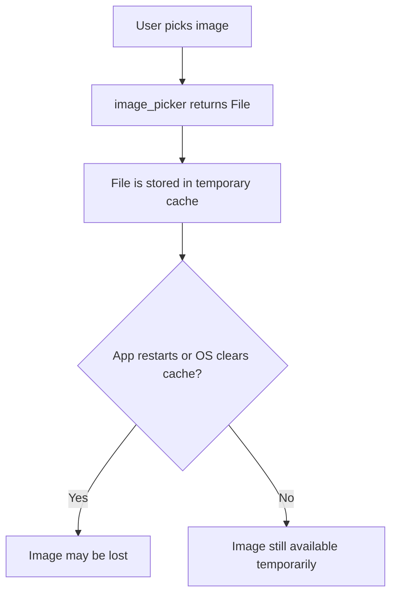
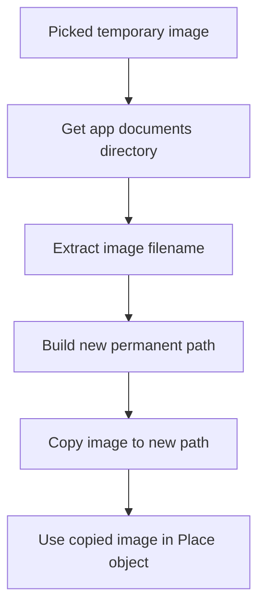
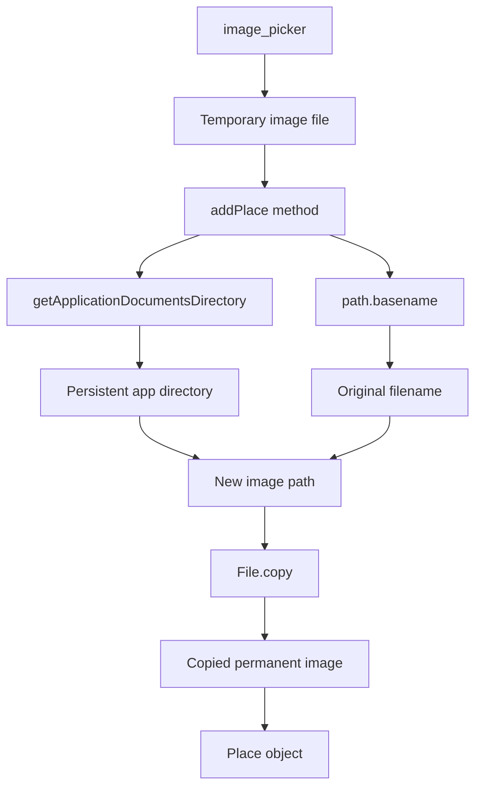
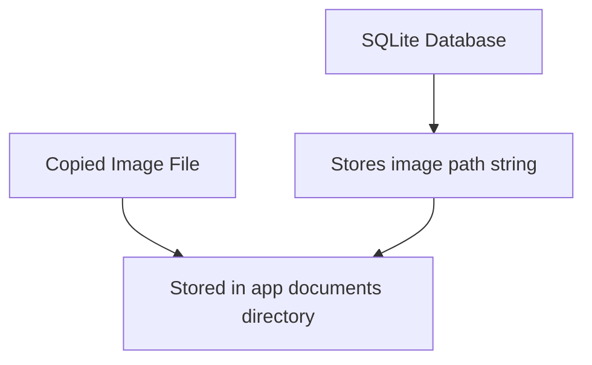

# Storing the Picked Image Locally

## Overview

This lecture explains how to store a picked image permanently on the device.

When an image is selected or captured with `image_picker`, the returned file is usually stored in a temporary cache directory. That temporary file may be deleted by the operating system later.

To prevent losing the image, the app copies it into the app's local documents directory. This directory is meant for persistent app data and is safe to use for long-term storage.

---

## Why This Is Needed

When the user picks or captures an image, the app receives a `File`.

However, that file may point to a temporary location.



To avoid this problem, the image must be copied into a persistent app directory.

---

## Storage Goal

The goal is to copy the image from its temporary location to a permanent location before saving the place.



---

## Required Imports

Inside the provider file where `addPlace` is defined, import these packages:

```dart
import 'dart:io';

import 'package:path_provider/path_provider.dart' as syspaths;
import 'package:path/path.dart' as path;
```

---

## Why Use Aliases?

### `syspaths`

```dart
import 'package:path_provider/path_provider.dart' as syspaths;
```

The `path_provider` package is imported with the alias `syspaths`.

This avoids naming conflicts with the `path` package.

---

### `path`

```dart
import 'package:path/path.dart' as path;
```

The `path` package is imported with the alias `path`.

It provides helper functions for working with file paths, such as:

```dart
path.basename(image.path)
```

---

## Step 1: Make `addPlace` Asynchronous

Copying a file takes time, so the `addPlace` method must be marked as `async`.

```dart
void addPlace(String title, File image, PlaceLocation location) async {
  // Save image locally
}
```

Or, more explicitly:

```dart
Future<void> addPlace(
  String title,
  File image,
  PlaceLocation location,
) async {
  // Save image locally
}
```

Using `Future<void>` makes it clear that this method performs asynchronous work but does not return a value.

---

## Step 2: Get the App Documents Directory

Use `getApplicationDocumentsDirectory()` from `path_provider`.

```dart
final appDir = await syspaths.getApplicationDocumentsDirectory();
```

This returns a directory that belongs to the app.

Files saved there are not temporary and can be used again after restarting the app.

---

## App Directory Flow


---

## Step 3: Extract the Image Filename

The picked image has a full file path.

Example:

```text
/temporary/cache/IMG_12345.jpg
```

But when copying the image, we only need the filename:

```text
IMG_12345.jpg
```

Use `path.basename()`:

```dart
final filename = path.basename(image.path);
```

---

## What `basename` Does


This is better than manually splitting the string because different platforms can use different path separators.

---

## Step 4: Build the New Image Path

The copied image should be stored inside the app documents directory.

```dart
final copiedImage = await image.copy('${appDir.path}/$filename');
```

This creates a new file path by combining:

* The app documents directory path
* The original image filename

Example concept:

```text
/app/documents/IMG_12345.jpg
```

---

## Step 5: Use the Copied Image

After copying the image, use the copied file instead of the original temporary file.

```dart
final newPlace = Place(
  title: title,
  image: copiedImage,
  location: location,
);
```

This ensures that the `Place` object points to the permanent image file.

---

## Complete Example

```dart
import 'dart:io';

import 'package:flutter_riverpod/flutter_riverpod.dart';
import 'package:path_provider/path_provider.dart' as syspaths;
import 'package:path/path.dart' as path;

import '../models/place.dart';

class UserPlacesNotifier extends StateNotifier<List<Place>> {
  UserPlacesNotifier() : super([]);

  Future<void> addPlace(
    String title,
    File image,
    PlaceLocation location,
  ) async {
    final appDir = await syspaths.getApplicationDocumentsDirectory();
    final filename = path.basename(image.path);

    final copiedImage = await image.copy('${appDir.path}/$filename');

    final newPlace = Place(
      title: title,
      image: copiedImage,
      location: location,
    );

    state = [newPlace, ...state];
  }
}
```

---

## Image Storage Architecture



---

## Why Store the Image File Separately?

The app should not store the image bytes directly inside the database.

Instead, the app should:

1. Copy the image file to persistent storage.
2. Store the image path in the database.



This keeps the database smaller and easier to manage.

---

## Temporary Path vs Permanent Path

| Path Type                    | Used For             | Safe After Restart? |
| ---------------------------- | -------------------- | ------------------- |
| Temporary image picker path  | Initial picked image | No                  |
| App documents directory path | Persistent app data  | Yes                 |

---

## Important Code Pieces

### Get Persistent Directory

```dart
final appDir = await syspaths.getApplicationDocumentsDirectory();
```

Gets a safe folder for storing app-owned files.

---

### Extract Filename

```dart
final filename = path.basename(image.path);
```

Extracts the filename from the original image path.

---

### Copy Image

```dart
final copiedImage = await image.copy('${appDir.path}/$filename');
```

Copies the image from the temporary location to the persistent app directory.

---

### Use Copied Image

```dart
image: copiedImage,
```

Stores the permanent image file in the `Place` object.

---

## Recommended Path Construction

The lecture uses string interpolation:

```dart
final copiedImage = await image.copy('${appDir.path}/$filename');
```

A slightly safer cross-platform version is to use `path.join()`:

```dart
final copiedImage = await image.copy(
  path.join(appDir.path, filename),
);
```

This avoids manually adding `/` between path segments.

---

## Improved Version

```dart
Future<void> addPlace(
  String title,
  File image,
  PlaceLocation location,
) async {
  final appDir = await syspaths.getApplicationDocumentsDirectory();
  final filename = path.basename(image.path);
  final newImagePath = path.join(appDir.path, filename);

  final copiedImage = await image.copy(newImagePath);

  final newPlace = Place(
    title: title,
    image: copiedImage,
    location: location,
  );

  state = [newPlace, ...state];
}
```

---

## What Happens After This Change?

After this change:

1. The user picks or captures an image.
2. The image initially exists in a temporary location.
3. `addPlace` gets the app documents directory.
4. The image filename is extracted.
5. The image is copied into the persistent app directory.
6. The app uses the copied image file.
7. Later, the copied image path can be stored in SQLite.

---

## Common Mistakes

| Mistake                              | Problem                              |
| ------------------------------------ | ------------------------------------ |
| Using the original image picker path | Image may disappear later            |
| Forgetting `await` before `copy()`   | The copied file may not be ready     |
| Not making `addPlace` async          | Cannot await file operations         |
| Storing image bytes in SQLite        | Database becomes unnecessarily large |
| Manually splitting file paths        | May break on different platforms     |
| Forgetting to import `dart:io`       | `File` is not recognized             |

---

## Summary

Images picked with `image_picker` should not be stored using their original temporary path.

To make the image persistent, the app uses `path_provider` to get the application documents directory, uses the `path` package to extract the filename, and copies the image file into that persistent folder.

The app then uses the copied image file in the `Place` object. Later, only the copied image path needs to be stored in the SQLite database.
