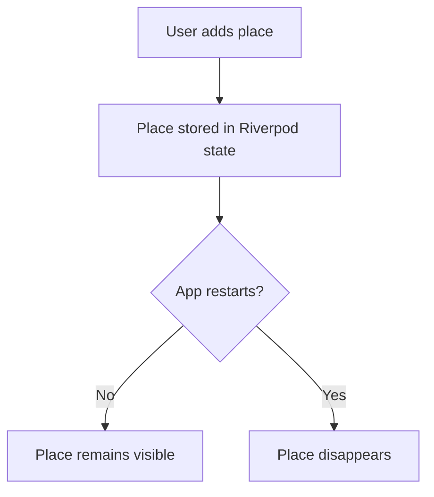
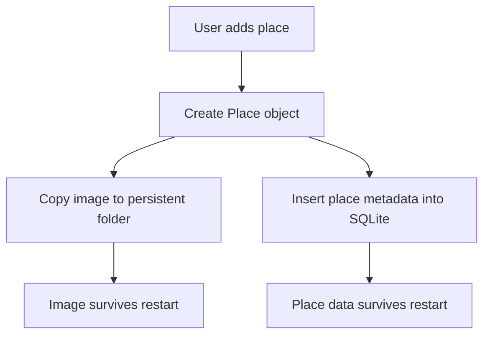
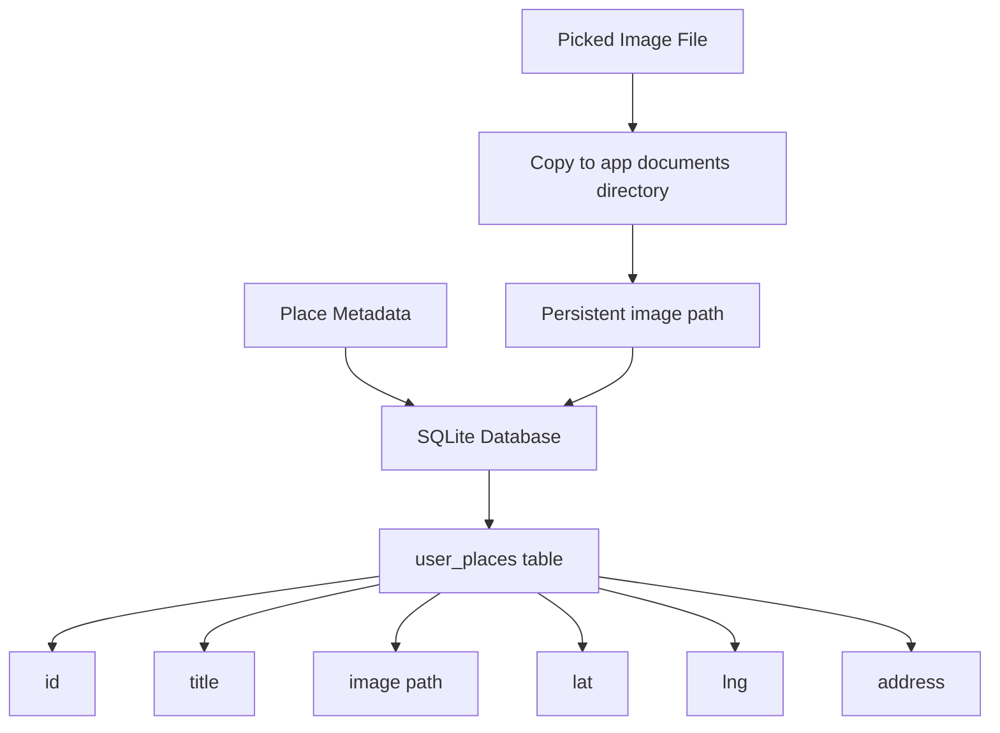
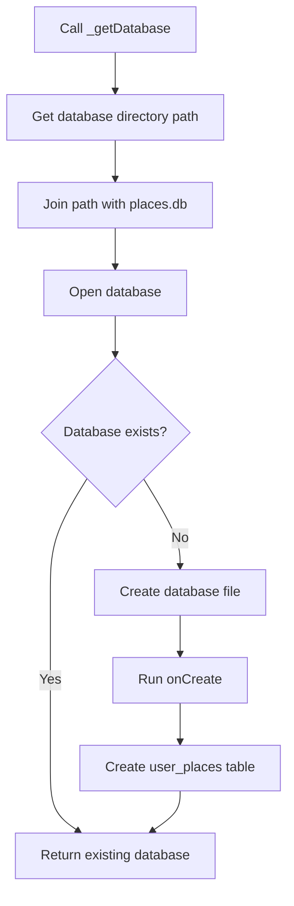
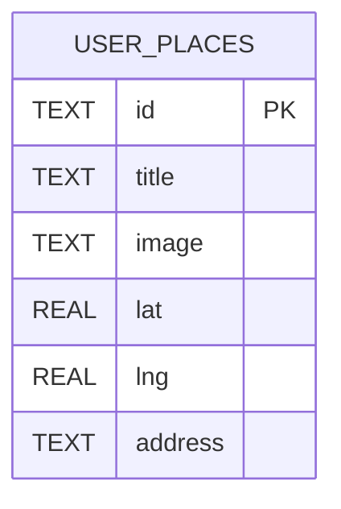
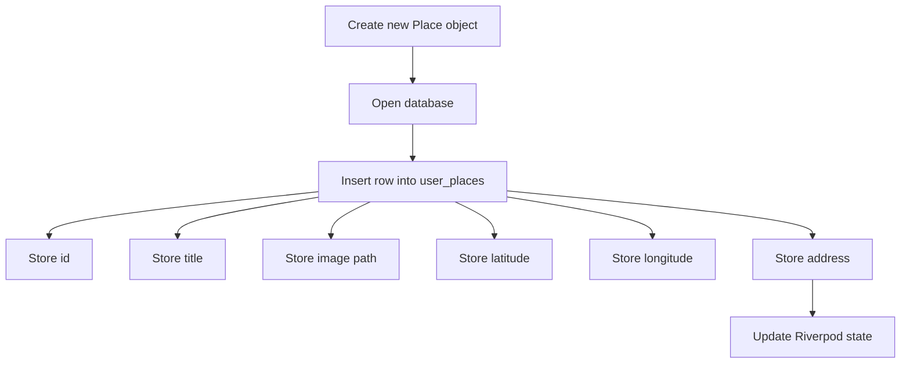
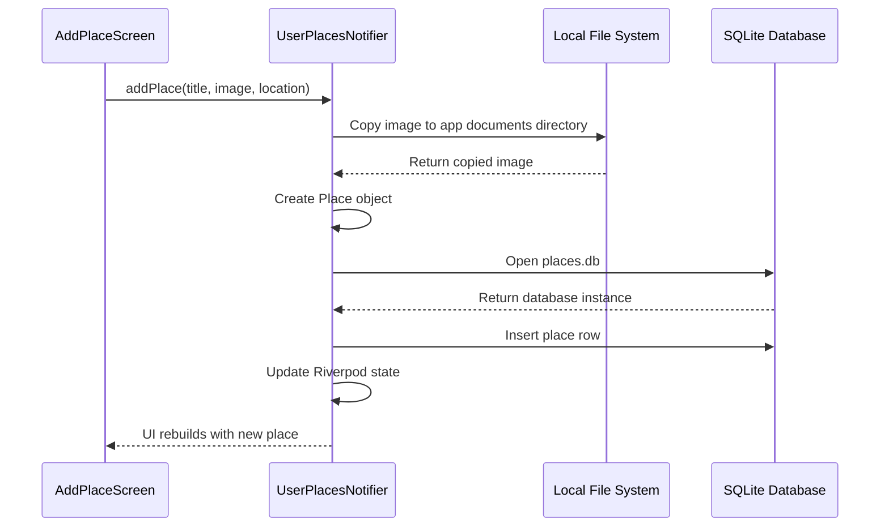
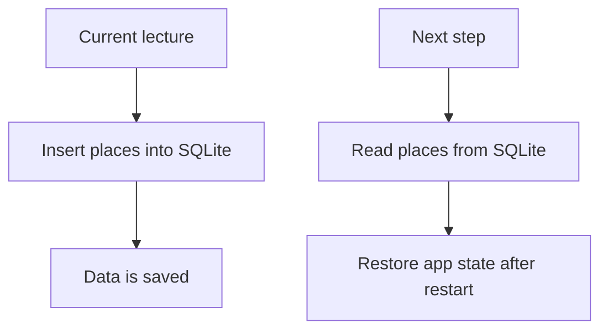

# Storing Place Data in an On-Device SQL Database

## Overview

This lecture implements local SQLite storage for the Favorite Places app.

Previously, the app copied the picked image into a persistent local folder. Now, the remaining place metadata also needs to be stored permanently.

This includes:

* Place ID
* Title
* Image path
* Latitude
* Longitude
* Human-readable address

To store this data, the app uses the `sqflite` package to create and write to a local SQLite database on the device.

---

## Why Store Place Data in SQLite?

App state is temporary. If the app restarts, in-memory data is lost.



SQLite solves this problem by storing data in a local database file on the device.



---

## What Data Should Be Stored?

Each place has multiple fields.

| Field      | SQLite Column | Type               |
| ---------- | ------------- | ------------------ |
| Place ID   | `id`          | `TEXT PRIMARY KEY` |
| Title      | `title`       | `TEXT`             |
| Image path | `image`       | `TEXT`             |
| Latitude   | `lat`         | `REAL`             |
| Longitude  | `lng`         | `REAL`             |
| Address    | `address`     | `TEXT`             |

The image itself is not stored in SQLite. Only the image file path is stored.

---

## Storage Architecture



---

## Required Imports

In the `user_places.dart` provider file, import `sqflite` and the `path` package.

```dart id="jwt9hp"
import 'dart:io';

import 'package:flutter_riverpod/flutter_riverpod.dart';
import 'package:path/path.dart' as path;
import 'package:path_provider/path_provider.dart' as syspaths;
import 'package:sqflite/sqflite.dart' as sql;
import 'package:sqflite/sqlite_api.dart';

import '../models/place.dart';
```

---

## Why Import `sqflite` Twice?

```dart id="vufl4m"
import 'package:sqflite/sqflite.dart' as sql;
import 'package:sqflite/sqlite_api.dart';
```

The first import gives access to functions such as:

```dart id="y51mrg"
sql.openDatabase(...)
sql.getDatabasesPath()
```

The second import gives access to types such as:

```dart id="bcztja"
Database
```

Using the alias `sql` keeps database-related functions organized under one namespace.

---

## Step 1: Create a Database Helper Function

A helper function can open the database and create it if it does not exist yet.

```dart id="7h8t1r"
Future<Database> _getDatabase() async {
  final dbPath = await sql.getDatabasesPath();

  final db = await sql.openDatabase(
    path.join(dbPath, 'places.db'),
    onCreate: (db, version) {
      return db.execute(
        'CREATE TABLE user_places('
        'id TEXT PRIMARY KEY, '
        'title TEXT, '
        'image TEXT, '
        'lat REAL, '
        'lng REAL, '
        'address TEXT'
        ')',
      );
    },
    version: 1,
  );

  return db;
}
```

---

## Database Creation Flow



---

## Step 2: Get the Database Path

```dart id="3k7suw"
final dbPath = await sql.getDatabasesPath();
```

This gets the directory where SQLite database files should be stored on the device.

This path does not point to a specific database file yet. It only points to the database directory.

---

## Step 3: Build the Database File Path

```dart id="5p0iby"
path.join(dbPath, 'places.db')
```

The `path.join` function safely combines path segments.

The result is the full path to the database file.

Example concept:

```text id="aeu6oj"
/app/database/places.db
```

---

## Step 4: Open or Create the Database

```dart id="x6m7uk"
final db = await sql.openDatabase(
  path.join(dbPath, 'places.db'),
  onCreate: (db, version) {
    return db.execute(
      'CREATE TABLE user_places(...)',
    );
  },
  version: 1,
);
```

`openDatabase` opens the database if it already exists.

If the database does not exist yet, `sqflite` creates it automatically and runs the `onCreate` callback.

---

## Step 5: Create the Table

Inside `onCreate`, run a SQL query to create the table.

```dart id="gj0grp"
return db.execute(
  'CREATE TABLE user_places('
  'id TEXT PRIMARY KEY, '
  'title TEXT, '
  'image TEXT, '
  'lat REAL, '
  'lng REAL, '
  'address TEXT'
  ')',
);
```

---

## Table Schema



---

## SQL Column Types

| SQL Type      | Used For              | Dart Equivalent  |
| ------------- | --------------------- | ---------------- |
| `TEXT`        | Text values           | `String`         |
| `REAL`        | Decimal numbers       | `double`         |
| `PRIMARY KEY` | Unique row identifier | Unique ID string |

Latitude and longitude use `REAL` because they are decimal numbers.

---

## Step 6: Insert a Place into the Database

After creating a new `Place`, insert it into the database.

```dart id="i4rhpo"
final db = await _getDatabase();

db.insert('user_places', {
  'id': newPlace.id,
  'title': newPlace.title,
  'image': newPlace.image.path,
  'lat': newPlace.location.latitude,
  'lng': newPlace.location.longitude,
  'address': newPlace.location.address,
});
```

---

## Insert Operation Flow



---

## Why Use a Map?

The `insert` method expects a map.

```dart id="rf658v"
{
  'id': newPlace.id,
  'title': newPlace.title,
  'image': newPlace.image.path,
  'lat': newPlace.location.latitude,
  'lng': newPlace.location.longitude,
  'address': newPlace.location.address,
}
```

The keys must match the database column names.

The values are the data that should be stored in those columns.

---

## Important Rule

The column names in the insert map must match the table schema exactly.

```dart id="p8xwac"
'id'
'title'
'image'
'lat'
'lng'
'address'
```

If you write a different key, SQLite will not know where to store that value.

---

## Complete Example

```dart id="h91h0n"
import 'dart:io';

import 'package:flutter_riverpod/flutter_riverpod.dart';
import 'package:path/path.dart' as path;
import 'package:path_provider/path_provider.dart' as syspaths;
import 'package:sqflite/sqflite.dart' as sql;
import 'package:sqflite/sqlite_api.dart';

import '../models/place.dart';

Future<Database> _getDatabase() async {
  final dbPath = await sql.getDatabasesPath();

  final db = await sql.openDatabase(
    path.join(dbPath, 'places.db'),
    onCreate: (db, version) {
      return db.execute(
        'CREATE TABLE user_places('
        'id TEXT PRIMARY KEY, '
        'title TEXT, '
        'image TEXT, '
        'lat REAL, '
        'lng REAL, '
        'address TEXT'
        ')',
      );
    },
    version: 1,
  );

  return db;
}

class UserPlacesNotifier extends StateNotifier<List<Place>> {
  UserPlacesNotifier() : super([]);

  Future<void> addPlace(
    String title,
    File image,
    PlaceLocation location,
  ) async {
    final appDir = await syspaths.getApplicationDocumentsDirectory();
    final filename = path.basename(image.path);
    final copiedImage = await image.copy(
      path.join(appDir.path, filename),
    );

    final newPlace = Place(
      title: title,
      image: copiedImage,
      location: location,
    );

    final db = await _getDatabase();

    await db.insert('user_places', {
      'id': newPlace.id,
      'title': newPlace.title,
      'image': newPlace.image.path,
      'lat': newPlace.location.latitude,
      'lng': newPlace.location.longitude,
      'address': newPlace.location.address,
    });

    state = [newPlace, ...state];
  }
}
```

---

## What Happens When `addPlace` Runs?



---

## Why Store the Image Path Instead of the Image File?

The database stores this:

```dart id="xp4b1n"
'image': newPlace.image.path,
```

It does not store the image bytes.

This is better because:

* The database stays smaller.
* File loading is simpler.
* Images remain normal files on the device.
* Only lightweight metadata is stored in SQLite.

---

## `version: 1`

```dart id="kf6s01"
version: 1,
```

The database version is used for schema management.

If the database structure changes later, the version should be increased and migration logic should be added.

For now, this is the first schema version, so it is set to `1`.

---

## `onCreate`

```dart id="6w2v6w"
onCreate: (db, version) {
  return db.execute(
    'CREATE TABLE user_places(...)',
  );
},
```

`onCreate` only runs when the database is created for the first time.

If the database already exists, `onCreate` is skipped.

---

## Data Persistence Result

After this lecture, when the user adds a new place:

1. The image is copied to a persistent app directory.
2. A new `Place` object is created.
3. The database is opened or created.
4. A row is inserted into the `user_places` table.
5. The app state is updated.

The saved data now exists outside the temporary in-memory state.

---

## Current Limitation

At this point, the app can save places into SQLite.

However, it may still not load them automatically when the app starts.

That requires a separate loading method that reads rows from the database and converts them back into `Place` objects.



---

## Common Mistakes

| Mistake                                     | Problem                                    |
| ------------------------------------------- | ------------------------------------------ |
| Column names do not match                   | Insert operation fails                     |
| Forgetting `await db.insert(...)`           | Data may not be stored before continuing   |
| Storing the full image file in SQLite       | Database becomes large and inefficient     |
| Not using `path.join`                       | Database path may break on some platforms  |
| Forgetting `version: 1`                     | Database creation may not behave correctly |
| Changing the table schema without migration | Existing database may not update           |

---

## Summary

This lecture adds SQLite persistence to the Favorite Places app.

The app opens or creates a local `places.db` database using `sqflite`. On first creation, it runs a `CREATE TABLE` query to create the `user_places` table.

Each time a new place is added, the app inserts a row containing the place ID, title, image path, latitude, longitude, and address.

This stores the place metadata permanently on the device, so it can later be loaded again after the app restarts.
