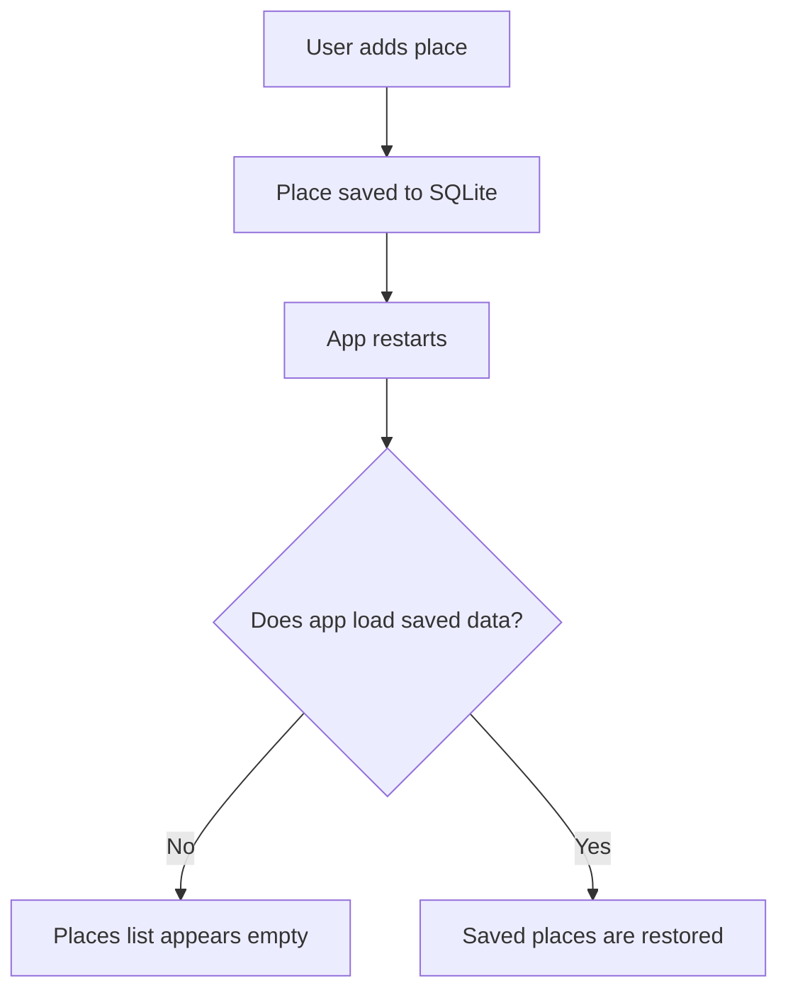
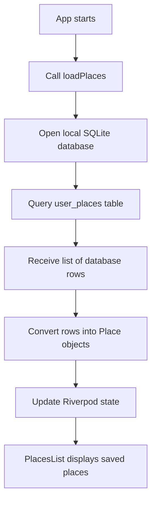
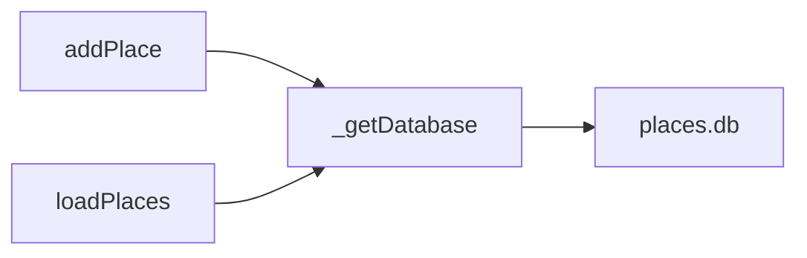
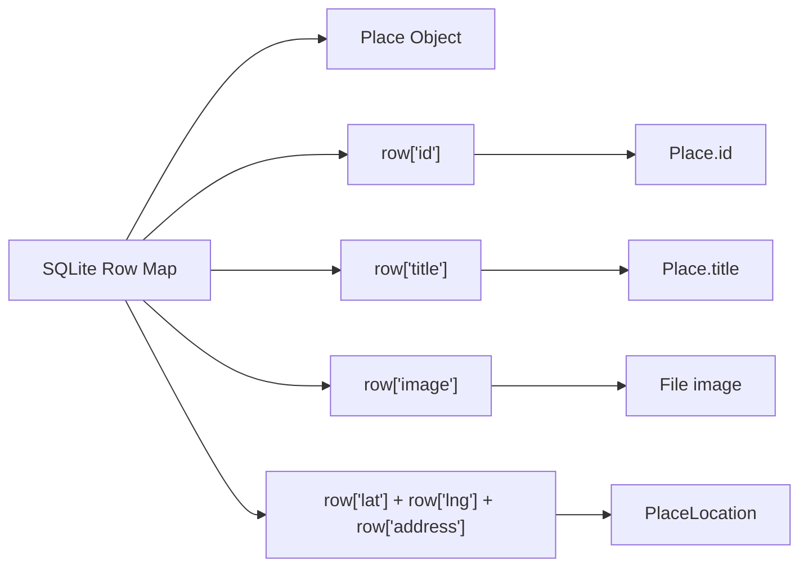
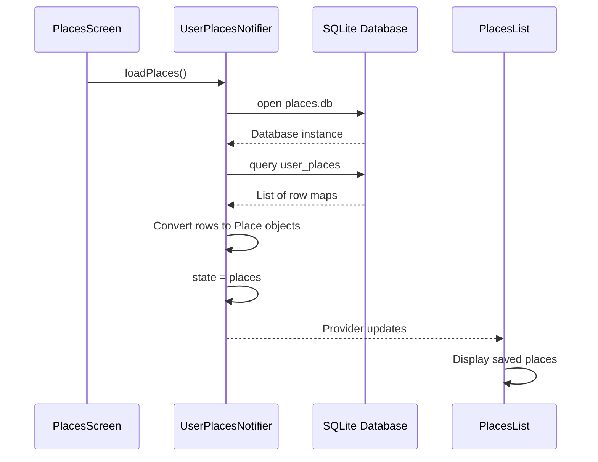
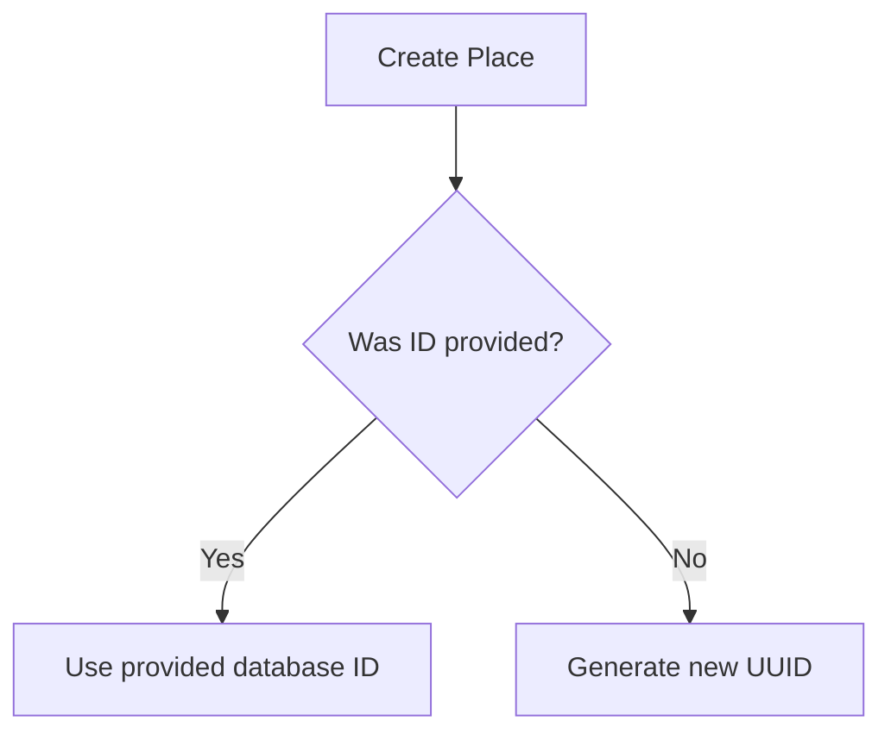
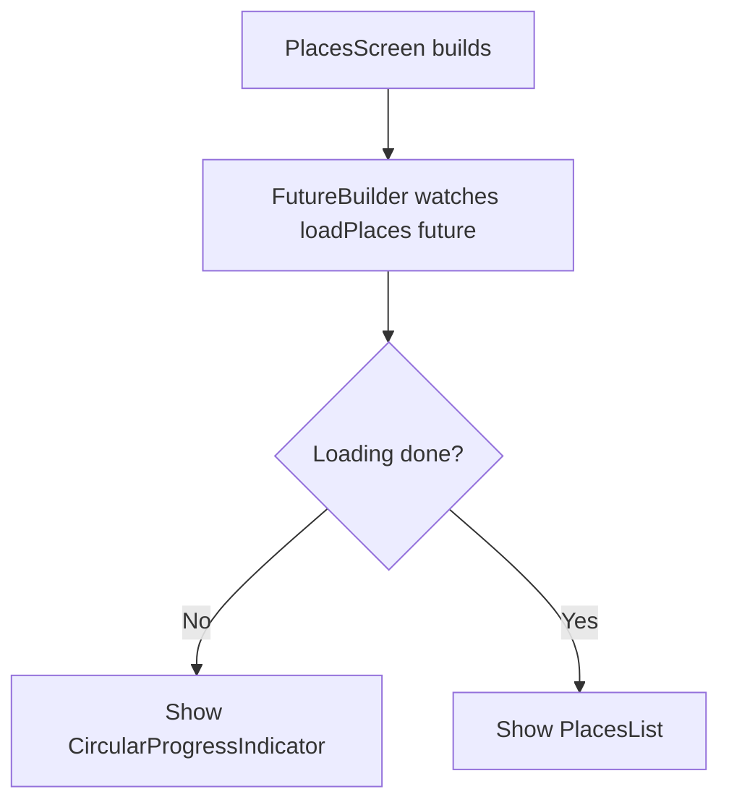
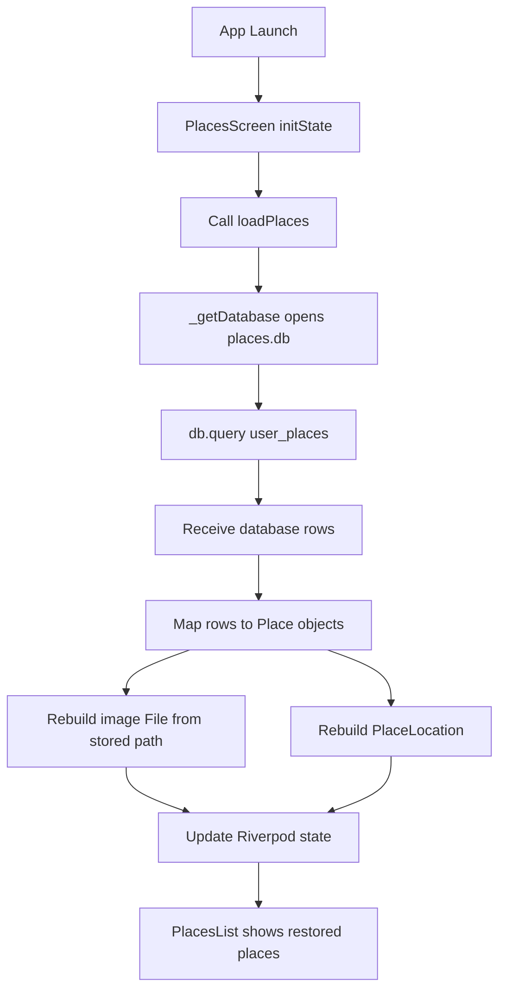

# Loading Data from the SQL Database

## Overview

This lecture implements loading saved places from the local SQLite database.

In the previous lectures, the app learned how to:

1. Copy picked images into a persistent app directory.
2. Store place metadata in a local SQLite database.

Now, the app needs to read that saved data when it starts again.

The `loadPlaces` method is added to `UserPlacesNotifier`. It opens the database, queries the `user_places` table, converts every database row back into a `Place` object, and updates the Riverpod state.

---

## Why Loading Data Is Needed

Saving data to SQLite is only half of the persistence workflow.

If the app saves data but never loads it again, the user still will not see their saved places after restarting the app.



---

## Persistence Workflow



---

## Step 1: Reuse the Database Helper Function

Instead of duplicating the database-opening logic in multiple methods, move it into a helper function.

```dart id="a4soly"
Future<Database> _getDatabase() async {
  final dbPath = await sql.getDatabasesPath();

  final db = await sql.openDatabase(
    path.join(dbPath, 'places.db'),
    onCreate: (db, version) {
      return db.execute(
        'CREATE TABLE user_places('
        'id TEXT PRIMARY KEY, '
        'title TEXT, '
        'image TEXT, '
        'lat REAL, '
        'lng REAL, '
        'address TEXT'
        ')',
      );
    },
    version: 1,
  );

  return db;
}
```

---

## Why Use `_getDatabase`?

Both `addPlace` and `loadPlaces` need access to the same database.

| Method       | Database Action                      |
| ------------ | ------------------------------------ |
| `addPlace`   | Opens database and inserts a new row |
| `loadPlaces` | Opens database and reads all rows    |

So the database-opening logic should be shared.



---

## Step 2: Add `loadPlaces`

Inside `UserPlacesNotifier`, add a new asynchronous method.

```dart id="i2rmat"
Future<void> loadPlaces() async {
  final db = await _getDatabase();
  final data = await db.query('user_places');

  final places = data.map((row) {
    return Place(
      id: row['id'] as String,
      title: row['title'] as String,
      image: File(row['image'] as String),
      location: PlaceLocation(
        latitude: row['lat'] as double,
        longitude: row['lng'] as double,
        address: row['address'] as String,
      ),
    );
  }).toList();

  state = places;
}
```

---

## Step 3: Query the Database

```dart id="ih692b"
final data = await db.query('user_places');
```

The `query` method reads rows from a database table.

Here, it reads all rows from the `user_places` table.

The result is a list of maps:

```dart id="wbjotz"
List<Map<String, Object?>>
```

Each map represents one row from the database.

---

## Database Row Structure

A single row may conceptually look like this:

```dart id="vbor20"
{
  'id': 'p1',
  'title': 'Favorite Park',
  'image': '/app/documents/photo.jpg',
  'lat': 37.422,
  'lng': -122.084,
  'address': 'Mountain View, California'
}
```

Each key matches one column from the `user_places` table.

---

## Step 4: Convert Rows into `Place` Objects

The database returns raw map data, but the app needs `Place` objects.

```dart id="fw9zib"
final places = data.map((row) {
  return Place(
    id: row['id'] as String,
    title: row['title'] as String,
    image: File(row['image'] as String),
    location: PlaceLocation(
      latitude: row['lat'] as double,
      longitude: row['lng'] as double,
      address: row['address'] as String,
    ),
  );
}).toList();
```

---

## Row-to-Object Mapping



---

## Reconstructing the Image File

The database does not store the image file itself.

It only stores the image path.

```dart id="iqef6b"
image: File(row['image'] as String),
```

This creates a new `File` object from the stored path.

Because the image was copied to the app documents directory earlier, this file should still exist after the app restarts.

---

## Reconstructing the Location

The location is rebuilt from the stored latitude, longitude, and address.

```dart id="4dcqgw"
location: PlaceLocation(
  latitude: row['lat'] as double,
  longitude: row['lng'] as double,
  address: row['address'] as String,
),
```

SQLite stores `lat` and `lng` as `REAL`, which maps well to Dart `double`.

---

## Step 5: Update Provider State

After converting all rows into `Place` objects, update the notifier state.

```dart id="d9wt33"
state = places;
```

Once the state is updated, any widget watching the provider will rebuild and display the loaded places.

---

## Data Loading Sequence



---

## Step 6: Update the `Place` Model to Accept an ID

There is one important issue: loaded places already have an ID stored in the database.

But the `Place` constructor may automatically generate a new ID.

To preserve the original database ID, update the model so the ID can optionally be passed in.

Example:

```dart id="tonll7"
class Place {
  Place({
    String? id,
    required this.title,
    required this.image,
    required this.location,
  }) : id = id ?? uuid.v4();

  final String id;
  final String title;
  final File image;
  final PlaceLocation location;
}
```

---

## Why Make `id` Optional?

When creating a new place, the app should generate a new ID automatically.

```dart id="amcivm"
Place(
  title: title,
  image: copiedImage,
  location: location,
);
```

When loading a place from the database, the app should reuse the stored ID.

```dart id="kqxpsl"
Place(
  id: row['id'] as String,
  title: row['title'] as String,
  image: File(row['image'] as String),
  location: location,
);
```

This gives both behaviors.

---

## ID Handling Flow



---

## Step 7: Call `loadPlaces` When the App Starts

The `loadPlaces` method must be called when the places screen initializes.

One common approach is to call it in `initState`.

Because `initState` is used, the screen should be a `ConsumerStatefulWidget`.

```dart id="3vr9sm"
class PlacesScreen extends ConsumerStatefulWidget {
  const PlacesScreen({super.key});

  @override
  ConsumerState<PlacesScreen> createState() {
    return _PlacesScreenState();
  }
}
```

Then call `loadPlaces` in `initState`.

```dart id="3oiamc"
class _PlacesScreenState extends ConsumerState<PlacesScreen> {
  late Future<void> _placesFuture;

  @override
  void initState() {
    super.initState();

    _placesFuture = ref.read(userPlacesProvider.notifier).loadPlaces();
  }

  @override
  Widget build(BuildContext context) {
    final userPlaces = ref.watch(userPlacesProvider);

    return Scaffold(
      appBar: AppBar(
        title: const Text('Your Places'),
      ),
      body: FutureBuilder(
        future: _placesFuture,
        builder: (context, snapshot) {
          if (snapshot.connectionState == ConnectionState.waiting) {
            return const Center(
              child: CircularProgressIndicator(),
            );
          }

          return PlacesList(
            places: userPlaces,
          );
        },
      ),
    );
  }
}
```

---

## Why Use `FutureBuilder`?

Loading data from SQLite is asynchronous.

The UI should not immediately show an empty list before the database query finishes.

`FutureBuilder` allows the app to show a loading spinner while the saved places are being loaded.



---

## Alternative `initState` Pattern

In some Riverpod setups, you may see this pattern:

```dart id="cmqzqw"
@override
void initState() {
  super.initState();

  Future(() {
    ref.read(userPlacesProvider.notifier).loadPlaces();
  });
}
```

This defers the provider call slightly.

However, storing the future in a field and passing it to `FutureBuilder` is usually cleaner because it avoids calling `loadPlaces` repeatedly during rebuilds.

---

## Complete Provider Example

```dart id="5hckm2"
import 'dart:io';

import 'package:flutter_riverpod/flutter_riverpod.dart';
import 'package:path/path.dart' as path;
import 'package:path_provider/path_provider.dart' as syspaths;
import 'package:sqflite/sqflite.dart' as sql;
import 'package:sqflite/sqlite_api.dart';

import '../models/place.dart';

Future<Database> _getDatabase() async {
  final dbPath = await sql.getDatabasesPath();

  final db = await sql.openDatabase(
    path.join(dbPath, 'places.db'),
    onCreate: (db, version) {
      return db.execute(
        'CREATE TABLE user_places('
        'id TEXT PRIMARY KEY, '
        'title TEXT, '
        'image TEXT, '
        'lat REAL, '
        'lng REAL, '
        'address TEXT'
        ')',
      );
    },
    version: 1,
  );

  return db;
}

class UserPlacesNotifier extends StateNotifier<List<Place>> {
  UserPlacesNotifier() : super([]);

  Future<void> loadPlaces() async {
    final db = await _getDatabase();
    final data = await db.query('user_places');

    final places = data.map((row) {
      return Place(
        id: row['id'] as String,
        title: row['title'] as String,
        image: File(row['image'] as String),
        location: PlaceLocation(
          latitude: row['lat'] as double,
          longitude: row['lng'] as double,
          address: row['address'] as String,
        ),
      );
    }).toList();

    state = places;
  }

  Future<void> addPlace(
    String title,
    File image,
    PlaceLocation location,
  ) async {
    final appDir = await syspaths.getApplicationDocumentsDirectory();
    final filename = path.basename(image.path);
    final copiedImage = await image.copy(
      path.join(appDir.path, filename),
    );

    final newPlace = Place(
      title: title,
      image: copiedImage,
      location: location,
    );

    final db = await _getDatabase();

    await db.insert('user_places', {
      'id': newPlace.id,
      'title': newPlace.title,
      'image': newPlace.image.path,
      'lat': newPlace.location.latitude,
      'lng': newPlace.location.longitude,
      'address': newPlace.location.address,
    });

    state = [newPlace, ...state];
  }
}
```

---

## Complete Loading Flow



---

## Important Concepts

### `db.query`

```dart id="8ejqxe"
final data = await db.query('user_places');
```

Reads rows from a database table.

Without a `where` clause, it reads all rows.

---

### `map`

```dart id="rkwyxc"
final places = data.map((row) {
  return Place(...);
}).toList();
```

Transforms each database row into a `Place` object.

---

### Type Casting with `as`

```dart id="h7kj1a"
row['title'] as String
row['lat'] as double
```

The row values are returned as `Object?`, so Dart needs explicit casts.

---

### `File`

```dart id="zfywhp"
File(row['image'] as String)
```

Recreates a file reference from the stored image path.

---

### Updating State

```dart id="llik1o"
state = places;
```

Replaces the current provider state with the loaded places.

---

## Common Mistakes

| Mistake                                      | Problem                                      |
| -------------------------------------------- | -------------------------------------------- |
| Not calling `loadPlaces` on startup          | Saved places remain hidden                   |
| Generating new IDs for loaded places         | Database identity is not preserved           |
| Forgetting `File(row['image'] as String)`    | Image cannot be reconstructed                |
| Forgetting `.toList()` after `map`           | State receives an iterable instead of a list |
| Showing `PlacesList` before loading finishes | UI may briefly show an empty list            |
| Not using the same table name                | Query returns no data or fails               |
| Forgetting type casts                        | Dart type errors occur                       |

---

## Summary

This lecture completes the local persistence workflow.

The `loadPlaces` method opens the SQLite database, queries all rows from the `user_places` table, converts each row into a `Place` object, and updates the Riverpod state.

The app also updates the `Place` model so loaded places can reuse their stored IDs instead of generating new ones.

Finally, the places screen calls `loadPlaces` during initialization and uses `FutureBuilder` to wait for the database query before showing the places list.

After this implementation, saved places are restored whenever the app starts again.
