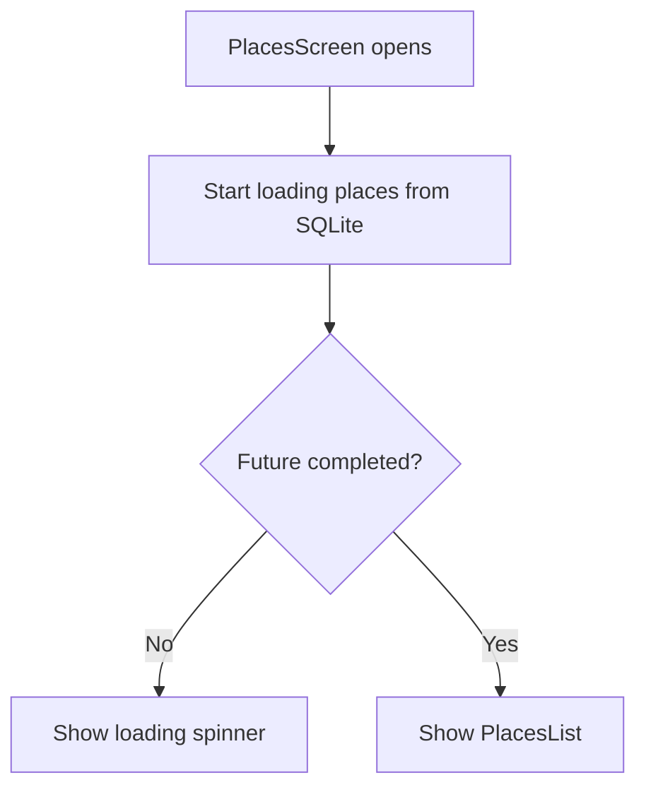
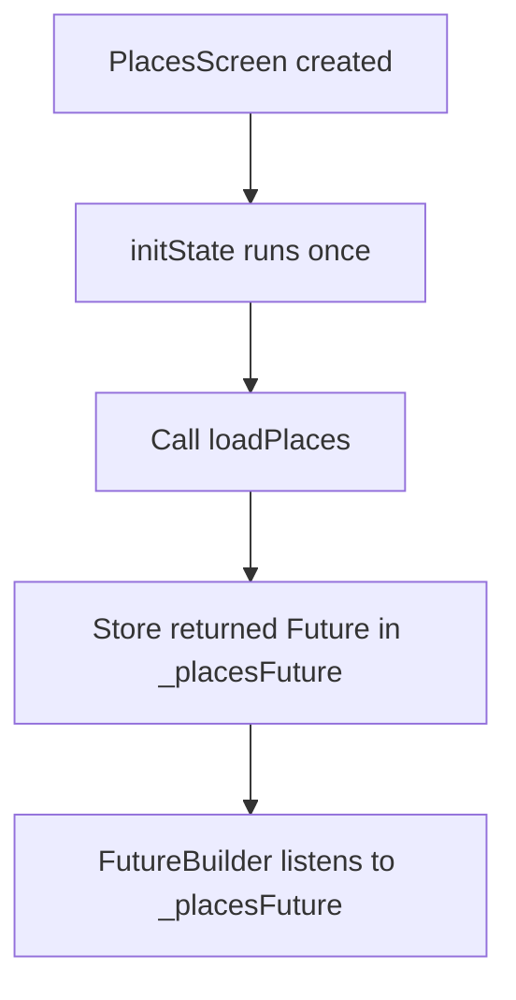
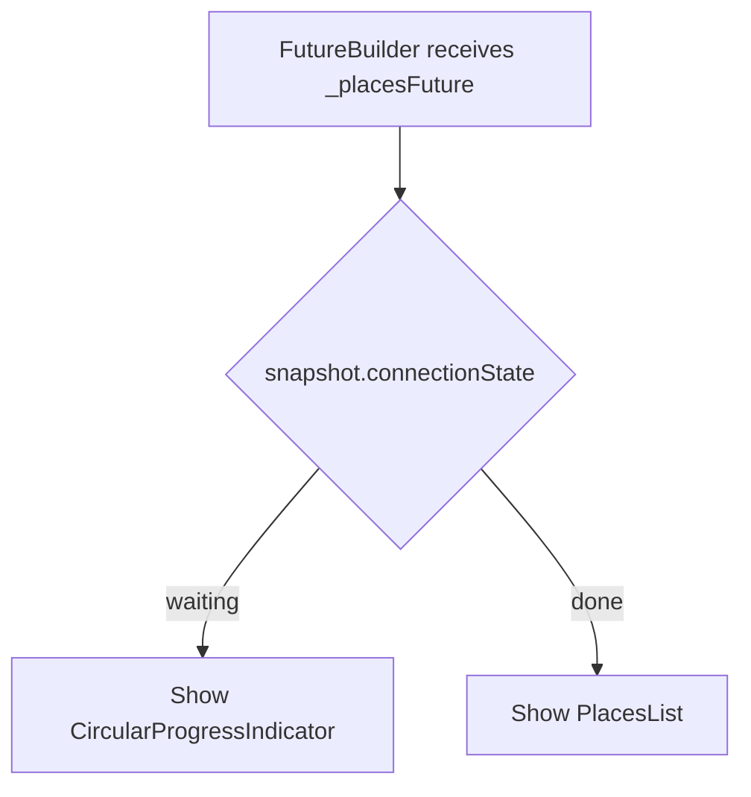
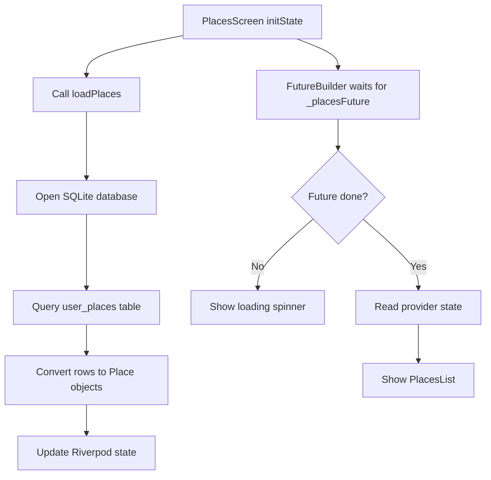
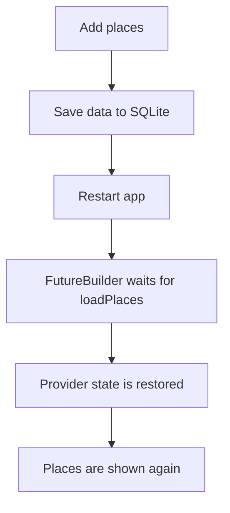

# Using a FutureBuilder for Loading Data

## Overview

This lecture refactors the places loading workflow by using Flutter's built-in `FutureBuilder` widget.

Previously, loading data from the SQLite database could be handled manually with a loading boolean and `setState`. However, Flutter already provides a cleaner widget-based solution for asynchronous UI: `FutureBuilder`.

`FutureBuilder` listens to a `Future`, checks its current state, and builds different UI depending on whether the future is still loading, completed successfully, or failed with an error.

In this app, `FutureBuilder` is used to wait for the `loadPlaces()` method to finish before displaying the places list.

---

## Why Use `FutureBuilder`?

Loading data from a database is asynchronous.

The app should not immediately show the places list before the database query finishes. If it does, the user might briefly see an empty list even though saved places are still being loaded.

`FutureBuilder` helps handle this cleanly.



---

## What `FutureBuilder` Handles

`FutureBuilder` helps handle three common async states:

| State   | Meaning                     | UI Example                  |
| ------- | --------------------------- | --------------------------- |
| Loading | The future is still running | `CircularProgressIndicator` |
| Done    | The future completed        | `PlacesList`                |
| Error   | The future failed           | Error message               |

---

## Basic FutureBuilder Structure

```dart
FutureBuilder(
  future: someFuture,
  builder: (ctx, snapshot) {
    if (snapshot.connectionState == ConnectionState.waiting) {
      return const Center(
        child: CircularProgressIndicator(),
      );
    }

    return const Text('Future completed!');
  },
)
```

The `builder` function receives:

| Parameter  | Purpose                                           |
| ---------- | ------------------------------------------------- |
| `ctx`      | The build context                                 |
| `snapshot` | Information about the current state of the future |

---

## Step 1: Convert `PlacesScreen` to `ConsumerStatefulWidget`

Because the screen needs to initialize a future in `initState`, it should become a stateful widget.

Since Riverpod is also used, the correct widget type is `ConsumerStatefulWidget`.

```dart
class PlacesScreen extends ConsumerStatefulWidget {
  const PlacesScreen({super.key});

  @override
  ConsumerState<PlacesScreen> createState() {
    return _PlacesScreenState();
  }
}
```

---

## Why `ConsumerStatefulWidget`?

A normal `ConsumerWidget` is useful when you only need to read providers in `build`.

However, this screen also needs `initState`.

So we use `ConsumerStatefulWidget`.

| Widget Type              | Use Case                            |
| ------------------------ | ----------------------------------- |
| `ConsumerWidget`         | Provider access only in `build`     |
| `StatefulWidget`         | Local lifecycle/state only          |
| `ConsumerStatefulWidget` | Provider access + lifecycle methods |

---

## Step 2: Create the State Class

```dart
class _PlacesScreenState extends ConsumerState<PlacesScreen> {
  late Future<void> _placesFuture;

  @override
  void initState() {
    super.initState();

    _placesFuture = ref.read(userPlacesProvider.notifier).loadPlaces();
  }

  @override
  Widget build(BuildContext context) {
    final userPlaces = ref.watch(userPlacesProvider);

    // UI code here
  }
}
```

---

## Step 3: Store the Future in a State Field

```dart
late Future<void> _placesFuture;
```

The `_placesFuture` field stores the future returned by `loadPlaces()`.

The `late` keyword tells Dart that this variable will be initialized later before it is used.

In this case, it is initialized inside `initState`.

---

## Why Store the Future?

The future should not be created directly inside the `build` method.

Bad example:

```dart
FutureBuilder(
  future: ref.read(userPlacesProvider.notifier).loadPlaces(),
  builder: ...
)
```

This is problematic because `build` can run many times. If the future is created inside `build`, the app may reload the database repeatedly.

Better approach:

```dart
late Future<void> _placesFuture;

@override
void initState() {
  super.initState();
  _placesFuture = ref.read(userPlacesProvider.notifier).loadPlaces();
}
```

This ensures the loading process starts only once when the screen is initialized.

---

## Future Initialization Flow



---

## Step 4: Load Places in `initState`

```dart
@override
void initState() {
  super.initState();

  _placesFuture = ref.read(userPlacesProvider.notifier).loadPlaces();
}
```

This starts the database loading process.

The `loadPlaces()` method:

1. Opens the SQLite database.
2. Queries the `user_places` table.
3. Converts rows into `Place` objects.
4. Updates the Riverpod state.

---

## Step 5: Watch the Provider in `build`

```dart
final userPlaces = ref.watch(userPlacesProvider);
```

After `loadPlaces()` updates the provider state, `ref.watch` receives the updated places list and rebuilds the UI.

---

## Step 6: Wrap the Places List with `FutureBuilder`

```dart
body: FutureBuilder(
  future: _placesFuture,
  builder: (ctx, snapshot) {
    if (snapshot.connectionState == ConnectionState.waiting) {
      return const Center(
        child: CircularProgressIndicator(),
      );
    }

    return PlacesList(
      places: userPlaces,
    );
  },
),
```

---

## Loading State

```dart
if (snapshot.connectionState == ConnectionState.waiting) {
  return const Center(
    child: CircularProgressIndicator(),
  );
}
```

While the database query is still running, the app shows a loading spinner.

This prevents the app from showing an empty list too early.

---

## Success State

```dart
return PlacesList(
  places: userPlaces,
);
```

Once the future is done, the app displays the places list.

Even if the list is empty, the database loading process is complete, so it is safe to show the normal places UI.

---

## FutureBuilder UI Flow



---

## Optional Error Handling

You can also handle errors with `snapshot.hasError`.

```dart
FutureBuilder(
  future: _placesFuture,
  builder: (ctx, snapshot) {
    if (snapshot.connectionState == ConnectionState.waiting) {
      return const Center(
        child: CircularProgressIndicator(),
      );
    }

    if (snapshot.hasError) {
      return const Center(
        child: Text('Something went wrong.'),
      );
    }

    return PlacesList(
      places: userPlaces,
    );
  },
)
```

This is useful if the database query fails.

---

## Complete Code Example

```dart
import 'package:flutter/material.dart';
import 'package:flutter_riverpod/flutter_riverpod.dart';

import '../providers/user_places.dart';
import '../widgets/places_list.dart';
import 'add_place.dart';

class PlacesScreen extends ConsumerStatefulWidget {
  const PlacesScreen({super.key});

  @override
  ConsumerState<PlacesScreen> createState() {
    return _PlacesScreenState();
  }
}

class _PlacesScreenState extends ConsumerState<PlacesScreen> {
  late Future<void> _placesFuture;

  @override
  void initState() {
    super.initState();

    _placesFuture = ref.read(userPlacesProvider.notifier).loadPlaces();
  }

  @override
  Widget build(BuildContext context) {
    final userPlaces = ref.watch(userPlacesProvider);

    return Scaffold(
      appBar: AppBar(
        title: const Text('Your Places'),
        actions: [
          IconButton(
            icon: const Icon(Icons.add),
            onPressed: () {
              Navigator.of(context).push(
                MaterialPageRoute(
                  builder: (ctx) => const AddPlaceScreen(),
                ),
              );
            },
          ),
        ],
      ),
      body: FutureBuilder(
        future: _placesFuture,
        builder: (ctx, snapshot) {
          if (snapshot.connectionState == ConnectionState.waiting) {
            return const Center(
              child: CircularProgressIndicator(),
            );
          }

          if (snapshot.hasError) {
            return const Center(
              child: Text('Something went wrong.'),
            );
          }

          return PlacesList(
            places: userPlaces,
          );
        },
      ),
    );
  }
}
```

---

## How This Works with Riverpod

The `FutureBuilder` does not directly use `snapshot.data` in this case.

Instead, `loadPlaces()` updates the provider state internally.

Then this line reads the updated provider state:

```dart
final userPlaces = ref.watch(userPlacesProvider);
```

So the responsibilities are split like this:

| Part                            | Responsibility                        |
| ------------------------------- | ------------------------------------- |
| `FutureBuilder`                 | Waits for `loadPlaces()` to finish    |
| `loadPlaces()`                  | Loads data and updates provider state |
| `ref.watch(userPlacesProvider)` | Reads the current places list         |
| `PlacesList`                    | Displays the places                   |

---

## Full Loading Architecture



---

## Why Not Use Manual Loading State?

Without `FutureBuilder`, you might manage loading manually.

Example concept:

```dart
bool _isLoading = true;

void loadData() async {
  await ref.read(userPlacesProvider.notifier).loadPlaces();

  setState(() {
    _isLoading = false;
  });
}
```

This works, but it requires extra state management.

`FutureBuilder` avoids this by letting the widget react directly to the future state.

---

## Manual Loading vs FutureBuilder

| Approach               | Characteristics                                          |
| ---------------------- | -------------------------------------------------------- |
| Manual loading boolean | More code, needs `setState`, easier to forget edge cases |
| `FutureBuilder`        | Declarative, built-in, directly tied to the future       |

---

## Important Concepts

### `FutureBuilder`

```dart
FutureBuilder(
  future: _placesFuture,
  builder: (ctx, snapshot) {
    // Return UI based on future state
  },
)
```

Builds UI based on a future's current status.

---

### `AsyncSnapshot`

```dart
builder: (ctx, snapshot) {
  // snapshot contains future state information
}
```

The snapshot contains information such as:

* `connectionState`
* `hasError`
* `data`
* `error`

---

### `ConnectionState.waiting`

```dart
snapshot.connectionState == ConnectionState.waiting
```

This means the future is still running.

---

### `late`

```dart
late Future<void> _placesFuture;
```

This tells Dart that the value will be assigned later before it is used.

---

### `ref.read`

```dart
ref.read(userPlacesProvider.notifier).loadPlaces();
```

Used in `initState` to trigger the loading operation once.

---

### `ref.watch`

```dart
final userPlaces = ref.watch(userPlacesProvider);
```

Used in `build` to listen for provider state changes.

---

## Testing the Feature

After implementing this:

1. Run the app.
2. Add a new place.
3. Add another place.
4. Restart the app completely.
5. The saved places should still appear.
6. Open each place to confirm that the image and location still work.

---

## Expected Result



---

## Common Mistakes

| Mistake                               | Problem                                                      |
| ------------------------------------- | ------------------------------------------------------------ |
| Creating the future inside `build`    | Causes repeated loading on rebuilds                          |
| Forgetting `late` or initialization   | `_placesFuture` may be used before being set                 |
| Using `ref.watch` in `initState`      | `watch` is intended for `build`, not one-time initialization |
| Not handling loading state            | UI may show empty list before data loads                     |
| Not calling `loadPlaces`              | Saved data is never restored                                 |
| Forgetting `Future<void>` return type | Async intent is less clear                                   |
| Not handling errors                   | Database failures may result in poor user feedback           |

---

## Summary

`FutureBuilder` is used to handle the asynchronous loading of saved places from the SQLite database.

The screen is converted to a `ConsumerStatefulWidget` so that `loadPlaces()` can be called once inside `initState`. The returned future is stored in `_placesFuture` and passed to `FutureBuilder`.

While the future is still running, a loading spinner is shown. Once the future completes, the app displays the `PlacesList`, which reads the restored places from the Riverpod provider.

This creates a clean, declarative, and reliable data loading workflow for locally persisted places.
