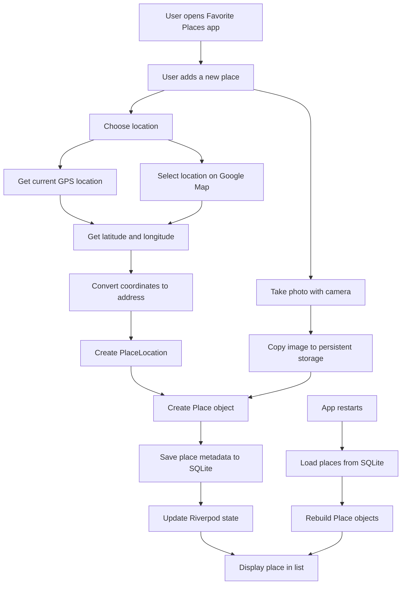
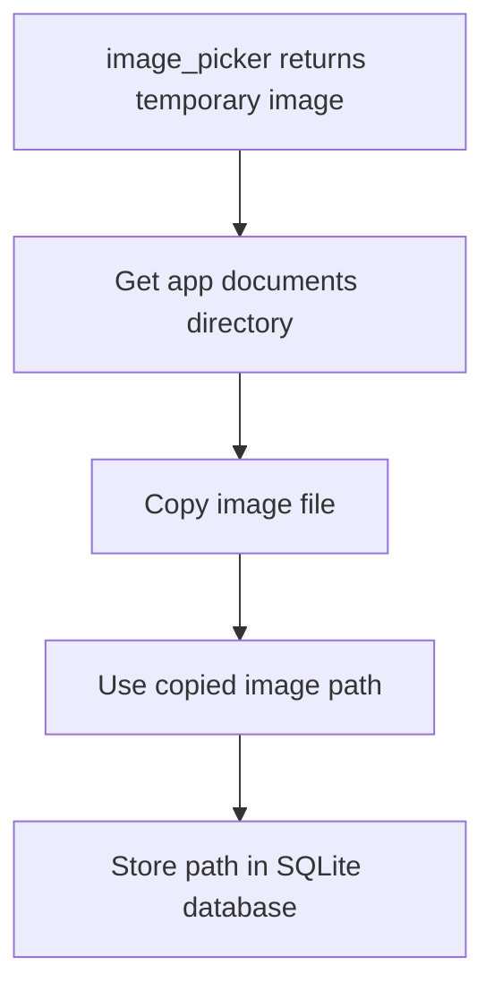
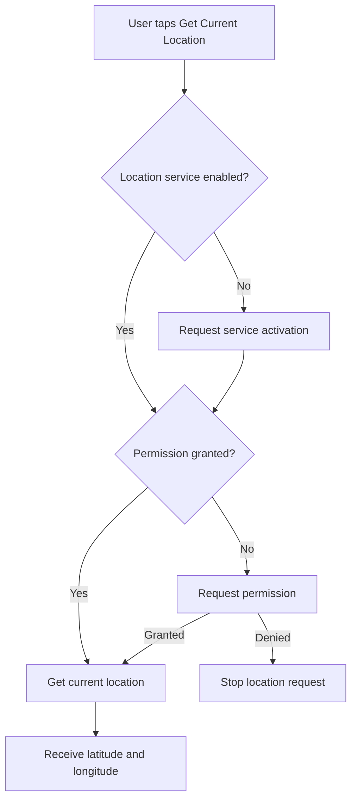
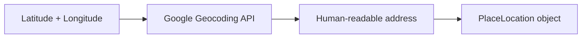
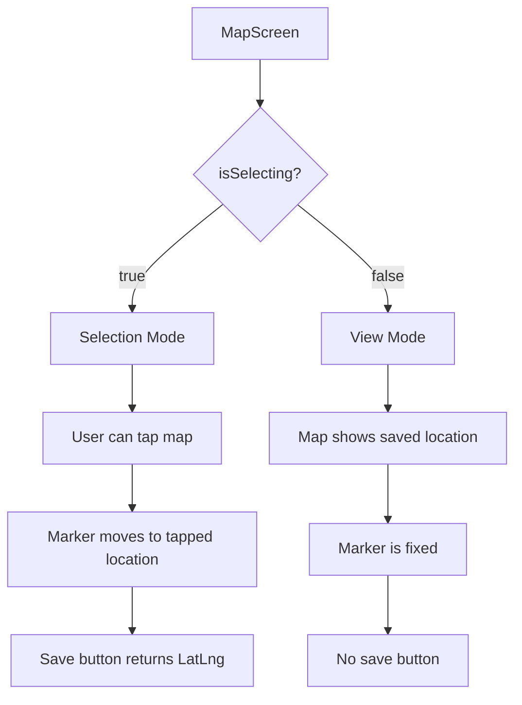
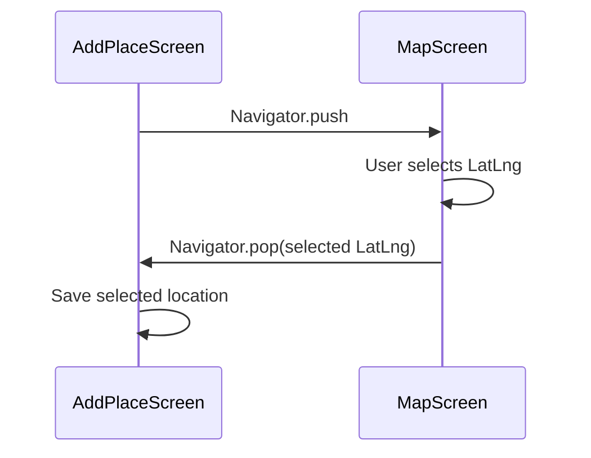
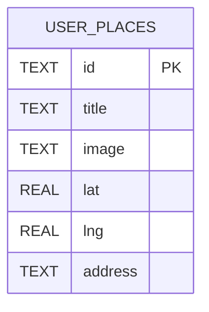
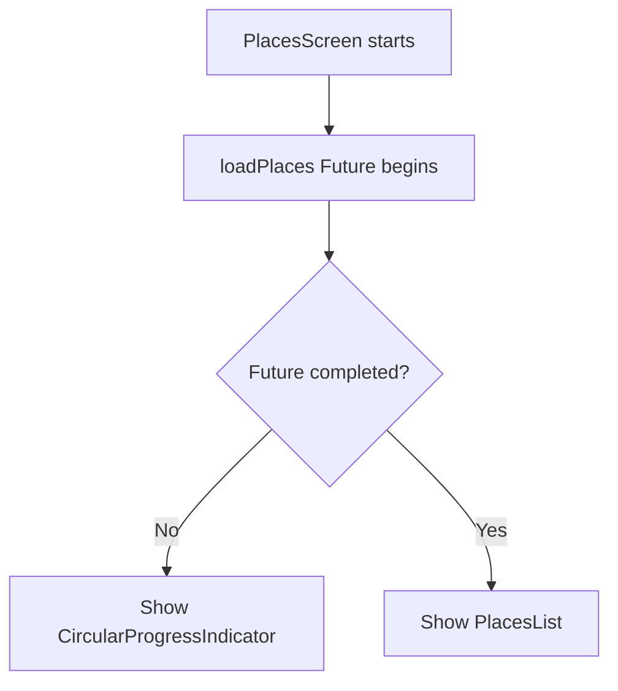
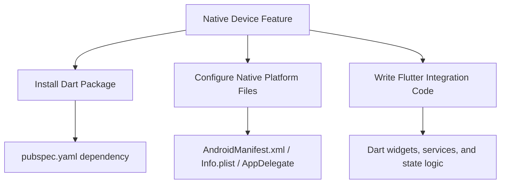
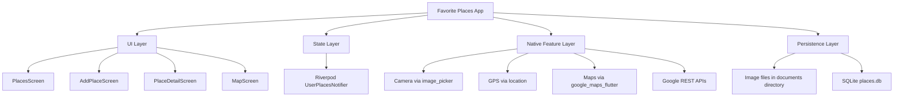

# Module Summary: Native Device Features in Flutter

## Overview

This module completed the **Favorite Places** app and demonstrated how Flutter apps can work with native device features.

Throughout the module, the app was enhanced with several real-world capabilities:

* Taking photos with the device camera
* Getting the user's current GPS location
* Displaying static and interactive Google Maps
* Selecting a location manually on a map
* Converting coordinates into a human-readable address
* Saving places locally on the device with SQLite

By the end of the module, the app could create, display, and persist favorite places even after the app was restarted.

---

## Final App Capabilities

The completed Favorite Places app allows users to:

1. Add a new place.
2. Take a photo for that place.
3. Get the current location or select a location manually on a map.
4. Display a static map preview.
5. Open a full interactive map.
6. Save the place locally.
7. Reload saved places after restarting the app.

---

## Complete Feature Flow



---

## Major Topics Covered

## 1. Image Picking with `image_picker`

The module used the `image_picker` package to access the device camera.

This package provides a simple cross-platform API for taking pictures or selecting images from the gallery.

Example concept:

```dart
final imagePicker = ImagePicker();

final pickedImage = await imagePicker.pickImage(
  source: ImageSource.camera,
);
```

The selected image is returned as an `XFile`, which can then be converted into a `File`.

---

## Why Image Storage Needed Extra Work

Images returned by `image_picker` may be stored in a temporary cache directory.

That means the operating system may delete them later.

To solve this, the app copied the selected image into a persistent app directory.



---

## 2. Getting the Current Location

The module used the `location` package to retrieve the user's current GPS coordinates.

The location workflow included:

* Checking whether location services are enabled
* Requesting location service activation if needed
* Checking runtime permissions
* Requesting permission if needed
* Getting latitude and longitude

---

## Location Permission Flow



---

## 3. Static Maps and Geocoding APIs

The app used Google Maps REST APIs for two purposes.

| API             | Purpose                                     |
| --------------- | ------------------------------------------- |
| Static Maps API | Display a static map image preview          |
| Geocoding API   | Convert coordinates into a readable address |

The static map preview was shown inside the place form and place detail screen.

The geocoding API was used to turn latitude and longitude into an address string.

---

## Coordinates to Address Flow



---

## 4. Interactive Google Maps

The module used the `google_maps_flutter` package to embed a real interactive Google Map inside the app.

The `MapScreen` supported two modes:

| Mode           | Purpose                              |
| -------------- | ------------------------------------ |
| Selection mode | User taps the map to pick a location |
| View mode      | User views a saved place location    |

---

## Map Screen Modes



---

## 5. Manual Location Selection

The user could manually select a location by tapping the map.

The `GoogleMap` widget's `onTap` callback returned a `LatLng` object.

```dart
void _selectLocation(LatLng position) {
  setState(() {
    _pickedLocation = position;
  });
}
```

The selected location was displayed with a `Marker`.

When the user pressed save, the selected `LatLng` was returned to the previous screen.

```dart
Navigator.of(context).pop(_pickedLocation);
```

---

## Returning Data Between Screens

This module reinforced an important Flutter navigation pattern:



---

## 6. Local File Storage with `path_provider`

The module used `path_provider` to find a safe directory for storing app files.

This was especially important for image files.

```dart
final appDir = await getApplicationDocumentsDirectory();
```

The app then copied the picked image into this directory.

```dart
final copiedImage = await image.copy(
  path.join(appDir.path, filename),
);
```

This ensured that images would not be lost when the app restarted.

---

## 7. Local SQL Storage with `sqflite`

The module used `sqflite` to create a local SQLite database.

The database stored structured place data:

| Column    | Type               | Purpose                   |
| --------- | ------------------ | ------------------------- |
| `id`      | `TEXT PRIMARY KEY` | Unique place ID           |
| `title`   | `TEXT`             | Place title               |
| `image`   | `TEXT`             | Path to copied image file |
| `lat`     | `REAL`             | Latitude                  |
| `lng`     | `REAL`             | Longitude                 |
| `address` | `TEXT`             | Human-readable address    |

---

## SQLite Storage Architecture



---

## Saving Places to SQLite

When a new place was added, the app inserted it into the database.

```dart
await db.insert('user_places', {
  'id': newPlace.id,
  'title': newPlace.title,
  'image': newPlace.image.path,
  'lat': newPlace.location.latitude,
  'lng': newPlace.location.longitude,
  'address': newPlace.location.address,
});
```

The image itself was not stored in the database.

Only the image path was stored.

---

## 8. Loading Places from SQLite

When the app started, the saved places were loaded from the database.

```dart
final data = await db.query('user_places');
```

Each database row was converted back into a `Place` object.

```dart
final places = data.map((row) {
  return Place(
    id: row['id'] as String,
    title: row['title'] as String,
    image: File(row['image'] as String),
    location: PlaceLocation(
      latitude: row['lat'] as double,
      longitude: row['lng'] as double,
      address: row['address'] as String,
    ),
  );
}).toList();
```

Then the Riverpod state was updated.

```dart
state = places;
```

---

## 9. Loading UI with `FutureBuilder`

The module used `FutureBuilder` to wait for the database loading operation.

While the app was loading saved places, it showed a loading spinner.

After loading finished, it displayed the places list.



---

## Important Packages Used

| Package               | Purpose                                    |
| --------------------- | ------------------------------------------ |
| `image_picker`        | Pick or capture images                     |
| `location`            | Access GPS coordinates                     |
| `google_maps_flutter` | Show interactive Google Maps               |
| `path_provider`       | Find platform-specific storage directories |
| `path`                | Build file paths safely                    |
| `sqflite`             | Store structured data in SQLite            |
| `flutter_riverpod`    | Manage app state                           |

---

## Three-Layer Pattern for Native Features

A key lesson from this module is that native features usually require three layers of setup.



For example, camera and location access require both Dart package usage and platform permission configuration.

Google Maps requires package installation, API key setup, Android/iOS configuration, and Dart widget integration.

---

## Key Lessons Learned

* Flutter can access native device features through third-party packages.
* Native packages often require Android and iOS configuration.
* Runtime permissions must be handled carefully.
* Device files may be temporary unless copied to persistent storage.
* Coordinates can be converted into addresses through geocoding.
* Static maps are useful for previews.
* Interactive maps are useful for selection and exploration.
* SQLite is a strong choice for structured local data.
* `FutureBuilder` is useful for asynchronous loading states.
* Provider or Riverpod can keep the UI synchronized with loaded data.

---

## Possible Improvements

The completed app works, but it could be expanded further.

Possible improvements include:

* Add a delete place feature.
* Add an edit place feature.
* Allow choosing images from the gallery.
* Add search or filtering.
* Add categories or tags.
* Add map clustering for many places.
* Add error handling for failed API calls.
* Add loading indicators for geocoding.
* Add offline map fallback behavior.
* Move the Google API key into a safer configuration system.

---

## Example Delete Feature Idea

A delete feature could remove a place from both Riverpod state and SQLite.

```dart
await db.delete(
  'user_places',
  where: 'id = ?',
  whereArgs: [id],
);
```

This would delete only the row matching the selected place ID.

---

## Security Note

For learning purposes, the Google API key may have been hardcoded directly in the Dart code or native files.

For production apps, avoid hardcoding sensitive keys.

Better options include:

* Environment variables
* `flutter_dotenv`
* Build-time secrets
* Backend proxy APIs
* Restricting API keys in Google Cloud Console

---

## Final Architecture



---

## Final Summary

This module built a complete Flutter app that integrates multiple native device features.

The app can take photos, get GPS coordinates, show static and interactive Google Maps, select locations manually, convert coordinates into addresses, and save all place data locally on the device.

The biggest takeaway is that real-world Flutter apps often depend on third-party packages to access native functionality. These packages usually require package installation, native platform configuration, runtime permission handling, and Dart integration code.

By completing this module, you now have a solid foundation for using native device features in Flutter apps and for building apps that store user data locally without requiring a backend server.
