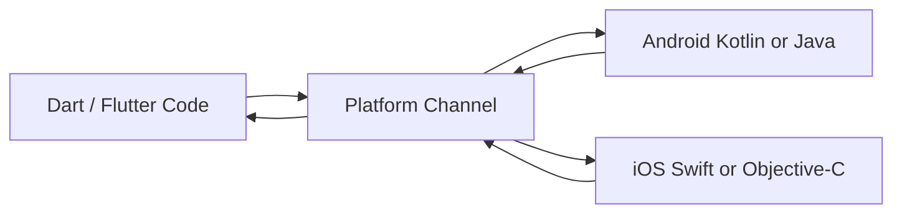
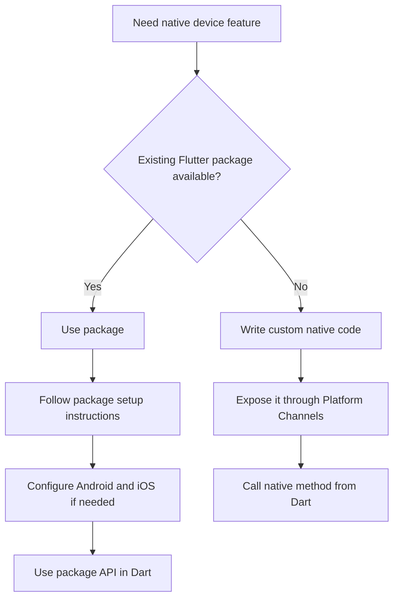
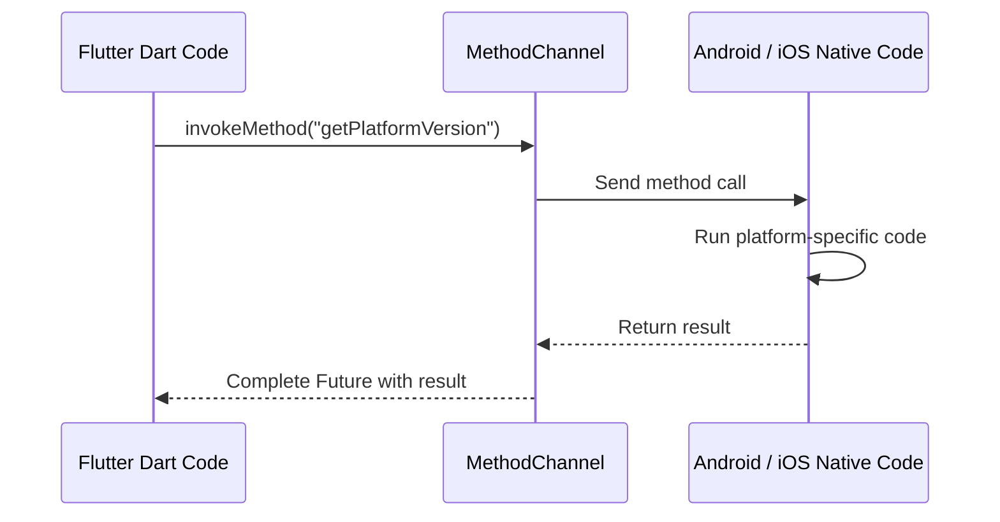
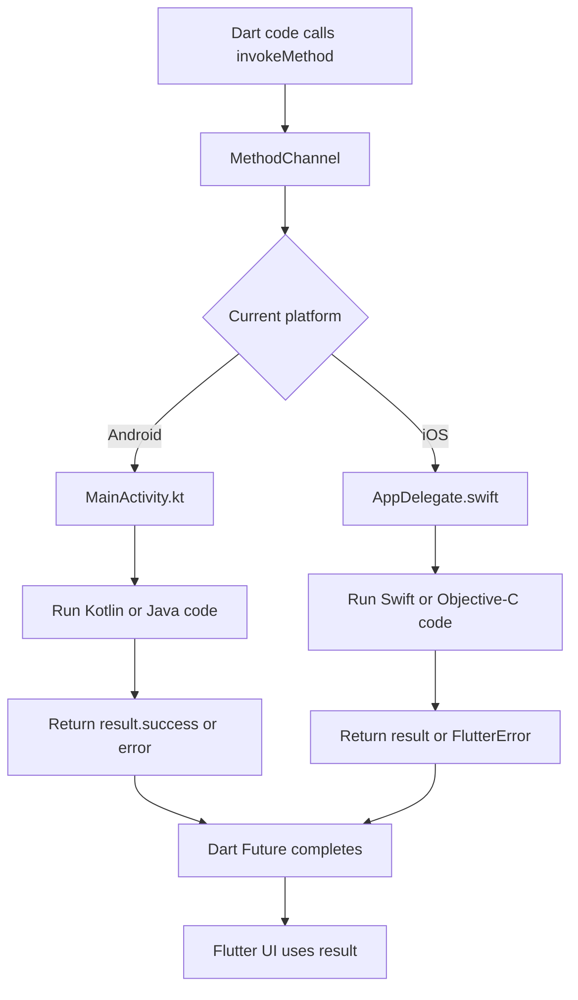
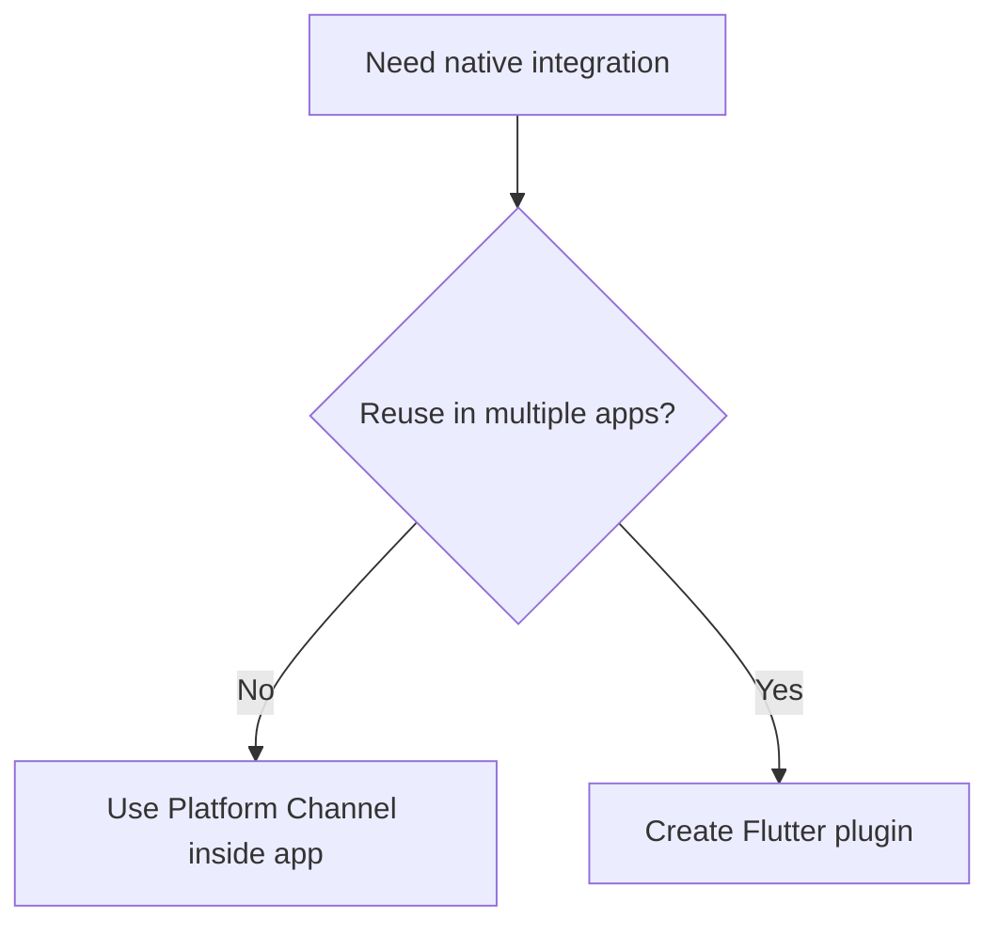

# Adding Your Own Native Code

## Overview

This lecture introduces how to add custom native platform code to a Flutter app.

Most of the time, when a Flutter app needs access to native device features, you will use existing packages. Examples from this module include:

* `image_picker` for camera and gallery access
* `location` for GPS location access
* `google_maps_flutter` for interactive Google Maps
* `sqflite` for local SQLite storage

However, sometimes there may not be a package for the native feature you need. In that case, Flutter allows you to write your own native Android or iOS code and connect it to Dart using **Platform Channels**.

---

## What Are Platform Channels?

Platform Channels are Flutter's bridge between Dart code and native platform code.

They allow Dart to send a message to the native side, ask it to run some platform-specific logic, and then receive a result back.



---

## When Would You Use Custom Native Code?

You usually do **not** need to write custom native code for common features because existing packages already solve many problems.

But custom native code can be useful when:

* No Flutter package exists for the native API you need.
* An existing package does not expose the feature you need.
* You need platform-specific behavior that is unique to Android or iOS.
* You are integrating with a native SDK.
* You are building your own reusable Flutter plugin.

---

## Typical Native Feature Strategy



---

## Platform Channel Concept

A Platform Channel uses a shared string name.

Both Dart and native code must use the same channel name.

Example:

```dart id="wvvq61"
static const platform = MethodChannel('com.example.myapp/native');
```

This channel name identifies the bridge.

By convention, channel names often use a reverse-domain format:

```text id="6fhjnj"
com.example.myapp/native
```

This helps avoid naming collisions.

---

## Dart Side: Calling Native Code

On the Flutter side, use `MethodChannel`.

```dart id="mefjod"
import 'package:flutter/services.dart';

class NativeBridge {
  static const platform = MethodChannel('com.example.myapp/native');

  static Future<String> getNativePlatformVersion() async {
    try {
      final String version = await platform.invokeMethod(
        'getPlatformVersion',
      );

      return version;
    } on PlatformException catch (error) {
      return 'Failed to get platform version: ${error.message}';
    }
  }
}
```

---

## Explanation

```dart id="8wa75c"
static const platform = MethodChannel('com.example.myapp/native');
```

This creates a channel object in Dart.

The native Android or iOS code must register a channel with the exact same name.

---

```dart id="2z50o5"
platform.invokeMethod('getPlatformVersion');
```

This sends a method call to the native side.

The string `'getPlatformVersion'` identifies which native method should run.

---

```dart id="byu0ox"
await platform.invokeMethod(...)
```

Platform channel calls are asynchronous, so they return a `Future`.

That is why `await` is used.

---

## Dart-to-Native Flow



---

## Android Side: Kotlin Example

On Android, native code is usually added in:

```text id="d1dac5"
android/app/src/main/kotlin/.../MainActivity.kt
```

Example:

```kotlin id="mxcl7v"
package com.example.myapp

import android.os.Build
import androidx.annotation.NonNull
import io.flutter.embedding.android.FlutterActivity
import io.flutter.embedding.engine.FlutterEngine
import io.flutter.plugin.common.MethodChannel

class MainActivity: FlutterActivity() {
    private val CHANNEL = "com.example.myapp/native"

    override fun configureFlutterEngine(@NonNull flutterEngine: FlutterEngine) {
        super.configureFlutterEngine(flutterEngine)

        MethodChannel(
            flutterEngine.dartExecutor.binaryMessenger,
            CHANNEL
        ).setMethodCallHandler { call, result ->
            if (call.method == "getPlatformVersion") {
                result.success("Android ${Build.VERSION.RELEASE}")
            } else {
                result.notImplemented()
            }
        }
    }
}
```

---

## Android Explanation

```kotlin id="0rghe0"
private val CHANNEL = "com.example.myapp/native"
```

This must match the Dart channel name.

---

```kotlin id="5czfq4"
MethodChannel(
    flutterEngine.dartExecutor.binaryMessenger,
    CHANNEL
)
```

This registers the Android side of the channel.

---

```kotlin id="em41k0"
.setMethodCallHandler { call, result ->
    // Handle Dart method calls here
}
```

This listens for method calls coming from Dart.

---

```kotlin id="y0zi18"
if (call.method == "getPlatformVersion") {
    result.success("Android ${Build.VERSION.RELEASE}")
}
```

If Dart calls `getPlatformVersion`, Android returns the current Android version.

---

## iOS Side: Swift Example

On iOS, native code is usually added in:

```text id="bt28jz"
ios/Runner/AppDelegate.swift
```

Example:

```swift id="b5tgm2"
import UIKit
import Flutter

@main
@objc class AppDelegate: FlutterAppDelegate {
  private let channelName = "com.example.myapp/native"

  override func application(
    _ application: UIApplication,
    didFinishLaunchingWithOptions launchOptions: [UIApplication.LaunchOptionsKey: Any]?
  ) -> Bool {
    let controller = window?.rootViewController as! FlutterViewController

    let channel = FlutterMethodChannel(
      name: channelName,
      binaryMessenger: controller.binaryMessenger
    )

    channel.setMethodCallHandler { call, result in
      if call.method == "getPlatformVersion" {
        result("iOS " + UIDevice.current.systemVersion)
      } else {
        result(FlutterMethodNotImplemented)
      }
    }

    GeneratedPluginRegistrant.register(with: self)

    return super.application(
      application,
      didFinishLaunchingWithOptions: launchOptions
    )
  }
}
```

---

## iOS Explanation

```swift id="cgadli"
let channel = FlutterMethodChannel(
  name: channelName,
  binaryMessenger: controller.binaryMessenger
)
```

This creates the iOS side of the Platform Channel.

---

```swift id="3vzl6n"
channel.setMethodCallHandler { call, result in
  // Handle Dart method calls here
}
```

This listens for method calls from Dart.

---

```swift id="v9vpmz"
if call.method == "getPlatformVersion" {
  result("iOS " + UIDevice.current.systemVersion)
}
```

If Dart calls `getPlatformVersion`, iOS returns the current iOS version.

---

## Important Compatibility Note

Flutter's official documentation notes that newer Flutter iOS templates may use different lifecycle setup depending on the app template and Flutter version.

So when adding custom native iOS code, always check the current Flutter documentation and your generated `AppDelegate.swift` structure.

---

## Supported Data Types

Platform Channels can pass simple values between Dart and native code.

Common supported data types include:

| Dart Type   | Native Equivalent |
| ----------- | ----------------- |
| `null`      | `null` / `nil`    |
| `bool`      | Boolean           |
| `int`       | Integer           |
| `double`    | Double            |
| `String`    | String            |
| `Uint8List` | Byte array        |
| `List`      | List / Array      |
| `Map`       | Map / Dictionary  |

Do not pass custom Dart objects directly.

Instead, convert them to simple maps or lists.

---

## Example: Passing Arguments

Dart side:

```dart id="09b1n7"
final result = await platform.invokeMethod(
  'calculateSomething',
  {
    'valueA': 10,
    'valueB': 20,
  },
);
```

Native side receives a map-like argument object.

Conceptually:

```text id="z40p7s"
{
  valueA: 10,
  valueB: 20
}
```

---

## Returning Data to Dart

Native code can return:

* A success value
* An error
* A not-implemented response

### Android Kotlin

```kotlin id="ebtryr"
result.success("Some native result")
```

```kotlin id="w9e2r6"
result.error("ERROR_CODE", "Something went wrong", null)
```

```kotlin id="p6b2mp"
result.notImplemented()
```

### iOS Swift

```swift id="dth3ck"
result("Some native result")
```

```swift id="6me5zq"
result(
  FlutterError(
    code: "ERROR_CODE",
    message: "Something went wrong",
    details: nil
  )
)
```

```swift id="2n21a1"
result(FlutterMethodNotImplemented)
```

---

## Error Handling in Dart

Always handle possible platform exceptions.

```dart id="840o26"
try {
  final result = await platform.invokeMethod('someNativeMethod');
  print(result);
} on PlatformException catch (error) {
  print('Native call failed: ${error.message}');
}
```

This is important because:

* The method may not be implemented.
* The native API may fail.
* The platform may not support the requested feature.
* The native code may return an error.

---

## Complete Communication Flow



---

## Platform Channels vs Packages

| Approach                 | Best For                                |
| ------------------------ | --------------------------------------- |
| Existing Flutter package | Common native features                  |
| Platform Channel in app  | One-off custom native integration       |
| Custom Flutter plugin    | Reusable native integration across apps |

---

## When to Build a Plugin Instead

If you only need native code in one app, adding Platform Channel code directly to the app is fine.

If you want to reuse the native integration in multiple apps, create a Flutter plugin package instead.



---

## Key Points

* Flutter can call custom Android and iOS code through Platform Channels.
* `MethodChannel` is used on the Dart side.
* Android registers the channel in `MainActivity.kt`.
* iOS registers the channel in `AppDelegate.swift`.
* Both sides must use the same channel name.
* Dart calls native methods with `invokeMethod`.
* Native code returns results back to Dart.
* Calls are asynchronous and should be awaited.
* Only supported simple data types should be passed.
* Use `try/catch` to handle `PlatformException`.

---

## Common Mistakes

| Mistake                                     | Problem                                                 |
| ------------------------------------------- | ------------------------------------------------------- |
| Channel names do not match                  | Dart cannot reach the native handler                    |
| Method names do not match                   | Native side returns not implemented                     |
| Not awaiting `invokeMethod`                 | Result may not be available when used                   |
| Not catching `PlatformException`            | Native errors can crash or break the flow               |
| Passing custom objects directly             | Platform channel serialization fails                    |
| Forgetting platform-specific imports        | Native code will not compile                            |
| Writing everything in native code too early | Existing Flutter packages may already solve the problem |

---

## Summary

Most Flutter apps use third-party packages to access native device functionality.

However, if no suitable package exists, Flutter allows you to write custom native code and connect it to Dart using Platform Channels.

A `MethodChannel` sends named method calls from Dart to Android or iOS. The native side handles the call, runs platform-specific code, and returns a result back to Flutter as a `Future`.

This is an advanced but powerful feature that lets Flutter apps access almost any native platform API when package-based solutions are not enough.
