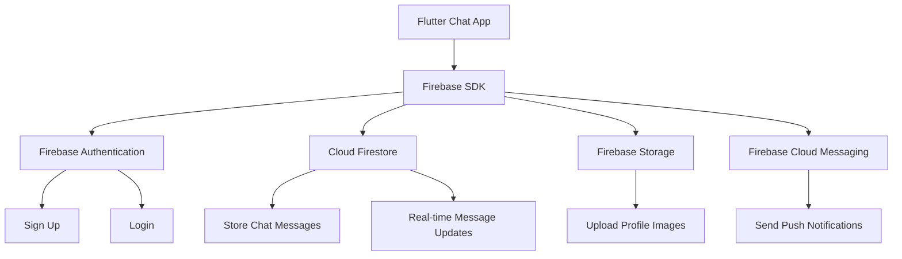
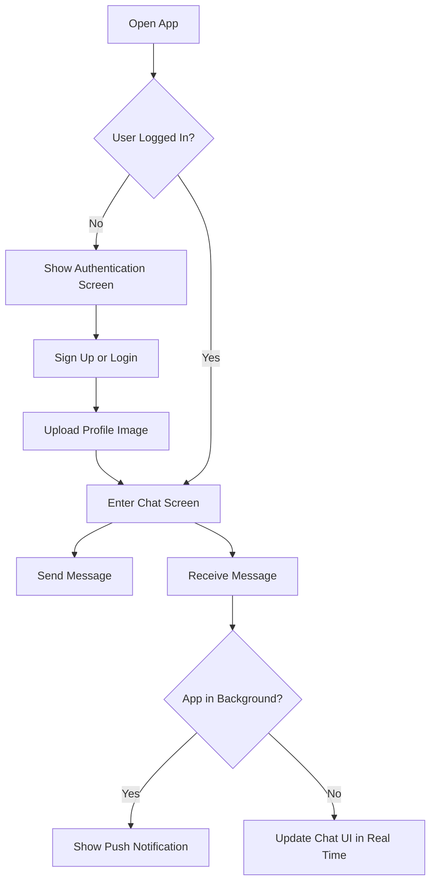
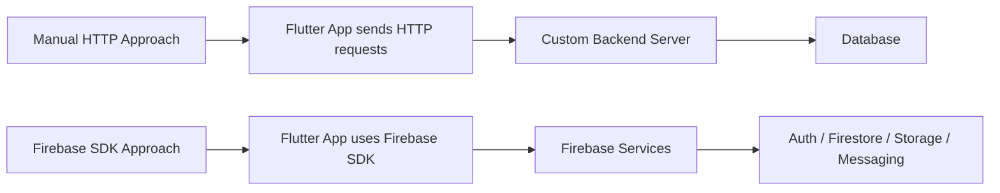

# Module Introduction: Firebase Integration with Flutter

## Overview

This module introduces how to integrate Firebase with Flutter by building a fully functional chat application. The app will use Firebase as its backend, allowing users to sign up, log in, upload a profile image, send and receive chat messages, and receive push notifications when new messages arrive.

By the end of this module, you will understand how to connect a Flutter app to Firebase and use Firebase services such as Authentication, Cloud Firestore, Firebase Storage, and Firebase Cloud Messaging.

---

## What You Will Build

In this module, you will build a chat app with the following features:

* User sign-up and login
* User authentication with Firebase Authentication
* Profile image capture and upload
* Real-time chat messages
* Cloud Firestore as the database
* Firebase Storage for image uploads
* Push notifications for new messages
* Firebase SDK integration instead of manual HTTP requests

---

## Key Concepts

### Firebase as a Backend-as-a-Service

Firebase is a Backend-as-a-Service platform by Google. It provides ready-to-use backend features, so you do not need to build and maintain your own custom backend server.

Instead of writing server-side code manually, you can use Firebase services directly from your Flutter app through Firebase SDKs.

---

## Firebase Services Covered

| Firebase Service         | Purpose in the Chat App                        |
| ------------------------ | ---------------------------------------------- |
| Firebase Authentication  | Handles user sign-up and login                 |
| Cloud Firestore          | Stores and syncs chat messages in real time    |
| Firebase Storage         | Stores uploaded user profile images            |
| Firebase Cloud Messaging | Sends push notifications                       |
| Firebase SDK             | Connects Flutter directly to Firebase services |

---

## App Architecture

---

## User Flow

---

## Why This Module Is Important

This module is a major step forward because it combines multiple advanced Flutter and backend concepts in one real project.

You will practice:

* Building widgets and screens
* Styling Flutter UI
* Managing user input
* Handling authentication state
* Uploading files
* Working with real-time databases
* Using Firebase SDKs
* Displaying push notifications

This module also shows how Flutter apps can communicate with a backend without manually sending HTTP requests. Instead, Firebase provides SDKs that simplify backend communication.

---

## SDK-Based Backend Communication

In previous modules, backend communication may have involved manually sending HTTP requests.

With Firebase, the app communicates with the backend through Firebase SDKs.

The Firebase SDK handles much of the communication logic for you, making backend integration easier and faster.

---

## Development Requirements

Before starting this module, make sure you have:

* A Google account
* A Firebase project created in the Firebase Console
* Flutter installed
* The FlutterFire CLI installed
* Your IDE ready
* The Firebase Console open while developing

---

## Tips

* Keep the Firebase Console open while working on the app.
* Review the official Firebase documentation when needed.
* Start with Firebase Authentication before adding Firestore, Storage, and Messaging.
* Use Firebase's free Spark plan for development and learning.
* Make sure your Firebase configuration files are correctly connected to your Flutter project.

---

## Notes

Firebase's free Spark plan is sufficient for development and learning. This module starts with basic Firebase setup and authentication, then gradually adds more advanced features such as image upload, real-time messaging, push notifications, and possibly cloud functions.

The chat app is useful because it combines many real-world app features into one project.

---

## Summary

This module teaches how to build a Firebase-powered Flutter chat application from start to finish. You will learn how to add user authentication, image uploads, real-time Firestore messages, and push notifications.

By completing this module, you will gain practical experience using Firebase as a backend for Flutter apps and understand how Firebase SDKs simplify backend communication.
