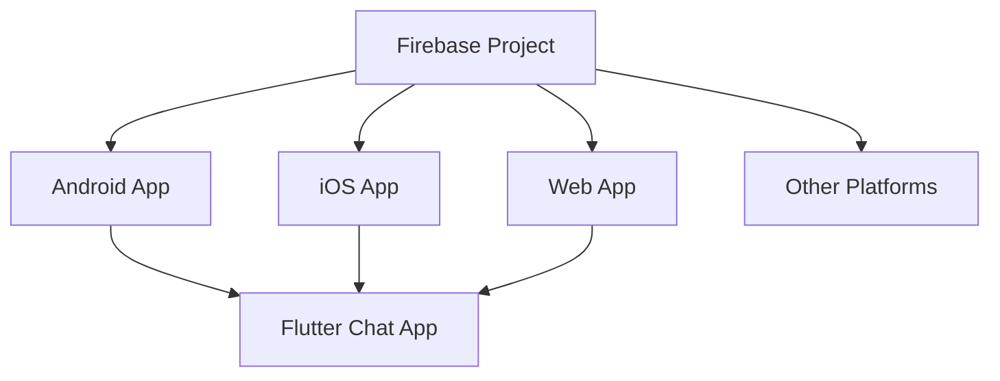
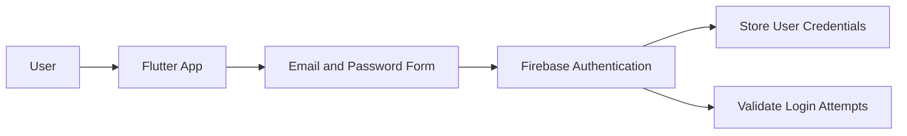
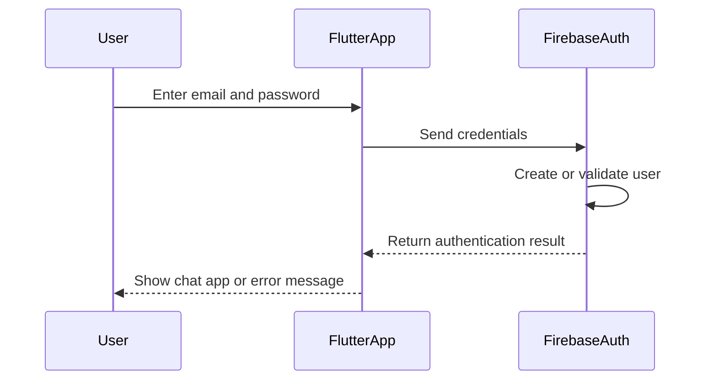
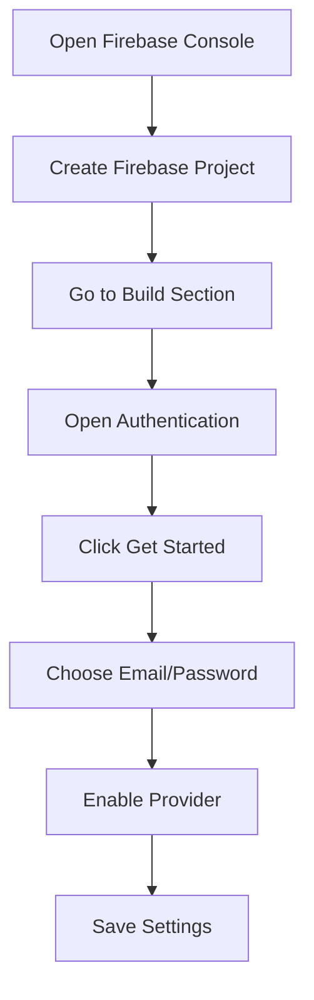
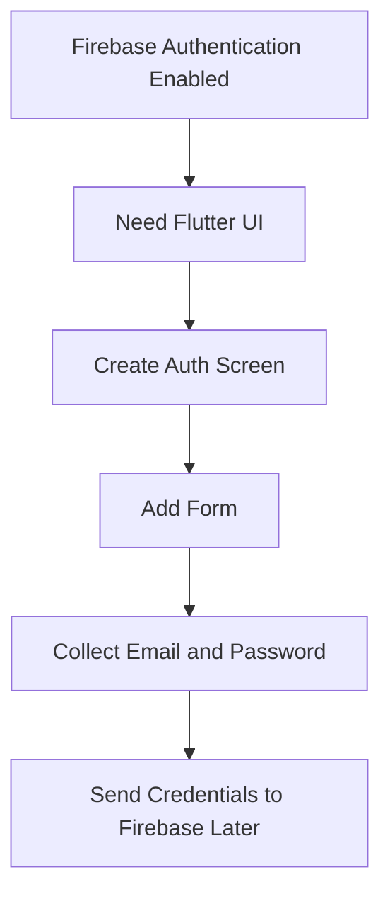

# App and Firebase Setup

## Overview

This lecture covers the initial setup for a new Flutter chat application and a corresponding Firebase project. Before adding Firebase SDKs or writing authentication logic, you first need to create a Flutter app scaffold and prepare a Firebase project in the Firebase Console.

The final app will require users to create an account and sign in before they can send or receive chat messages. Therefore, this module begins with the foundation for user authentication: a Flutter frontend and a Firebase backend.

---

## Learning Goals

By the end of this lecture, you will understand how to:

* Create a new Flutter project for the chat app
* Set up a Firebase project in the Firebase Console
* Understand the relationship between the Flutter frontend and Firebase backend
* Enable Email/Password authentication in Firebase
* Prepare the app for a future authentication screen and form

---

## Project Setup

A new Flutter project is created for this module.

Example project name:

```text
CHAT_APP
```

The default `main.dart` file is replaced with a simple app widget that defines the basic app structure and theme.

```dart
import 'package:flutter/material.dart';

void main() {
  runApp(const App());
}

class App extends StatelessWidget {
  const App({super.key});

  @override
  Widget build(BuildContext context) {
    return MaterialApp(
      title: 'FlutterChat',
      theme: ThemeData().copyWith(
        useMaterial3: true,
        colorScheme: ColorScheme.fromSeed(
          seedColor: const Color.fromARGB(255, 63, 17, 177),
        ),
      ),
      home: ...
    );
  }
}
```

At this point, the app only contains a basic theme. The rest of the chat app will be built step by step.

---

## Firebase Project Setup

To use Firebase as the backend, you need to create a Firebase project.

### Steps

1. Go to the Firebase Console:

```text
https://console.firebase.google.com
```

2. Sign in with your Google account.

3. Create a new Firebase project.

4. Give the project a clear name, for example:

```text
flutter-chat-app
```

5. Google Analytics can be disabled for this learning project.

6. Finish creating the Firebase project.

---

## Firebase Project Structure

A single Firebase project can support multiple app platforms.



This means one Firebase backend can be connected to different versions of the same Flutter app.

---

## Frontend and Backend Relationship

Authentication requires communication between the frontend and the backend.

In this project:

* The frontend is the Flutter app.
* The backend is Firebase.
* The user enters credentials in the Flutter app.
* Firebase stores and validates those credentials.



---

## What Authentication Means

Authentication is the process of verifying a user's identity.

In a simple email/password flow:

1. The user creates an account with an email and password.
2. The app sends those credentials to the backend.
3. The backend stores the credentials securely.
4. Later, when the user logs in, the app sends the credentials again.
5. The backend checks whether the email and password match an existing account.
6. If the credentials are valid, the user is allowed to access the app.



---

## Why Firebase Is Used

You could build your own backend using technologies such as:

* Node.js
* Python
* Java
* Go
* PHP

However, this course focuses on Flutter, which is mainly used for building frontend applications. Firebase is used as a ready-made backend service so you can focus on building the Flutter app.

Firebase provides built-in services for:

* User authentication
* Database storage
* File storage
* Push notifications
* Real-time updates

---

## Enabling Firebase Authentication

After creating the Firebase project, authentication must be enabled.

### Steps

1. Open your Firebase project.
2. Go to the **Build** section.
3. Select **Authentication**.
4. Click **Get started**.
5. Choose **Email/Password** as the sign-in provider.
6. Enable Email/Password authentication.
7. Click **Save**.



---

## Supported Authentication Options

Firebase Authentication supports many sign-in methods.

Examples include:

| Sign-in Method | Description                                           |
| -------------- | ----------------------------------------------------- |
| Email/Password | Users sign up and log in with email and password      |
| Google         | Users sign in with a Google account                   |
| Apple          | Users sign in with an Apple account                   |
| Facebook       | Users sign in with a Facebook account                 |
| Phone          | Users sign in using a phone number                    |
| Anonymous      | Users can use the app without creating a full account |

For this course, the app will use **Email/Password authentication**.

---

## Why Start with the Authentication Screen?

Even though Firebase Authentication is enabled, the Flutter app still needs a user interface that allows users to enter their credentials.

The app needs:

* An authentication screen
* A form
* Email input
* Password input
* Validation logic
* A way to submit the credentials to Firebase later

Therefore, the next step is to build the authentication screen in Flutter.



---

## Key Points

* A new Flutter project is created for the chat app.
* Firebase will be used as the backend for this project.
* Users must sign up and log in before using the chat app.
* Authentication requires both a frontend form and a backend service.
* Firebase Authentication can store and validate user credentials.
* Email/Password authentication must be enabled in the Firebase Console.
* The actual connection between Flutter and Firebase will be implemented later.
* The next immediate step is building the authentication screen and form.

---

## Tips

* Use a clear Firebase project name, such as `flutter-chat-app`.
* Keep the Firebase Console open while developing.
* Disable Google Analytics if you want a simpler setup for learning.
* Make sure your Flutter app runs correctly before adding Firebase dependencies.
* Start with the frontend authentication form before sending data to Firebase.
* Use the official Firebase documentation when adding more advanced sign-in methods.

---

## Notes

Firebase was previously used in the course for its real-time database features. In this module, Firebase is used more extensively as a backend service that supports authentication, image uploads, real-time chat messages, and push notifications.

For now, Firebase Authentication is enabled, but the app does not yet have a screen where users can enter their email and password. That screen will be built next.

---

## Summary

This lecture sets up the foundation for a Firebase-powered Flutter chat app. You create a new Flutter project, create a Firebase project, and enable Email/Password authentication in the Firebase Console.

Authentication requires communication between the Flutter frontend and a backend. Firebase will handle the backend side, including storing and validating user credentials. The next step is to build the authentication screen and form in Flutter so users can enter their email and password.
