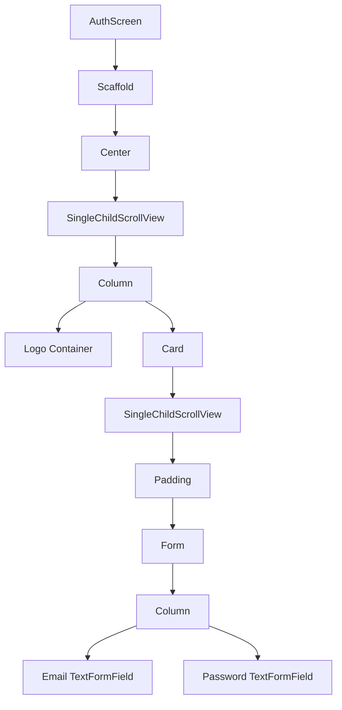
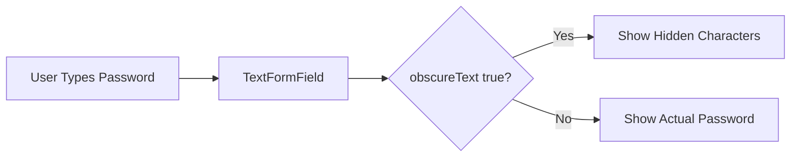
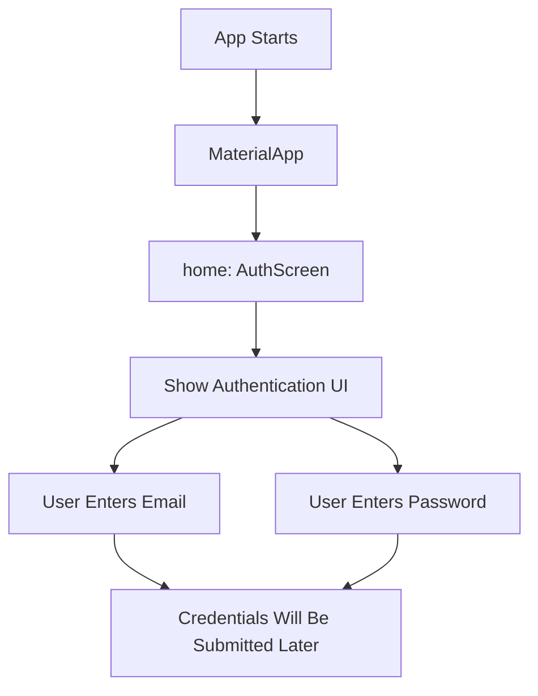

# Adding an Authentication Screen

## Overview

This lecture focuses on creating the first version of the authentication screen for a Flutter chat application. Since users must create an account and log in before they can send or receive messages, the app needs a dedicated screen where users can enter their credentials.

The authentication screen will contain a form with email and password inputs. At this stage, the screen only focuses on the user interface. Actual validation and Firebase authentication logic will be added later.

---

## Learning Goals

By the end of this lecture, you will understand how to:

* Create a new screen widget in a Flutter project
* Use a `StatefulWidget` for a form-based screen
* Build an authentication form with `Form` and `TextFormField`
* Use `Scaffold`, `Center`, `SingleChildScrollView`, `Column`, and `Card` to structure the screen
* Add email and password fields
* Configure email keyboard behavior
* Hide password input using `obscureText`
* Display the authentication screen from `main.dart`

---

## Project Structure

A new folder named `screens` is created inside the `lib` folder.

Inside the `screens` folder, a new file named `auth.dart` is added.

```text
lib/
├── main.dart
└── screens/
    └── auth.dart
```

The `auth.dart` file contains the `AuthScreen` widget.

---

## Why Use a StatefulWidget?

The authentication screen is created as a `StatefulWidget`.

This is important because the screen will contain a form, and later it will need to manage:

* User input
* Form validation
* Login mode
* Signup mode
* Loading state
* Error state
* Submitted email and password values

```dart
class AuthScreen extends StatefulWidget {
  const AuthScreen({super.key});

  @override
  State<AuthScreen> createState() => _AuthScreenState();
}
```

The state class contains the `build()` method and will later store form-related logic.

```dart
class _AuthScreenState extends State<AuthScreen> {
  @override
  Widget build(BuildContext context) {
    return Scaffold();
  }
}
```

---

## Authentication Screen Layout

The screen uses a `Scaffold` as its root widget.

The background color is taken from the app theme:

```dart
backgroundColor: Theme.of(context).colorScheme.primary,
```

This allows the authentication screen to follow the global app theme defined in `main.dart`.

---

## Layout Structure



---

## Why Use SingleChildScrollView?

The screen uses `SingleChildScrollView` to prevent layout overflow.

This is especially important when:

* The device screen is small
* The keyboard opens
* The form contains multiple input fields
* More buttons and widgets are added later

Without `SingleChildScrollView`, the keyboard could cover the form or cause a bottom overflow error.

---

## Adding a Logo Image

Before the form, a logo image is displayed for styling purposes.

A new assets folder is created:

```text
assets/
└── images/
    └── chat.png
```

The image must also be registered in `pubspec.yaml`.

```yaml
flutter:
  assets:
    - assets/images/chat.png
```

Then the image can be used with `Image.asset`.

```dart
Container(
  margin: const EdgeInsets.only(
    top: 30,
    bottom: 20,
    left: 20,
    right: 20,
  ),
  width: 200,
  child: Image.asset('assets/images/chat.png'),
),
```

---

## Why Use a Card?

The form is placed inside a `Card` widget.

The `Card` widget gives the form a clean Material Design look by adding:

* Elevation
* Rounded appearance
* Visual separation from the background
* A focused area for user input

```dart
Card(
  margin: const EdgeInsets.all(20),
  child: Padding(
    padding: const EdgeInsets.all(16),
    child: Form(
      child: Column(
        mainAxisSize: MainAxisSize.min,
        children: [],
      ),
    ),
  ),
)
```

---

## Form Structure

The authentication form is built with Flutter's `Form` widget.

Inside the form, a `Column` is used to arrange the input fields vertically.

```dart
Form(
  child: Column(
    mainAxisSize: MainAxisSize.min,
    children: [
      TextFormField(),
      TextFormField(),
    ],
  ),
)
```

The `mainAxisSize: MainAxisSize.min` setting ensures that the column only takes as much vertical space as its children need.

---

## Email Input Field

The first `TextFormField` is used for the email address.

```dart
TextFormField(
  decoration: const InputDecoration(
    labelText: 'Email Address',
  ),
  keyboardType: TextInputType.emailAddress,
  autocorrect: false,
  textCapitalization: TextCapitalization.none,
),
```

### Important Properties

| Property                                      | Purpose                           |
| --------------------------------------------- | --------------------------------- |
| `labelText`                                   | Shows a label for the input       |
| `keyboardType: TextInputType.emailAddress`    | Opens an email-friendly keyboard  |
| `autocorrect: false`                          | Prevents unwanted corrections     |
| `textCapitalization: TextCapitalization.none` | Prevents automatic capitalization |

These settings improve the user experience when entering an email address.

---

## Password Input Field

The second `TextFormField` is used for the password.

```dart
TextFormField(
  decoration: const InputDecoration(
    labelText: 'Password',
  ),
  obscureText: true,
),
```

The most important property here is:

```dart
obscureText: true
```

This hides the password characters while the user types.

---

## Why obscureText Is Important

Password fields should not display the actual characters entered by the user.



Using `obscureText: true` protects the user's password from being seen by people nearby.

---

## Complete AuthScreen Code

```dart
import 'package:flutter/material.dart';

class AuthScreen extends StatefulWidget {
  const AuthScreen({super.key});

  @override
  State<AuthScreen> createState() {
    return _AuthScreenState();
  }
}

class _AuthScreenState extends State<AuthScreen> {
  @override
  Widget build(BuildContext context) {
    return Scaffold(
      backgroundColor: Theme.of(context).colorScheme.primary,
      body: Center(
        child: SingleChildScrollView(
          child: Column(
            mainAxisAlignment: MainAxisAlignment.center,
            children: [
              Container(
                margin: const EdgeInsets.only(
                  top: 30,
                  bottom: 20,
                  left: 20,
                  right: 20,
                ),
                width: 200,
                child: Image.asset('assets/images/chat.png'),
              ),
              Card(
                margin: const EdgeInsets.all(20),
                child: SingleChildScrollView(
                  child: Padding(
                    padding: const EdgeInsets.all(16),
                    child: Form(
                      child: Column(
                        mainAxisSize: MainAxisSize.min,
                        children: [
                          TextFormField(
                            decoration: const InputDecoration(
                              labelText: 'Email Address',
                            ),
                            keyboardType: TextInputType.emailAddress,
                            autocorrect: false,
                            textCapitalization: TextCapitalization.none,
                          ),
                          TextFormField(
                            decoration: const InputDecoration(
                              labelText: 'Password',
                            ),
                            obscureText: true,
                          ),
                        ],
                      ),
                    ),
                  ),
                ),
              ),
            ],
          ),
        ),
      ),
    );
  }
}
```

---

## Showing the AuthScreen in main.dart

After creating `AuthScreen`, it must be imported and used in `main.dart`.

```dart
import 'package:flutter/material.dart';
import 'package:chat_app/screens/auth.dart';

void main() {
  runApp(const App());
}

class App extends StatelessWidget {
  const App({super.key});

  @override
  Widget build(BuildContext context) {
    return MaterialApp(
      title: 'FlutterChat',
      theme: ThemeData().copyWith(
        useMaterial3: true,
        colorScheme: ColorScheme.fromSeed(
          seedColor: const Color.fromARGB(255, 63, 17, 177),
        ),
      ),
      home: const AuthScreen(),
    );
  }
}
```

---

## Authentication Screen Flow



---

## Current Result

At this point, the app displays a basic authentication screen with:

* A themed background color
* A logo image
* A card-based form layout
* An email input field
* A password input field
* A hidden password entry behavior

The screen is not complete yet. It does not validate input or communicate with Firebase yet.

---

## What Is Still Missing?

The current authentication form still needs several features:

* A `GlobalKey<FormState>`
* Input validation
* Saving entered email and password
* Login and signup mode switching
* Submit button
* Firebase Authentication connection
* Error handling
* Loading indicator

These features will be added in later lectures.

---

## Key Points

* `AuthScreen` is created as a `StatefulWidget`.
* The screen uses a `Scaffold` with a themed background color.
* `SingleChildScrollView` prevents overflow when the keyboard is open.
* A logo image is added using `Image.asset`.
* The form is placed inside a `Card` for better visual structure.
* `TextFormField` is used for both email and password inputs.
* `TextInputType.emailAddress` improves the keyboard layout for email input.
* `autocorrect: false` prevents unwanted email corrections.
* `TextCapitalization.none` prevents unwanted capitalization.
* `obscureText: true` hides the password input.
* The screen is connected to the app through `home: const AuthScreen()` in `main.dart`.

---

## Notes

This lecture focuses only on building the visual structure of the authentication screen. The screen is not functional yet, but it provides the foundation for collecting user credentials.

Later, this form will be connected to Firebase Authentication so users can sign up and log in with their email and password.

---

## Summary

This lecture introduces the authentication screen for the Flutter chat app. The screen is built as a `StatefulWidget` and contains a form with email and password fields. The layout uses common Flutter widgets such as `Scaffold`, `Center`, `SingleChildScrollView`, `Column`, `Container`, `Card`, `Padding`, `Form`, and `TextFormField`.

The result is a clean and scrollable authentication UI that will later be extended with validation, login/signup switching, and Firebase authentication logic.
