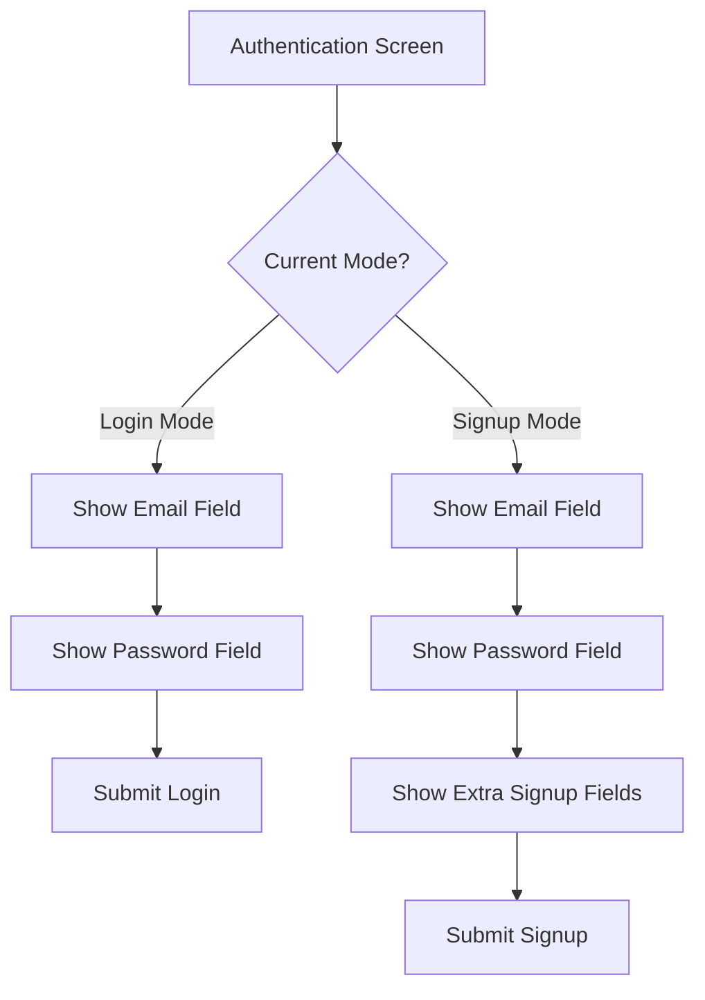
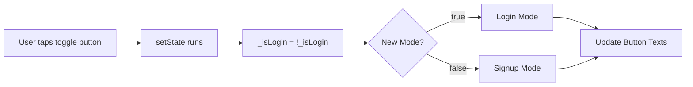
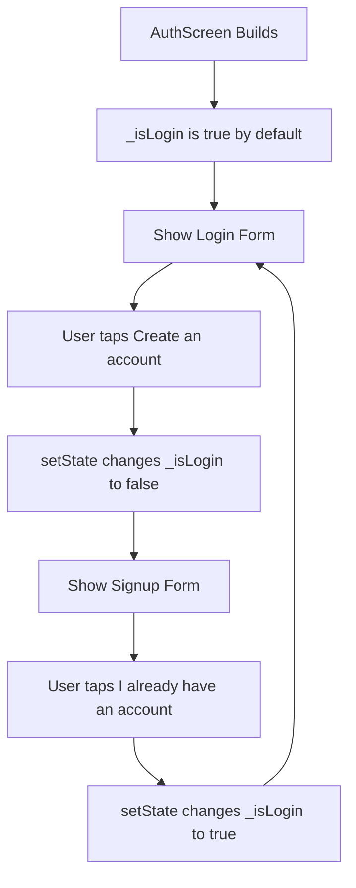
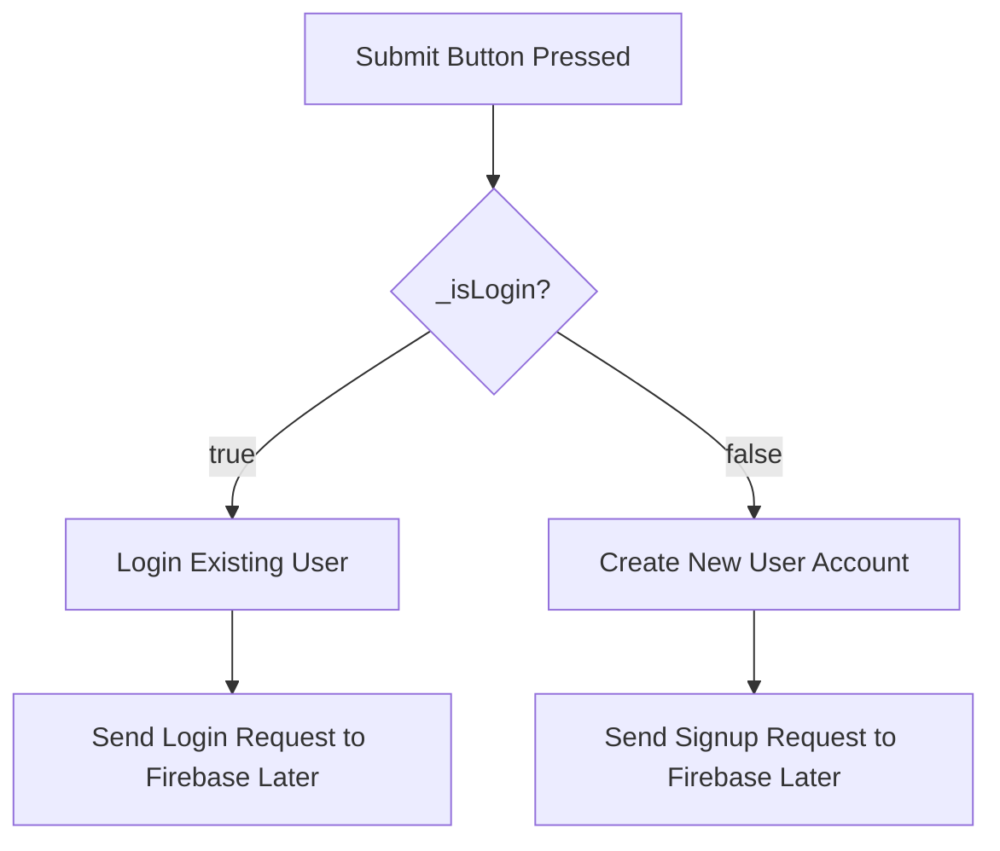

# Adding Buttons and Modes to the Authentication Screen

## Overview

This lecture extends the authentication screen by adding buttons and mode switching logic. Instead of creating two separate screens for login and signup, the app uses one authentication screen that can switch between both modes.

A boolean state variable named `_isLogin` controls whether the form is currently in Login mode or Signup mode. Based on this value, the button labels and visible form fields can change dynamically.

---

## Learning Goals

By the end of this lecture, you will understand how to:

* Add buttons to a Flutter form
* Use `ElevatedButton` for the main submit action
* Use `TextButton` for switching between Login and Signup modes
* Manage authentication mode with a boolean state variable
* Update the UI with `setState()`
* Dynamically change button labels
* Conditionally show extra fields in Signup mode
* Prepare the form for future validation and Firebase authentication logic

---

## Why Use One Screen for Login and Signup?

Instead of creating two separate screens, one for login and one for signup, this app uses a single authentication screen.

This keeps the code simpler and avoids duplication.



---

## Authentication Mode State

A boolean variable is added to the `_AuthScreenState` class.

```dart id="yyuww8"
bool _isLogin = true;
```

This variable controls the current mode:

| `_isLogin` Value | Active Mode |
| ---------------- | ----------- |
| `true`           | Login mode  |
| `false`          | Signup mode |

The app starts in Login mode by default.

---

## Adding a Submit Button

An `ElevatedButton` is used as the primary action button.

The button text changes depending on the current mode.

```dart id="h9sx9i"
ElevatedButton(
  onPressed: _submit,
  style: ElevatedButton.styleFrom(
    backgroundColor: Theme.of(context).colorScheme.primaryContainer,
  ),
  child: Text(_isLogin ? 'Login' : 'Signup'),
),
```

If `_isLogin` is `true`, the button says:

```text id="66gvfl"
Login
```

If `_isLogin` is `false`, the button says:

```text id="vvzwj5"
Signup
```

---

## Adding a Toggle Button

A `TextButton` is added below the submit button.

This button allows the user to switch between Login mode and Signup mode.

```dart id="xas7as"
TextButton(
  onPressed: () {
    setState(() {
      _isLogin = !_isLogin;
    });
  },
  child: Text(
    _isLogin
        ? 'Create an account'
        : 'I already have an account',
  ),
),
```

---

## How the Toggle Works

The expression below switches `_isLogin` to its opposite value:

```dart id="df7eqv"
_isLogin = !_isLogin;
```

If `_isLogin` is currently `true`, it becomes `false`.

If `_isLogin` is currently `false`, it becomes `true`.



---

## Why setState Is Needed

The `_isLogin` value is part of the widget's state.

When the value changes, Flutter must rebuild the widget tree so the UI can update.

That is why the mode switch must happen inside `setState()`.

```dart id="qnvti4"
setState(() {
  _isLogin = !_isLogin;
});
```

Without `setState()`, the value may change internally, but the screen would not visually update.

---

## Adding Space Before Buttons

A `SizedBox` is added between the input fields and the buttons.

```dart id="sb95da"
const SizedBox(height: 12),
```

This creates better visual spacing and prevents the form from looking too crowded.

---

## Conditional Signup Fields

Some fields should only appear when the user is creating a new account.

For example, a username field or image upload field should be shown only in Signup mode.

```dart id="0p59kz"
if (!_isLogin)
  TextFormField(
    decoration: const InputDecoration(
      labelText: 'Username',
    ),
    enableSuggestions: false,
  ),
```

The condition means:

```text id="cbtf49"
If the user is not in Login mode, show the signup-only field.
```

Later, the image upload widget can also be shown only in Signup mode.

---

## Authentication Form Flow



---

## Submit Method

A `_submit()` method is prepared for handling form submission.

```dart id="izs2fs"
void _submit() {
  final isValid = _formKey.currentState!.validate();

  if (!isValid) {
    return;
  }

  _formKey.currentState!.save();

  // TODO: Send authentication data to Firebase.
}
```

At this stage, the method does not connect to Firebase yet.

Later, this method will be responsible for:

* Validating the form
* Saving the entered values
* Sending login requests to Firebase
* Sending signup requests to Firebase
* Showing loading and error states

---

## Complete Example

```dart id="93un5v"
import 'package:flutter/material.dart';

class AuthScreen extends StatefulWidget {
  const AuthScreen({super.key});

  @override
  State<AuthScreen> createState() {
    return _AuthScreenState();
  }
}

class _AuthScreenState extends State<AuthScreen> {
  final _formKey = GlobalKey<FormState>();

  bool _isLogin = true;

  void _submit() {
    final isValid = _formKey.currentState!.validate();

    if (!isValid) {
      return;
    }

    _formKey.currentState!.save();

    // TODO: Connect this form to Firebase Authentication.
  }

  @override
  Widget build(BuildContext context) {
    return Scaffold(
      backgroundColor: Theme.of(context).colorScheme.primary,
      body: Center(
        child: SingleChildScrollView(
          child: Column(
            mainAxisAlignment: MainAxisAlignment.center,
            children: [
              Card(
                margin: const EdgeInsets.all(20),
                child: SingleChildScrollView(
                  child: Padding(
                    padding: const EdgeInsets.all(16),
                    child: Form(
                      key: _formKey,
                      child: Column(
                        mainAxisSize: MainAxisSize.min,
                        children: [
                          if (!_isLogin)
                            TextFormField(
                              decoration: const InputDecoration(
                                labelText: 'Username',
                              ),
                              enableSuggestions: false,
                            ),
                          TextFormField(
                            decoration: const InputDecoration(
                              labelText: 'Email Address',
                            ),
                            keyboardType: TextInputType.emailAddress,
                            autocorrect: false,
                            textCapitalization: TextCapitalization.none,
                          ),
                          TextFormField(
                            decoration: const InputDecoration(
                              labelText: 'Password',
                            ),
                            obscureText: true,
                          ),
                          const SizedBox(height: 12),
                          ElevatedButton(
                            onPressed: _submit,
                            style: ElevatedButton.styleFrom(
                              backgroundColor: Theme.of(context)
                                  .colorScheme
                                  .primaryContainer,
                            ),
                            child: Text(_isLogin ? 'Login' : 'Signup'),
                          ),
                          TextButton(
                            onPressed: () {
                              setState(() {
                                _isLogin = !_isLogin;
                              });
                            },
                            child: Text(
                              _isLogin
                                  ? 'Create an account'
                                  : 'I already have an account',
                            ),
                          ),
                        ],
                      ),
                    ),
                  ),
                ),
              ),
            ],
          ),
        ),
      ),
    );
  }
}
```

---

## Button Behavior

| Current Mode | Main Button Text | Toggle Button Text        |
| ------------ | ---------------- | ------------------------- |
| Login        | Login            | Create an account         |
| Signup       | Signup           | I already have an account |

---

## Styling the ElevatedButton

The submit button is styled directly inside the widget.

```dart id="yqf444"
style: ElevatedButton.styleFrom(
  backgroundColor: Theme.of(context).colorScheme.primaryContainer,
),
```

This uses the app's global theme color scheme while customizing only this specific button.

This is acceptable here because the app only uses an `ElevatedButton` in this specific place.

---

## Why the Button Text Is Dynamic

The same form can perform two different actions:



The UI changes based on the mode, and later the Firebase request will also depend on the same mode.

---

## Current Result

At this point, the authentication screen now includes:

* Email input field
* Password input field
* Optional signup-only field
* Submit button
* Mode toggle button
* Dynamic button labels
* Mode switching with `setState()`

The form still does not validate or submit real data to Firebase yet.

---

## What Is Still Missing?

The screen still needs:

* Input validation
* Saving entered email and password
* Firebase Authentication integration
* Signup logic
* Login logic
* Error handling
* Loading indicator
* Image upload for signup mode

---

## Key Points

* `_isLogin` controls whether the screen is in Login or Signup mode.
* The form starts in Login mode by default.
* `ElevatedButton` is used for the main submit action.
* `TextButton` is used for switching between modes.
* `setState()` rebuilds the UI after changing `_isLogin`.
* Button labels are updated dynamically using ternary expressions.
* Extra fields can be conditionally shown with `if (!_isLogin)`.
* The `_submit()` method is prepared for future validation and Firebase logic.

---

## Notes

Using one screen for both login and signup keeps the code clean and avoids creating two almost identical screens.

The toggle button changes the UI immediately by updating the `_isLogin` state. Later, this same variable will also determine whether the app sends a login request or a signup request to Firebase Authentication.

---

## Summary

This lecture adds buttons and mode switching to the authentication screen. A boolean state variable named `_isLogin` determines whether the form is in Login mode or Signup mode.

The submit button changes between `Login` and `Signup`, while the toggle button allows users to switch modes. This creates a flexible authentication screen that can later be connected to Firebase Authentication.
