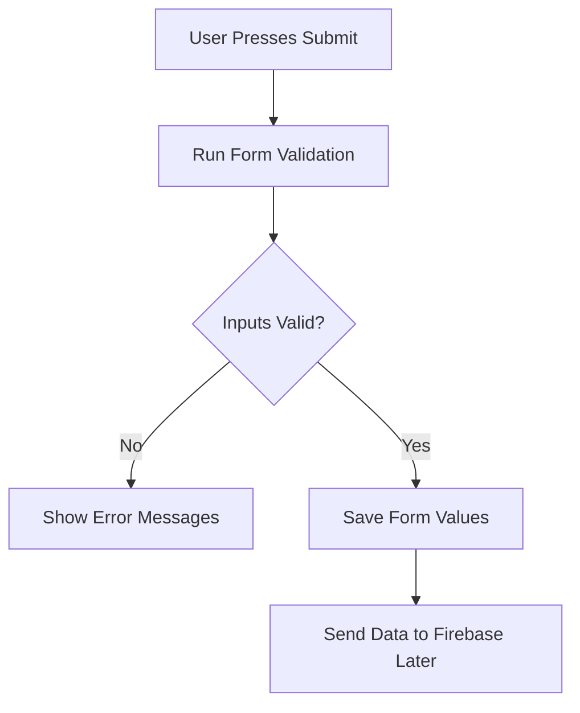
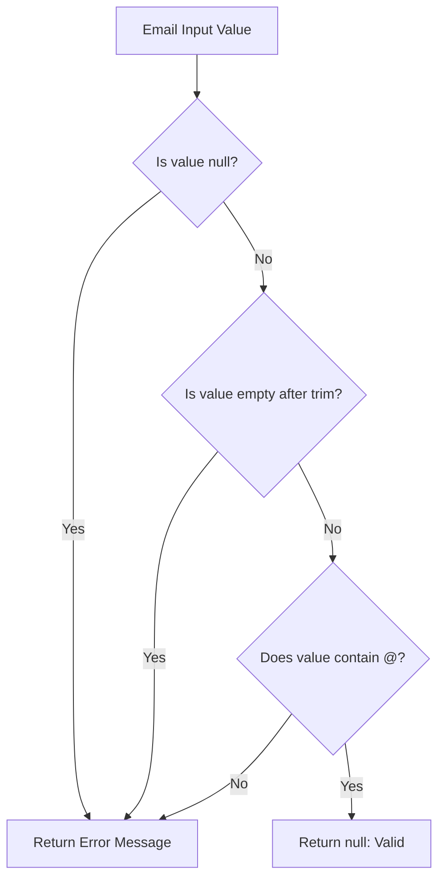
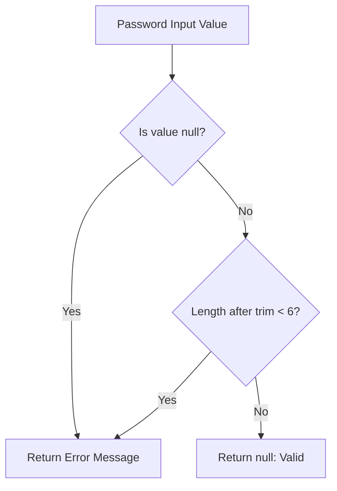
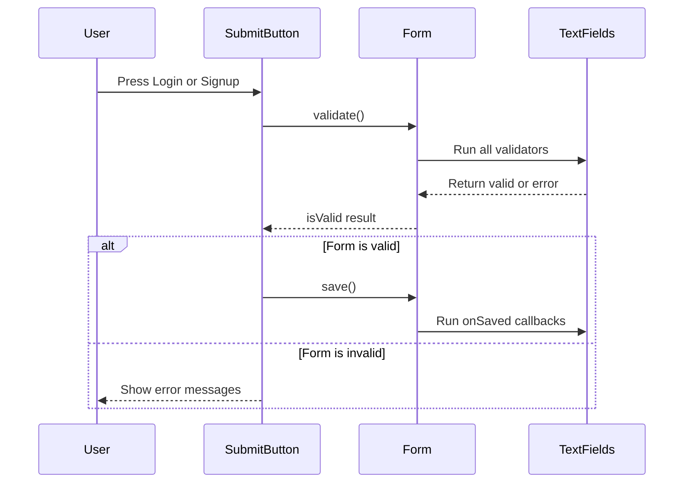

# Validating User Input

## Overview

This lecture adds client-side validation to the authentication form. Before sending user credentials to Firebase, the app should first check whether the entered email and password are valid.

Flutter provides validation support through the `Form` and `TextFormField` widgets. Each input field can define a `validator` function, and the entire form can be validated by calling `validate()` through a `GlobalKey<FormState>`.

---

## Learning Goals

By the end of this lecture, you will understand how to:

* Add validation to `TextFormField`
* Use a `GlobalKey<FormState>` to access the form state
* Trigger all form validators with `validate()`
* Return error messages from validator functions
* Save entered values with `onSaved`
* Store email and password in local state variables
* Prepare validated user input for Firebase Authentication

---

## Why Validate User Input?

Validation ensures that users do not submit incomplete or incorrect data.

For this authentication form, the app should check that:

* The email field is not empty
* The email contains an `@` symbol
* The password is not empty
* The password is at least 6 characters long



---

## Adding a Form Key

To validate and save the form, a `GlobalKey<FormState>` is added to the state class.

```dart id="tg5xrv"
final _form = GlobalKey<FormState>();
```

This key is connected to the `Form` widget.

```dart id="0nkmsu"
Form(
  key: _form,
  child: Column(
    children: [
      // TextFormField widgets
    ],
  ),
)
```

The form key allows the code to access the form state from inside the `_submit()` method.

---

## Storing Entered Values

Two variables are added to store the submitted email and password.

```dart id="kfz360"
var _enteredEmail = '';
var _enteredPassword = '';
```

These variables will be updated when the form is successfully saved.

---

## Email Validation

The email field receives a `validator` callback.

```dart id="a2p8wa"
TextFormField(
  decoration: const InputDecoration(
    labelText: 'Email Address',
  ),
  keyboardType: TextInputType.emailAddress,
  autocorrect: false,
  textCapitalization: TextCapitalization.none,
  validator: (value) {
    if (value == null ||
        value.trim().isEmpty ||
        !value.contains('@')) {
      return 'Please enter a valid email address.';
    }

    return null;
  },
  onSaved: (value) {
    _enteredEmail = value!;
  },
),
```

---

## How the Email Validator Works



The validator returns a string if the input is invalid.

```dart id="qdd6u5"
return 'Please enter a valid email address.';
```

It returns `null` if the input is valid.

```dart id="ptjhrz"
return null;
```

In Flutter forms:

| Validator Return Value | Meaning                           |
| ---------------------- | --------------------------------- |
| `String`               | Invalid input, show error message |
| `null`                 | Valid input                       |

---

## Password Validation

The password field also receives a `validator` callback.

```dart id="qllq0f"
TextFormField(
  decoration: const InputDecoration(
    labelText: 'Password',
  ),
  obscureText: true,
  validator: (value) {
    if (value == null || value.trim().length < 6) {
      return 'Password must be at least 6 characters long.';
    }

    return null;
  },
  onSaved: (value) {
    _enteredPassword = value!;
  },
),
```

The password must be at least 6 characters long because Firebase Authentication also requires a minimum password length.

---

## How the Password Validator Works



---

## The Submit Method

A `_submit()` method is added to trigger validation and save the form.

```dart id="7jt510"
void _submit() {
  final isValid = _form.currentState!.validate();

  if (!isValid) {
    return;
  }

  _form.currentState!.save();

  print(_enteredEmail);
  print(_enteredPassword);

  // TODO: Send the values to Firebase.
}
```

The submit method does three important things:

1. Calls `validate()`
2. Stops if the form is invalid
3. Calls `save()` if all fields are valid

---

## Why Call validate Before save?

You should always validate the form before saving it.



If `save()` is called before validation, invalid values could be stored and later sent to Firebase.

---

## onSaved Callback

The `onSaved` callback is used to extract the entered value from a form field.

```dart id="l8v4hn"
onSaved: (value) {
  _enteredEmail = value!;
},
```

The exclamation mark `!` tells Dart that the value will not be null.

This is safe here because:

* The validator already checks for `null`
* `save()` only runs after validation succeeds

---

## Connecting Submit Button to _submit

The `ElevatedButton` should call `_submit` when pressed.

```dart id="64l8gt"
ElevatedButton(
  onPressed: _submit,
  style: ElevatedButton.styleFrom(
    backgroundColor: Theme.of(context).colorScheme.primaryContainer,
  ),
  child: Text(_isLogin ? 'Login' : 'Signup'),
),
```

Now, when the user presses the button, the form validators run.

---

## Complete Example

```dart id="f3kgjx"
import 'package:flutter/material.dart';

class AuthScreen extends StatefulWidget {
  const AuthScreen({super.key});

  @override
  State<AuthScreen> createState() {
    return _AuthScreenState();
  }
}

class _AuthScreenState extends State<AuthScreen> {
  final _form = GlobalKey<FormState>();

  var _isLogin = true;
  var _enteredEmail = '';
  var _enteredPassword = '';

  void _submit() {
    final isValid = _form.currentState!.validate();

    if (!isValid) {
      return;
    }

    _form.currentState!.save();

    print(_enteredEmail);
    print(_enteredPassword);

    // TODO: Send authentication data to Firebase.
  }

  @override
  Widget build(BuildContext context) {
    return Scaffold(
      backgroundColor: Theme.of(context).colorScheme.primary,
      body: Center(
        child: SingleChildScrollView(
          child: Column(
            mainAxisAlignment: MainAxisAlignment.center,
            children: [
              Card(
                margin: const EdgeInsets.all(20),
                child: SingleChildScrollView(
                  child: Padding(
                    padding: const EdgeInsets.all(16),
                    child: Form(
                      key: _form,
                      child: Column(
                        mainAxisSize: MainAxisSize.min,
                        children: [
                          TextFormField(
                            decoration: const InputDecoration(
                              labelText: 'Email Address',
                            ),
                            keyboardType: TextInputType.emailAddress,
                            autocorrect: false,
                            textCapitalization: TextCapitalization.none,
                            validator: (value) {
                              if (value == null ||
                                  value.trim().isEmpty ||
                                  !value.contains('@')) {
                                return 'Please enter a valid email address.';
                              }

                              return null;
                            },
                            onSaved: (value) {
                              _enteredEmail = value!;
                            },
                          ),
                          TextFormField(
                            decoration: const InputDecoration(
                              labelText: 'Password',
                            ),
                            obscureText: true,
                            validator: (value) {
                              if (value == null ||
                                  value.trim().length < 6) {
                                return 'Password must be at least 6 characters long.';
                              }

                              return null;
                            },
                            onSaved: (value) {
                              _enteredPassword = value!;
                            },
                          ),
                          const SizedBox(height: 12),
                          ElevatedButton(
                            onPressed: _submit,
                            style: ElevatedButton.styleFrom(
                              backgroundColor: Theme.of(context)
                                  .colorScheme
                                  .primaryContainer,
                            ),
                            child: Text(_isLogin ? 'Login' : 'Signup'),
                          ),
                          TextButton(
                            onPressed: () {
                              setState(() {
                                _isLogin = !_isLogin;
                              });
                            },
                            child: Text(
                              _isLogin
                                  ? 'Create an account'
                                  : 'I already have an account',
                            ),
                          ),
                        ],
                      ),
                    ),
                  ),
                ),
              ),
            ],
          ),
        ),
      ),
    );
  }
}
```

---

## Validation Rules

| Field    | Validation Rule                        | Error Message                                  |
| -------- | -------------------------------------- | ---------------------------------------------- |
| Email    | Must not be empty and must contain `@` | `Please enter a valid email address.`          |
| Password | Must be at least 6 characters long     | `Password must be at least 6 characters long.` |

---

## Current Result

At this point, the authentication form can:

* Detect invalid email addresses
* Detect passwords that are too short
* Show error messages below invalid fields
* Save the entered email and password after successful validation
* Print the saved values to the debug console

The form still does not connect to Firebase yet.

---

## What Is Still Missing?

The next steps are:

* Send the entered email and password to Firebase
* Create a new user in Signup mode
* Log in an existing user in Login mode
* Handle Firebase authentication errors
* Show a loading indicator while the request is running
* Navigate to the chat screen after successful authentication

---

## Key Points

* `validator` is used to check whether a field value is valid.
* A validator returns an error string for invalid input.
* A validator returns `null` for valid input.
* `_form.currentState!.validate()` triggers all validators.
* `_form.currentState!.save()` triggers all `onSaved` callbacks.
* `onSaved` is used to store entered values in local variables.
* `save()` should only run after successful validation.
* The collected email and password will later be sent to Firebase Authentication.

---

## Notes

Flutter automatically displays validation error messages below the corresponding `TextFormField`.

The validation used here is intentionally simple. For a production app, email validation could be improved with a dedicated package such as `email_validator`.

For this learning project, checking whether the email contains `@` is enough to demonstrate how form validation works.

---

## Summary

This lecture adds validation and value extraction to the authentication form. Each `TextFormField` now has a `validator` function that checks the entered value and displays an error message if needed.

The `_submit()` method uses the form key to validate the entire form. If all inputs are valid, it saves the entered email and password into local variables. These values are now ready to be sent to Firebase Authentication in the next step.
