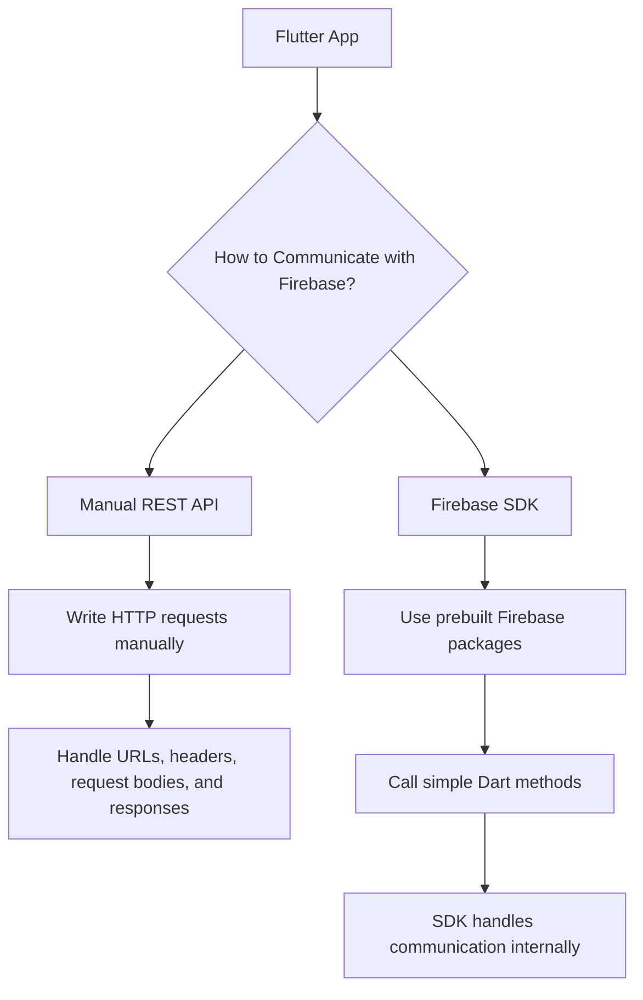
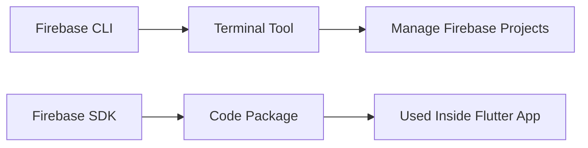
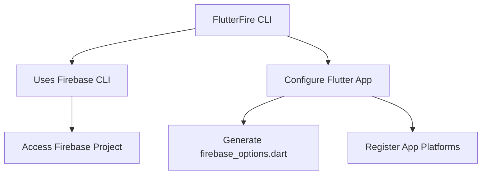
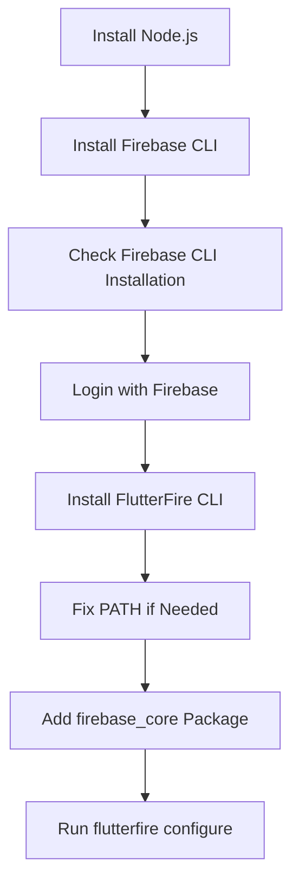
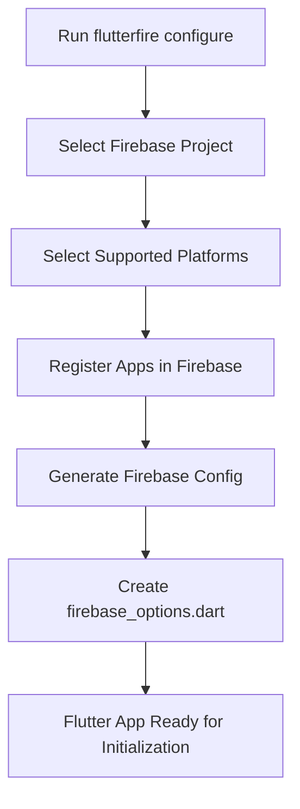
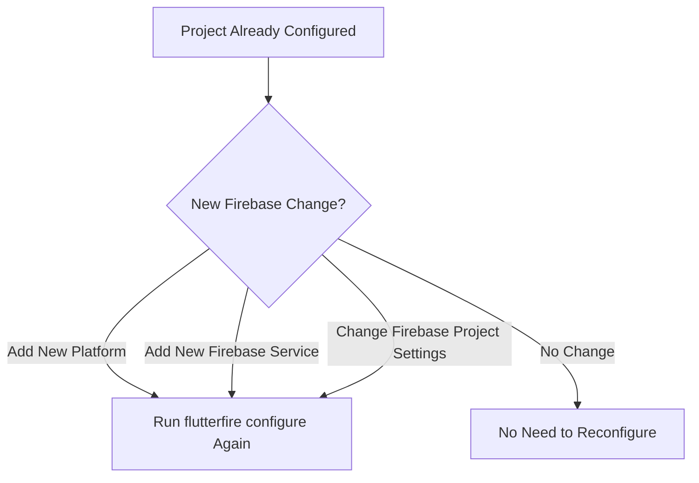

# Firebase CLI and SDK Setup 1 of 2

## Overview

This lecture explains the first part of setting up Firebase in a Flutter project. Before the Flutter app can communicate with Firebase services, several command-line tools must be installed and configured.

The main tools are:

* Firebase CLI
* FlutterFire CLI
* Firebase Core Flutter package

These tools help automate Firebase project configuration and generate the required Firebase setup files for the Flutter app.

---

## Learning Goals

By the end of this lecture, you will understand how to:

* Install the Firebase CLI
* Log in to Firebase from the terminal
* Install the FlutterFire CLI
* Understand the difference between Firebase CLI and Firebase SDK
* Add the first Firebase dependency to a Flutter project
* Prepare the project for Firebase configuration
* Fix common PATH issues when `flutterfire` is not recognized

---

## Why Use the Firebase SDK?

The Flutter app needs to send user credentials, such as email and password, to Firebase Authentication.

Technically, this could be done manually by sending HTTP requests to Firebase's REST API.

However, in this course, the app will use the Firebase SDK instead.

An SDK, or Software Development Kit, is a collection of prebuilt tools and code that makes it easier to work with a service.

---

## REST API vs Firebase SDK



Using the Firebase SDK simplifies the development process because you do not need to manually build and manage every HTTP request.

---

## What Is the Firebase CLI?

The Firebase CLI is a general command-line tool provided by Firebase.

It allows developers to interact with Firebase projects from the terminal.

The Firebase CLI can be used to:

* Log in to Firebase
* Manage Firebase projects
* Configure Firebase services
* Deploy Firebase features
* Support FlutterFire configuration

The Firebase CLI is not the same as the Firebase SDK.



---

## What Is the FlutterFire CLI?

The FlutterFire CLI is a tool specifically designed for Flutter projects that use Firebase.

It helps connect a Flutter app to a Firebase project.

The FlutterFire CLI uses the Firebase CLI under the hood, so both tools are required.



---

## Setup Process Overview



---

## Step 1: Install Node.js

If you want to install the Firebase CLI using `npm`, Node.js must be installed first.

You can check whether Node.js is installed by running:

```bash id="oc06pr"
node --version
```

You can also check npm with:

```bash id="amy4kn"
npm --version
```

If these commands work, you can install the Firebase CLI with npm.

---

## Step 2: Install the Firebase CLI

Install the Firebase CLI globally with npm:

```bash id="rfgoh4"
npm install -g firebase-tools
```

This command installs the Firebase command-line tool on your system.

After installation, confirm that Firebase CLI is available:

```bash id="zhdpiv"
firebase --version
```

You can also run:

```bash id="qnzewr"
firebase
```

If Firebase is installed correctly, the terminal should show Firebase CLI output instead of an error.

---

## Step 3: Log In to Firebase

After installing the Firebase CLI, log in with your Google account:

```bash id="jey6uv"
firebase login
```

This command opens a browser-based login flow or asks you to authenticate with your Google account.

Once login is complete, your terminal can interact with Firebase projects connected to that Google account.

---

## Step 4: Install the FlutterFire CLI

The FlutterFire CLI is installed as a Dart global package.

Run this command from any directory:

```bash id="d46vzj"
dart pub global activate flutterfire_cli
```

After installation, check whether the command is available:

```bash id="v8l412"
flutterfire --version
```

---

## Firebase CLI vs FlutterFire CLI

| Tool            | Purpose                            | Used For                                            |
| --------------- | ---------------------------------- | --------------------------------------------------- |
| Firebase CLI    | General Firebase command-line tool | Logging in, managing Firebase projects, deployments |
| FlutterFire CLI | Flutter-specific Firebase tool     | Configuring Flutter apps to use Firebase            |
| Firebase SDK    | App-level code packages            | Calling Firebase services from Flutter code         |

---

## Step 5: Fix PATH Issues if Needed

Sometimes, after installing the FlutterFire CLI, the terminal may show an error like:

```text id="zzh7f7"
flutterfire: command not found
```

This usually means the Dart global package cache is not added to the system PATH.

On Windows, the path is typically:

```text id="tmpxwz"
%APPDATA%\Pub\Cache\bin
```

On macOS or Linux, the terminal may suggest adding a line to your shell configuration file, such as:

```bash id="vhp2lu"
export PATH="$PATH":"$HOME/.pub-cache/bin"
```

For macOS using Zsh, this is usually added to:

```text id="7s4qbr"
~/.zshrc
```

After updating the PATH, close and reopen the terminal, then run:

```bash id="iuhjdq"
flutterfire --version
```

---

## Step 6: Add Firebase Core to the Flutter Project

The first Firebase package that must be added to a Flutter app is `firebase_core`.

Run this command inside the Flutter project directory:

```bash id="0jkeub"
flutter pub add firebase_core
```

`firebase_core` is required because it initializes Firebase in the Flutter app.

Other Firebase packages, such as Authentication, Firestore, Storage, and Messaging, depend on Firebase Core.

---

## Step 7: Run FlutterFire Configure

Inside the Flutter project directory, run:

```bash id="i8ra38"
flutterfire configure
```

This command starts the Firebase configuration process for the Flutter app.

It can:

* Connect the Flutter app to a Firebase project
* Register Android, iOS, web, or other app platforms
* Generate the Firebase configuration file
* Keep platform-specific Firebase settings up to date
* Create or update `firebase_options.dart`

---

## What flutterfire configure Does



---

## When Should You Run flutterfire configure Again?

You should run `flutterfire configure` again when:

* You add support for a new platform
* You start using a new Firebase product
* You add Firebase Authentication
* You add Cloud Firestore
* You add Cloud Messaging
* You add Crashlytics or Performance Monitoring
* Your Firebase configuration changes



---

## Firebase Initialization Preview

After configuration, Firebase will later be initialized inside `main.dart`.

The app will import Firebase Core and the generated options file:

```dart id="pm4q5h"
import 'package:firebase_core/firebase_core.dart';
import 'firebase_options.dart';
```

Then Firebase will be initialized before running the app:

```dart id="6xkmp8"
void main() async {
  WidgetsFlutterBinding.ensureInitialized();

  await Firebase.initializeApp(
    options: DefaultFirebaseOptions.currentPlatform,
  );

  runApp(const App());
}
```

This initialization step will be completed in the next setup lecture.

---

## Command Summary

| Step                    | Command                                    |
| ----------------------- | ------------------------------------------ |
| Check Node.js           | `node --version`                           |
| Check npm               | `npm --version`                            |
| Install Firebase CLI    | `npm install -g firebase-tools`            |
| Check Firebase CLI      | `firebase --version`                       |
| Log in to Firebase      | `firebase login`                           |
| Install FlutterFire CLI | `dart pub global activate flutterfire_cli` |
| Check FlutterFire CLI   | `flutterfire --version`                    |
| Add Firebase Core       | `flutter pub add firebase_core`            |
| Configure Flutter app   | `flutterfire configure`                    |

---

## Common Problems

### Problem: Firebase CLI Not Found

If this command fails:

```bash id="nqpak4"
firebase --version
```

Then Firebase CLI may not be installed correctly, or npm's global path may not be available.

Possible fixes:

* Reinstall Firebase CLI
* Restart the terminal
* Check Node.js and npm installation
* Make sure npm global packages are available in PATH

---

### Problem: FlutterFire Command Not Found

If this command fails:

```bash id="o6l6dw"
flutterfire --version
```

Then the Dart global pub cache path may not be in PATH.

Possible fixes:

* Run the FlutterFire activation command again
* Read the warning shown in the terminal
* Add the suggested Dart pub cache path to PATH
* Restart the terminal

---

## Why This Setup Is Needed Only Once Per Machine

The Firebase CLI and FlutterFire CLI are installed globally on your development machine.

This means you only need to install them once.

After that, they can be reused across multiple Flutter projects.

However, each new Flutter project still needs to run:

```bash id="kdtcnb"
flutterfire configure
```

because each project needs its own Firebase configuration.

---

## Key Points

* Firebase can be accessed manually through REST APIs, but this course uses the Firebase SDK.
* The Firebase SDK simplifies communication with Firebase services.
* The Firebase CLI is a general Firebase terminal tool.
* The FlutterFire CLI is specifically used for Flutter Firebase setup.
* The FlutterFire CLI depends on the Firebase CLI.
* `firebase login` connects the CLI to your Google account.
* `firebase_core` is the first Firebase package needed in a Flutter project.
* `flutterfire configure` connects the Flutter app to Firebase and generates configuration files.
* PATH issues may prevent `flutterfire` from being recognized until the Dart pub cache bin directory is added.

---

## Notes

This setup process may feel long because several tools are involved. However, most of these steps only need to be completed once on your system.

For future Flutter projects, you usually only need to:

```bash id="8w6eof"
flutter pub add firebase_core
flutterfire configure
```

Then you can initialize Firebase and add the specific Firebase packages needed by your app.

---

## Summary

This lecture covers the first part of connecting Firebase to a Flutter app. Instead of sending HTTP requests manually to Firebase's REST API, the app will use the Firebase SDK.

To prepare for that, you install the Firebase CLI, log in with your Google account, install the FlutterFire CLI, add the `firebase_core` package, and prepare to run `flutterfire configure`.

These tools automate much of the setup process and make it easier to connect Flutter apps to Firebase services such as Authentication, Firestore, Storage, and Cloud Messaging.
