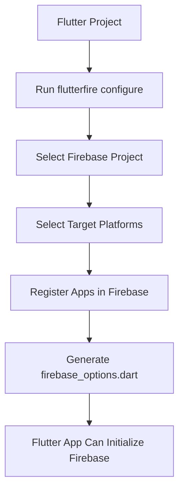
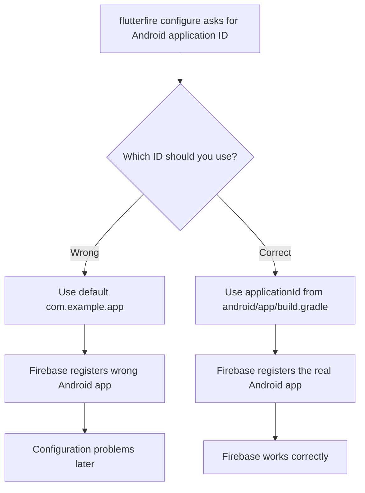
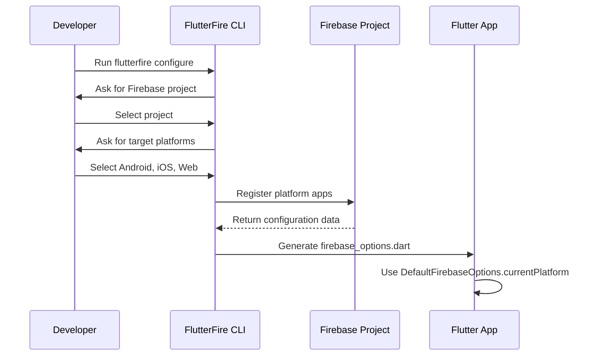
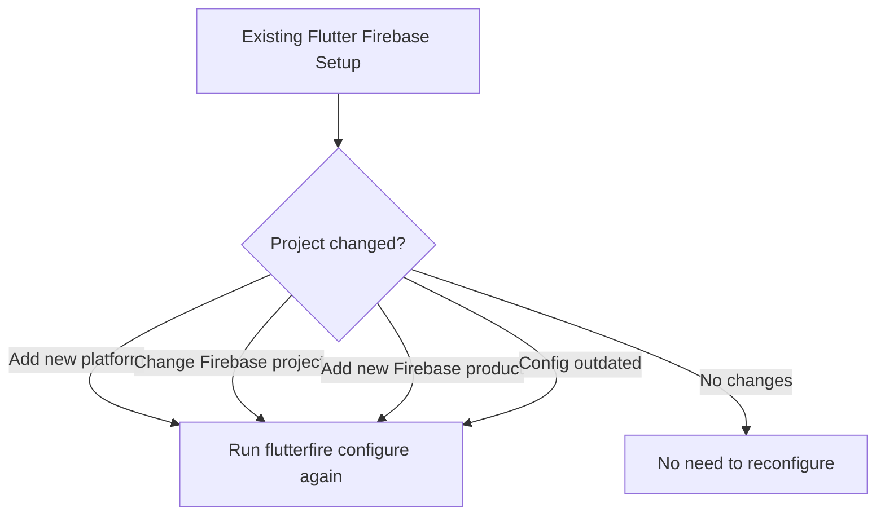

# FlutterFire Configuration

## Overview

This lecture explains how to connect a Flutter project to a Firebase project by running the `flutterfire configure` command.

The FlutterFire CLI automatically registers the Flutter app with Firebase and generates the required configuration files. This setup allows the Flutter app to use Firebase services such as Authentication, Cloud Firestore, Firebase Storage, and Cloud Messaging.

One important detail in this setup is the Android application ID. When the CLI asks for the Android application ID, you should not blindly use the default value. Instead, you should use the actual package name from your Flutter project.

---

## Learning Goals

By the end of this lecture, you will understand how to:

* Run `flutterfire configure` inside a Flutter project
* Select the correct Firebase project
* Choose the target platforms for the Flutter app
* Register the Flutter app with Firebase
* Generate the `firebase_options.dart` file
* Understand why the Android application ID matters
* Know when to re-run `flutterfire configure`

---

## What Is FlutterFire Configuration?

FlutterFire configuration is the process of connecting a Flutter app to Firebase.

This process links:

* Your Flutter project
* Your Firebase project
* Your target platforms such as Android, iOS, and web
* Firebase configuration files required by the app



---

## Running flutterfire configure

The command must be executed from the root directory of the Flutter project.

```bash id="hp9kz4"
flutterfire configure
```

The FlutterFire CLI will guide you through a setup process.

It may ask you to:

* Select a Firebase project
* Choose which platforms to configure
* Confirm or enter Android app information
* Generate Firebase configuration files

---

## Important: Android Application ID

When running `flutterfire configure`, the CLI may ask for an Android application ID.

You should not use the default value:

```text id="9qgz0h"
com.example.app
```

Instead, use the actual application ID from your Flutter project.

You can find it in:

```text id="h9fd4c"
android/app/build.gradle
```

Look for the `applicationId` value.

Example:

```gradle id="541dmp"
android {
    defaultConfig {
        applicationId "com.example.chat_app"
    }
}
```

In this case, the Android application ID should be:

```text id="y7xgs4"
com.example.chat_app
```

---

## Why the Android Application ID Matters

Firebase uses the Android application ID to identify your Android app.

If you register the wrong application ID, Firebase may not properly connect to your Flutter Android app.



---

## Where to Find the Android Application ID

Open this file:

```text id="fmjzao"
android/app/build.gradle
```

Then find:

```gradle id="1cy3t5"
applicationId "your.package.name"
```

That value is the one you should provide when FlutterFire asks for the Android application ID.

---

## Generated firebase_options.dart File

After the configuration process completes, FlutterFire generates a file in the `lib/` folder.

```text id="6fbaaq"
lib/
└── firebase_options.dart
```

This file contains platform-specific Firebase configuration values.

It usually includes:

* API key
* App ID
* Messaging sender ID
* Project ID
* Storage bucket
* Platform-specific Firebase options

---

## Example firebase_options.dart

```dart id="0jp4w8"
import 'package:firebase_core/firebase_core.dart' show FirebaseOptions;
import 'package:flutter/foundation.dart'
    show defaultTargetPlatform, kIsWeb, TargetPlatform;

class DefaultFirebaseOptions {
  static FirebaseOptions get currentPlatform {
    if (kIsWeb) {
      return web;
    }

    switch (defaultTargetPlatform) {
      case TargetPlatform.android:
        return android;
      case TargetPlatform.iOS:
        return ios;
      default:
        throw UnsupportedError(
          'DefaultFirebaseOptions are not configured for this platform.',
        );
    }
  }

  static const FirebaseOptions android = FirebaseOptions(
    apiKey: 'YOUR_ANDROID_API_KEY',
    appId: 'YOUR_ANDROID_APP_ID',
    messagingSenderId: 'YOUR_MESSAGING_SENDER_ID',
    projectId: 'YOUR_PROJECT_ID',
    storageBucket: 'YOUR_PROJECT_ID.appspot.com',
  );

  static const FirebaseOptions ios = FirebaseOptions(
    apiKey: 'YOUR_IOS_API_KEY',
    appId: 'YOUR_IOS_APP_ID',
    messagingSenderId: 'YOUR_MESSAGING_SENDER_ID',
    projectId: 'YOUR_PROJECT_ID',
    storageBucket: 'YOUR_PROJECT_ID.appspot.com',
    iosBundleId: 'YOUR_IOS_BUNDLE_ID',
  );

  static const FirebaseOptions web = FirebaseOptions(
    apiKey: 'YOUR_WEB_API_KEY',
    appId: 'YOUR_WEB_APP_ID',
    messagingSenderId: 'YOUR_MESSAGING_SENDER_ID',
    projectId: 'YOUR_PROJECT_ID',
    authDomain: 'YOUR_PROJECT_ID.firebaseapp.com',
    storageBucket: 'YOUR_PROJECT_ID.appspot.com',
  );
}
```

---

## How firebase_options.dart Is Used

The generated file exports `DefaultFirebaseOptions`.

This object is used when initializing Firebase inside `main.dart`.

```dart id="lv8lry"
import 'package:firebase_core/firebase_core.dart';
import 'firebase_options.dart';
```

Then Firebase can be initialized like this:

```dart id="l9e9ez"
void main() async {
  WidgetsFlutterBinding.ensureInitialized();

  await Firebase.initializeApp(
    options: DefaultFirebaseOptions.currentPlatform,
  );

  runApp(const App());
}
```

---

## Firebase Configuration Flow



---

## Platform-Specific Configuration

FlutterFire can configure multiple platforms from one command.

| Platform | Configuration Result                                |
| -------- | --------------------------------------------------- |
| Android  | Registers Android app and configures Gradle files   |
| iOS      | Registers iOS app and configures iOS Firebase files |
| Web      | Registers web app and adds web Firebase options     |
| macOS    | Registers macOS app if selected                     |

---

## Files Modified or Generated

Running `flutterfire configure` can create or update several files.

Common examples include:

```text id="nwed90"
lib/firebase_options.dart
android/build.gradle
android/app/build.gradle
ios/Runner/GoogleService-Info.plist
```

You usually do not need to manually download `google-services.json` when using the FlutterFire CLI approach.

---

## Do Not Manually Edit firebase_options.dart

The `firebase_options.dart` file is auto-generated.

You should generally not edit it manually because it can be overwritten the next time you run:

```bash id="qsvg8q"
flutterfire configure
```

If your Firebase setup changes, re-run the command instead of manually changing this file.

---

## Should firebase_options.dart Be Committed?

In many Flutter projects, `firebase_options.dart` is committed to version control so the project can build correctly on other machines.

However, treat the file carefully because it contains Firebase project identifiers and API keys.

For public repositories, make sure your Firebase security rules and authentication settings are properly configured.

---

## When to Re-run flutterfire configure

You should run `flutterfire configure` again when:

* You add a new platform, such as iOS, Android, or web
* You connect to a different Firebase project
* You start using a new Firebase service
* Firebase project settings change
* Generated configuration files become outdated



---

## Common Mistake: Using the Wrong Android ID

A common mistake is accepting the default Android application ID.

Wrong example:

```text id="t3i74c"
com.example.app
```

Correct approach:

```text id="ub2zvg"
Use the applicationId from android/app/build.gradle
```

If your real app package is:

```text id="h34g8g"
com.mycompany.flutterchat
```

Then that is the ID you should provide to Firebase.

---

## Command Summary

| Step                  | Command or File               |
| --------------------- | ----------------------------- |
| Run FlutterFire setup | `flutterfire configure`       |
| Find Android app ID   | `android/app/build.gradle`    |
| Generated config file | `lib/firebase_options.dart`   |
| Initialize Firebase   | `Firebase.initializeApp(...)` |

---

## Key Points

* `flutterfire configure` connects a Flutter app to a Firebase project.
* The command should be run from the Flutter project root directory.
* The CLI asks which Firebase project and platforms should be used.
* The command generates `lib/firebase_options.dart`.
* `firebase_options.dart` contains platform-specific Firebase settings.
* The generated `DefaultFirebaseOptions.currentPlatform` object is used in `main.dart`.
* The Android application ID must match the `applicationId` in `android/app/build.gradle`.
* Do not use the default `com.example.app` unless it is actually your app's real package name.
* Re-run `flutterfire configure` whenever your Firebase platform setup changes.

---

## Notes

The FlutterFire CLI greatly simplifies Firebase setup for Flutter apps. Instead of manually registering each app platform and downloading configuration files, the CLI handles most of this process automatically.

The most important thing to watch out for during setup is the Android application ID. Always copy the real `applicationId` from `android/app/build.gradle` instead of using the default value suggested by the CLI.

---

## Summary

This lecture covers the FlutterFire configuration process. By running `flutterfire configure`, the Flutter app is registered with the selected Firebase project, target platforms are configured, and the `firebase_options.dart` file is generated.

This file provides the configuration data needed to initialize Firebase in `main.dart`. Once this step is complete, the Flutter app is ready for Firebase initialization and later Firebase service integration.
