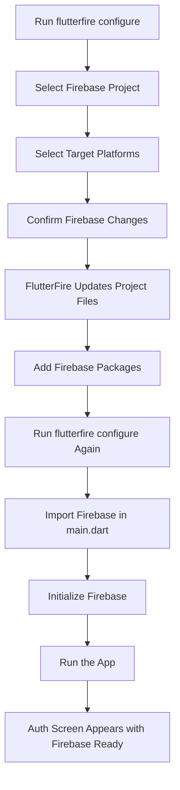
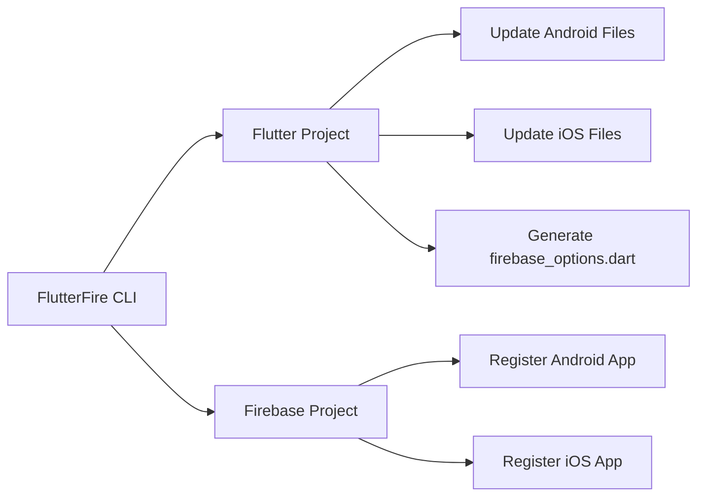
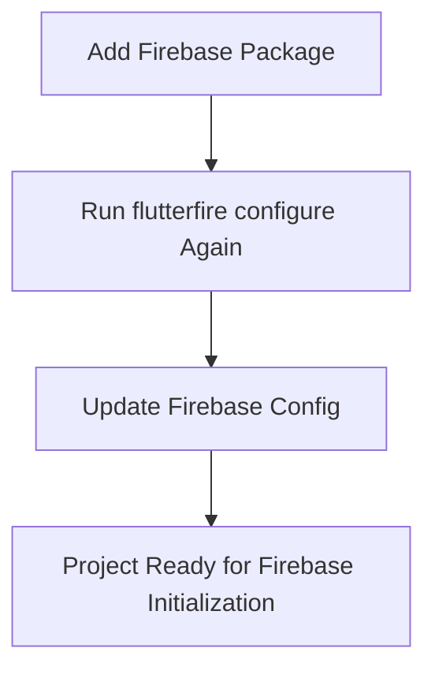
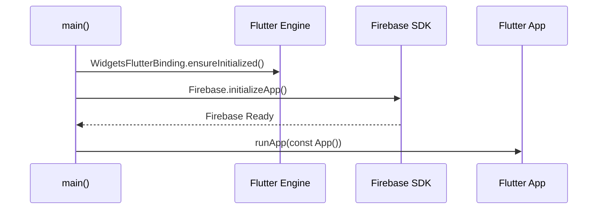
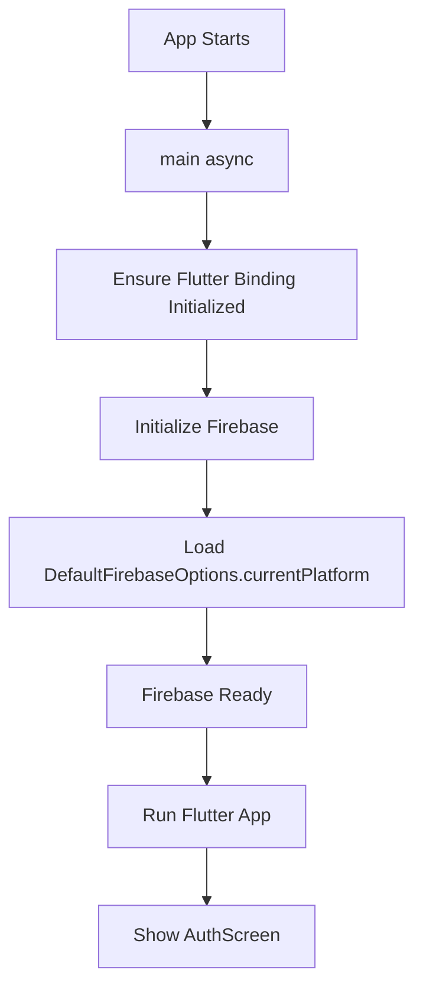
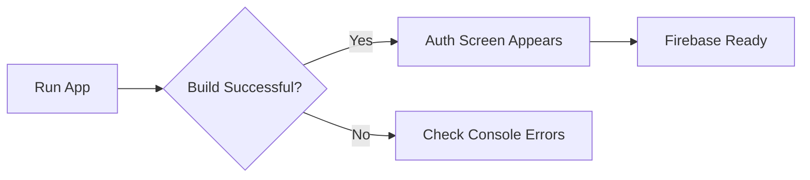
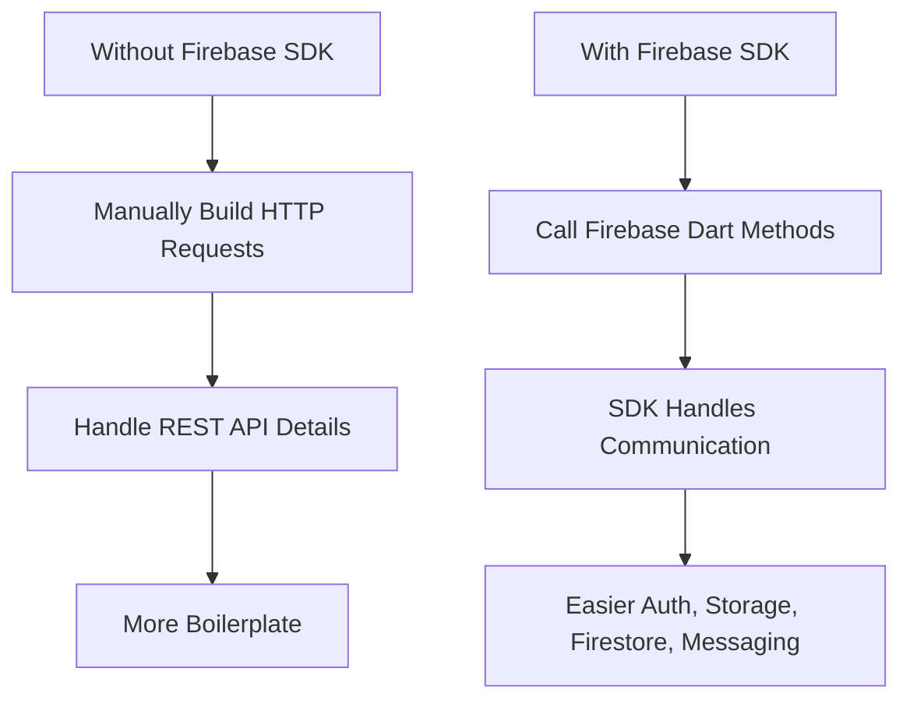

# Firebase CLI and SDK Setup 2 of 2

## Overview

This lecture completes the Firebase setup process for the Flutter chat app. After running `flutterfire configure`, the Flutter project is connected to the selected Firebase project and platform-specific configuration files are generated.

The next step is to add the required Firebase packages, initialize Firebase inside `main.dart`, and verify that the app still runs correctly.

Once Firebase is initialized successfully, the app is ready to use Firebase services such as Authentication, Firestore, Storage, and Cloud Messaging.

---

## Learning Goals

By the end of this lecture, you will understand how to:

* Select a Firebase project during `flutterfire configure`
* Choose target platforms such as Android and iOS
* Add Firebase packages to a Flutter project
* Re-run `flutterfire configure` after adding Firebase packages
* Import Firebase Core and the generated Firebase options file
* Initialize Firebase before `runApp()`
* Fix common startup issues with `WidgetsFlutterBinding.ensureInitialized()`
* Confirm that the Flutter app runs with Firebase connected

---

## Setup Flow



---

## Selecting the Firebase Project

When running:

```bash
flutterfire configure
```

The CLI asks which Firebase project should be connected to the Flutter app.

Choose the Firebase project that was created earlier, for example:

```text
flutter-chat-app
```

This connects the local Flutter project to the Firebase backend project.

---

## Selecting Target Platforms

The FlutterFire CLI also asks which platforms should be configured.

For this course project, only Android and iOS are selected.

Example platform selection:

```text
[✓] android
[✓] ios
[ ] macos
[ ] web
```

You can select or unselect platforms by using the keyboard and pressing space.

---

## What FlutterFire Changes

After confirmation, the FlutterFire CLI updates both the local Flutter project and the Firebase project.

It may update:

* Android configuration files
* iOS configuration files
* Firebase app registration settings
* The generated `firebase_options.dart` file



---

## Adding Firebase Packages

After the general Firebase configuration is done, specific Firebase SDK packages must be added.

The first package is `firebase_core`.

```bash
flutter pub add firebase_core
```

This package is required to initialize Firebase in the Flutter app.

For authentication, add:

```bash
flutter pub add firebase_auth
```

`firebase_auth` provides the Firebase Authentication API for Flutter.

---

## Package Purpose

| Package         | Purpose                                                        |
| --------------- | -------------------------------------------------------------- |
| `firebase_core` | Initializes Firebase and connects the app to Firebase services |
| `firebase_auth` | Provides authentication features such as signup and login      |

---

## Re-running flutterfire configure

After adding Firebase packages, it is recommended to run:

```bash
flutterfire configure
```

again.

This ensures the Firebase configuration is up to date for the packages and platforms used by the project.



---

## Generated firebase_options.dart

The `flutterfire configure` command automatically generates this file:

```text
lib/firebase_options.dart
```

This file contains platform-specific Firebase configuration.

It exports:

```dart
DefaultFirebaseOptions.currentPlatform
```

This object is used when initializing Firebase in `main.dart`.

You should not manually edit `firebase_options.dart` unless you clearly know what you are doing, because it is generated by the FlutterFire CLI.

---

## Updating main.dart

To initialize Firebase, import Firebase Core and the generated Firebase options file.

```dart
import 'package:firebase_core/firebase_core.dart';
import 'package:flutter/material.dart';

import 'firebase_options.dart';
```

Then update the `main()` function.

Because Firebase initialization is asynchronous, `main()` must become `async`.

```dart
void main() async {
  WidgetsFlutterBinding.ensureInitialized();

  await Firebase.initializeApp(
    options: DefaultFirebaseOptions.currentPlatform,
  );

  runApp(const App());
}
```

---

## Why main Must Be async

Firebase initialization returns a `Future`.

That means the app must wait until Firebase is fully initialized before building the widget tree.



---

## Why WidgetsFlutterBinding.ensureInitialized Is Required

Before calling asynchronous platform code in `main()`, Flutter needs to make sure the widget binding is initialized.

This line does that:

```dart
WidgetsFlutterBinding.ensureInitialized();
```

Without it, the app may throw a runtime error or get stuck during startup.

---

## Complete main.dart Example

```dart
import 'package:firebase_core/firebase_core.dart';
import 'package:flutter/material.dart';

import 'firebase_options.dart';
import 'package:chat_app/screens/auth.dart';

void main() async {
  WidgetsFlutterBinding.ensureInitialized();

  await Firebase.initializeApp(
    options: DefaultFirebaseOptions.currentPlatform,
  );

  runApp(const App());
}

class App extends StatelessWidget {
  const App({super.key});

  @override
  Widget build(BuildContext context) {
    return MaterialApp(
      title: 'FlutterChat',
      theme: ThemeData().copyWith(
        useMaterial3: true,
        colorScheme: ColorScheme.fromSeed(
          seedColor: const Color.fromARGB(255, 63, 17, 177),
        ),
      ),
      home: const AuthScreen(),
    );
  }
}
```

---

## Firebase Initialization Flow



---

## Running the App

After setup, stop the currently running app and restart it from scratch.

Use:

```bash
flutter run
```

The first build after adding Firebase may take longer than usual because the Android and iOS projects need to compile with the newly added Firebase SDK dependencies.

This is normal.

---

## Expected Result

If everything is configured correctly:

* The app should build successfully
* No Firebase initialization errors should appear in the console
* The authentication screen should appear as before
* Firebase should now be available inside the app



---

## Common Issue: App Stuck on Startup

If the app gets stuck or throws a binding-related error, make sure this line appears before `Firebase.initializeApp()`:

```dart
WidgetsFlutterBinding.ensureInitialized();
```

Correct order:

```dart
void main() async {
  WidgetsFlutterBinding.ensureInitialized();

  await Firebase.initializeApp(
    options: DefaultFirebaseOptions.currentPlatform,
  );

  runApp(const App());
}
```

---

## Why Use Firebase SDK Instead of Manual HTTP Requests?

At first, setting up Firebase may feel more complicated than manually sending HTTP requests.

However, once the SDK is configured, using Firebase services becomes much easier.

Instead of manually handling:

* Authentication endpoints
* Request URLs
* Headers
* JSON request bodies
* Response parsing
* Platform-specific setup

You can use Firebase packages directly from Dart code.



---

## Firebase Services Coming Next

Now that Firebase is connected, the project can start using Firebase features.

Upcoming features include:

* User signup
* User login
* Firebase Authentication
* Image upload
* Firebase Storage
* Cloud Firestore chat messages
* Push notifications with Firebase Cloud Messaging

---

## Command Summary

| Task                       | Command                         |
| -------------------------- | ------------------------------- |
| Configure Firebase project | `flutterfire configure`         |
| Add Firebase Core          | `flutter pub add firebase_core` |
| Add Firebase Auth          | `flutter pub add firebase_auth` |
| Reconfigure after packages | `flutterfire configure`         |
| Run the app                | `flutter run`                   |

---

## Key Points

* `flutterfire configure` connects the Flutter project to the Firebase project.
* Android and iOS are selected as the target platforms in this app.
* FlutterFire updates local project files and Firebase project settings.
* `firebase_core` is required for Firebase initialization.
* `firebase_auth` is required for Firebase Authentication.
* `main()` must be marked `async`.
* `WidgetsFlutterBinding.ensureInitialized()` must be called before Firebase initialization.
* `Firebase.initializeApp()` must be awaited before `runApp()`.
* `DefaultFirebaseOptions.currentPlatform` comes from the generated `firebase_options.dart` file.
* After successful setup, the app should show the same authentication screen, but now Firebase is connected.

---

## Notes

The initial Firebase setup takes some time because multiple tools, configuration files, and platform-specific changes are involved.

However, after this setup is complete, using Firebase features becomes much easier. Authentication, image upload, database storage, and push notifications can all be added through Firebase SDK packages instead of manually working with REST APIs.

---

## Summary

This lecture completes the Firebase SDK setup for the Flutter chat app. After selecting the Firebase project and target platforms with `flutterfire configure`, the app adds `firebase_core` and `firebase_auth`.

Firebase is then initialized in `main.dart` by calling `Firebase.initializeApp()` with `DefaultFirebaseOptions.currentPlatform`. Once the app builds and shows the authentication screen without Firebase-related errors, Firebase is successfully connected and ready to use.
