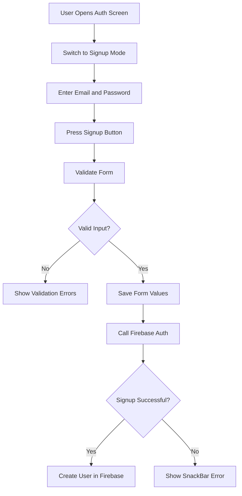
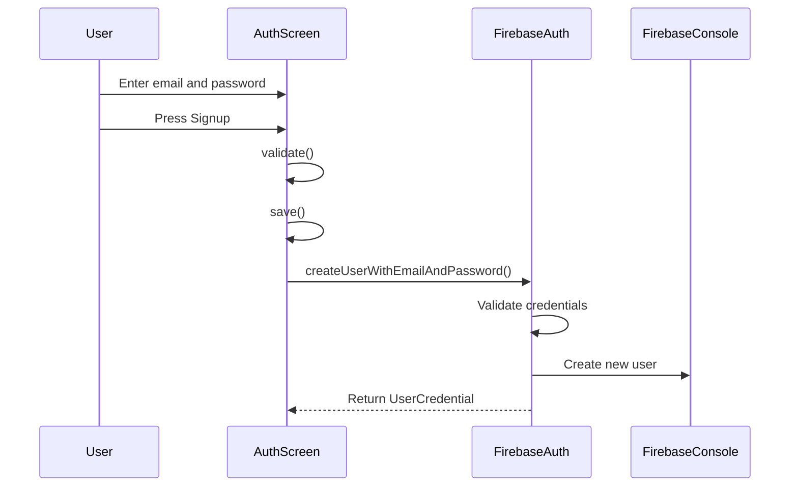
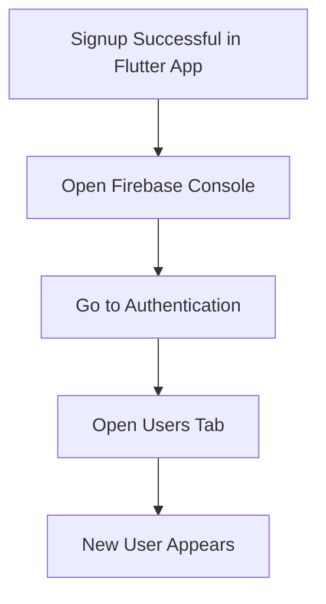
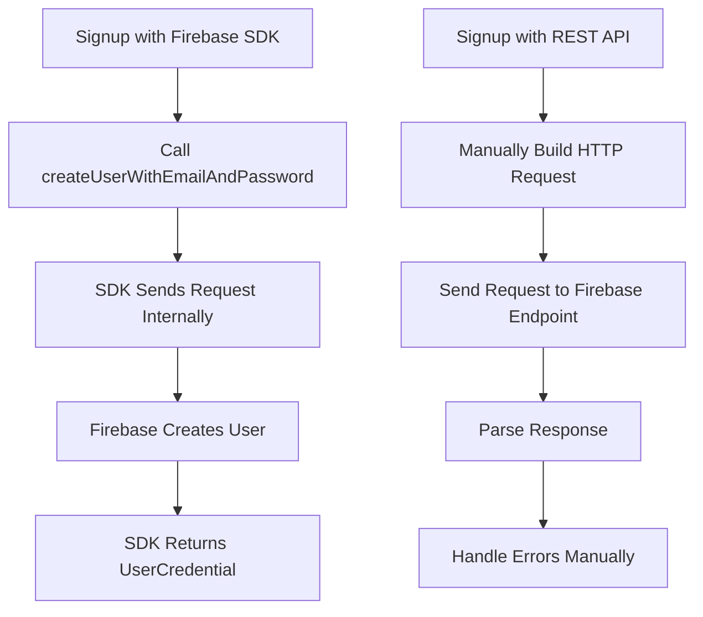

# Signing Users Up

## Overview

This lecture connects the authentication form to Firebase Authentication so users can create new accounts.

After setting up Firebase and validating the form input, the app can now send the entered email and password to Firebase. This is done with the `createUserWithEmailAndPassword()` method from the `firebase_auth` package.

At this stage, only signup is implemented. Login logic will be added later.

---

## Learning Goals

By the end of this lecture, you will understand how to:

* Add and use the `firebase_auth` package
* Access Firebase Authentication through `FirebaseAuth.instance`
* Create a new user with email and password
* Use `async` and `await` when calling Firebase methods
* Handle Firebase authentication errors with `try-catch`
* Display error messages with `SnackBar`
* Verify newly created users in the Firebase Console

---

## Authentication Flow



---

## Adding firebase_auth

To use Firebase Authentication, add the `firebase_auth` package to the project.

```bash id="b2sx7k"
flutter pub add firebase_auth
```

Then make sure dependencies are installed:

```bash id="h1sx5v"
flutter pub get
```

The package is imported inside the authentication screen file.

```dart id="7yb87p"
import 'package:firebase_auth/firebase_auth.dart';
```

---

## Creating a FirebaseAuth Instance

Inside `auth.dart`, create a Firebase Authentication instance.

```dart id="p6zvgw"
final _firebase = FirebaseAuth.instance;
```

This gives access to Firebase Authentication methods such as:

* `createUserWithEmailAndPassword`
* `signInWithEmailAndPassword`
* `signOut`
* `authStateChanges`

The instance can be reused throughout the authentication screen.

---

## Signup Method

To create a new user, call:

```dart id="yu8dix"
await _firebase.createUserWithEmailAndPassword(
  email: _enteredEmail,
  password: _enteredPassword,
);
```

This sends the email and password to Firebase Authentication.

If the signup succeeds, Firebase creates a new user account.

If the signup fails, Firebase throws a `FirebaseAuthException`.

---

## Firebase Signup Sequence



---

## Updating the Submit Method

The `_submit()` method now checks whether the form is in Login mode or Signup mode.

Since login is not implemented yet, the signup logic is added inside the `else` branch.

```dart id="97l5ft"
void _submit() async {
  final isValid = _form.currentState!.validate();

  if (!isValid) {
    return;
  }

  _form.currentState!.save();

  if (_isLogin) {
    // TODO: Log users in.
  } else {
    final userCredentials = await _firebase.createUserWithEmailAndPassword(
      email: _enteredEmail,
      password: _enteredPassword,
    );

    print(userCredentials);
  }
}
```

---

## Why Use async and await?

The Firebase signup method returns a `Future`.

That means the app must wait for Firebase to finish creating the user.

```dart id="ghrw3h"
void _submit() async {
  final userCredentials = await _firebase.createUserWithEmailAndPassword(
    email: _enteredEmail,
    password: _enteredPassword,
  );
}
```

Without `await`, the app would continue running before Firebase finishes the signup request.

---

## Handling Firebase Errors

Creating a user can fail.

Examples:

* The email is already in use
* The email address is invalid
* The password is too weak
* Firebase Authentication is not enabled
* The device has no network connection

Therefore, the Firebase call should be wrapped in a `try-catch` block.

```dart id="dte219"
try {
  final userCredentials = await _firebase.createUserWithEmailAndPassword(
    email: _enteredEmail,
    password: _enteredPassword,
  );

  print(userCredentials);
} on FirebaseAuthException catch (error) {
  ScaffoldMessenger.of(context).clearSnackBars();
  ScaffoldMessenger.of(context).showSnackBar(
    SnackBar(
      content: Text(error.message ?? 'Authentication failed.'),
    ),
  );
}
```

---

## FirebaseAuthException

`FirebaseAuthException` is a specific error type thrown by Firebase Authentication.

It can contain:

| Property  | Meaning                      |
| --------- | ---------------------------- |
| `code`    | Machine-readable error code  |
| `message` | Human-readable error message |

Example error code:

```text id="a04e58"
email-already-in-use
```

In this lecture, the app does not handle every error code individually. Instead, it displays the Firebase error message directly.

---

## Showing Error Messages with SnackBar

A `SnackBar` is used to show authentication errors to the user.

```dart id="xzqbfo"
ScaffoldMessenger.of(context).clearSnackBars();

ScaffoldMessenger.of(context).showSnackBar(
  SnackBar(
    content: Text(error.message ?? 'Authentication failed.'),
  ),
);
```

First, existing snack bars are cleared.

Then, a new snack bar is shown with either:

* Firebase's error message
* A fallback message

---

## Complete Signup Example

```dart id="o4s9g5"
import 'package:firebase_auth/firebase_auth.dart';
import 'package:flutter/material.dart';

final _firebase = FirebaseAuth.instance;

class AuthScreen extends StatefulWidget {
  const AuthScreen({super.key});

  @override
  State<AuthScreen> createState() {
    return _AuthScreenState();
  }
}

class _AuthScreenState extends State<AuthScreen> {
  final _form = GlobalKey<FormState>();

  var _isLogin = true;
  var _enteredEmail = '';
  var _enteredPassword = '';

  void _submit() async {
    final isValid = _form.currentState!.validate();

    if (!isValid) {
      return;
    }

    _form.currentState!.save();

    try {
      if (_isLogin) {
        // TODO: Log users in later.
      } else {
        final userCredentials =
            await _firebase.createUserWithEmailAndPassword(
          email: _enteredEmail,
          password: _enteredPassword,
        );

        print(userCredentials);
      }
    } on FirebaseAuthException catch (error) {
      ScaffoldMessenger.of(context).clearSnackBars();
      ScaffoldMessenger.of(context).showSnackBar(
        SnackBar(
          content: Text(error.message ?? 'Authentication failed.'),
        ),
      );
    }
  }

  @override
  Widget build(BuildContext context) {
    return Scaffold(
      backgroundColor: Theme.of(context).colorScheme.primary,
      body: Center(
        child: SingleChildScrollView(
          child: Card(
            margin: const EdgeInsets.all(20),
            child: Padding(
              padding: const EdgeInsets.all(16),
              child: Form(
                key: _form,
                child: Column(
                  mainAxisSize: MainAxisSize.min,
                  children: [
                    TextFormField(
                      decoration: const InputDecoration(
                        labelText: 'Email Address',
                      ),
                      keyboardType: TextInputType.emailAddress,
                      autocorrect: false,
                      textCapitalization: TextCapitalization.none,
                      validator: (value) {
                        if (value == null ||
                            value.trim().isEmpty ||
                            !value.contains('@')) {
                          return 'Please enter a valid email address.';
                        }

                        return null;
                      },
                      onSaved: (value) {
                        _enteredEmail = value!;
                      },
                    ),
                    TextFormField(
                      decoration: const InputDecoration(
                        labelText: 'Password',
                      ),
                      obscureText: true,
                      validator: (value) {
                        if (value == null || value.trim().length < 6) {
                          return 'Password must be at least 6 characters long.';
                        }

                        return null;
                      },
                      onSaved: (value) {
                        _enteredPassword = value!;
                      },
                    ),
                    const SizedBox(height: 12),
                    ElevatedButton(
                      onPressed: _submit,
                      style: ElevatedButton.styleFrom(
                        backgroundColor:
                            Theme.of(context).colorScheme.primaryContainer,
                      ),
                      child: Text(_isLogin ? 'Login' : 'Signup'),
                    ),
                    TextButton(
                      onPressed: () {
                        setState(() {
                          _isLogin = !_isLogin;
                        });
                      },
                      child: Text(
                        _isLogin
                            ? 'Create an account'
                            : 'I already have an account',
                      ),
                    ),
                  ],
                ),
              ),
            ),
          ),
        ),
      ),
    );
  }
}
```

---

## Signup Mode Requirement

The signup logic only runs when `_isLogin` is `false`.

```dart id="4u8a58"
if (_isLogin) {
  // Login logic will be added later.
} else {
  // Signup logic runs here.
}
```

To test user registration, the user must tap:

```text id="9mglzy"
Create an account
```

Then the main button changes from:

```text id="3m0maj"
Login
```

to:

```text id="j2td2o"
Signup
```

---

## Verifying User Creation

After successfully signing up, go to the Firebase Console.

Navigate to:

```text id="4zglfw"
Firebase Console > Authentication > Users
```

The newly created user should appear in the user list.



---

## Testing Error Handling

To test the error handling:

1. Create a user with an email and password.
2. Try to create the same user again with the same email address.
3. Firebase should reject the request.
4. The app should show a `SnackBar` with an error message.

Example error:

```text id="93toya"
The email address is already in use by another account.
```

---

## Why the Firebase SDK Helps

Without the Firebase SDK, the app would need to manually:

* Build HTTP requests
* Use Firebase REST API endpoints
* Send JSON bodies
* Parse responses
* Handle status codes
* Convert errors into useful messages

With the Firebase SDK, this becomes much simpler.



---

## UserCredential Object

The signup method returns a `UserCredential` object.

```dart id="omzajt"
final userCredentials = await _firebase.createUserWithEmailAndPassword(
  email: _enteredEmail,
  password: _enteredPassword,
);
```

This object contains information about the authenticated user.

Common user data includes:

* User ID
* Email address
* Authentication provider
* Metadata
* User profile information

The user can be accessed through:

```dart id="sz817o"
userCredentials.user
```

---

## Current Result

At this point, the app can:

* Validate email and password input
* Switch to Signup mode
* Send signup data to Firebase Authentication
* Create a new Firebase user
* Print the returned `UserCredential`
* Show a `SnackBar` if Firebase returns an error
* Display the new user in the Firebase Console

---

## What Is Still Missing?

The app still needs:

* Login logic
* Loading indicator during authentication
* Better error handling
* Auth state checking
* Redirecting authenticated users to the chat screen
* Image upload during signup
* Saving user profile data in Firestore

---

## Key Points

* `firebase_auth` is required for Firebase Authentication.
* `FirebaseAuth.instance` gives access to Firebase Auth methods.
* `createUserWithEmailAndPassword()` creates a new Firebase user.
* The method requires an email and password.
* The method returns a `UserCredential`.
* Firebase signup calls are asynchronous and should be awaited.
* `try-catch` is used to handle Firebase errors.
* `FirebaseAuthException` contains useful error information.
* `SnackBar` can display authentication errors to the user.
* Newly created users can be verified in Firebase Console under Authentication > Users.

---

## Notes

Before testing signup, make sure Email/Password authentication is enabled in the Firebase Console.

The app must be in Signup mode for the user creation logic to run. If the app is still in Login mode, the signup code will not execute yet because login logic has not been implemented.

The current error handling is simple but effective. Later, specific error codes can be handled individually to show more customized messages.

---

## Summary

This lecture implements user registration with Firebase Authentication. The app uses the `firebase_auth` package and calls `createUserWithEmailAndPassword()` with the entered email and password.

The signup request is wrapped in a `try-catch` block to handle Firebase errors gracefully. If user creation succeeds, Firebase returns a `UserCredential` object and the new user appears in the Firebase Console. If it fails, the app displays an error message using a `SnackBar`.

With signup complete, the next step is to add login functionality for existing users.
