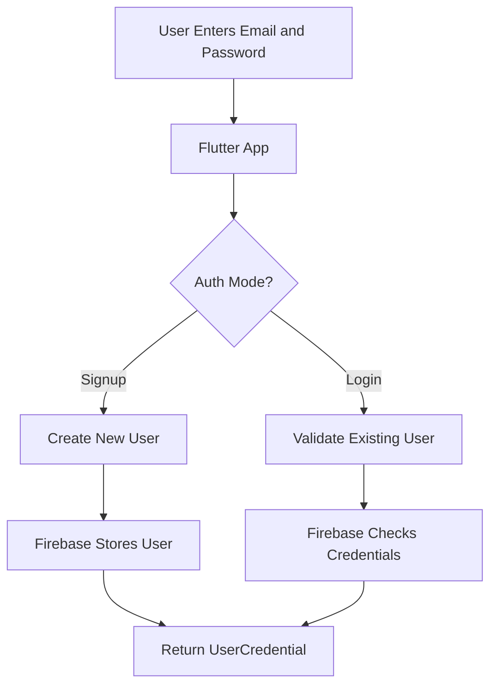
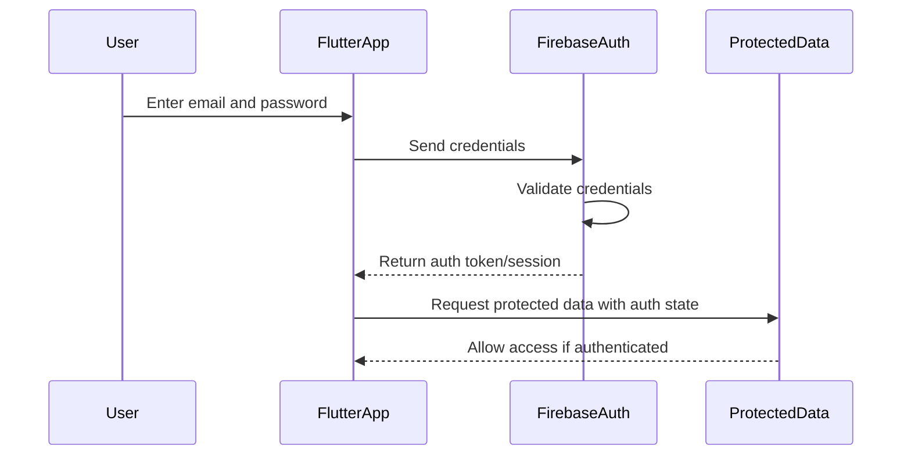
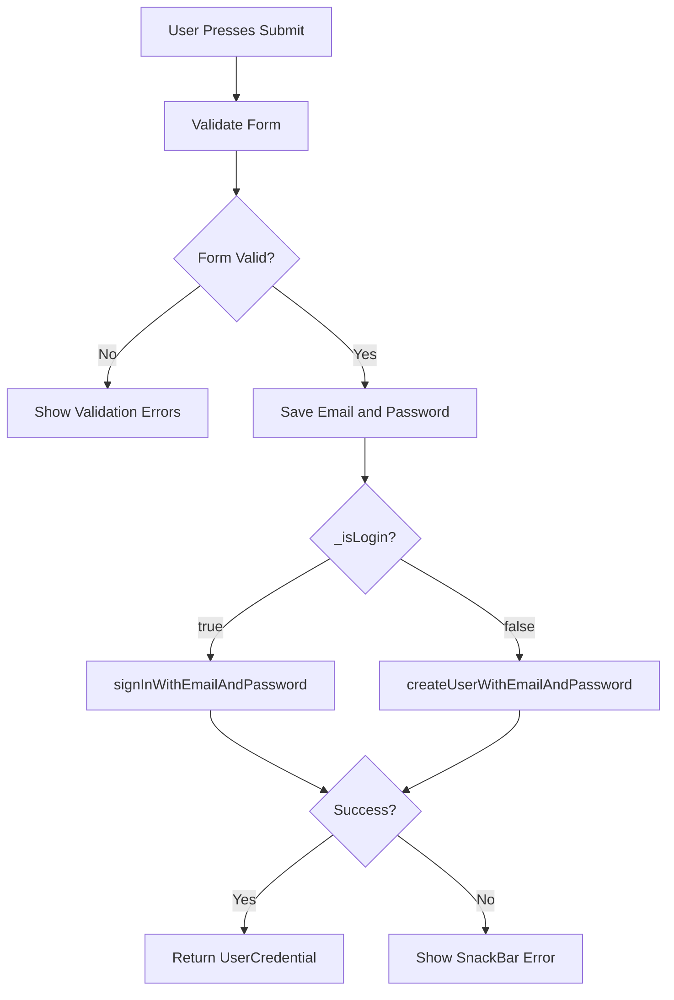
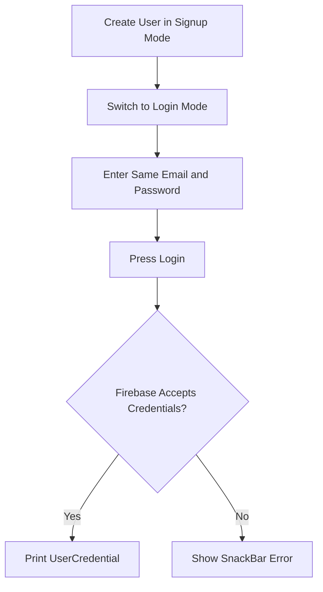
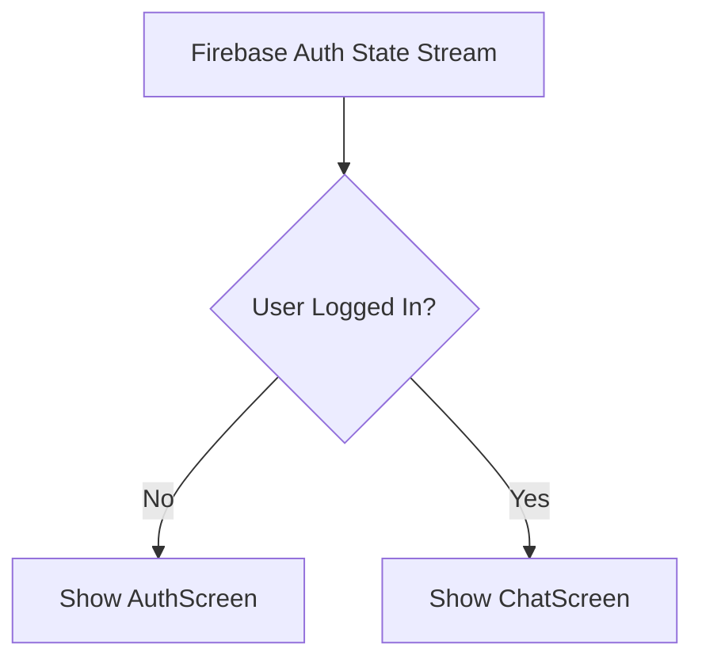
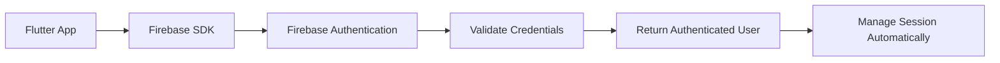

# Logging Users In

## Overview

This lecture completes the basic authentication flow by adding login functionality to the existing authentication form.

In the previous lecture, users could create new accounts with Firebase Authentication. Now, existing users can log in by entering their email and password. The app uses Firebase Authentication's `signInWithEmailAndPassword()` method when the form is in Login mode.

The same `_submit()` method now handles both signup and login by checking the `_isLogin` state variable.

---

## Learning Goals

By the end of this lecture, you will understand how to:

* Log users in with Firebase Authentication
* Use `signInWithEmailAndPassword()`
* Reuse the same form for login and signup
* Branch authentication logic based on `_isLogin`
* Handle login and signup errors with one shared `try-catch` block
* Understand the basic role of authentication tokens
* Verify that login works by checking the returned `UserCredential`

---

## Authentication Recap

Authentication is the process of verifying a user's identity.

In this app, authentication uses:

* Email
* Password
* Firebase Authentication
* Firebase SDK

When a user signs up, Firebase stores the user's credentials securely.

When a user logs in, Firebase checks whether the entered email and password match an existing account.



---

## Why Login Is Different from Signup

Signup creates a new user account.

Login validates an existing user account.

| Mode   | Firebase Method                    | Purpose                                 |
| ------ | ---------------------------------- | --------------------------------------- |
| Signup | `createUserWithEmailAndPassword()` | Creates a new Firebase user             |
| Login  | `signInWithEmailAndPassword()`     | Authenticates an existing Firebase user |

---

## Understanding Authentication Tokens

After successful signup or login, Firebase creates an authentication token.

This token proves that the user is authenticated.

The Flutter app can later use this token when accessing protected backend resources, such as chat messages.



With the Firebase SDK, token creation, storage, refreshing, and lifecycle management are handled automatically.

Without the SDK, the app would need to manage tokens manually.

---

## Login Method

Firebase Authentication provides this method for logging users in:

```dart id="q300qy"
await _firebase.signInWithEmailAndPassword(
  email: _enteredEmail,
  password: _enteredPassword,
);
```

This method:

* Sends the email and password to Firebase
* Checks whether the credentials are valid
* Returns a `UserCredential` object on success
* Throws a `FirebaseAuthException` on failure

---

## Branching Between Login and Signup

The `_isLogin` variable determines which Firebase method should be called.

```dart id="yasx3i"
if (_isLogin) {
  final userCredentials = await _firebase.signInWithEmailAndPassword(
    email: _enteredEmail,
    password: _enteredPassword,
  );

  print(userCredentials);
} else {
  final userCredentials = await _firebase.createUserWithEmailAndPassword(
    email: _enteredEmail,
    password: _enteredPassword,
  );

  print(userCredentials);
}
```

If `_isLogin` is `true`, the app logs the user in.

If `_isLogin` is `false`, the app creates a new account.

---

## Authentication Decision Flow



---

## Shared Error Handling

Both login and signup can fail.

Common login errors include:

* User not found
* Wrong password
* Invalid email
* Network error
* Disabled authentication method

Instead of writing separate error handling for login and signup, the entire `if` statement can be wrapped in one `try-catch` block.

```dart id="39of17"
try {
  if (_isLogin) {
    final userCredentials = await _firebase.signInWithEmailAndPassword(
      email: _enteredEmail,
      password: _enteredPassword,
    );

    print(userCredentials);
  } else {
    final userCredentials = await _firebase.createUserWithEmailAndPassword(
      email: _enteredEmail,
      password: _enteredPassword,
    );

    print(userCredentials);
  }
} on FirebaseAuthException catch (error) {
  ScaffoldMessenger.of(context).clearSnackBars();
  ScaffoldMessenger.of(context).showSnackBar(
    SnackBar(
      content: Text(error.message ?? 'Authentication failed.'),
    ),
  );
}
```

---

## Complete Submit Method

```dart id="4687pt"
void _submit() async {
  final isValid = _form.currentState!.validate();

  if (!isValid) {
    return;
  }

  _form.currentState!.save();

  try {
    if (_isLogin) {
      final userCredentials = await _firebase.signInWithEmailAndPassword(
        email: _enteredEmail,
        password: _enteredPassword,
      );

      print(userCredentials);
    } else {
      final userCredentials = await _firebase.createUserWithEmailAndPassword(
        email: _enteredEmail,
        password: _enteredPassword,
      );

      print(userCredentials);
    }
  } on FirebaseAuthException catch (error) {
    ScaffoldMessenger.of(context).clearSnackBars();
    ScaffoldMessenger.of(context).showSnackBar(
      SnackBar(
        content: Text(error.message ?? 'Authentication failed.'),
      ),
    );
  }
}
```

---

## Complete Authentication Logic Example

```dart id="votcf8"
import 'package:firebase_auth/firebase_auth.dart';
import 'package:flutter/material.dart';

final _firebase = FirebaseAuth.instance;

class AuthScreen extends StatefulWidget {
  const AuthScreen({super.key});

  @override
  State<AuthScreen> createState() {
    return _AuthScreenState();
  }
}

class _AuthScreenState extends State<AuthScreen> {
  final _form = GlobalKey<FormState>();

  var _isLogin = true;
  var _enteredEmail = '';
  var _enteredPassword = '';

  void _submit() async {
    final isValid = _form.currentState!.validate();

    if (!isValid) {
      return;
    }

    _form.currentState!.save();

    try {
      if (_isLogin) {
        final userCredentials = await _firebase.signInWithEmailAndPassword(
          email: _enteredEmail,
          password: _enteredPassword,
        );

        print(userCredentials);
      } else {
        final userCredentials =
            await _firebase.createUserWithEmailAndPassword(
          email: _enteredEmail,
          password: _enteredPassword,
        );

        print(userCredentials);
      }
    } on FirebaseAuthException catch (error) {
      ScaffoldMessenger.of(context).clearSnackBars();
      ScaffoldMessenger.of(context).showSnackBar(
        SnackBar(
          content: Text(error.message ?? 'Authentication failed.'),
        ),
      );
    }
  }

  @override
  Widget build(BuildContext context) {
    return Scaffold(
      backgroundColor: Theme.of(context).colorScheme.primary,
      body: Center(
        child: SingleChildScrollView(
          child: Card(
            margin: const EdgeInsets.all(20),
            child: Padding(
              padding: const EdgeInsets.all(16),
              child: Form(
                key: _form,
                child: Column(
                  mainAxisSize: MainAxisSize.min,
                  children: [
                    TextFormField(
                      decoration: const InputDecoration(
                        labelText: 'Email Address',
                      ),
                      keyboardType: TextInputType.emailAddress,
                      autocorrect: false,
                      textCapitalization: TextCapitalization.none,
                      validator: (value) {
                        if (value == null ||
                            value.trim().isEmpty ||
                            !value.contains('@')) {
                          return 'Please enter a valid email address.';
                        }

                        return null;
                      },
                      onSaved: (value) {
                        _enteredEmail = value!;
                      },
                    ),
                    TextFormField(
                      decoration: const InputDecoration(
                        labelText: 'Password',
                      ),
                      obscureText: true,
                      validator: (value) {
                        if (value == null || value.trim().length < 6) {
                          return 'Password must be at least 6 characters long.';
                        }

                        return null;
                      },
                      onSaved: (value) {
                        _enteredPassword = value!;
                      },
                    ),
                    const SizedBox(height: 12),
                    ElevatedButton(
                      onPressed: _submit,
                      style: ElevatedButton.styleFrom(
                        backgroundColor:
                            Theme.of(context).colorScheme.primaryContainer,
                      ),
                      child: Text(_isLogin ? 'Login' : 'Signup'),
                    ),
                    TextButton(
                      onPressed: () {
                        setState(() {
                          _isLogin = !_isLogin;
                        });
                      },
                      child: Text(
                        _isLogin
                            ? 'Create an account'
                            : 'I already have an account',
                      ),
                    ),
                  ],
                ),
              ),
            ),
          ),
        ),
      ),
    );
  }
}
```

---

## UserCredential

Both signup and login return a `UserCredential` object.

```dart id="yxp62s"
final userCredentials = await _firebase.signInWithEmailAndPassword(
  email: _enteredEmail,
  password: _enteredPassword,
);
```

The `UserCredential` contains information about the authenticated user.

Examples include:

* User ID
* Email address
* Authentication provider
* User metadata
* Firebase user object

You can access the user with:

```dart id="hci9sw"
userCredentials.user
```

---

## Login Error Examples

Firebase may throw a `FirebaseAuthException` if login fails.

Common error codes include:

| Error Code               | Meaning                              |
| ------------------------ | ------------------------------------ |
| `user-not-found`         | No user exists for the entered email |
| `wrong-password`         | Password is incorrect                |
| `invalid-email`          | Email address format is invalid      |
| `user-disabled`          | The user account has been disabled   |
| `network-request-failed` | Network connection failed            |

The current code displays Firebase's default error message through a `SnackBar`.

---

## Testing the Login Flow

To test login:

1. Create a user in Signup mode.
2. Switch back to Login mode.
3. Enter the same email and password.
4. Press the Login button.
5. Check the debug console for the returned `UserCredential`.
6. Confirm that no error `SnackBar` appears.



---

## What Happens After Login?

After a successful login, Firebase Authentication automatically manages the user session.

This means:

* The user remains authenticated
* Firebase stores the session locally
* The SDK can restore authentication state after app restart
* The app can later check whether a user is logged in
* Protected Firebase resources can be accessed according to security rules

Navigation after login is not handled manually in this lecture. It will be handled later by listening to Firebase's authentication state stream.

---

## Auth State Preview

Instead of manually navigating after login, the app can listen to authentication state changes.



This approach ensures the UI automatically updates when the user logs in or signs out.

---

## Why the Firebase SDK Helps

With the Firebase SDK, the app does not need to manually manage:

* Login API endpoints
* HTTP request bodies
* Authentication tokens
* Token refresh
* Session persistence
* Low-level error parsing

Firebase handles these tasks internally.



---

## Current Result

At this point, the app can:

* Validate email and password input
* Create new users in Signup mode
* Log existing users in with Login mode
* Handle Firebase authentication errors
* Print returned `UserCredential` objects
* Use a single form for both authentication flows

---

## What Is Still Missing?

The app still needs:

* Loading indicator while Firebase is processing
* Auth state listener
* Automatic screen switching after login
* Logout functionality
* Chat screen
* Firebase-protected chat messages
* User profile image upload
* User data storage in Firestore

---

## Key Points

* `signInWithEmailAndPassword()` logs in an existing Firebase user.
* Login and signup both return a `UserCredential`.
* `_isLogin` controls whether the app logs in or signs up.
* The login and signup logic can share one `try-catch` block.
* `FirebaseAuthException` handles authentication errors.
* Error messages are shown with `SnackBar`.
* Firebase SDK automatically manages the user session and authentication token.
* Later, the app will use auth state changes to decide whether to show the auth screen or the chat screen.

---

## Notes

Login only works for users that already exist in Firebase Authentication.

If the user enters an email that has not been registered, or enters the wrong password, Firebase throws an error. The app catches that error and displays a `SnackBar`.

After login succeeds, the screen does not change yet. The next step is to listen to the authentication state and show the main chat screen when a user is authenticated.

---

## Summary

This lecture adds login functionality to the authentication screen. The `_submit()` method now checks `_isLogin` to decide whether to call `signInWithEmailAndPassword()` or `createUserWithEmailAndPassword()`.

Both branches use Firebase Authentication and return a `UserCredential` when successful. Errors from both login and signup are handled in one shared `try-catch` block and displayed to the user with a `SnackBar`.

With signup and login implemented, the app now has a complete basic Firebase Authentication flow.
