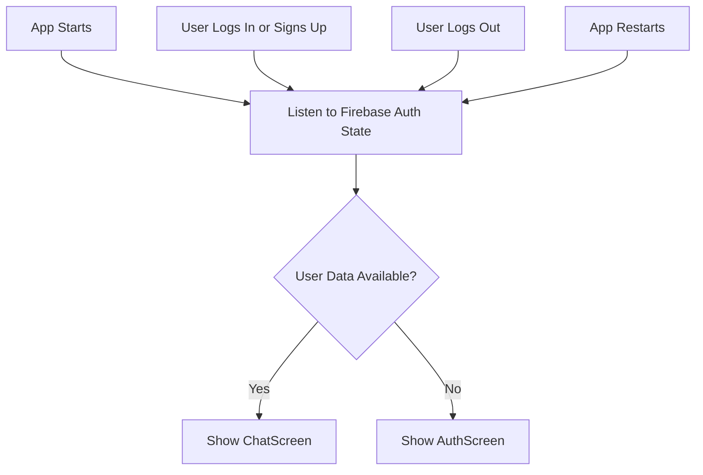
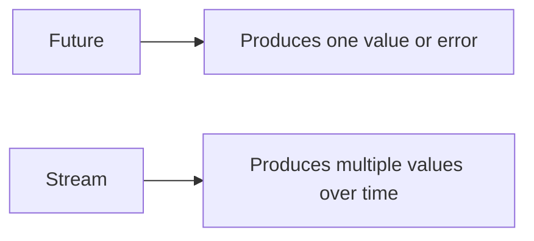
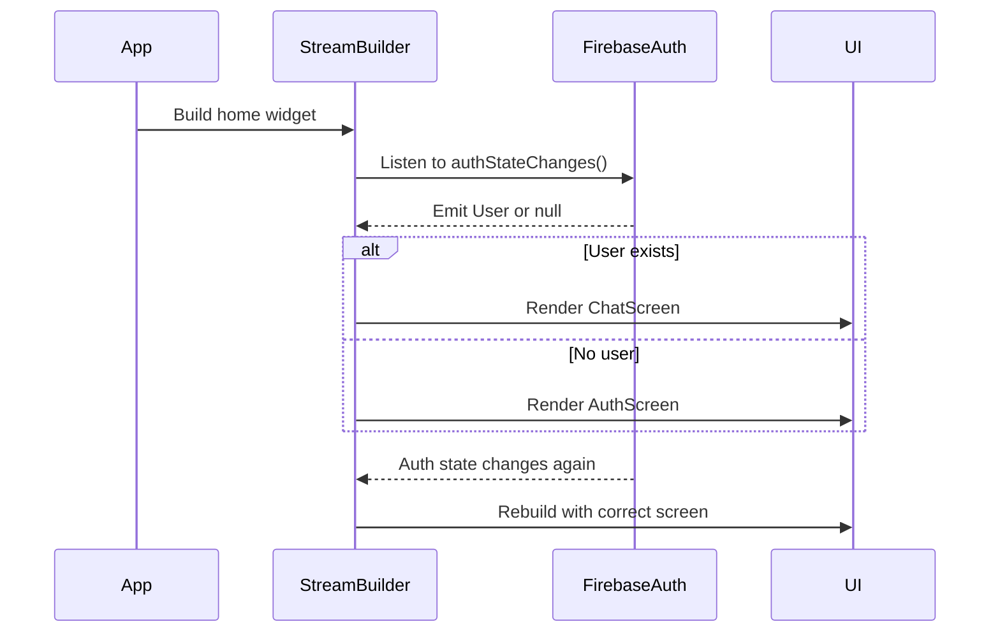
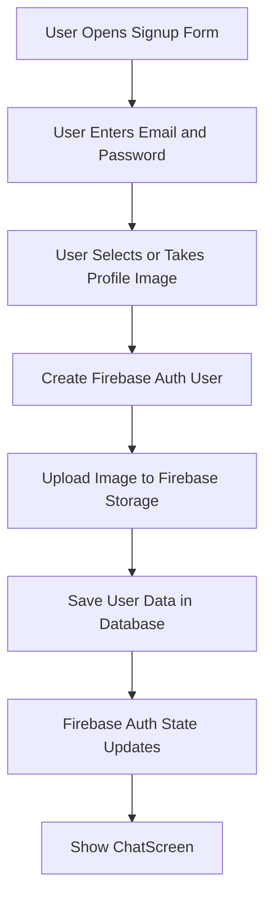

# Showing Different Screens Based On The Authentication State

## Overview

This lecture explains how to show different screens depending on the user's Firebase Authentication state.

Instead of manually navigating after login or signup, the app listens to Firebase's authentication state by using `FirebaseAuth.instance.authStateChanges()`. This method returns a stream that emits a new value whenever the authentication state changes.

If Firebase emits a valid user, the app displays the `ChatScreen`. If there is no logged-in user, the app displays the `AuthScreen`.

This approach also supports automatic session restoration. If the user logged in before and the Firebase authentication token is still stored on the device, the app can start directly on the `ChatScreen` after restarting.

---

## Why Authentication State Matters

When a user successfully logs in or signs up, Firebase creates and stores an authentication token on the device.

The existence of this token proves that the user has provided valid credentials. Firebase only creates and returns such a token when authentication succeeds.

Therefore, the app can use Firebase's authentication state to decide which screen should be displayed:

* If a valid user/token exists → show the chat screen
* If no valid user/token exists → show the authentication screen

This means the app does not need to manually check credentials again every time it starts.

---

## Screen Switching Flow



---

## Authentication State Stream

Firebase provides the following method:

```dart
FirebaseAuth.instance.authStateChanges()
```

This returns a `Stream<User?>`.

The stream emits:

* A `User` object when the user is logged in
* `null` when the user is logged out

Because it is a stream, it can emit multiple values over time.

This is different from a `Future`, which only produces one result once.

---

## Future vs Stream



### Future

A `Future` is useful when an operation completes once.

Example:

```dart
final userCredential = await FirebaseAuth.instance
    .signInWithEmailAndPassword(
  email: email,
  password: password,
);
```

### Stream

A `Stream` is useful when values can change over time.

Example:

```dart
FirebaseAuth.instance.authStateChanges()
```

This stream can emit a new value when:

* The user logs in
* The user signs up
* The user logs out
* Firebase restores a previous session on app startup

---

## Creating the Chat Screen

Before switching screens, we create a simple `ChatScreen`.

For now, this screen only displays a placeholder text. Later, it will be responsible for displaying chat messages.

### `chat.dart`

```dart
import 'package:flutter/material.dart';

class ChatScreen extends StatelessWidget {
  const ChatScreen({super.key});

  @override
  Widget build(BuildContext context) {
    return Scaffold(
      appBar: AppBar(
        title: const Text('FlutterChat'),
      ),
      body: const Center(
        child: Text('Logged in!'),
      ),
    );
  }
}
```

---

## Using StreamBuilder in `main.dart`

To react to authentication state changes, we use `StreamBuilder`.

The `StreamBuilder` listens to the Firebase auth state stream and rebuilds the UI whenever the stream emits a new value.

### Main Idea

```dart
StreamBuilder(
  stream: FirebaseAuth.instance.authStateChanges(),
  builder: (ctx, snapshot) {
    if (snapshot.hasData) {
      return const ChatScreen();
    }

    return const AuthScreen();
  },
)
```

If `snapshot.hasData` is `true`, Firebase has emitted a logged-in user.

If `snapshot.hasData` is `false`, there is no authenticated user.

---

## Full Code Example

### `main.dart`

```dart
import 'package:firebase_auth/firebase_auth.dart';
import 'package:flutter/material.dart';

import 'package:flutter_chat/screens/auth.dart';
import 'package:flutter_chat/screens/chat.dart';

class App extends StatelessWidget {
  const App({super.key});

  @override
  Widget build(BuildContext context) {
    return MaterialApp(
      title: 'FlutterChat',
      theme: ThemeData().copyWith(
        colorScheme: ColorScheme.fromSeed(
          seedColor: const Color.fromARGB(255, 63, 17, 177),
        ),
      ),
      home: StreamBuilder(
        stream: FirebaseAuth.instance.authStateChanges(),
        builder: (ctx, snapshot) {
          if (snapshot.hasData) {
            return const ChatScreen();
          }

          return const AuthScreen();
        },
      ),
    );
  }
}
```

---

## Improved Version With Loading State

When the app starts, Firebase may need a short moment to check whether a user session already exists.

During that time, we can show a loading spinner.

```dart
import 'package:firebase_auth/firebase_auth.dart';
import 'package:flutter/material.dart';

import 'package:flutter_chat/screens/auth.dart';
import 'package:flutter_chat/screens/chat.dart';

class App extends StatelessWidget {
  const App({super.key});

  @override
  Widget build(BuildContext context) {
    return MaterialApp(
      title: 'FlutterChat',
      theme: ThemeData().copyWith(
        colorScheme: ColorScheme.fromSeed(
          seedColor: const Color.fromARGB(255, 63, 17, 177),
        ),
      ),
      home: StreamBuilder(
        stream: FirebaseAuth.instance.authStateChanges(),
        builder: (ctx, snapshot) {
          if (snapshot.connectionState == ConnectionState.waiting) {
            return const Scaffold(
              body: Center(
                child: CircularProgressIndicator(),
              ),
            );
          }

          if (snapshot.hasData) {
            return const ChatScreen();
          }

          return const AuthScreen();
        },
      ),
    );
  }
}
```

---

## How StreamBuilder Works



---

## Why We Do Not Use Manual Navigation

A possible approach would be to manually navigate after login or signup:

```dart
Navigator.of(context).pushReplacement(...);
```

However, this is not necessary here.

Firebase already knows whether the user is authenticated. By listening to `authStateChanges()`, the UI automatically reacts to login, signup, logout, and session restoration.

This makes the app cleaner and less error-prone.

---

## Benefits of This Approach

* No manual navigation after login is required
* The app automatically reacts to login and logout
* Firebase restores previous sessions automatically
* The correct screen is shown when the app restarts
* Authentication logic stays centralized in `main.dart`
* The UI stays reactive and easier to maintain

---

## Important Note About User Image Upload

Later, when creating a new account, users should also be required to upload a profile image.

That feature will be added separately.

For now, the focus is only on switching screens based on whether the user is authenticated.

The future signup flow will likely include:



---

## Common Mistakes

### 1. Manually navigating after login

Avoid manually pushing the chat screen after login when you are already using `authStateChanges()`.

The stream will update automatically.

---

### 2. Forgetting to import `ChatScreen`

Make sure `chat.dart` is imported in `main.dart`.

```dart
import 'package:flutter_chat/screens/chat.dart';
```

---

### 3. Not using `const` constructors

Using `const` is not required, but it is recommended when widgets do not depend on changing data.

```dart
const ChatScreen()
```

---

### 4. Not handling the loading state

When Firebase checks the saved login session, the stream may briefly be in a waiting state.

For a better user experience, show a loading indicator.

```dart
if (snapshot.connectionState == ConnectionState.waiting) {
  return const Scaffold(
    body: Center(
      child: CircularProgressIndicator(),
    ),
  );
}
```

---

## Summary

Using `StreamBuilder` with `FirebaseAuth.instance.authStateChanges()` allows the app to reactively display different screens based on the user's authentication state.

If Firebase emits a logged-in user, the app shows the `ChatScreen`.

If no user is logged in, the app shows the `AuthScreen`.

This approach also handles session restoration automatically, meaning users who previously logged in can return directly to the chat screen when the app restarts.
