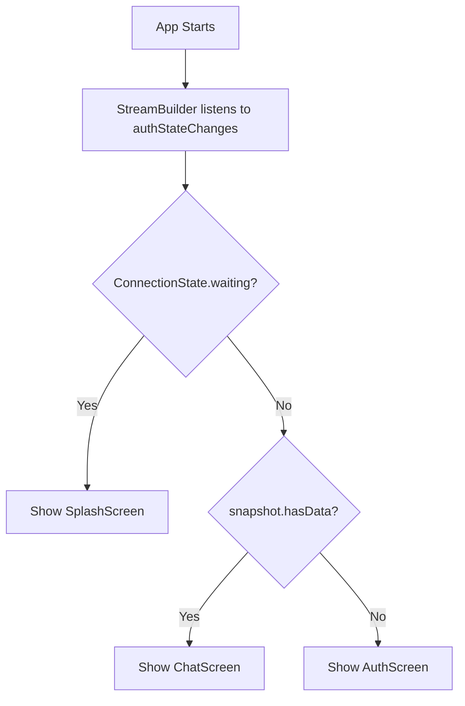
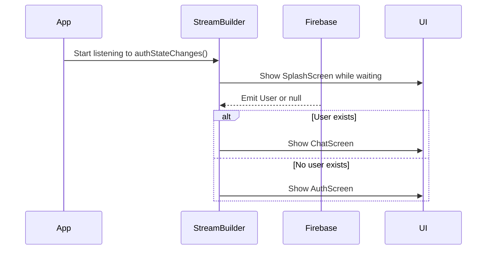
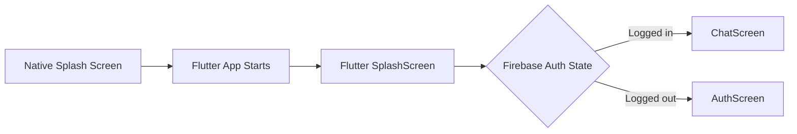
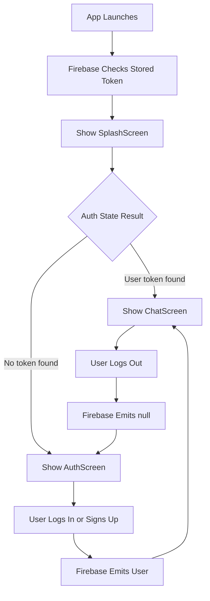

# Adding a Splash Screen / Loading Screen

## Overview

This lecture adds a splash screen that is shown while Firebase is checking the current authentication state.

The app already uses `FirebaseAuth.instance.authStateChanges()` with a `StreamBuilder` to decide whether to show the `ChatScreen` or the `AuthScreen`.

However, when the app starts, Firebase may need a short moment to restore the authentication token stored on the device. During that short delay, the app might briefly show the `AuthScreen` even though the user is already logged in.

To avoid this visual flash, we add a third screen: `SplashScreen`.

The `SplashScreen` is displayed while the stream is still waiting for its first value.

---

## Problem

When the app starts, Firebase needs to check whether a valid authentication token exists on the device.

If Firebase has not finished checking yet, the app does not know whether the user is logged in or not.

Without a splash screen, the app could temporarily show the `AuthScreen`.

This can create a bad user experience because a logged-in user might briefly see the login/signup screen before being redirected to the chat screen.

---

## Solution

Use `snapshot.connectionState` inside the `StreamBuilder`.

Before checking `snapshot.hasData`, first check whether the stream is still waiting.

```dart
if (snapshot.connectionState == ConnectionState.waiting) {
  return const SplashScreen();
}
```

This ensures that the app displays a loading screen until Firebase has finished checking the authentication state.

---

## Authentication Screen Flow



---

## Why Check `connectionState` First?

The `connectionState` tells us whether the stream has already emitted its first value.

When the app starts, the stream may still be waiting.

During this waiting phase, Firebase is still checking whether a stored token exists.

That is why this check should come before `snapshot.hasData`.

Correct order:

```dart
if (snapshot.connectionState == ConnectionState.waiting) {
  return const SplashScreen();
}

if (snapshot.hasData) {
  return const ChatScreen();
}

return const AuthScreen();
```

Incorrect order:

```dart
if (snapshot.hasData) {
  return const ChatScreen();
}

return const AuthScreen();
```

The incorrect version may briefly show the auth screen before Firebase finishes restoring the user session.

---

## Creating the Splash Screen

Create a new file:

```text
lib/screens/splash.dart
```

### `splash.dart`

```dart
import 'package:flutter/material.dart';

class SplashScreen extends StatelessWidget {
  const SplashScreen({super.key});

  @override
  Widget build(BuildContext context) {
    return Scaffold(
      backgroundColor: Theme.of(context).colorScheme.primary,
      body: const Center(
        child: Text(
          'Loading...',
          style: TextStyle(
            color: Colors.white,
            fontSize: 24,
          ),
        ),
      ),
    );
  }
}
```

This simple splash screen shows a loading text while Firebase checks the authentication state.

---

## Improved Splash Screen With Loading Spinner

A better version uses `CircularProgressIndicator`.

```dart
import 'package:flutter/material.dart';

class SplashScreen extends StatelessWidget {
  const SplashScreen({super.key});

  @override
  Widget build(BuildContext context) {
    return Scaffold(
      backgroundColor: Theme.of(context).colorScheme.primary,
      body: const Center(
        child: CircularProgressIndicator(
          color: Colors.white,
        ),
      ),
    );
  }
}
```

This gives the user a clear visual signal that the app is loading.

---

## Updating `main.dart`

Now import the new splash screen.

```dart
import 'package:flutter_chat/screens/splash.dart';
```

Then update the `StreamBuilder`.

### `main.dart`

```dart
import 'package:firebase_auth/firebase_auth.dart';
import 'package:flutter/material.dart';

import 'package:flutter_chat/screens/auth.dart';
import 'package:flutter_chat/screens/chat.dart';
import 'package:flutter_chat/screens/splash.dart';

class App extends StatelessWidget {
  const App({super.key});

  @override
  Widget build(BuildContext context) {
    return MaterialApp(
      title: 'FlutterChat',
      theme: ThemeData().copyWith(
        colorScheme: ColorScheme.fromSeed(
          seedColor: const Color.fromARGB(255, 63, 17, 177),
        ),
      ),
      home: StreamBuilder(
        stream: FirebaseAuth.instance.authStateChanges(),
        builder: (ctx, snapshot) {
          if (snapshot.connectionState == ConnectionState.waiting) {
            return const SplashScreen();
          }

          if (snapshot.hasData) {
            return const ChatScreen();
          }

          return const AuthScreen();
        },
      ),
    );
  }
}
```

---

## How It Works



---

## What `ConnectionState.waiting` Means

`ConnectionState.waiting` means the stream is active, but it has not emitted its first value yet.

In this case, Firebase is still checking whether there is an authenticated user.

This is different from `snapshot.hasData`.

### Difference

| Check                                                 | Meaning                                             |
| ----------------------------------------------------- | --------------------------------------------------- |
| `snapshot.connectionState == ConnectionState.waiting` | Firebase has not emitted the first auth state yet   |
| `snapshot.hasData`                                    | Firebase emitted a logged-in user                   |
| `!snapshot.hasData`                                   | Firebase emitted no user, so the user is logged out |

---

## Native Splash Screen vs Flutter Splash Screen

There are two different kinds of splash screens.

### 1. Native Splash Screen

This appears before Flutter is fully loaded.

It is configured separately using:

* `flutter_native_splash`
* Android native assets
* iOS native launch screen settings

### 2. Flutter-Level Splash Screen

This is the screen we created in this lecture.

It appears after Flutter starts, but before Firebase finishes checking the authentication state.



For production apps, the native splash screen and the Flutter splash screen should have a similar design to avoid a sudden visual change.

---

## Benefits

Adding a splash screen provides several benefits:

* Prevents the wrong screen from flashing briefly
* Gives Firebase time to restore the saved authentication token
* Improves the app startup experience
* Makes the authentication flow feel smoother
* Keeps the screen-switching logic clean and predictable

---

## Common Mistakes

### 1. Checking `snapshot.hasData` first

Do not check `snapshot.hasData` before checking the waiting state.

```dart
if (snapshot.connectionState == ConnectionState.waiting) {
  return const SplashScreen();
}
```

This should come first.

---

### 2. Forgetting to import `SplashScreen`

Make sure the splash screen file is imported in `main.dart`.

```dart
import 'package:flutter_chat/screens/splash.dart';
```

---

### 3. Confusing Native Splash and Flutter Splash

The splash screen in this lecture does not replace the native splash screen.

It only handles the time after Flutter starts and before Firebase confirms the auth state.

---

## Final Authentication Flow



---

## Summary

A splash screen should be shown while Firebase is waiting to emit the first authentication state.

By checking `snapshot.connectionState == ConnectionState.waiting`, the app can display a `SplashScreen` before deciding whether to show the `ChatScreen` or the `AuthScreen`.

This prevents the authentication screen from briefly flashing when an already logged-in user opens the app.

The final screen decision becomes:

```dart
if (snapshot.connectionState == ConnectionState.waiting) {
  return const SplashScreen();
}

if (snapshot.hasData) {
  return const ChatScreen();
}

return const AuthScreen();
```

This creates a smoother and more reliable authentication startup flow.
