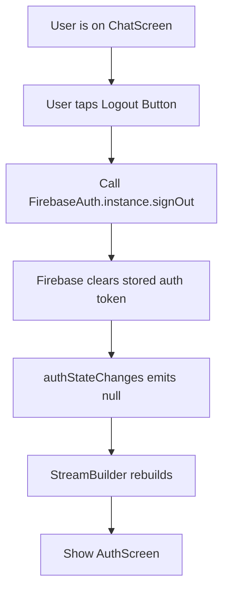
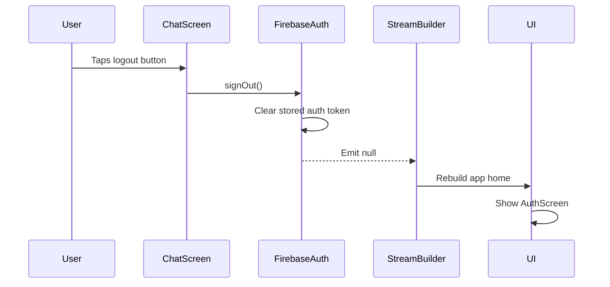
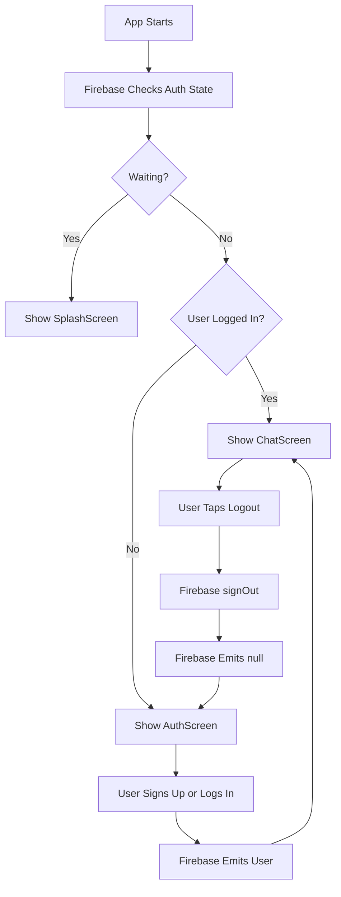

# Adding User Logout

## Overview

This lecture adds logout functionality to the Flutter chat app.

At this point, the app can already create users, log users in, restore previous sessions, and show different screens based on the Firebase Authentication state.

However, once a user is logged in, there needs to be a way to leave the logged-in state. To implement this, we add a logout button to the `AppBar` of the `ChatScreen`.

When the user presses the logout button, the app calls:

```dart
FirebaseAuth.instance.signOut();
```

After signing out, Firebase clears the locally stored authentication token. Since the app is already listening to `authStateChanges()` in `main.dart`, the UI automatically switches back to the `AuthScreen`.

No manual navigation is required.

---

## Why Logout Is Needed

Without logout functionality, users stay authenticated once they log in.

That means:

* The app keeps showing the `ChatScreen`
* The stored Firebase token remains on the device
* The user has no way to return to the authentication screen
* Testing different accounts becomes difficult

By adding logout, users can exit the current session and log in again with the same or a different account.

---

## Logout Flow



---

## Adding a Logout Button to the AppBar

The logout button is added to the `actions` property of the `AppBar`.

```dart
actions: [
  IconButton(
    onPressed: () {
      FirebaseAuth.instance.signOut();
    },
    icon: Icon(
      Icons.exit_to_app,
      color: Theme.of(context).colorScheme.primary,
    ),
  ),
],
```

The icon used here is:

```dart
Icons.exit_to_app
```

This icon visually represents leaving or logging out of the app.

---

## Full Code Example

### `chat.dart`

```dart
import 'package:firebase_auth/firebase_auth.dart';
import 'package:flutter/material.dart';

class ChatScreen extends StatelessWidget {
  const ChatScreen({super.key});

  @override
  Widget build(BuildContext context) {
    return Scaffold(
      appBar: AppBar(
        title: const Text('FlutterChat'),
        actions: [
          IconButton(
            onPressed: () {
              FirebaseAuth.instance.signOut();
            },
            icon: Icon(
              Icons.exit_to_app,
              color: Theme.of(context).colorScheme.primary,
            ),
          ),
        ],
      ),
      body: const Center(
        child: Text('Logged in!'),
      ),
    );
  }
}
```

---

## How Firebase Handles Logout

When `signOut()` is called, Firebase removes the authentication token from the device and memory.

After that, Firebase emits a new authentication state event.

Because no user is logged in anymore, the emitted value is `null`.

The `StreamBuilder` in `main.dart` receives that new value and rebuilds the UI.

---

## Main Authentication Listener

The logout feature works automatically because the app already listens to Firebase authentication state changes.

### `main.dart`

```dart
home: StreamBuilder(
  stream: FirebaseAuth.instance.authStateChanges(),
  builder: (ctx, snapshot) {
    if (snapshot.connectionState == ConnectionState.waiting) {
      return const SplashScreen();
    }

    if (snapshot.hasData) {
      return const ChatScreen();
    }

    return const AuthScreen();
  },
),
```

After logout:

```dart
snapshot.hasData
```

becomes `false`.

Therefore, the app returns:

```dart
return const AuthScreen();
```

---

## Logout Sequence



---

## Why Manual Navigation Is Not Needed

A common mistake is to manually navigate after logout.

For example:

```dart
Navigator.of(context).pushReplacement(...);
```

This is unnecessary when using `authStateChanges()`.

The `StreamBuilder` already reacts to the authentication state. Once Firebase emits `null`, the app automatically switches to the `AuthScreen`.

So this is enough:

```dart
FirebaseAuth.instance.signOut();
```

---

## Authentication State Before and After Logout

| State                         | Firebase Auth Stream Emits | Screen Shown |
| ----------------------------- | -------------------------- | ------------ |
| User logged in                | `User` object              | `ChatScreen` |
| User logs out                 | `null`                     | `AuthScreen` |
| App restarts with saved token | `User` object              | `ChatScreen` |
| App restarts without token    | `null`                     | `AuthScreen` |

---

## Complete Authentication Flow So Far



---

## Testing the Logout Feature

After adding the logout button:

1. Start the app.
2. Log in with a valid user account.
3. The app should show the `ChatScreen`.
4. Tap the logout icon in the app bar.
5. Firebase signs the user out.
6. The app automatically returns to the `AuthScreen`.

You can also log in again with any valid user account created before.

---

## Firebase Console

Created users can be viewed in the Firebase Console.

Go to:

```text
Firebase Console → Authentication → Users
```

From there, you can:

* View all registered users
* Refresh the user list
* Delete users
* Reset the app testing state

This is useful when testing signup and login flows repeatedly.

---

## Common Mistakes

### 1. Navigating manually after logout

Avoid this:

```dart
Navigator.of(context).pushReplacement(...);
```

The `StreamBuilder` already handles the screen switch.

---

### 2. Forgetting to import Firebase Auth

The `ChatScreen` needs access to `FirebaseAuth`.

```dart
import 'package:firebase_auth/firebase_auth.dart';
```

---

### 3. Expecting `signOut()` to return a user

`signOut()` does not return a logged-out user. It simply clears the current Firebase authentication session.

---

### 4. Not listening to `authStateChanges()`

Logout only switches screens automatically because the app is already listening to:

```dart
FirebaseAuth.instance.authStateChanges()
```

Without this stream listener, you would need to update the UI manually.

---

## Summary

Logout is implemented by calling:

```dart
FirebaseAuth.instance.signOut();
```

This clears the stored Firebase authentication token and causes `authStateChanges()` to emit `null`.

Because the app uses a `StreamBuilder` in `main.dart`, the UI automatically rebuilds and shows the `AuthScreen`.

With this feature, the basic authentication flow is now complete:

* Users can sign up
* Users can log in
* Firebase restores previous sessions
* A splash screen appears while auth state is loading
* Users can log out
* The UI switches screens reactively without manual navigation

The next step is to add image upload so that new users must provide a profile image during signup.
