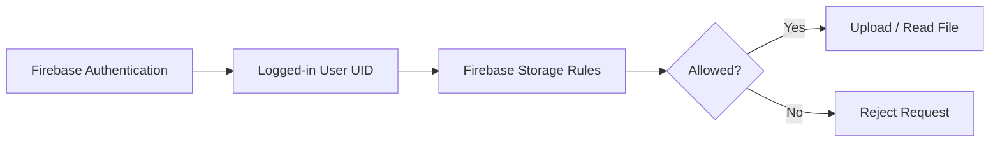

# Firebase and Image Storage

## Overview

This lecture introduces Firebase Storage as the place where user-uploaded files can be stored.

In the Flutter chat app, users will later be required to upload a profile image when creating a new account. Since images are binary files, they should not be stored directly inside Firebase Authentication or a normal database document.

Instead, Firebase Storage is used to store files such as:

* Profile images
* Chat images
* Videos
* Audio files
* Other uploaded documents

Firebase Storage is designed for storing and serving files, while Firebase Authentication is used for user identity.

---

## Why Firebase Storage Is Needed

Firebase Authentication can store basic user account information, such as:

* Email
* Password credentials
* User ID
* Authentication token

However, it is not meant to store large binary files like images.

For profile pictures, we need a dedicated file storage service.

That is where Firebase Storage comes in.

---

## Authentication vs Storage


---

## What Firebase Storage Does

Firebase Storage is a cloud storage service for files.

It allows your app to upload, download, and manage files in the cloud.

In this app, it will be used to store user profile images.

A common file path could look like this:

```text
user_images/user-id.jpg
```

For example:

```text
user_images/abc123.jpg
```

Here, `abc123` could be the Firebase Authentication user ID.

---

## Storage Bucket Concept

Firebase Storage stores files inside a storage bucket.

A bucket is like a cloud folder that belongs to your Firebase project.

Inside that bucket, you can organize files using folder-like paths.

Example structure:

```text
firebase-storage-bucket
│
├── user_images
│   ├── user_001.jpg
│   ├── user_002.jpg
│   └── user_003.jpg
│
├── chat_images
│   ├── message_001.jpg
│   └── message_002.jpg
│
└── other_files
    └── example.pdf
```

---

## Firebase Storage Structure


---

## Enabling Firebase Storage

To use Firebase Storage, it must be enabled in the Firebase Console.

General steps:

1. Open the Firebase Console.
2. Select your Firebase project.
3. Go to **Storage**.
4. Click **Get Started**.
5. Choose a storage bucket location.
6. Configure the initial security rules.
7. Finish the setup.

After that, the project can store files in Firebase Storage.

---

## Important Billing Note

Firebase Storage may require enabling billing or adding a credit card, depending on the current Firebase project setup and region.

However, Firebase usually provides a free usage tier that is enough for development and small course projects.

For a simple chat app where only a few profile images are uploaded, the free tier is usually sufficient during learning.

Still, you should avoid uploading many large files while testing.

---

## Choosing a Storage Location

When enabling Firebase Storage, Firebase asks you to choose a bucket location.

This location determines where your uploaded files are physically stored.

For better performance, choose a region close to your users.

Example:

```text
Users mainly in Asia → choose an Asia region if available
Users mainly in Europe → choose a Europe region
Users mainly in the US → choose a US region
```

A closer region can reduce latency when uploading and downloading files.

---

## Adding Firebase Storage to Flutter

To use Firebase Storage in a Flutter app, install the `firebase_storage` package.

Run:

```bash
flutter pub add firebase_storage
```

Then import it in Dart files where you need to upload or download files:

```dart
import 'package:firebase_storage/firebase_storage.dart';
```

---

## Firebase Storage Package

The `firebase_storage` package allows Flutter to communicate with Firebase Storage.

It provides access through:

```dart
FirebaseStorage.instance
```

Example:

```dart
final storageRef = FirebaseStorage.instance.ref();
```

This gives you a reference to the default Firebase Storage bucket.

---

## Upload Flow

Later, when users sign up, the app will follow a flow like this:


---

## Why Use the User ID in the File Path?

Firebase Authentication gives every user a unique ID called a UID.

Using this UID in the image path makes files easier to manage.

Example:

```text
user_images/{uid}.jpg
```

If the user ID is:

```text
a7x92kLm
```

The image path could be:

```text
user_images/a7x92kLm.jpg
```

This makes it easy to associate each image with the correct user.

---

## Basic Storage Reference Example

```dart
final storageRef = FirebaseStorage.instance
    .ref()
    .child('user_images')
    .child('${user.uid}.jpg');
```

This creates a reference to a file path like:

```text
user_images/user-id.jpg
```

Later, this reference can be used to upload the selected image.

---

## Security Rules

Firebase Storage uses security rules to control who can read and write files.

For development, you may allow only authenticated users to access storage:

```text
allow read, write: if request.auth != null;
```

This means only logged-in users can upload or read files.

---

## Example Storage Rules

```text
rules_version = '2';

service firebase.storage {
  match /b/{bucket}/o {
    match /{allPaths=**} {
      allow read, write: if request.auth != null;
    }
  }
}
```

These rules are simple and useful for learning.

However, for production apps, you should make the rules stricter.

---

## More Secure User Image Rules

A stricter version can allow users to upload only their own profile image.

```text
rules_version = '2';

service firebase.storage {
  match /b/{bucket}/o {
    match /user_images/{userId}.jpg {
      allow read: if request.auth != null;
      allow write: if request.auth != null
                   && request.auth.uid == userId;
    }
  }
}
```

This rule means:

* Logged-in users can read profile images
* A user can only upload or replace their own image
* Users cannot overwrite another user's profile image

---

## Firebase Auth and Storage Relationship

Firebase Storage can use Firebase Authentication information inside security rules.

For example:

```text
request.auth.uid
```

This represents the currently logged-in user's ID.

That allows Storage rules to check whether the user is allowed to access a file.



---

## Storage vs Firestore

Firebase Storage and Firestore are used for different kinds of data.

| Service                 | Best For                               |
| ----------------------- | -------------------------------------- |
| Firebase Authentication | User login, signup, auth tokens        |
| Firebase Storage        | Images, videos, audio, files           |
| Firestore               | User profiles, chat messages, metadata |

For example, a user's image file should go into Firebase Storage.

But the image download URL can be stored in Firestore together with other user information.

---

## Example User Data Flow


---

## Example Final User Profile Data

A user profile document in Firestore might look like this:

```json
{
  "email": "user@example.com",
  "username": "john_doe",
  "image_url": "https://firebase-storage-download-url.com/profile.jpg"
}
```

The actual image is stored in Firebase Storage.

The database only stores the image URL.

---

## Tips

### 1. Keep file paths organized

Use clear folder names.

Good example:

```text
user_images/{uid}.jpg
```

Less organized example:

```text
image1.jpg
image2.jpg
abc.jpg
```

---

### 2. Use authentication-based rules

Do not allow public write access.

Avoid rules like this in production:

```text
allow read, write: if true;
```

This would allow anyone to upload or modify files.

---

### 3. Store only file URLs in the database

Do not store the image file itself in Firestore.

Instead:

* Upload the image to Firebase Storage
* Get the download URL
* Store the download URL in Firestore

---

### 4. Be careful with costs

Firebase Storage pricing depends on:

* Amount of storage used
* Download bandwidth
* Upload and download operations

For course projects, usage is usually very small.

Still, avoid uploading many large files unnecessarily.

---

## Common Mistakes

### 1. Forgetting to install `firebase_storage`

The app cannot use Firebase Storage unless the package is installed.

```bash
flutter pub add firebase_storage
```

---

### 2. Confusing Firebase Storage with Firestore

Firestore stores structured document data.

Firebase Storage stores files.

Use the correct service for each type of data.

---

### 3. Using unsafe security rules

Do not leave Storage publicly writable.

For development, use at least:

```text
allow read, write: if request.auth != null;
```

---

### 4. Not using the user UID

If every uploaded image has a random or unclear name, managing files becomes harder.

Use the Firebase user UID to keep profile images predictable and unique.

---

## Summary

Firebase Storage is used to store user-uploaded files such as profile images.

In this chat app, Firebase Storage will later be used during signup so that each new user can upload a profile image.

The general process is:

1. User creates an account.
2. Firebase Authentication creates a user.
3. The app gets the user's UID.
4. The profile image is uploaded to Firebase Storage.
5. The image download URL is saved in a database.

Firebase Storage works well with Firebase Authentication because its security rules can check `request.auth.uid`.

This makes it possible to safely store user-specific files such as profile images.
