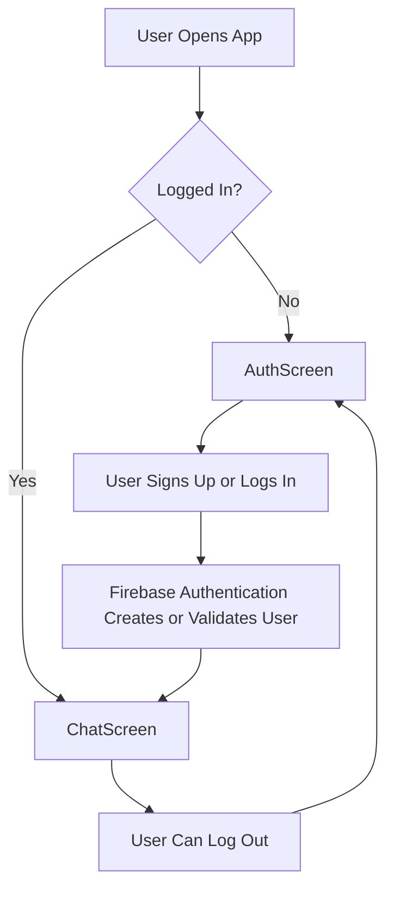
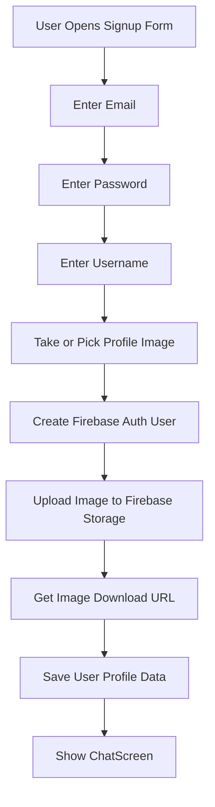
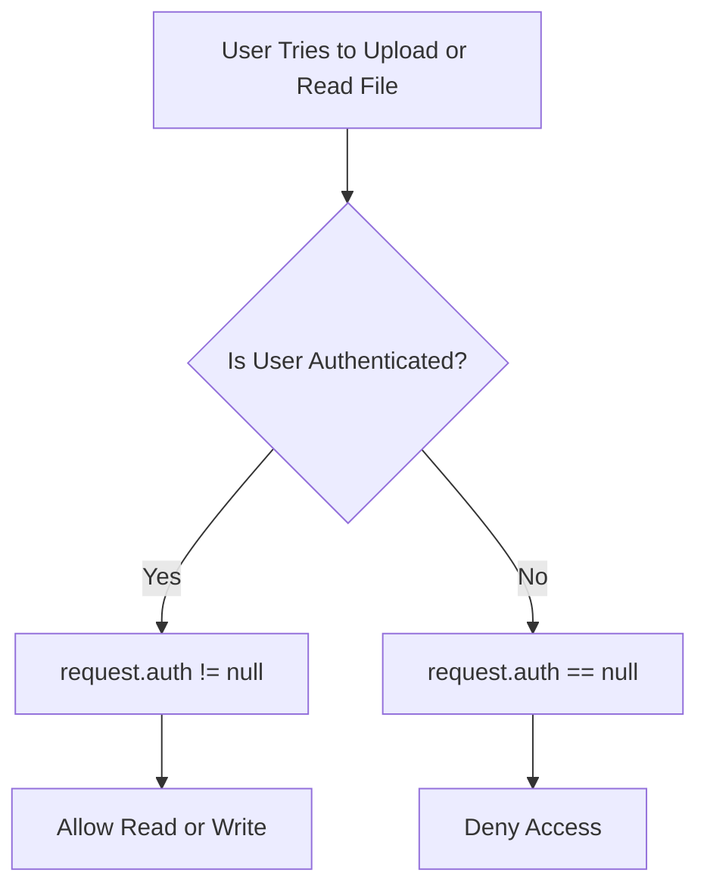
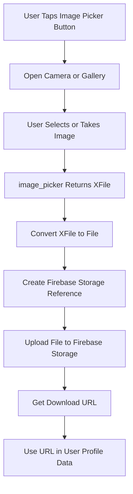
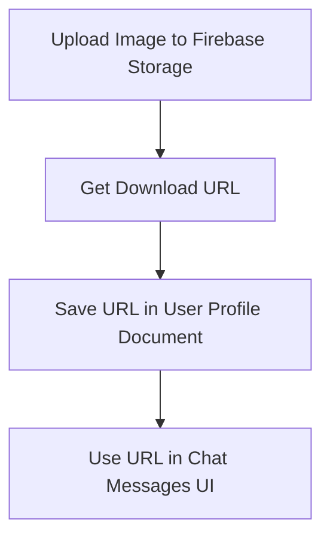

# Image Upload Setup and First Steps

## Overview

This lecture starts the image upload feature for the Flutter chat app.

The app already supports the basic authentication flow:

* Users can sign up
* Users can log in
* Users can stay logged in after restarting the app
* Users can log out

The next goal is to improve the signup process so that new users must provide more than just an email address and password.

Later, each new user should also provide:

* A username
* A profile image

The profile image will be uploaded to Firebase Storage and later shown together with the user's chat messages.

---

## Why Image Upload Is Needed

At the moment, a user account only contains authentication data.

That means the app knows:

* The user's email
* The user's password credentials
* The user's Firebase user ID

However, a real chat app usually also needs profile information.

For example, when users send messages, the app should be able to display:

* The message text
* The user's name
* The user's profile image

To support this, the signup flow must later collect and upload an image.

---

## Current User Flow



---

## Future Signup Flow With Image Upload



---

## Firebase Storage

Firebase provides a storage service that allows apps to upload files to a Firebase project.

This service is called Firebase Storage.

Firebase Storage is useful for storing files such as:

* Profile images
* Chat images
* Videos
* Audio files
* Documents

In this app, Firebase Storage will be used for storing user profile images.

---

## Where to Find Firebase Storage

In the Firebase Console, open your Firebase project and go to:

```text id="krbh4r"
Build → Storage
```

There, you can enable Firebase Storage for the project.

After files are uploaded from the Flutter app, they will appear in this Storage section.

---

## Starting Firebase Storage

When enabling Firebase Storage, Firebase may ask whether you want to start in:

* Production mode
* Test mode

For this lecture, Storage is started in production mode.

Production mode is safer because it initially blocks access. After that, the rules can be changed manually to allow only authenticated users to read and upload files.

---

## Firebase Storage Rules

Firebase Storage rules control who can read and write files.

By default, production rules may block all access.

To allow only authenticated users to read and write files, update the rules to check whether `request.auth` exists.

Example rule:

```text id="4s2niq"
allow read, write: if request.auth != null;
```

This means:

* If the user is authenticated, reading and writing are allowed
* If the user is not authenticated, access is denied

---

## Example Storage Rules

```text id="i7mk8j"
rules_version = '2';

service firebase.storage {
  match /b/{bucket}/o {
    match /{allPaths=**} {
      allow read, write: if request.auth != null;
    }
  }
}
```

After editing the rules, they must be published in the Firebase Console.

---

## How Storage Rules Work



---

## Important Security Note

The rule below is useful for learning:

```text id="asv99n"
allow read, write: if request.auth != null;
```

However, it is still quite broad.

It allows any authenticated user to read and write any file in Storage.

For a production app, you would normally create stricter rules.

For example, users should only be allowed to upload their own profile image.

```text id="f76d7x"
match /user_images/{userId}.jpg {
  allow read: if request.auth != null;
  allow write: if request.auth != null
               && request.auth.uid == userId;
}
```

---

## Required Flutter Packages

To build the image upload feature, two packages are needed:

1. `firebase_storage`
2. `image_picker`

---

## `firebase_storage`

The `firebase_storage` package allows the Flutter app to upload files to Firebase Storage.

Install it with:

```bash id="dcxtnm"
flutter pub add firebase_storage
```

This package provides access to:

```dart id="srak9u"
FirebaseStorage.instance
```

which is used to create references to files in the storage bucket.

---

## `image_picker`

The `image_picker` package allows the user to take or select an image from the device.

Install it with:

```bash id="mss0b0"
flutter pub add image_picker
```

This package can be used to:

* Open the camera
* Open the image gallery
* Return the selected image as an `XFile`

---

## Package Setup

After installation, the dependencies in `pubspec.yaml` may look similar to this:

```yaml id="qrbl4d"
dependencies:
  flutter:
    sdk: flutter

  firebase_core: ^latest
  firebase_auth: ^latest
  firebase_storage: ^latest
  image_picker: ^latest
```

Specific versions may differ depending on the current package versions used in the project.

---

## Basic Imports

Later, the image upload code will need these imports:

```dart id="adffrx"
import 'package:firebase_storage/firebase_storage.dart';
import 'package:image_picker/image_picker.dart';
```

If the selected image is converted to a `File`, this import is also needed:

```dart id="26qmep"
import 'dart:io';
```

---

## Image Upload Flow

The image upload process has several steps.



---

## What `image_picker` Returns

The `image_picker` package returns an `XFile`.

Example:

```dart id="8bqgsb"
final pickedImage = await ImagePicker().pickImage(
  source: ImageSource.camera,
);
```

The result can be `null` if the user cancels the image selection.

```dart id="g3jxwh"
if (pickedImage == null) {
  return;
}
```

To upload it with `putFile`, convert it to a `File`.

```dart id="8lyo5b"
final imageFile = File(pickedImage.path);
```

---

## Creating a Firebase Storage Reference

Before uploading a file, create a reference to the location where the file should be stored.

Example:

```dart id="m8tvze"
final storageRef = FirebaseStorage.instance
    .ref()
    .child('user_images')
    .child('${user.uid}.jpg');
```

This creates a file path like:

```text id="90hnpg"
user_images/user-id.jpg
```

Using the user's UID keeps profile image paths unique and predictable.

---

## Uploading the Image

Once the image has been picked and converted to a `File`, it can be uploaded.

```dart id="s4em9i"
await storageRef.putFile(imageFile);
```

After uploading, get the image download URL:

```dart id="v7eew5"
final imageUrl = await storageRef.getDownloadURL();
```

This URL can later be stored in a database together with the user's profile data.

---

## Basic Upload Example

```dart id="0c0fjf"
import 'dart:io';

import 'package:firebase_storage/firebase_storage.dart';
import 'package:image_picker/image_picker.dart';

Future<void> uploadUserImage(String userId) async {
  final pickedImage = await ImagePicker().pickImage(
    source: ImageSource.camera,
  );

  if (pickedImage == null) {
    return;
  }

  final imageFile = File(pickedImage.path);

  final storageRef = FirebaseStorage.instance
      .ref()
      .child('user_images')
      .child('$userId.jpg');

  await storageRef.putFile(imageFile);

  final imageUrl = await storageRef.getDownloadURL();

  print(imageUrl);
}
```

---

## Platform-Specific Permissions

Accessing the camera or photo library requires platform-specific permission setup.

This is important because mobile operating systems protect access to user media.

---

## iOS Permissions

On iOS, add usage descriptions to:

```text id="y6qk00"
ios/Runner/Info.plist
```

Example:

```xml id="0b5ky0"
<key>NSCameraUsageDescription</key>
<string>This app needs camera access so users can take a profile picture.</string>

<key>NSPhotoLibraryUsageDescription</key>
<string>This app needs photo library access so users can select a profile picture.</string>
```

Without these keys, the app may crash or fail when trying to access the camera or photo library.

---

## Android Permissions

On Android, image picking usually works through system intents, but older Android versions may require storage permissions.

Check:

```text id="1i2pxq"
android/app/src/main/AndroidManifest.xml
```

For older Android API levels, you may need:

```xml id="ra8qn4"
<uses-permission android:name="android.permission.READ_EXTERNAL_STORAGE" />
```

Camera usage may also require:

```xml id="y1jqkr"
<uses-permission android:name="android.permission.CAMERA" />
```

The exact permission needs can vary depending on Android version and how the image picker is used.

---

## Camera vs Gallery

The image picker can use different image sources.

### Camera

```dart id="kv5lyj"
final pickedImage = await ImagePicker().pickImage(
  source: ImageSource.camera,
);
```

This opens the device camera.

### Gallery

```dart id="o5nmdc"
final pickedImage = await ImagePicker().pickImage(
  source: ImageSource.gallery,
);
```

This opens the image gallery.

---

## iOS Simulator Note

The iOS simulator does not support real camera access.

For camera testing, use a real iOS device.

For simulator testing, use the gallery picker instead.

---

## Firebase Storage Upload Structure


---

## Where the Image URL Goes Later

Firebase Storage stores the actual image file.

But the app also needs to remember where that image is stored.

That is why the download URL should later be saved in a database, such as Cloud Firestore.



Example user profile data:

```json id="4qmwj5"
{
  "username": "john",
  "email": "john@example.com",
  "image_url": "https://firebase-storage-download-url.com/user_images/john.jpg"
}
```

---

## Summary

This lecture prepares the app for image upload.

The main setup steps are:

1. Enable Firebase Storage in the Firebase Console.
2. Start with safe rules.
3. Update Storage rules so authenticated users can read and write files.
4. Install the `firebase_storage` package.
5. Install the `image_picker` package.
6. Prepare the app to pick an image from the camera or gallery.
7. Upload the selected image to Firebase Storage later.

The next implementation step is to build the UI that allows users to select or take a profile image during signup.
