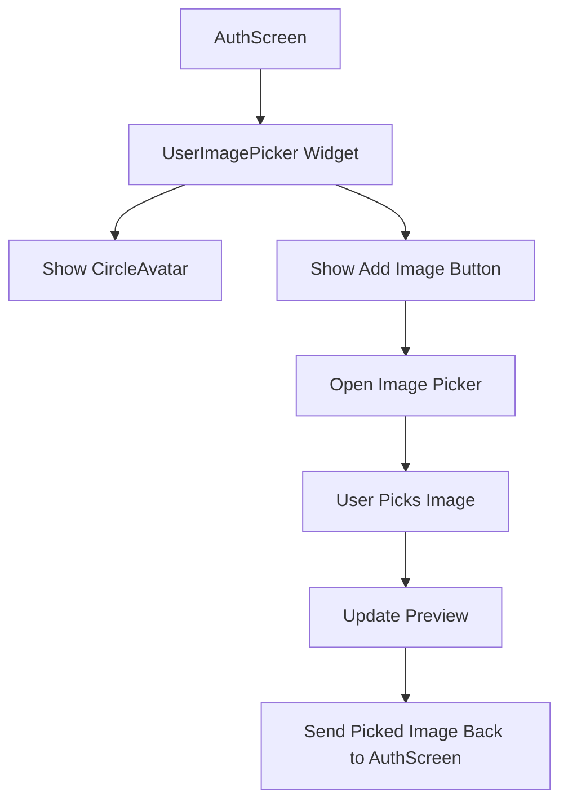
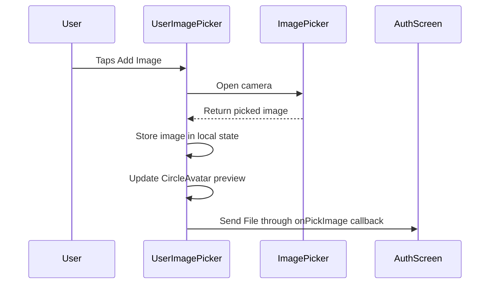
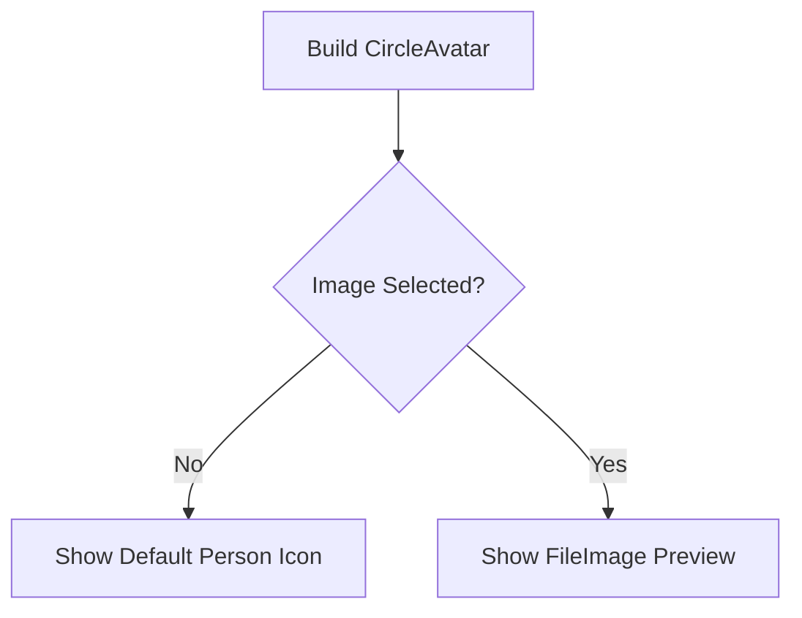
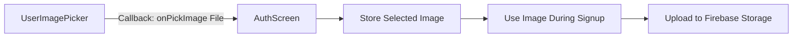

# Adding a User Image Picker Widget

## Overview

This lecture creates a reusable `UserImagePicker` widget.

This widget will later be used inside the signup form so that new users can choose or take a profile image before creating an account.

The widget is not a full screen. It is a smaller reusable UI component, so it should be placed inside a `widgets/` folder instead of a `screens/` folder.

The widget will display:

* A circular avatar preview
* A default person icon when no image has been selected
* A button labeled **Add Image**
* A preview of the selected image after the user picks one

---

## Why Create a Separate Widget?

The image picker UI has its own responsibility:

* Display the current image preview
* Let the user pick an image
* Store the selected image locally
* Notify the parent widget when an image was picked

Because this logic is separate from the authentication form itself, it makes sense to move it into its own widget.

This keeps the `AuthScreen` cleaner and easier to maintain.

---

## Folder Structure

Create a new folder inside `lib`:

```text
lib/widgets
```

Then create a new file:

```text
lib/widgets/user_image_picker.dart
```

The project structure will look like this:

```text
lib/
│
├── screens/
│   ├── auth.dart
│   ├── chat.dart
│   └── splash.dart
│
├── widgets/
│   └── user_image_picker.dart
│
└── main.dart
```

---

## Widget Responsibility



---

## Why Use a StatefulWidget?

The `UserImagePicker` must manage local UI state.

It needs to remember whether an image has already been picked.

Before the user selects an image, the widget shows a default icon.

After the user selects an image, the widget updates the UI and shows a preview.

Because the UI changes after picking an image, this widget should be a `StatefulWidget`.

---

## Creating the UserImagePicker Widget

### `user_image_picker.dart`

```dart
import 'dart:io';

import 'package:flutter/material.dart';
import 'package:image_picker/image_picker.dart';

class UserImagePicker extends StatefulWidget {
  const UserImagePicker({
    super.key,
    required this.onPickImage,
  });

  final void Function(File pickedImage) onPickImage;

  @override
  State<UserImagePicker> createState() {
    return _UserImagePickerState();
  }
}

class _UserImagePickerState extends State<UserImagePicker> {
  File? _pickedImageFile;

  void _pickImage() async {
    final pickedImage = await ImagePicker().pickImage(
      source: ImageSource.camera,
      imageQuality: 50,
      maxWidth: 150,
    );

    if (pickedImage == null) {
      return;
    }

    setState(() {
      _pickedImageFile = File(pickedImage.path);
    });

    widget.onPickImage(_pickedImageFile!);
  }

  @override
  Widget build(BuildContext context) {
    return Column(
      children: [
        CircleAvatar(
          radius: 40,
          backgroundColor: Colors.grey,
          foregroundImage: _pickedImageFile != null
              ? FileImage(_pickedImageFile!)
              : null,
          child: _pickedImageFile == null
              ? const Icon(
                  Icons.person,
                  size: 40,
                )
              : null,
        ),
        TextButton.icon(
          onPressed: _pickImage,
          icon: const Icon(Icons.image),
          label: Text(
            'Add Image',
            style: TextStyle(
              color: Theme.of(context).colorScheme.primary,
            ),
          ),
        ),
      ],
    );
  }
}
```

---

## Main Parts of the Widget

### 1. Local Image State

```dart
File? _pickedImageFile;
```

This variable stores the selected image file.

It is nullable because initially no image has been selected.

---

### 2. Picking an Image

```dart
final pickedImage = await ImagePicker().pickImage(
  source: ImageSource.camera,
  imageQuality: 50,
  maxWidth: 150,
);
```

This opens the camera and lets the user take a photo.

The result is an `XFile?`.

It can be `null` if the user cancels the action.

---

### 3. Handling Cancelled Image Selection

```dart
if (pickedImage == null) {
  return;
}
```

If the user does not pick or take an image, the function stops.

This prevents errors caused by trying to use a missing image.

---

### 4. Converting `XFile` to `File`

```dart
_pickedImageFile = File(pickedImage.path);
```

The `image_picker` package returns an `XFile`.

To preview or upload the image with Firebase Storage, it is commonly converted into a `File`.

---

### 5. Updating the Preview

```dart
setState(() {
  _pickedImageFile = File(pickedImage.path);
});
```

Calling `setState()` tells Flutter that the widget state has changed.

After this, Flutter rebuilds the widget and shows the selected image inside the `CircleAvatar`.

---

### 6. Sending the Image to the Parent Widget

```dart
widget.onPickImage(_pickedImageFile!);
```

The selected image is passed back to the parent widget through a callback.

This is important because the parent widget, such as `AuthScreen`, will later need the image for uploading to Firebase Storage.

---

## Callback Flow



---

## CircleAvatar Preview

The `CircleAvatar` is used to display the profile image preview.

```dart
CircleAvatar(
  radius: 40,
  backgroundColor: Colors.grey,
  foregroundImage: _pickedImageFile != null
      ? FileImage(_pickedImageFile!)
      : null,
  child: _pickedImageFile == null
      ? const Icon(
          Icons.person,
          size: 40,
        )
      : null,
)
```

If no image has been selected, the avatar shows a default person icon.

If an image has been selected, the avatar uses `FileImage` to show the local image file.

---

## Avatar Display Logic



---

## Add Image Button

The button is created with `TextButton.icon`.

```dart
TextButton.icon(
  onPressed: _pickImage,
  icon: const Icon(Icons.image),
  label: Text(
    'Add Image',
    style: TextStyle(
      color: Theme.of(context).colorScheme.primary,
    ),
  ),
)
```

When the user presses this button, `_pickImage()` runs.

---

## Why Use `imageQuality` and `maxWidth`?

```dart
imageQuality: 50,
maxWidth: 150,
```

These settings reduce the size of the selected image.

This is useful because profile images do not need to be extremely large.

Smaller images help with:

* Faster uploads
* Less Firebase Storage bandwidth usage
* Lower storage cost
* Faster image loading in the app

---

## Using the Widget in the Auth Screen

Later, the widget can be added to the signup form like this:

```dart
UserImagePicker(
  onPickImage: (pickedImage) {
    _selectedImage = pickedImage;
  },
)
```

The parent screen can store the selected image in a variable and upload it during signup.

---

## Parent-Child Communication



---

## Common Mistakes

### 1. Forgetting `dart:io`

The `File` class comes from `dart:io`.

```dart
import 'dart:io';
```

---

### 2. Forgetting `image_picker`

The image picker package must be imported.

```dart
import 'package:image_picker/image_picker.dart';
```

---

### 3. Not checking for `null`

The user may cancel image picking.

Always check:

```dart
if (pickedImage == null) {
  return;
}
```

---

### 4. Not calling `setState()`

If you update `_pickedImageFile` without `setState()`, the UI will not update.

Correct:

```dart
setState(() {
  _pickedImageFile = File(pickedImage.path);
});
```

---

### 5. Managing the image only inside the child widget

The parent widget also needs access to the image so it can upload it later.

That is why the callback is important:

```dart
widget.onPickImage(_pickedImageFile!);
```

---

## Summary

The `UserImagePicker` widget is a reusable component that handles image selection and preview.

It uses a `CircleAvatar` to show either a default icon or the selected image.

It uses `image_picker` to let the user take or choose an image.

After an image is picked, it stores the file locally, updates the preview with `setState()`, and sends the selected image back to the parent widget through a callback.

This prepares the app for the next step: integrating the image picker into the signup form and uploading the selected image to Firebase Storage.
