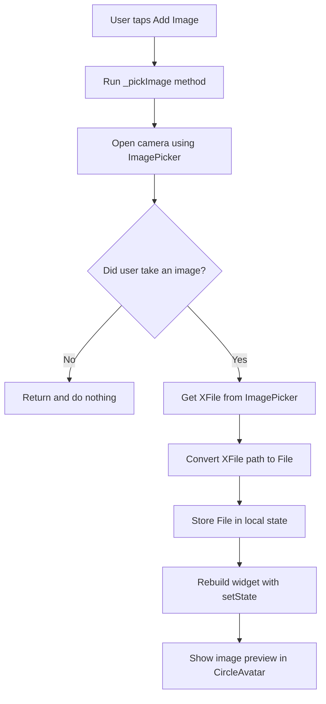
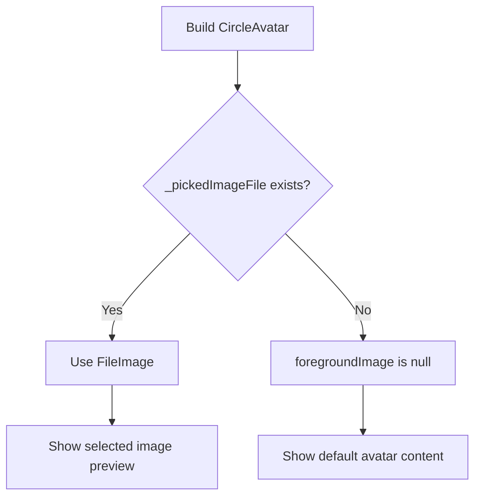
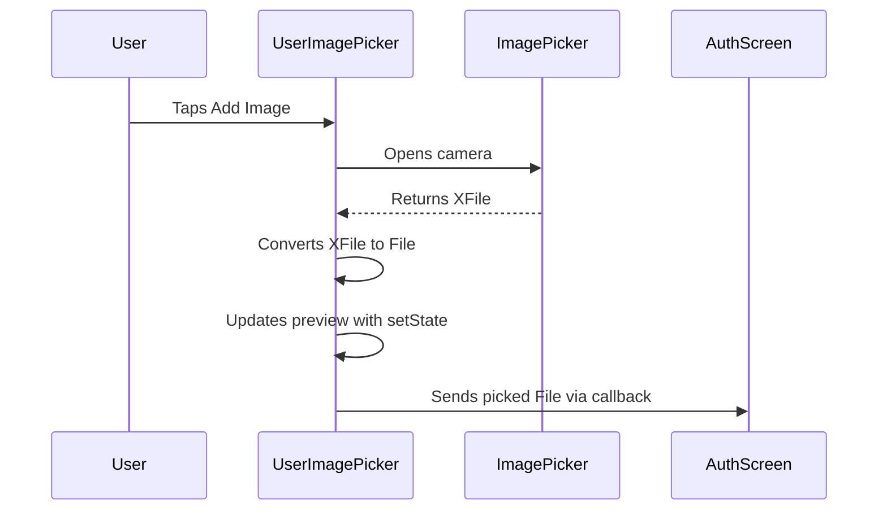
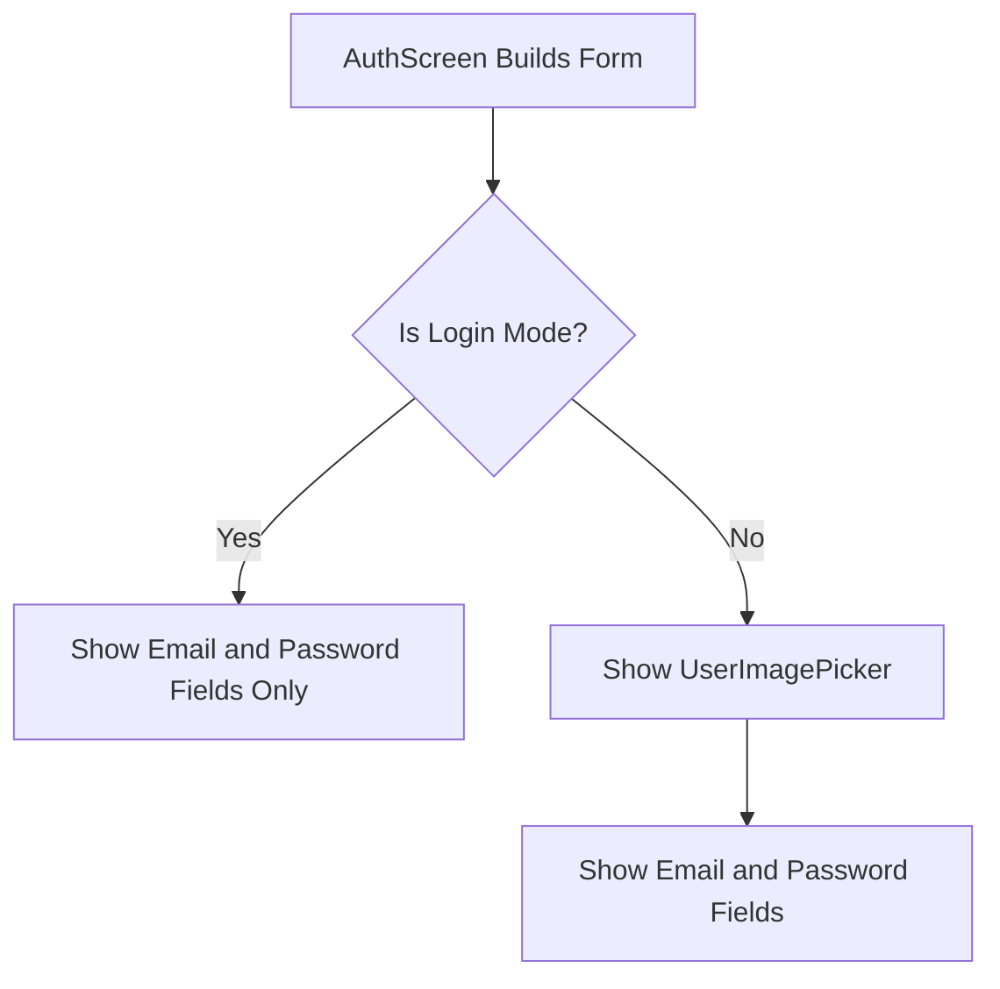

# Using the ImagePicker Package

## Overview

This lecture explains how to use the `image_picker` package to take or select an image and show a preview inside the app.

The image picker is used inside the `UserImagePicker` widget. This widget allows users to take a profile picture during signup.

The selected image is stored locally as a `File`, displayed inside a `CircleAvatar`, and later passed to the parent widget so it can be uploaded to Firebase Storage.

---

## Why We Need ImagePicker

The app needs users to upload a profile image when creating a new account.

To do that, the app must first allow the user to choose an image from the device.

The `image_picker` package can open:

* The device camera
* The device gallery

In this lecture, the camera is used as the image source.

---

## Image Picking Flow



---

## Importing Required Packages

The widget needs three imports.

```dart
import 'dart:io';

import 'package:flutter/material.dart';
import 'package:image_picker/image_picker.dart';
```

### Why `dart:io` Is Needed

The selected image will be stored as a `File`.

```dart
File? _pickedImageFile;
```

The `File` class comes from `dart:io`.

### Why `image_picker` Is Needed

The `image_picker` package provides:

```dart
ImagePicker
ImageSource
XFile
```

These are used to open the camera or gallery and receive the selected image.

---

## Creating the `_pickImage` Method

Inside `_UserImagePickerState`, add a new method:

```dart
void _pickImage() async {
  final pickedImage = await ImagePicker().pickImage(
    source: ImageSource.camera,
    imageQuality: 50,
    maxWidth: 150,
  );

  if (pickedImage == null) {
    return;
  }

  setState(() {
    _pickedImageFile = File(pickedImage.path);
  });

  widget.onPickImage(_pickedImageFile!);
}
```

This method opens the camera, waits for the user to take an image, converts the selected image into a `File`, and updates the UI.

---

## Understanding `pickImage()`

The `pickImage()` method is provided by the `image_picker` package.

```dart
final pickedImage = await ImagePicker().pickImage(
  source: ImageSource.camera,
  imageQuality: 50,
  maxWidth: 150,
);
```

It returns a `Future<XFile?>`.

This means the result is asynchronous and nullable.

It is nullable because the user may close the camera without taking a picture.

---

## Camera vs Gallery

To open the camera:

```dart
source: ImageSource.camera
```

To open the gallery:

```dart
source: ImageSource.gallery
```

Example using the gallery:

```dart
final pickedImage = await ImagePicker().pickImage(
  source: ImageSource.gallery,
);
```

In this app, the camera is used because users are expected to take a profile picture.

---

## Why Use `async` and `await`

Picking an image takes time because the app must open the camera and wait for user input.

Therefore, the method is asynchronous.

```dart
void _pickImage() async {
  final pickedImage = await ImagePicker().pickImage(
    source: ImageSource.camera,
  );
}
```

The `await` keyword pauses the function until the image picker returns a result.

---

## Handling Cancelled Image Picking

The user may close the camera without taking an image.

In that case, `pickedImage` will be `null`.

```dart
if (pickedImage == null) {
  return;
}
```

This check prevents the app from trying to access a missing image path.

Without this check, the app could crash.

---

## Converting `XFile` to `File`

The image picker returns an `XFile`.

Firebase Storage upload and local preview commonly use a `File`.

So the selected image is converted like this:

```dart
_pickedImageFile = File(pickedImage.path);
```

The `path` property gives the local file path of the selected image.

---

## Why Store the Image in State?

The selected image must be remembered so it can be shown in the UI.

```dart
File? _pickedImageFile;
```

It is nullable because no image is selected at the beginning.

After the user takes an image, this variable stores the selected file.

---

## Updating the UI With `setState()`

When the image is selected, the UI must rebuild so the preview can appear.

```dart
setState(() {
  _pickedImageFile = File(pickedImage.path);
});
```

Calling `setState()` tells Flutter that the widget data has changed.

Flutter then runs the `build()` method again.

---

## Showing the Image Preview

The selected image is displayed in a `CircleAvatar`.

```dart
CircleAvatar(
  radius: 40,
  backgroundColor: Colors.grey,
  foregroundImage: _pickedImageFile != null
      ? FileImage(_pickedImageFile!)
      : null,
)
```

If `_pickedImageFile` is not `null`, the avatar displays the selected image.

If `_pickedImageFile` is `null`, no foreground image is shown.

---

## Why Use `FileImage` Instead of `Image.file`

`foregroundImage` expects an `ImageProvider`.

`FileImage` creates an image provider from a local file.

```dart
FileImage(_pickedImageFile!)
```

`Image.file()` creates a widget, not an image provider.

That is why `FileImage` is used here.

---

## Avatar Preview Logic



---

## Complete `UserImagePicker` Widget

```dart
import 'dart:io';

import 'package:flutter/material.dart';
import 'package:image_picker/image_picker.dart';

class UserImagePicker extends StatefulWidget {
  const UserImagePicker({
    super.key,
    required this.onPickImage,
  });

  final void Function(File pickedImage) onPickImage;

  @override
  State<UserImagePicker> createState() {
    return _UserImagePickerState();
  }
}

class _UserImagePickerState extends State<UserImagePicker> {
  File? _pickedImageFile;

  void _pickImage() async {
    final pickedImage = await ImagePicker().pickImage(
      source: ImageSource.camera,
      imageQuality: 50,
      maxWidth: 150,
    );

    if (pickedImage == null) {
      return;
    }

    setState(() {
      _pickedImageFile = File(pickedImage.path);
    });

    widget.onPickImage(_pickedImageFile!);
  }

  @override
  Widget build(BuildContext context) {
    return Column(
      children: [
        CircleAvatar(
          radius: 40,
          backgroundColor: Colors.grey,
          foregroundImage: _pickedImageFile != null
              ? FileImage(_pickedImageFile!)
              : null,
          child: _pickedImageFile == null
              ? const Icon(
                  Icons.person,
                  size: 40,
                )
              : null,
        ),
        TextButton.icon(
          onPressed: _pickImage,
          icon: const Icon(Icons.image),
          label: Text(
            'Add Image',
            style: TextStyle(
              color: Theme.of(context).colorScheme.primary,
            ),
          ),
        ),
      ],
    );
  }
}
```

---

## Connecting the Button to `_pickImage`

The `TextButton.icon` must call `_pickImage` when pressed.

```dart
TextButton.icon(
  onPressed: _pickImage,
  icon: const Icon(Icons.image),
  label: Text(
    'Add Image',
    style: TextStyle(
      color: Theme.of(context).colorScheme.primary,
    ),
  ),
)
```

When the user taps **Add Image**, the camera opens.

---

## Sending the Picked Image to the Parent

After the image is selected, the widget sends the file to the parent widget.

```dart
widget.onPickImage(_pickedImageFile!);
```

This is important because the `AuthScreen` will later need the image file to upload it to Firebase Storage.

---

## Parent Callback Flow



---

## Adding the Widget to the Auth Screen

The image picker should only be shown during signup.

Users who are only logging in do not need to pick an image.

Inside the signup form column, add:

```dart
if (!_isLogin)
  UserImagePicker(
    onPickImage: (pickedImage) {
      _selectedImage = pickedImage;
    },
  ),
```

This means:

* If `_isLogin` is `true`, the image picker is hidden
* If `_isLogin` is `false`, the image picker is shown

---

## Auth Screen Display Logic



---

## Restarting the App After Installing Packages

After installing packages like `image_picker`, the app may need a full restart.

This is because packages that use native device features can require the app bundle to be rebuilt.

Recommended steps:

1. Stop the running app.
2. Run the app again from the beginning.
3. Test the image picker.

A hot reload may not be enough after adding native packages.

---

## Styling the Add Image Button

The button text color can be matched with the app theme.

Correct:

```dart
color: Theme.of(context).colorScheme.primary
```

This accesses the primary color from the current `ColorScheme`.

---

## Why Reduce Image Quality and Width?

The image picker options are configured like this:

```dart
imageQuality: 50,
maxWidth: 150,
```

These settings make the image smaller before upload.

This is useful because the image will only be displayed as a small profile picture.

Smaller images provide several benefits:

* Faster upload
* Faster download
* Less bandwidth usage
* Less Firebase Storage usage
* Better performance on slower networks

---

## Common Mistakes

### 1. Forgetting to check for `null`

Always handle the case where the user cancels image picking.

```dart
if (pickedImage == null) {
  return;
}
```

---

### 2. Forgetting `setState()`

If the image file is updated without `setState()`, the UI will not show the new preview.

```dart
setState(() {
  _pickedImageFile = File(pickedImage.path);
});
```

---

### 3. Using `Image.file` for `foregroundImage`

This is incorrect:

```dart
foregroundImage: Image.file(_pickedImageFile!)
```

`foregroundImage` needs an `ImageProvider`, not a widget.

Use:

```dart
foregroundImage: FileImage(_pickedImageFile!)
```

---

### 4. Showing the image picker during login

The image picker should only appear when creating a new account.

```dart
if (!_isLogin)
  UserImagePicker(...)
```

---

### 5. Expecting camera to work everywhere

The camera may not work on all simulators or emulators.

For camera testing, a physical device is often more reliable.

---

## Summary

The `image_picker` package allows the app to open the camera or gallery and return a selected image as an `XFile`.

Because the result can be `null`, the app must check whether the user actually picked an image.

The selected `XFile` can then be converted into a `File` by using its path.

Inside the `UserImagePicker`, the selected image is stored in local state, shown as a preview inside a `CircleAvatar`, and passed back to the parent widget through a callback.

This completes the image picking and preview step. The next step is to upload the selected image to Firebase Storage during signup.
