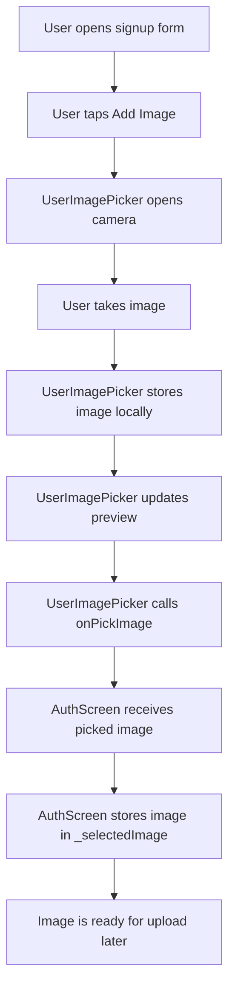
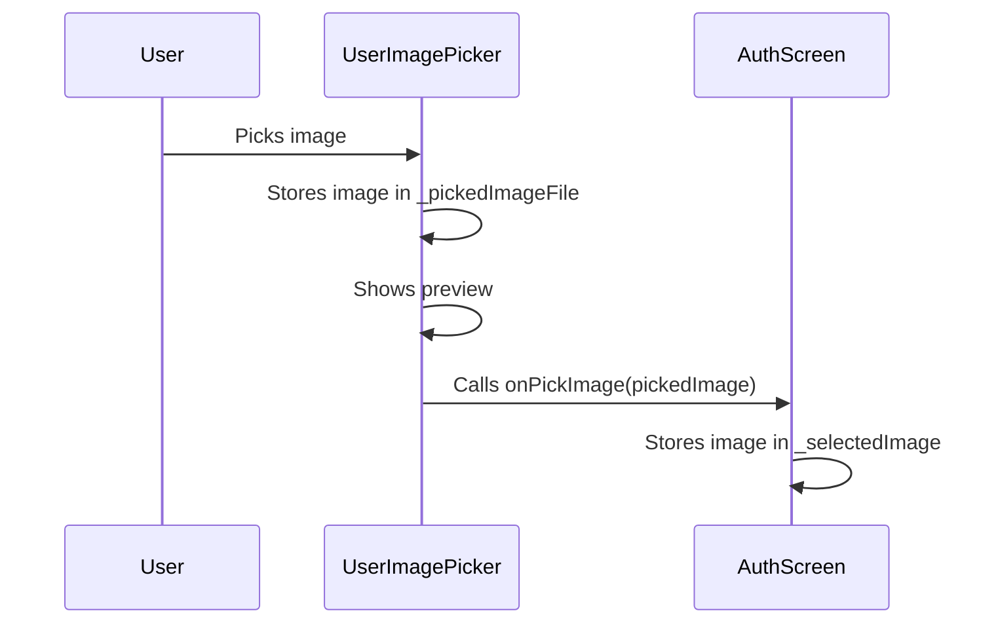
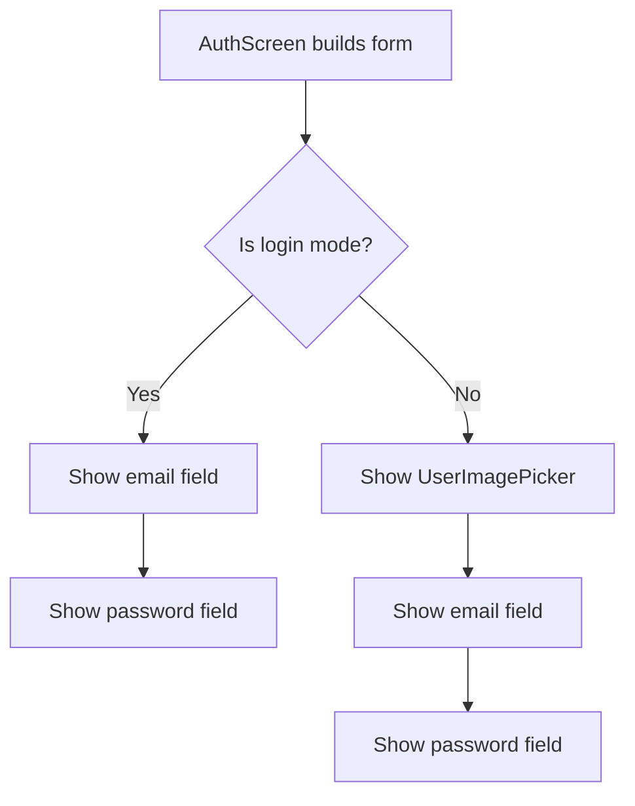
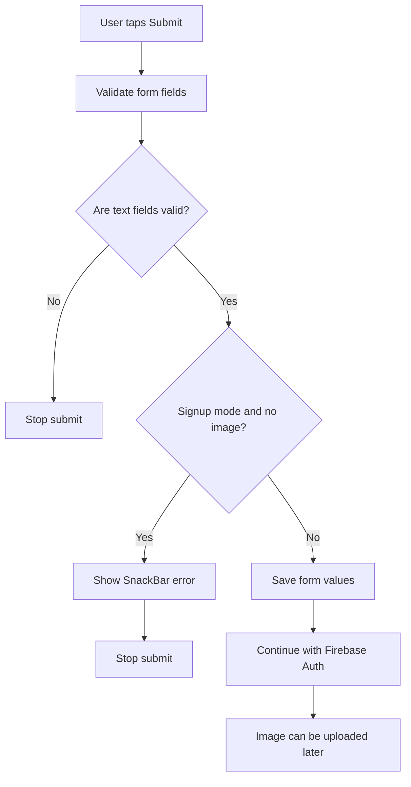
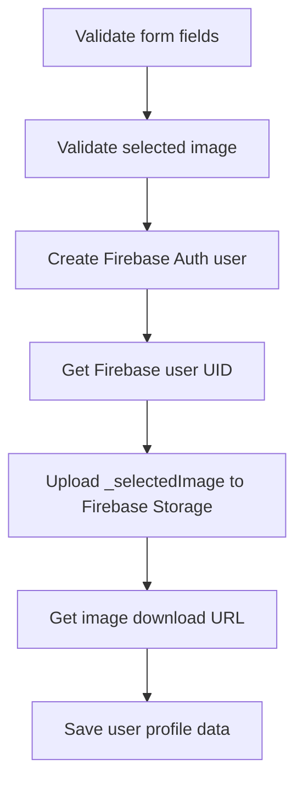

# Managing the Selected Image in the Authentication Form

## Overview

This lecture connects the `UserImagePicker` widget to the authentication form.

Previously, the `UserImagePicker` could open the camera, let the user take an image, and show a preview inside a `CircleAvatar`.

However, the selected image was only managed inside the `UserImagePicker` widget. The parent `AuthScreen` did not yet know which image was selected.

To upload the image later during signup, the selected image must be passed from the child widget back to the parent authentication form.

This is done by using a callback function.

---

## Goal

The goal is to store the selected profile image in the `AuthScreen`.

The image should be:

* Picked inside `UserImagePicker`
* Previewed inside `UserImagePicker`
* Passed back to `AuthScreen`
* Stored in a `File? _selectedImage` variable
* Validated before signup is allowed
* Uploaded later to Firebase Storage

---

## Image Selection Flow



---

## Why the Parent Needs the Selected Image

The `UserImagePicker` is only responsible for picking and previewing the image.

But the actual signup process happens inside the `AuthScreen`.

That means the `AuthScreen` must have access to all required signup data:

* Email
* Password
* Username
* Profile image

Without passing the selected image to the parent, the signup form would not be able to upload it to Firebase Storage later.

---

## Adding `_selectedImage` to `AuthScreen`

Inside `_AuthScreenState`, add a nullable `File` variable.

```dart
File? _selectedImage;
```

The variable is nullable because no image is selected when the form first appears.

Since `File` comes from `dart:io`, add this import at the top of `auth.dart`:

```dart
import 'dart:io';
```

---

## AuthScreen State Example

```dart
import 'dart:io';

class _AuthScreenState extends State<AuthScreen> {
  final _formKey = GlobalKey<FormState>();

  var _isLogin = true;
  var _enteredEmail = '';
  var _enteredPassword = '';

  File? _selectedImage;

  // ...
}
```

---

## Updating the `UserImagePicker` Widget

The `UserImagePicker` needs a callback so it can send the selected image to its parent.

In `user_image_picker.dart`, add a required `onPickImage` property.

```dart
final void Function(File pickedImage) onPickImage;
```

Then add it to the constructor.

```dart
const UserImagePicker({
  super.key,
  required this.onPickImage,
});
```

---

## Full `UserImagePicker` Structure

```dart
import 'dart:io';

import 'package:flutter/material.dart';
import 'package:image_picker/image_picker.dart';

class UserImagePicker extends StatefulWidget {
  const UserImagePicker({
    super.key,
    required this.onPickImage,
  });

  final void Function(File pickedImage) onPickImage;

  @override
  State<UserImagePicker> createState() {
    return _UserImagePickerState();
  }
}

class _UserImagePickerState extends State<UserImagePicker> {
  File? _pickedImageFile;

  void _pickImage() async {
    final pickedImage = await ImagePicker().pickImage(
      source: ImageSource.camera,
      imageQuality: 50,
      maxWidth: 150,
    );

    if (pickedImage == null) {
      return;
    }

    setState(() {
      _pickedImageFile = File(pickedImage.path);
    });

    widget.onPickImage(_pickedImageFile!);
  }

  @override
  Widget build(BuildContext context) {
    return Column(
      children: [
        CircleAvatar(
          radius: 40,
          backgroundColor: Colors.grey,
          foregroundImage: _pickedImageFile != null
              ? FileImage(_pickedImageFile!)
              : null,
          child: _pickedImageFile == null
              ? const Icon(
                  Icons.person,
                  size: 40,
                )
              : null,
        ),
        TextButton.icon(
          onPressed: _pickImage,
          icon: const Icon(Icons.image),
          label: Text(
            'Add Image',
            style: TextStyle(
              color: Theme.of(context).colorScheme.primary,
            ),
          ),
        ),
      ],
    );
  }
}
```

---

## Calling the Callback

After the image has been picked and stored locally, call the callback.

```dart
widget.onPickImage(_pickedImageFile!);
```

This sends the selected image file to the parent widget.

The exclamation mark is used because `_pickedImageFile` was just assigned before this line.

```dart
setState(() {
  _pickedImageFile = File(pickedImage.path);
});

widget.onPickImage(_pickedImageFile!);
```

---

## Child-to-Parent Communication



---

## Using `UserImagePicker` in the Auth Form

In `auth.dart`, add `UserImagePicker` inside the form.

It should only be shown when the user is signing up.

```dart
if (!_isLogin)
  UserImagePicker(
    onPickImage: (pickedImage) {
      setState(() {
        _selectedImage = pickedImage;
      });
    },
  ),
```

This means:

* In login mode, the image picker is hidden
* In signup mode, the image picker is shown
* When the user picks an image, `_selectedImage` is updated

---

## Login vs Signup UI Logic



---

## Storing the Picked Image in the Parent

The callback receives the image from the child widget.

```dart
onPickImage: (pickedImage) {
  setState(() {
    _selectedImage = pickedImage;
  });
},
```

This stores the selected image in the parent form state.

Using `setState()` ensures that the parent widget knows its state changed.

Even if the parent does not immediately show the image itself, this keeps the form state consistent.

---

## Adding Image Validation During Signup

The form already validates the text fields.

However, the image is not a `TextFormField`, so it must be validated manually.

Inside `_submit()`, add an extra check.

```dart
if (!_isLogin && _selectedImage == null) {
  ScaffoldMessenger.of(context).showSnackBar(
    const SnackBar(
      content: Text('Please pick an image.'),
    ),
  );
  return;
}
```

This check means:

* If the user is logging in, no image is required
* If the user is signing up, an image is required
* If no image was selected, the signup process stops

---

## Submit Flow With Image Validation



---

## Updated `_submit()` Method

```dart
void _submit() async {
  final isValid = _formKey.currentState!.validate();

  if (!isValid) {
    return;
  }

  if (!_isLogin && _selectedImage == null) {
    ScaffoldMessenger.of(context).showSnackBar(
      const SnackBar(
        content: Text('Please pick an image.'),
      ),
    );
    return;
  }

  _formKey.currentState!.save();

  // Continue with Firebase Authentication.
  // Later, _selectedImage will be uploaded to Firebase Storage.
}
```

---

## Why the Image Check Only Runs During Signup

Users only need to provide a profile image when creating a new account.

When logging in, the user already exists, so there is no need to pick a new image.

That is why the validation uses this condition:

```dart
if (!_isLogin && _selectedImage == null)
```

This means:

```text
If we are not in login mode,
and no image was selected,
stop the signup process.
```

---

## Full Auth Form Integration Example

```dart
import 'dart:io';

import 'package:flutter/material.dart';

import 'package:flutter_chat/widgets/user_image_picker.dart';

class AuthScreen extends StatefulWidget {
  const AuthScreen({super.key});

  @override
  State<AuthScreen> createState() {
    return _AuthScreenState();
  }
}

class _AuthScreenState extends State<AuthScreen> {
  final _formKey = GlobalKey<FormState>();

  var _isLogin = true;
  var _enteredEmail = '';
  var _enteredPassword = '';

  File? _selectedImage;

  void _submit() async {
    final isValid = _formKey.currentState!.validate();

    if (!isValid) {
      return;
    }

    if (!_isLogin && _selectedImage == null) {
      ScaffoldMessenger.of(context).showSnackBar(
        const SnackBar(
          content: Text('Please pick an image.'),
        ),
      );
      return;
    }

    _formKey.currentState!.save();

    // Continue with login or signup.
    // During signup, _selectedImage will be uploaded later.
  }

  @override
  Widget build(BuildContext context) {
    return Scaffold(
      body: Center(
        child: SingleChildScrollView(
          child: Card(
            margin: const EdgeInsets.all(20),
            child: Padding(
              padding: const EdgeInsets.all(16),
              child: Form(
                key: _formKey,
                child: Column(
                  mainAxisSize: MainAxisSize.min,
                  children: [
                    if (!_isLogin)
                      UserImagePicker(
                        onPickImage: (pickedImage) {
                          setState(() {
                            _selectedImage = pickedImage;
                          });
                        },
                      ),

                    TextFormField(
                      decoration: const InputDecoration(
                        labelText: 'Email Address',
                      ),
                      keyboardType: TextInputType.emailAddress,
                      autocorrect: false,
                      textCapitalization: TextCapitalization.none,
                      validator: (value) {
                        if (value == null ||
                            value.trim().isEmpty ||
                            !value.contains('@')) {
                          return 'Please enter a valid email address.';
                        }

                        return null;
                      },
                      onSaved: (value) {
                        _enteredEmail = value!;
                      },
                    ),

                    TextFormField(
                      decoration: const InputDecoration(
                        labelText: 'Password',
                      ),
                      obscureText: true,
                      validator: (value) {
                        if (value == null || value.trim().length < 6) {
                          return 'Password must be at least 6 characters long.';
                        }

                        return null;
                      },
                      onSaved: (value) {
                        _enteredPassword = value!;
                      },
                    ),

                    const SizedBox(height: 12),

                    ElevatedButton(
                      onPressed: _submit,
                      child: Text(_isLogin ? 'Login' : 'Signup'),
                    ),

                    TextButton(
                      onPressed: () {
                        setState(() {
                          _isLogin = !_isLogin;
                        });
                      },
                      child: Text(
                        _isLogin
                            ? 'Create an account'
                            : 'I already have an account',
                      ),
                    ),
                  ],
                ),
              ),
            ),
          ),
        ),
      ),
    );
  }
}
```

---

## Important Note About `_selectedImage`

At this stage, `_selectedImage` is only stored in the authentication form.

It is not uploaded yet.

The upload will happen later after Firebase successfully creates the new user account.

The later signup flow will look like this:



---

## Common Mistakes

### 1. Forgetting `dart:io`

Because `_selectedImage` uses `File`, this import is required:

```dart
import 'dart:io';
```

---

### 2. Showing the image picker in login mode

The image picker should only be shown in signup mode.

```dart
if (!_isLogin)
  UserImagePicker(...)
```

---

### 3. Forgetting to pass `onPickImage`

Because `onPickImage` is required, the widget must receive this argument.

```dart
UserImagePicker(
  onPickImage: (pickedImage) {
    _selectedImage = pickedImage;
  },
)
```

---

### 4. Not validating the image before signup

The image is not part of the `Form` widget, so it must be checked manually.

```dart
if (!_isLogin && _selectedImage == null) {
  return;
}
```

---

### 5. Uploading the image before user creation

For profile images, it is usually better to create the user first.

That gives you the Firebase user UID, which can then be used in the Storage path.

Example:

```text
user_images/{uid}.jpg
```

---

## Summary

The selected image is now managed by the parent `AuthScreen`.

The `UserImagePicker` still handles picking and previewing the image, but it sends the selected image to the parent through the `onPickImage` callback.

The parent stores that image in:

```dart
File? _selectedImage;
```

During signup, the form checks whether an image was selected.

If no image was selected, the app shows an error and stops the signup process.

This prepares the authentication flow for the next step: uploading the selected image to Firebase Storage after creating the user account.
