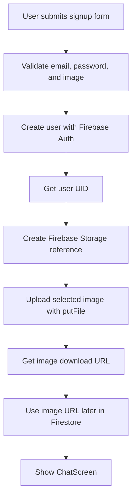
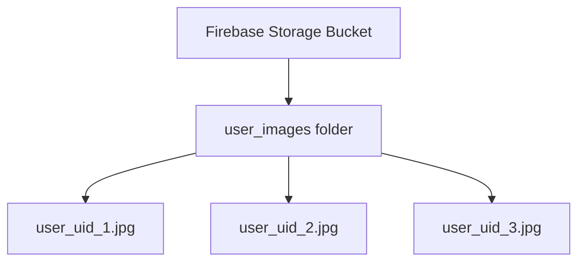
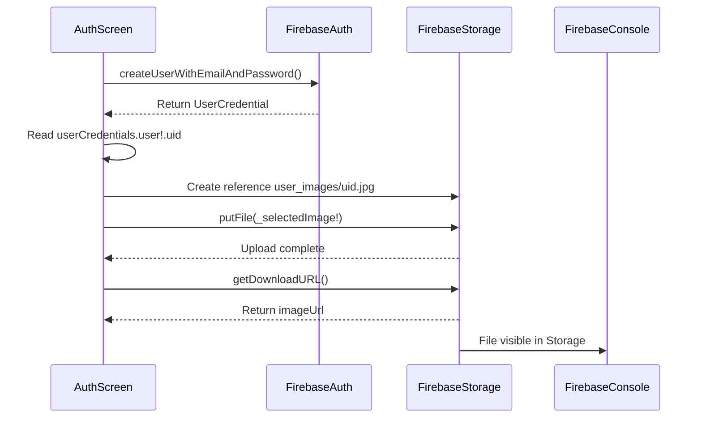
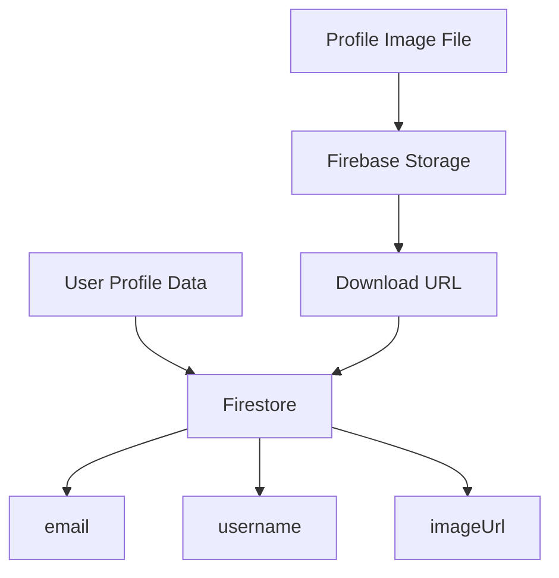
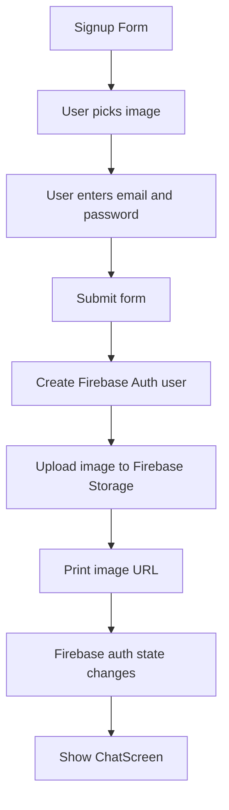

# Uploading Images to Firebase

## Overview

This lecture implements the actual image upload step.

Previously, the app already allowed users to pick an image during signup and store that selected image in the authentication form as a `File`.

Now, after a new user account is created with Firebase Authentication, the selected image is uploaded to Firebase Storage.

The user's Firebase UID is used as the image filename. This ensures that every user gets a unique profile image path.

---

## Why Upload After Creating the User?

Firebase Authentication only handles account creation and login.

It stores authentication-related data such as:

* Email
* Password credentials
* User ID
* Authentication token

It does not directly store profile images.

Therefore, the signup process must happen in multiple steps:

1. Validate the form.
2. Create the user with Firebase Authentication.
3. Get the new user's UID.
4. Upload the selected profile image to Firebase Storage.
5. Get the image download URL.
6. Store the URL later with the user's profile data.

---

## Signup and Upload Flow



---

## Required Import

To upload files to Firebase Storage, import the `firebase_storage` package.

```dart id="se5v61"
import 'package:firebase_storage/firebase_storage.dart';
```

This gives access to:

```dart id="82kj4u"
FirebaseStorage.instance
```

---

## Creating the Firebase Storage Reference

After creating a new user, use the returned `userCredentials` object to access the user's UID.

```dart id="g0r6qc"
final storageRef = FirebaseStorage.instance
    .ref()
    .child('user_images')
    .child('${userCredentials.user!.uid}.jpg');
```

This creates a storage path like:

```text id="9qepfz"
user_images/user-id.jpg
```

For example:

```text id="lfn20e"
user_images/abc123xyz.jpg
```

---

## Why Use the User UID as the Filename?

Every Firebase user has a unique UID.

Using the UID as the image filename has several benefits:

* Each user's image has a unique path
* Images are easy to associate with users
* Users do not overwrite each other's images
* The storage structure stays organized
* The path can be used in Firebase Storage security rules later

---

## Firebase Storage Path Structure



---

## Uploading the Selected Image

The selected image is stored in the authentication form as:

```dart id="1cewi3"
File? _selectedImage;
```

Because the form already validates that an image exists during signup, the upload code can use:

```dart id="m4lekj"
await storageRef.putFile(_selectedImage!);
```

The exclamation mark tells Dart that `_selectedImage` is not `null` at this point.

---

## Getting the Download URL

After the upload finishes, call:

```dart id="fma2r5"
final imageUrl = await storageRef.getDownloadURL();
```

This returns a URL that can later be used to display the uploaded image.

For example, it can be used with:

```dart id="03ejv1"
Image.network(imageUrl)
```

or:

```dart id="drtomf"
NetworkImage(imageUrl)
```

---

## Upload Sequence



---

## Updated Signup Logic

The upload logic should be added after the user is created.

```dart id="c7ui4l"
final userCredentials = await _firebase.createUserWithEmailAndPassword(
  email: _enteredEmail,
  password: _enteredPassword,
);

final storageRef = FirebaseStorage.instance
    .ref()
    .child('user_images')
    .child('${userCredentials.user!.uid}.jpg');

await storageRef.putFile(_selectedImage!);

final imageUrl = await storageRef.getDownloadURL();

print(imageUrl);
```

---

## Full `_submit()` Example

```dart id="3r9mmt"
import 'dart:io';

import 'package:firebase_auth/firebase_auth.dart';
import 'package:firebase_storage/firebase_storage.dart';
import 'package:flutter/material.dart';

final _firebase = FirebaseAuth.instance;

class _AuthScreenState extends State<AuthScreen> {
  final _formKey = GlobalKey<FormState>();

  var _isLogin = true;
  var _enteredEmail = '';
  var _enteredPassword = '';
  File? _selectedImage;

  void _submit() async {
    final isValid = _formKey.currentState!.validate();

    if (!isValid) {
      return;
    }

    if (!_isLogin && _selectedImage == null) {
      ScaffoldMessenger.of(context).showSnackBar(
        const SnackBar(
          content: Text('Please pick an image.'),
        ),
      );
      return;
    }

    _formKey.currentState!.save();

    try {
      if (_isLogin) {
        await _firebase.signInWithEmailAndPassword(
          email: _enteredEmail,
          password: _enteredPassword,
        );
      } else {
        final userCredentials = await _firebase.createUserWithEmailAndPassword(
          email: _enteredEmail,
          password: _enteredPassword,
        );

        final storageRef = FirebaseStorage.instance
            .ref()
            .child('user_images')
            .child('${userCredentials.user!.uid}.jpg');

        await storageRef.putFile(_selectedImage!);

        final imageUrl = await storageRef.getDownloadURL();

        print(imageUrl);

        // Later, this imageUrl will be stored in Firestore
        // together with the user's email and username.
      }
    } on FirebaseAuthException catch (error) {
      ScaffoldMessenger.of(context).clearSnackBars();
      ScaffoldMessenger.of(context).showSnackBar(
        SnackBar(
          content: Text(error.message ?? 'Authentication failed.'),
        ),
      );
    } catch (error) {
      ScaffoldMessenger.of(context).clearSnackBars();
      ScaffoldMessenger.of(context).showSnackBar(
        const SnackBar(
          content: Text('Something went wrong. Please try again.'),
        ),
      );
    }
  }
}
```

---

## Important Detail About `userCredentials.user`

After calling:

```dart id="fd3lvx"
createUserWithEmailAndPassword()
```

Firebase returns a `UserCredential` object.

From that object, you can access the created user:

```dart id="ipik96"
userCredentials.user
```

Then you can access the user's UID:

```dart id="nuoy11"
userCredentials.user!.uid
```

The user could theoretically be nullable, but if user creation succeeds, it should exist.

That is why the code uses:

```dart id="belmxq"
userCredentials.user!.uid
```

---

## What `ref()` Does

```dart id="dshfve"
FirebaseStorage.instance.ref()
```

This gives access to the root reference of the Firebase Storage bucket.

From there, `.child()` is used to build a path.

```dart id="t70zt5"
.child('user_images')
.child('${userCredentials.user!.uid}.jpg')
```

This does not require the folder or file to already exist.

Firebase Storage creates the path automatically when the file is uploaded.

---

## What `putFile()` Does

```dart id="5d7prr"
await storageRef.putFile(_selectedImage!);
```

`putFile()` uploads a local file to Firebase Storage.

It returns an upload task that can be awaited.

By awaiting it, the app waits until the upload finishes before continuing.

---

## What `getDownloadURL()` Does

```dart id="e6n0r4"
final imageUrl = await storageRef.getDownloadURL();
```

`getDownloadURL()` returns a URL for the uploaded file.

This URL is important because the app will later need it to display the image again.

The image itself is stored in Firebase Storage.

The URL can be stored in a database, such as Firestore.

---

## Storage vs Database



Firebase Storage stores the actual image file.

Firestore will later store user profile information such as:

```json id="sctmif"
{
  "email": "user@example.com",
  "username": "john",
  "image_url": "https://firebase-storage-download-url.com/image.jpg"
}
```

---

## Error Handling

The image upload should be inside the same `try-catch` block as the authentication logic.

This way, errors from both Firebase Authentication and Firebase Storage can be handled.

Example:

```dart id="edxuq3"
try {
  // Create user
  // Upload image
  // Get download URL
} on FirebaseAuthException catch (error) {
  // Handle authentication errors
} catch (error) {
  // Handle upload or other errors
}
```

---

## Possible Upload Problems

Image upload can fail if:

* Firebase Storage is not enabled
* The `firebase_storage` package is not installed
* Storage security rules deny the request
* The user is not authenticated
* The selected image is null
* The device has no internet connection
* The file path is invalid

---

## Storage Security Rules Reminder

For this upload to work, Firebase Storage rules must allow authenticated users to write files.

A simple development rule is:

```text id="0wtk1d"
rules_version = '2';

service firebase.storage {
  match /b/{bucket}/o {
    match /{allPaths=**} {
      allow read, write: if request.auth != null;
    }
  }
}
```

This allows only authenticated users to read and write files.

---

## More Secure Rule for User Images

For a production app, a stricter rule is better.

```text id="3rti1a"
rules_version = '2';

service firebase.storage {
  match /b/{bucket}/o {
    match /user_images/{userId}.jpg {
      allow read: if request.auth != null;
      allow write: if request.auth != null
                   && request.auth.uid == userId;
    }
  }
}
```

This ensures users can only upload their own image.

---

## Testing the Upload

To test the upload:

1. Run the app.
2. Switch to signup mode.
3. Pick or take a profile image.
4. Enter a new email and password.
5. Press **Signup**.
6. Open Firebase Console.
7. Go to **Storage**.
8. Refresh the page.
9. Open the `user_images` folder.
10. Confirm that a file named with the user's UID exists.

---

## Expected Firebase Storage Result

```text id="h8tlce"
Storage
└── user_images
    └── user_uid.jpg
```

When opening the file in Firebase Console, you should see a preview of the uploaded image.

This confirms that the upload worked.

---

## Current Signup Flow After This Lecture



---

## Common Mistakes

### 1. Uploading before creating the user

Avoid uploading the image before user creation if you want to use the UID in the file path.

Correct order:

```text id="v9lqzd"
Create user → Get UID → Upload image
```

---

### 2. Forgetting the Firebase Storage import

```dart id="fwywq6"
import 'package:firebase_storage/firebase_storage.dart';
```

---

### 3. Forgetting to await `putFile()`

If you do not await the upload, the app may continue before the file is fully uploaded.

```dart id="tcrzmh"
await storageRef.putFile(_selectedImage!);
```

---

### 4. Getting the download URL before upload finishes

This should happen after `putFile()` completes.

```dart id="04h169"
await storageRef.putFile(_selectedImage!);
final imageUrl = await storageRef.getDownloadURL();
```

---

### 5. Not validating `_selectedImage`

The image must be selected before uploading.

```dart id="2v1n6h"
if (!_isLogin && _selectedImage == null) {
  return;
}
```

---

### 6. Using unsafe file names

Avoid using email addresses as file names because they can contain special characters and expose user information.

Using the UID is cleaner and safer.

```dart id="q5b9it"
.child('${userCredentials.user!.uid}.jpg')
```

---

## Summary

This lecture adds image upload to Firebase Storage.

After a new user is created with Firebase Authentication, the app creates a Firebase Storage reference using the user's UID.

Then it uploads the selected profile image with:

```dart id="r5e7kd"
await storageRef.putFile(_selectedImage!);
```

After the upload finishes, the app retrieves the image download URL:

```dart id="82eo56"
final imageUrl = await storageRef.getDownloadURL();
```

For now, the URL is printed.

Later, it will be stored in Firestore together with the user's username and email address.

This completes the first working version of uploading user profile images to Firebase Storage.
