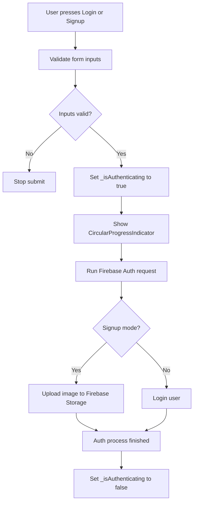
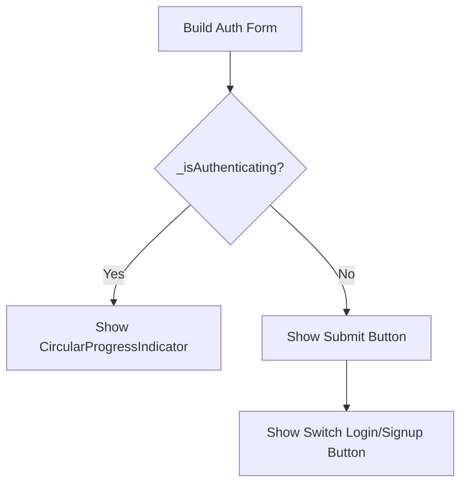
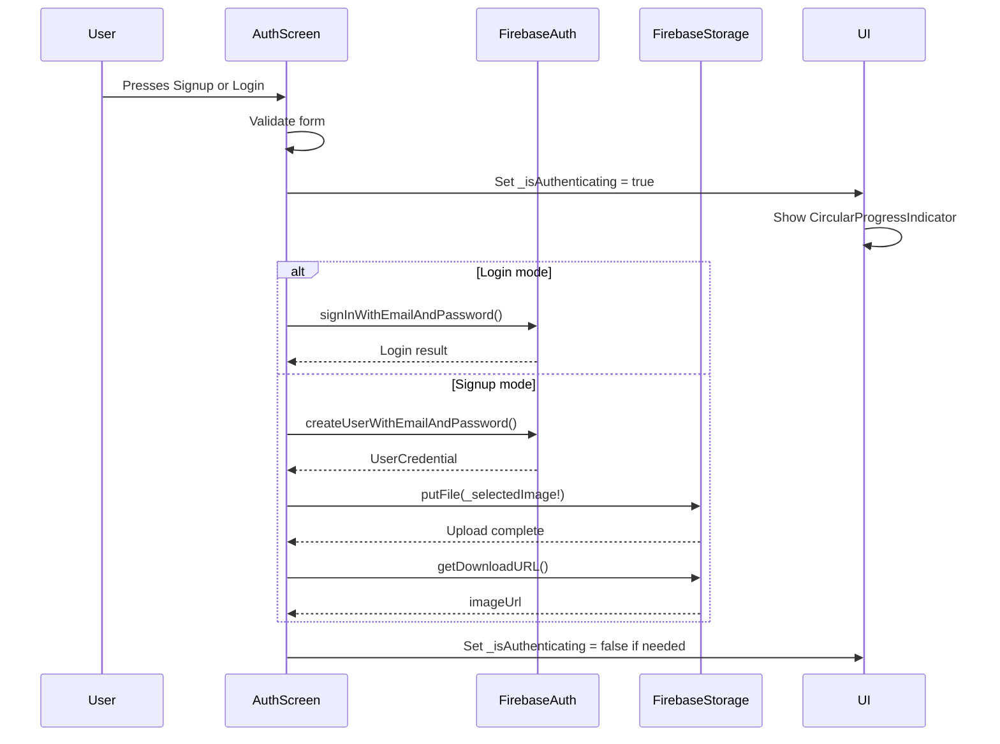
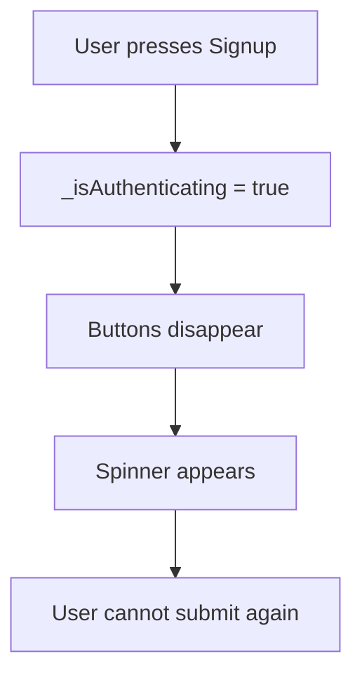
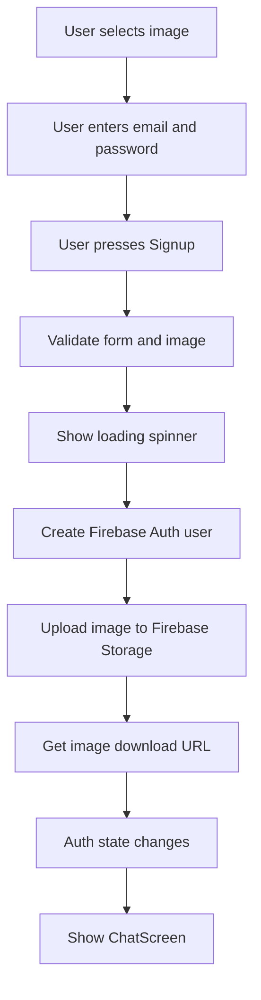

# Showing a Loading Spinner Whilst Uploading

## Overview

This lecture adds a loading spinner to the authentication form while Firebase authentication and image upload are running.

Creating a new user and uploading a profile image can take some time. Logging in can also take a moment because the app has to communicate with Firebase.

During that time, the user should not be able to press the submit button again.

To solve this, we add a loading state variable named `_isAuthenticating`.

When authentication starts, `_isAuthenticating` becomes `true`.

When authentication finishes or fails, `_isAuthenticating` becomes `false` again.

---

## Why a Loading Spinner Is Needed

Without a loading spinner, users may not know that something is happening.

They might press the signup or login button multiple times.

That can cause:

* Duplicate requests
* Confusing UI behavior
* Multiple Firebase calls
* A poor user experience

A loading spinner gives clear feedback that the app is working.

---

## Loading State Flow



---

## Adding the Loading State Variable

Inside `_AuthScreenState`, add a boolean variable.

```dart
var _isAuthenticating = false;
```

This variable controls whether the form should show:

* The login/signup buttons
* Or a loading spinner

---

## AuthScreen State Example

```dart
class _AuthScreenState extends State<AuthScreen> {
  final _formKey = GlobalKey<FormState>();

  var _isLogin = true;
  var _enteredEmail = '';
  var _enteredPassword = '';
  var _isAuthenticating = false;

  File? _selectedImage;

  // ...
}
```

---

## Setting Loading State to `true`

When the submit process starts, set `_isAuthenticating` to `true`.

```dart
setState(() {
  _isAuthenticating = true;
});
```

This should happen after validation succeeds.

```dart
void _submit() async {
  final isValid = _formKey.currentState!.validate();

  if (!isValid) {
    return;
  }

  if (!_isLogin && _selectedImage == null) {
    ScaffoldMessenger.of(context).showSnackBar(
      const SnackBar(
        content: Text('Please pick an image.'),
      ),
    );
    return;
  }

  _formKey.currentState!.save();

  setState(() {
    _isAuthenticating = true;
  });

  // Firebase logic continues here...
}
```

---

## Why Set Loading After Validation?

The loading spinner should only appear if the app is actually starting the authentication request.

If the form is invalid, there is no need to show a spinner.

Correct order:

```text
Validate form → Check image → Save form → Show loading spinner → Run Firebase request
```

---

## Updating the UI Based on `_isAuthenticating`

The buttons should only be shown when the app is not currently authenticating.

If `_isAuthenticating` is `true`, show a loading spinner instead.

```dart
if (_isAuthenticating)
  const CircularProgressIndicator()
else
  ElevatedButton(
    onPressed: _submit,
    child: Text(_isLogin ? 'Login' : 'Signup'),
  ),
```

---

## Showing or Hiding Buttons



---

## Updated Button Section

```dart
const SizedBox(height: 12),

if (_isAuthenticating)
  const CircularProgressIndicator()
else
  ElevatedButton(
    onPressed: _submit,
    style: ElevatedButton.styleFrom(
      backgroundColor: Theme.of(context).colorScheme.primaryContainer,
    ),
    child: Text(_isLogin ? 'Login' : 'Signup'),
  ),

if (!_isAuthenticating)
  TextButton(
    onPressed: () {
      setState(() {
        _isLogin = !_isLogin;
      });
    },
    child: Text(
      _isLogin ? 'Create an account' : 'I already have an account',
    ),
  ),
```

In this version:

* The spinner appears during authentication
* The submit button disappears during authentication
* The switch button also disappears during authentication

This prevents the user from changing modes while a request is running.

---

## Authentication Process With Loading State



---

## Resetting Loading State After an Error

If an error occurs, the loading spinner must disappear.

Otherwise, the user would be stuck on the spinner and would not be able to try again.

Inside the `catch` block, reset `_isAuthenticating` to `false`.

```dart
setState(() {
  _isAuthenticating = false;
});
```

Example:

```dart
} on FirebaseAuthException catch (error) {
  ScaffoldMessenger.of(context).clearSnackBars();
  ScaffoldMessenger.of(context).showSnackBar(
    SnackBar(
      content: Text(error.message ?? 'Authentication failed.'),
    ),
  );

  setState(() {
    _isAuthenticating = false;
  });
}
```

---

## Better Version Using `finally`

A cleaner approach is to use a `finally` block.

The `finally` block always runs after `try` and `catch`, whether the operation succeeds or fails.

```dart
try {
  // Firebase authentication and image upload
} on FirebaseAuthException catch (error) {
  ScaffoldMessenger.of(context).clearSnackBars();
  ScaffoldMessenger.of(context).showSnackBar(
    SnackBar(
      content: Text(error.message ?? 'Authentication failed.'),
    ),
  );
} catch (error) {
  ScaffoldMessenger.of(context).clearSnackBars();
  ScaffoldMessenger.of(context).showSnackBar(
    const SnackBar(
      content: Text('Something went wrong. Please try again.'),
    ),
  );
} finally {
  setState(() {
    _isAuthenticating = false;
  });
}
```

This ensures the loading spinner is always hidden after the async operation ends.

---

## Important Note About Success Case

When login or signup succeeds, the app may automatically switch to the `ChatScreen` because `authStateChanges()` emits a logged-in user.

So in many cases, resetting `_isAuthenticating` after success is not visually important because the screen changes anyway.

However, using `finally` is still a clean and safe pattern.

---

## Updated `_submit()` Method

```dart
void _submit() async {
  final isValid = _formKey.currentState!.validate();

  if (!isValid) {
    return;
  }

  if (!_isLogin && _selectedImage == null) {
    ScaffoldMessenger.of(context).showSnackBar(
      const SnackBar(
        content: Text('Please pick an image.'),
      ),
    );
    return;
  }

  _formKey.currentState!.save();

  setState(() {
    _isAuthenticating = true;
  });

  try {
    if (_isLogin) {
      await _firebase.signInWithEmailAndPassword(
        email: _enteredEmail,
        password: _enteredPassword,
      );
    } else {
      final userCredentials = await _firebase.createUserWithEmailAndPassword(
        email: _enteredEmail,
        password: _enteredPassword,
      );

      final storageRef = FirebaseStorage.instance
          .ref()
          .child('user_images')
          .child('${userCredentials.user!.uid}.jpg');

      await storageRef.putFile(_selectedImage!);

      final imageUrl = await storageRef.getDownloadURL();

      print(imageUrl);

      // Later, this imageUrl will be stored in Firestore
      // together with the user's username and email.
    }
  } on FirebaseAuthException catch (error) {
    ScaffoldMessenger.of(context).clearSnackBars();
    ScaffoldMessenger.of(context).showSnackBar(
      SnackBar(
        content: Text(error.message ?? 'Authentication failed.'),
      ),
    );
  } catch (error) {
    ScaffoldMessenger.of(context).clearSnackBars();
    ScaffoldMessenger.of(context).showSnackBar(
      const SnackBar(
        content: Text('Something went wrong. Please try again.'),
      ),
    );
  } finally {
    setState(() {
      _isAuthenticating = false;
    });
  }
}
```

---

## Full UI Button Area Example

```dart
const SizedBox(height: 12),

if (_isAuthenticating)
  const CircularProgressIndicator(),

if (!_isAuthenticating)
  ElevatedButton(
    onPressed: _submit,
    style: ElevatedButton.styleFrom(
      backgroundColor: Theme.of(context).colorScheme.primaryContainer,
    ),
    child: Text(_isLogin ? 'Login' : 'Signup'),
  ),

if (!_isAuthenticating)
  TextButton(
    onPressed: () {
      setState(() {
        _isLogin = !_isLogin;
      });
    },
    child: Text(
      _isLogin ? 'Create an account' : 'I already have an account',
    ),
  ),
```

---

## Alternative With `else`

You can also write the UI with `else`.

```dart
if (_isAuthenticating)
  const CircularProgressIndicator()
else
  ElevatedButton(
    onPressed: _submit,
    child: Text(_isLogin ? 'Login' : 'Signup'),
  ),

if (!_isAuthenticating)
  TextButton(
    onPressed: () {
      setState(() {
        _isLogin = !_isLogin;
      });
    },
    child: Text(
      _isLogin ? 'Create an account' : 'I already have an account',
    ),
  ),
```

Both approaches work.

The important idea is that the buttons should not be available while the request is running.

---

## Why This Prevents Duplicate Submissions

When the user presses signup, `_isAuthenticating` becomes `true`.

The buttons are removed from the UI and replaced with a spinner.

Because the buttons are no longer visible, the user cannot press them again.



---

## Current Signup Flow After Adding Spinner



---

## Common Mistakes

### 1. Forgetting to reset loading state after errors

If `_isAuthenticating` is never reset, the spinner stays forever.

```dart
setState(() {
  _isAuthenticating = false;
});
```

---

### 2. Setting loading state before validation

Avoid showing a spinner if the form is invalid.

Correct order:

```text
Validate first, then set _isAuthenticating to true.
```

---

### 3. Letting users press buttons during upload

If buttons stay visible during upload, users can submit the form multiple times.

Hide or disable the buttons while `_isAuthenticating` is `true`.

---

### 4. Naming the variable too narrowly

A name like `_isUploading` only describes the image upload.

But the spinner is shown during both authentication and upload.

A better name is:

```dart
_isAuthenticating
```

---

## Summary

This lecture adds a loading spinner to the authentication screen.

A new boolean state variable is used:

```dart
var _isAuthenticating = false;
```

When the user submits the form, the app sets this value to `true`.

While it is `true`, the form shows a `CircularProgressIndicator` instead of the signup/login buttons.

After the Firebase operation succeeds or fails, the value is reset to `false`.

This improves the user experience and prevents duplicate form submissions while Firebase Authentication and Firebase Storage upload are running.

The next step is to store the uploaded image URL together with other user data, such as username and email, in a Firebase database.
