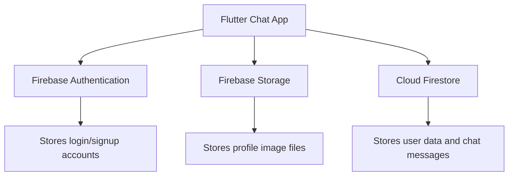
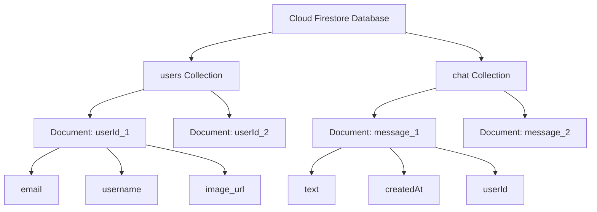
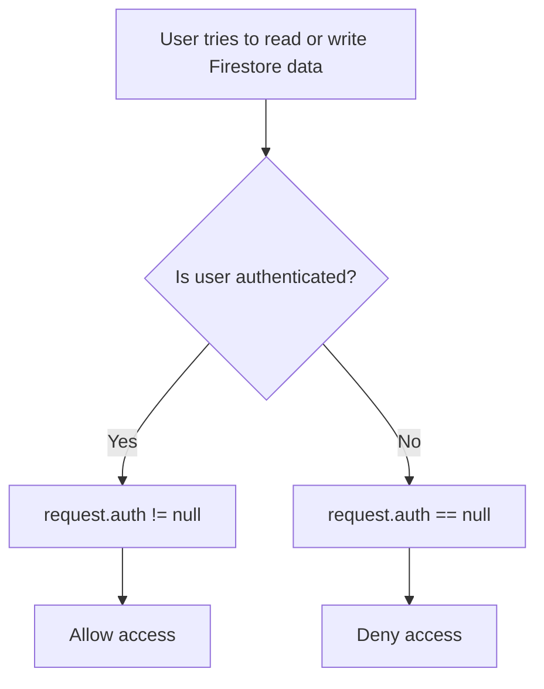
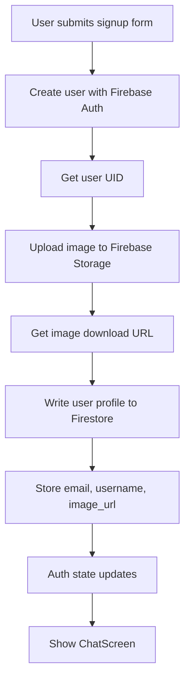
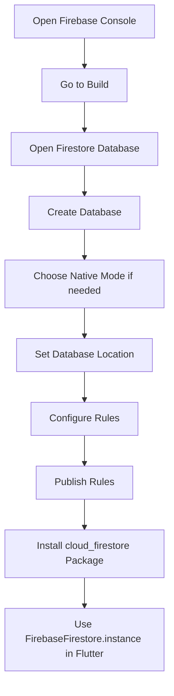

# Adding a Remote Database: Firestore Setup

## Overview

This lecture introduces **Cloud Firestore** as the remote database for the Flutter chat app.

So far, the app can:

* Create users with Firebase Authentication
* Log users in
* Log users out
* Pick a profile image
* Upload that image to Firebase Storage
* Retrieve the uploaded image download URL

However, Firebase Authentication only stores authentication data such as email, password credentials, and user ID. It does not store extra user profile data like usernames or profile image URLs.

To store that extra data, the app needs a database.

For this app, we will use **Cloud Firestore**.

---

## Why Firestore Is Needed

After uploading a profile image, Firebase Storage gives us a download URL.

That URL is not a file anymore. It is user metadata.

For example, a user profile may contain:

```json id="jmn4e7"
{
  "email": "user@example.com",
  "username": "john",
  "image_url": "https://firebase-storage-download-url.com/profile.jpg"
}
```

This kind of structured data should be stored in a database, not in Firebase Storage.

Firebase Storage is for files.

Firestore is for structured data.

---

## Firebase Services Used So Far



---

## Firebase Authentication vs Storage vs Firestore

| Firebase Service        | Purpose                                                                |
| ----------------------- | ---------------------------------------------------------------------- |
| Firebase Authentication | Create users, log users in, manage auth state                          |
| Firebase Storage        | Store uploaded files such as profile images                            |
| Cloud Firestore         | Store structured data such as usernames, image URLs, and chat messages |

---

## Why Authentication Alone Is Not Enough

When creating a user with Firebase Auth, we call:

```dart id="02ewxs"
createUserWithEmailAndPassword(
  email: _enteredEmail,
  password: _enteredPassword,
);
```

This method only accepts an email and password.

It does not allow us to directly store:

* Username
* Profile image URL
* User bio
* Chat messages
* Other custom user data

Therefore, extra user data must be stored separately in Firestore.

---

## What Is Cloud Firestore?

Cloud Firestore is Firebase's flexible NoSQL cloud database.

It stores data in:

* Collections
* Documents
* Fields

Firestore is especially useful for chat apps because it supports real-time updates through streams.

Later, the app will use Firestore to store and listen to chat messages.

---

## Firestore Data Model

Firestore uses a document-collection structure.



---

## Collections and Documents

A **collection** is like a folder that contains documents.

A **document** is like a JSON object that stores key-value pairs.

Example:

```text id="3iesrp"
users
└── user_uid_123
    ├── email: user@example.com
    ├── username: john
    └── image_url: https://...
```

In this example:

* `users` is a collection
* `user_uid_123` is a document
* `email`, `username`, and `image_url` are fields

---

## Example Firestore User Document

```json id="57spsk"
{
  "email": "user@example.com",
  "username": "john",
  "image_url": "https://firebase-storage-download-url.com/user_images/uid.jpg"
}
```

This document stores the user profile data.

The actual image file stays in Firebase Storage.

Firestore only stores the URL.

---

## Firestore vs Realtime Database

Firebase offers two main database products:

* Realtime Database
* Cloud Firestore

In earlier parts of the course, Firebase Realtime Database may have been used as a simple dummy backend.

For this chat app, Firestore is used instead.

Firestore is more powerful and better suited for structured app data.

| Feature           | Realtime Database  | Cloud Firestore              |
| ----------------- | ------------------ | ---------------------------- |
| Data model        | Large JSON tree    | Collections and documents    |
| Querying          | Simpler            | More advanced                |
| Real-time updates | Yes                | Yes                          |
| Offline support   | Yes                | Strong support               |
| Best for          | Simple synced data | Structured scalable app data |

---

## Enabling Firestore in Firebase Console

To enable Firestore:

1. Open the Firebase Console.
2. Select your Firebase project.
3. Go to **Build**.
4. Open **Firestore Database**.
5. Click **Create database**.
6. Choose a mode.
7. Select a database location.
8. Finish setup.

For development, you may start in test mode, but rules should be tightened before production.

---

## Firestore Mode Note

In some projects, Firebase may redirect you to Google Cloud Console.

If that happens, choose:

```text id="vktm8e"
Switch to Native Mode
```

After switching to Native Mode, reload the Firestore Database page in Firebase Console.

Then Firestore can be managed directly from Firebase again.

---

## Firestore Security Rules

Firestore rules control who can read and write data.

For this demo app, we want only authenticated users to access Firestore.

A simple rule is:

```text id="t5nu2m"
allow read, write: if request.auth != null;
```

This means:

* Logged-in users can read and write data
* Unauthenticated users cannot access the database

---

## Example Firestore Rules

```text id="fj7soz"
rules_version = '2';

service cloud.firestore {
  match /databases/{database}/documents {
    match /{document=**} {
      allow read, write: if request.auth != null;
    }
  }
}
```

After editing the rules, click **Publish** in Firebase Console.

---

## How Firestore Rules Work



---

## Important Security Warning

The rule below is acceptable for learning:

```text id="6h0s11"
allow read, write: if request.auth != null;
```

However, it is still broad.

It allows any authenticated user to read or write any document.

For production apps, rules should be stricter.

For example, users should only be able to write their own user document.

---

## More Secure User Rule Example

```text id="oid4qf"
rules_version = '2';

service cloud.firestore {
  match /databases/{database}/documents {
    match /users/{userId} {
      allow read: if request.auth != null;
      allow write: if request.auth != null
                   && request.auth.uid == userId;
    }
  }
}
```

This rule means:

* Authenticated users can read user documents
* A user can only write to their own document
* A user cannot overwrite another user's profile data

---

## Installing the Firestore Package

To use Firestore from Flutter, install the official package:

```bash id="m46qh6"
flutter pub add cloud_firestore
```

This package allows the Flutter app to communicate with Cloud Firestore.

---

## Importing Firestore

After installing the package, import it where needed:

```dart id="upc0f2"
import 'package:cloud_firestore/cloud_firestore.dart';
```

This gives access to:

```dart id="j3y2yl"
FirebaseFirestore.instance
```

---

## Accessing Firestore in Flutter

Firestore is accessed through:

```dart id="2gkfqo"
FirebaseFirestore.instance
```

Example:

```dart id="45y1t4"
final firestore = FirebaseFirestore.instance;
```

From there, you can access collections and documents.

---

## Basic Firestore Write Example

```dart id="o1qef8"
await FirebaseFirestore.instance
    .collection('users')
    .doc(userCredentials.user!.uid)
    .set({
  'email': _enteredEmail,
  'username': _enteredUsername,
  'image_url': imageUrl,
});
```

This creates or replaces a document in the `users` collection.

The document ID is the Firebase user's UID.

---

## Why Use the UID as the Document ID?

Using the Firebase UID as the Firestore document ID is useful because:

* Each user already has a unique ID
* User data is easy to find later
* Storage image filenames and Firestore documents can match
* Security rules are easier to write
* The app can quickly load the current user's profile

Example structure:

```text id="1fbt54"
users
└── firebase_user_uid
    ├── email
    ├── username
    └── image_url
```

---

## User Signup Data Flow With Firestore



---

## Firestore for Chat Messages

Firestore will also be used later to store chat messages.

A chat message document may contain:

```json id="cvbwik"
{
  "text": "Hello!",
  "createdAt": "timestamp",
  "userId": "firebase_user_uid",
  "username": "john",
  "userImage": "https://..."
}
```

This makes Firestore suitable for real-time chat updates.

---

## Real-Time Firestore Streams

Firestore supports real-time listeners.

Instead of manually fetching data again and again, the app can listen to a stream.

Example:

```dart id="s8v1d2"
FirebaseFirestore.instance
    .collection('chat')
    .orderBy('createdAt', descending: true)
    .snapshots();
```

This stream emits new data whenever the chat collection changes.

That is why Firestore is a good fit for chat applications.

---

## One-Time Reads vs Real-Time Streams

| Firestore Method | Purpose                                      |
| ---------------- | -------------------------------------------- |
| `get()`          | Read data once                               |
| `snapshots()`    | Listen to real-time updates                  |
| `set()`          | Create or replace a document                 |
| `add()`          | Add a new document with an auto-generated ID |
| `update()`       | Update fields in an existing document        |
| `delete()`       | Delete a document                            |

---

## Firestore Setup Flow



---

## Common Mistakes

### 1. Trying to store files in Firestore

Do not store image files directly in Firestore.

Use Firebase Storage for the image file.

Use Firestore for the image URL.

---

### 2. Expecting Firebase Auth to store extra user data

`createUserWithEmailAndPassword()` only creates the auth account.

Extra data must be stored separately.

---

### 3. Forgetting to publish Firestore rules

After editing rules, click **Publish**.

Otherwise, the new rules will not take effect.

---

### 4. Keeping test rules in production

Test mode is useful during development, but it is unsafe for production.

Before releasing the app, write proper security rules.

---

### 5. Forgetting the Firestore package

The Flutter app cannot communicate with Firestore unless the package is installed.

```bash id="80ly5a"
flutter pub add cloud_firestore
```

---

## Summary

Cloud Firestore is added as the app's remote database.

It will be used to store structured data such as:

* Usernames
* User image download URLs
* User email addresses
* Chat messages

Firebase Authentication still handles login and signup.

Firebase Storage stores image files.

Firestore stores metadata and chat data.

After enabling Firestore in Firebase Console and installing the `cloud_firestore` package, the app can use:

```dart id="c1s8ih"
FirebaseFirestore.instance
```

to write and read database data.

The next step is to store the uploaded profile image URL, username, and email in a Firestore user document after signup.
