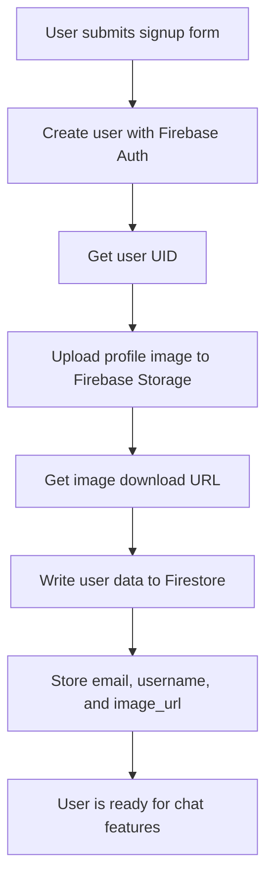
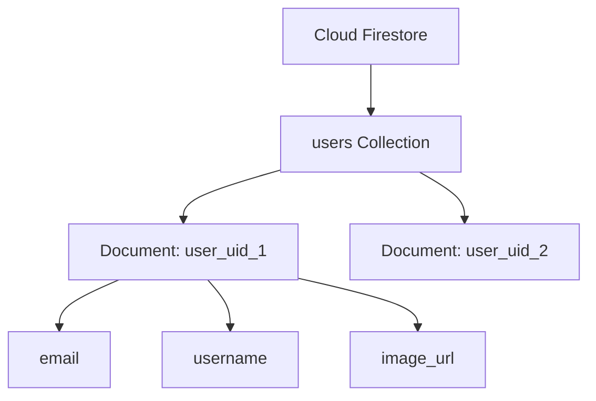
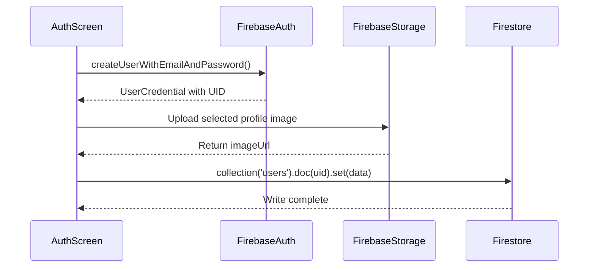
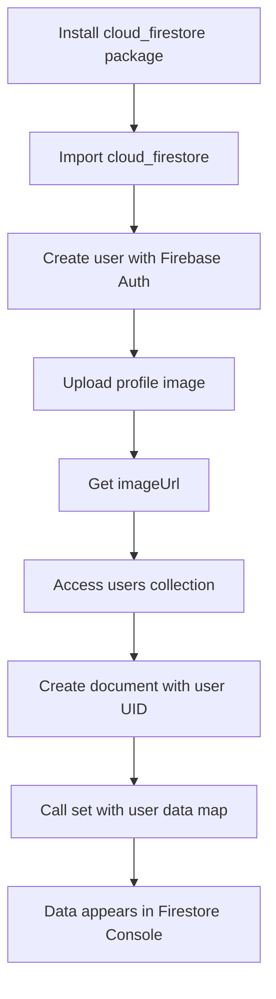

# Sending Data to Firestore

## Overview

This lecture explains how to send extra user data to Cloud Firestore after a successful signup.

At this point, the app can:

* Create a new user with Firebase Authentication
* Pick a profile image
* Upload that image to Firebase Storage
* Get the uploaded image download URL

The next step is to store extra user information in Firestore.

Firebase Authentication only stores basic authentication data, such as email, password credentials, and user ID. It does not store custom profile data like usernames or image URLs.

Therefore, after uploading the profile image, we write user metadata to Firestore.

---

## Why Store Data in Firestore?

Firebase Authentication creates the user account, but it does not allow extra custom fields during signup.

For example, this method only accepts email and password:

```dart id="2w7zqk"
await FirebaseAuth.instance.createUserWithEmailAndPassword(
  email: _enteredEmail,
  password: _enteredPassword,
);
```

It does not accept:

* Username
* Profile image URL
* User profile metadata
* Chat-specific user data

To store that extra information, we use Cloud Firestore.

---

## Data Flow After Signup



---

## Required Import

To use Firestore in Dart, import the `cloud_firestore` package.

```dart id="h0hmw4"
import 'package:cloud_firestore/cloud_firestore.dart';
```

This gives access to:

```dart id="uttwpy"
FirebaseFirestore.instance
```

---

## Accessing Firestore

Firestore is accessed through the global Firebase Firestore instance.

```dart id="2wv88i"
FirebaseFirestore.instance
```

This object allows the app to:

* Access collections
* Access documents
* Write data
* Read data
* Listen to real-time updates

---

## Firestore Collections and Documents

Firestore stores data in collections and documents.

A collection is like a folder.

A document is like a JSON object inside that folder.



---

## Creating a Collection Reference

To access a collection, use:

```dart id="er53b9"
FirebaseFirestore.instance.collection('users')
```

This points to a Firestore collection named `users`.

If the collection does not exist yet, Firestore will create it automatically when data is written.

---

## Creating a Document Reference

Inside the `users` collection, create a document for the current user.

```dart id="6sx11a"
FirebaseFirestore.instance
    .collection('users')
    .doc(userCredentials.user!.uid)
```

The document ID is the Firebase user's UID.

This means each user gets one document with their own unique ID.

---

## Why Use the User UID as the Document ID?

Using the Firebase UID as the Firestore document ID is useful because:

* The UID is already unique
* The user's data can be loaded directly later
* No extra query is needed to find the user's profile
* It matches the Firebase Storage image filename
* It works well with Firestore security rules

Example:

```text id="81sbao"
users
└── firebase_user_uid
    ├── email
    ├── username
    └── image_url
```

---

## Writing Data With `set()`

To write data to a specific document, use `.set()`.

```dart id="q24zj8"
await FirebaseFirestore.instance
    .collection('users')
    .doc(userCredentials.user!.uid)
    .set({
  'username': _enteredUsername,
  'email': _enteredEmail,
  'image_url': imageUrl,
});
```

The data is passed as a `Map<String, dynamic>`.

The keys become Firestore field names.

The values become the stored field values.

---

## Firestore Document Example

After writing the data, the Firestore document may look like this:

```json id="ydbpta"
{
  "username": "john",
  "email": "john@example.com",
  "image_url": "https://firebase-storage-download-url.com/user_images/uid.jpg"
}
```

The image file itself is stored in Firebase Storage.

Firestore only stores the image URL.

---

## `set()` vs `add()`

Firestore provides two common ways to write documents.

### `set()`

Use `set()` when you know the document ID.

```dart id="7s2dat"
await FirebaseFirestore.instance
    .collection('users')
    .doc(userId)
    .set({
  'email': email,
  'username': username,
});
```

This creates or overwrites the document with the given ID.

---

### `add()`

Use `add()` when you want Firestore to generate a random document ID.

```dart id="2kvyjc"
await FirebaseFirestore.instance
    .collection('messages')
    .add({
  'text': 'Hello world',
  'createdAt': Timestamp.now(),
  'userId': userId,
});
```

This is useful for data like chat messages, where every message should be a new document.

---

## When to Use Each Method

| Method                | Use Case                                          |
| --------------------- | ------------------------------------------------- |
| `.doc(id).set({...})` | When you want to control the document ID          |
| `.add({...})`         | When Firestore should create a random document ID |

For user profiles, use `set()` with the Firebase UID.

For chat messages, use `add()` because each message should be a new document.

---

## User Data Write Flow



---

## Full Signup Example With Firestore

```dart id="lyz7ci"
import 'dart:io';

import 'package:cloud_firestore/cloud_firestore.dart';
import 'package:firebase_auth/firebase_auth.dart';
import 'package:firebase_storage/firebase_storage.dart';
import 'package:flutter/material.dart';

final _firebase = FirebaseAuth.instance;

class _AuthScreenState extends State<AuthScreen> {
  final _formKey = GlobalKey<FormState>();

  var _isLogin = true;
  var _enteredEmail = '';
  var _enteredPassword = '';
  var _enteredUsername = '';
  var _isAuthenticating = false;

  File? _selectedImage;

  void _submit() async {
    final isValid = _formKey.currentState!.validate();

    if (!isValid) {
      return;
    }

    if (!_isLogin && _selectedImage == null) {
      ScaffoldMessenger.of(context).showSnackBar(
        const SnackBar(
          content: Text('Please pick an image.'),
        ),
      );
      return;
    }

    _formKey.currentState!.save();

    setState(() {
      _isAuthenticating = true;
    });

    try {
      if (_isLogin) {
        await _firebase.signInWithEmailAndPassword(
          email: _enteredEmail,
          password: _enteredPassword,
        );
      } else {
        final userCredentials = await _firebase.createUserWithEmailAndPassword(
          email: _enteredEmail,
          password: _enteredPassword,
        );

        final storageRef = FirebaseStorage.instance
            .ref()
            .child('user_images')
            .child('${userCredentials.user!.uid}.jpg');

        await storageRef.putFile(_selectedImage!);

        final imageUrl = await storageRef.getDownloadURL();

        await FirebaseFirestore.instance
            .collection('users')
            .doc(userCredentials.user!.uid)
            .set({
          'username': _enteredUsername,
          'email': _enteredEmail,
          'image_url': imageUrl,
        });
      }
    } on FirebaseAuthException catch (error) {
      ScaffoldMessenger.of(context).clearSnackBars();
      ScaffoldMessenger.of(context).showSnackBar(
        SnackBar(
          content: Text(error.message ?? 'Authentication failed.'),
        ),
      );
    } catch (error) {
      ScaffoldMessenger.of(context).clearSnackBars();
      ScaffoldMessenger.of(context).showSnackBar(
        const SnackBar(
          content: Text('Something went wrong. Please try again.'),
        ),
      );
    } finally {
      if (mounted) {
        setState(() {
          _isAuthenticating = false;
        });
      }
    }
  }
}
```

---

## Understanding the Firestore Write

```dart id="91dq3h"
await FirebaseFirestore.instance
    .collection('users')
    .doc(userCredentials.user!.uid)
    .set({
  'username': _enteredUsername,
  'email': _enteredEmail,
  'image_url': imageUrl,
});
```

This code does the following:

1. Accesses the `users` collection.
2. Creates or selects a document with the user's UID.
3. Stores a map of user profile data.
4. Waits until the write operation is complete.

---

## Why `await` Is Important

The `set()` method returns a `Future`.

That means the write operation is asynchronous.

Use `await` so the app waits until Firestore has finished saving the data.

```dart id="v9lt8l"
await FirebaseFirestore.instance
    .collection('users')
    .doc(userCredentials.user!.uid)
    .set({...});
```

Without `await`, the app may continue before the data is fully stored.

---

## Firestore Data Types

Firestore documents store key-value pairs.

Common supported values include:

* String
* Number
* Boolean
* List
* Map
* Timestamp
* Null

Example:

```dart id="pjosop"
{
  'username': 'john',
  'email': 'john@example.com',
  'image_url': imageUrl,
  'created_at': Timestamp.now(),
}
```

---

## Adding a Timestamp

For more complete user data, you can also store when the user profile was created.

```dart id="4cbt9d"
await FirebaseFirestore.instance
    .collection('users')
    .doc(userCredentials.user!.uid)
    .set({
  'username': _enteredUsername,
  'email': _enteredEmail,
  'image_url': imageUrl,
  'created_at': Timestamp.now(),
});
```

`Timestamp.now()` is provided by the `cloud_firestore` package.

---

## Example Firestore Structure

```text id="fqsr69"
Firestore Database
│
└── users
    │
    ├── uid_abc123
    │   ├── email: user1@example.com
    │   ├── username: user_one
    │   └── image_url: https://...
    │
    └── uid_xyz789
        ├── email: user2@example.com
        ├── username: user_two
        └── image_url: https://...
```

---

## Firestore in Firebase Console

After signing up a new user, open Firebase Console and go to:

```text id="ui7p03"
Build → Firestore Database
```

After refreshing, you should see:

```text id="l2y4ml"
users collection
└── document named with the user UID
```

Inside the document, you should see fields such as:

* `email`
* `username`
* `image_url`

---

## Android Build Issue: minSdkVersion

After adding the `cloud_firestore` package, some Android projects may fail to build because the minimum SDK version is too low.

If you see an error about `minSdkVersion`, open:

```text id="wy2p60"
android/app/build.gradle
```

Inside `defaultConfig`, update:

```gradle id="ldlu7k"
minSdkVersion 19
```

Depending on your Flutter project version, the syntax may also look like:

```gradle id="s3vcoi"
minSdk = 19
```

Use the syntax that matches your Gradle file.

---

## Android Build Issue: MultiDex

Some projects may also need MultiDex enabled.

Inside `defaultConfig`, add:

```gradle id="umwmlh"
multiDexEnabled true
```

Example:

```gradle id="gexksx"
defaultConfig {
    applicationId "com.example.flutter_chat"
    minSdkVersion 19
    targetSdkVersion flutter.targetSdkVersion
    versionCode flutterVersionCode.toInteger()
    versionName flutterVersionName
    multiDexEnabled true
}
```

After changing native Android configuration, stop the app and run it again.

A hot reload is not enough.

---

## Firestore Write Process



---

## Common Mistakes

### 1. Forgetting the Firestore import

```dart id="0eq5t2"
import 'package:cloud_firestore/cloud_firestore.dart';
```

---

### 2. Forgetting to await `set()`

Firestore writes are asynchronous.

```dart id="h86o9d"
await FirebaseFirestore.instance
    .collection('users')
    .doc(userCredentials.user!.uid)
    .set({...});
```

---

### 3. Using `add()` for user profiles

This works, but it is less convenient because Firestore generates a random document ID.

For user profiles, prefer:

```dart id="93vk4b"
.doc(userCredentials.user!.uid).set({...})
```

---

### 4. Storing the image file in Firestore

Do not store the actual image file in Firestore.

Store the image in Firebase Storage and save only the download URL in Firestore.

---

### 5. Forgetting to restart after adding packages

If the app cannot find the package or native build fails, stop the running process and start it again.

---

## Summary

This lecture writes extra user data to Cloud Firestore after signup.

After the user is created and the profile image is uploaded, the app stores a document in the `users` collection.

The document ID is the Firebase user's UID.

The stored data includes:

```dart id="wdb4nk"
{
  'username': _enteredUsername,
  'email': _enteredEmail,
  'image_url': imageUrl,
}
```

Use `.doc(uid).set({...})` when you want to control the document ID.

Use `.add({...})` when Firestore should generate a new random document ID.

This gives the app a complete user profile data structure that can later be used when displaying chat messages.
