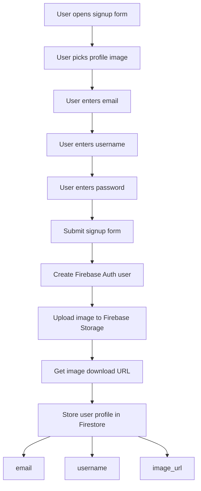
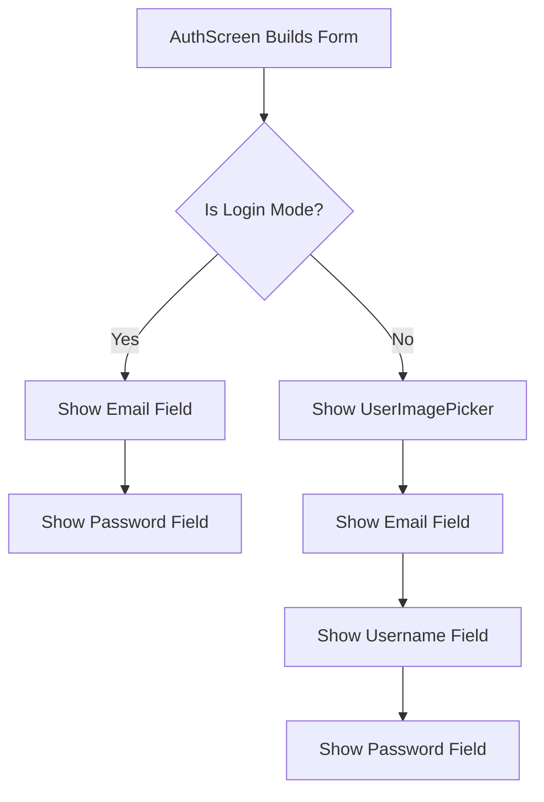
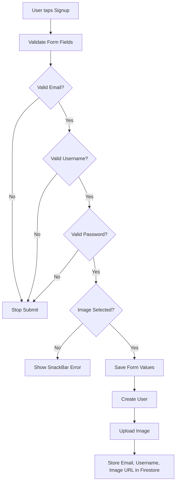
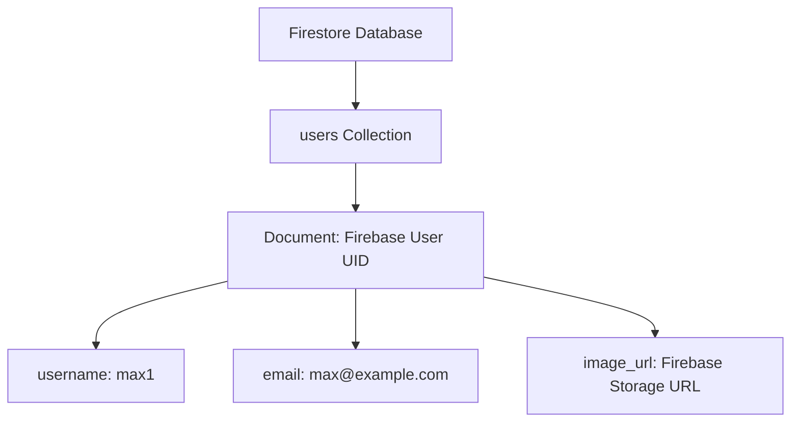

# Storing a Username

## Overview

This lecture adds a username field to the signup form.

So far, the app can create users with Firebase Authentication, upload profile images to Firebase Storage, and store user data in Cloud Firestore.

However, the user profile data is still incomplete because every user should also have a username.

The username will later be displayed together with chat messages, so other users can see who sent each message.

---

## Why Store a Username?

Firebase Authentication stores basic login data, such as:

* Email
* Password credentials
* Firebase UID
* Authentication token

However, a chat app usually needs more user profile data.

For example, when a user sends a message, the app should display:

* The message text
* The sender's username
* The sender's profile image

That extra profile data should be stored in Firestore.

---

## User Profile Data Flow



---

## Adding a Username State Variable

Inside `_AuthScreenState`, add a new variable for storing the username.

```dart
var _enteredUsername = '';
```

Example:

```dart
class _AuthScreenState extends State<AuthScreen> {
  final _formKey = GlobalKey<FormState>();

  var _isLogin = true;
  var _enteredEmail = '';
  var _enteredPassword = '';
  var _enteredUsername = '';
  var _isAuthenticating = false;

  File? _selectedImage;

  // ...
}
```

The username starts as an empty string and will be updated when the form is saved.

---

## Showing the Username Field Only During Signup

The username field should only be visible when the user is creating a new account.

It should not be shown during login because existing users only need their email and password to sign in.

```dart
if (!_isLogin)
  TextFormField(
    decoration: const InputDecoration(
      labelText: 'Username',
    ),
    enableSuggestions: false,
    validator: (value) {
      if (value == null || value.isEmpty || value.trim().length < 4) {
        return 'Please enter at least 4 characters.';
      }

      return null;
    },
    onSaved: (value) {
      _enteredUsername = value!;
    },
  ),
```

---

## Login vs Signup Form Fields



---

## Username Field Breakdown

### Input Decoration

```dart
decoration: const InputDecoration(
  labelText: 'Username',
),
```

This gives the text field a label so the user knows what to enter.

---

### Disable Suggestions

```dart
enableSuggestions: false,
```

Suggestions are disabled because usernames are often custom or fictional names.

Keyboard suggestions are usually not helpful for username input.

---

### Validate the Username

```dart
validator: (value) {
  if (value == null || value.isEmpty || value.trim().length < 4) {
    return 'Please enter at least 4 characters.';
  }

  return null;
},
```

This validation requires the username to be at least four characters long.

The form is invalid if:

* The value is `null`
* The value is empty
* The trimmed value is shorter than four characters

---

### Save the Username

```dart
onSaved: (value) {
  _enteredUsername = value!;
},
```

When `_formKey.currentState!.save()` is called, this function stores the entered username in `_enteredUsername`.

The exclamation mark is used because the validator already ensures that the value is valid before saving.

---

## Form Submit Flow With Username



---

## Updating the Firestore Write

Previously, the Firestore write may have used a placeholder username.

Now, replace that placeholder with `_enteredUsername`.

```dart
await FirebaseFirestore.instance
    .collection('users')
    .doc(userCredentials.user!.uid)
    .set({
  'username': _enteredUsername,
  'email': _enteredEmail,
  'image_url': imageUrl,
});
```

This stores the real username entered by the user during signup.

---

## Complete Signup Data Stored in Firestore

After this step, each user document stores:

```json
{
  "username": "max1",
  "email": "max@example.com",
  "image_url": "https://firebase-storage-download-url.com/user_images/uid.jpg"
}
```

The document is stored inside the `users` collection.

The document ID is the Firebase user's UID.

---

## Firestore User Document Structure



---

## Full Code Example

```dart
import 'dart:io';

import 'package:cloud_firestore/cloud_firestore.dart';
import 'package:firebase_auth/firebase_auth.dart';
import 'package:firebase_storage/firebase_storage.dart';
import 'package:flutter/material.dart';

import 'package:flutter_chat/widgets/user_image_picker.dart';

final _firebase = FirebaseAuth.instance;

class AuthScreen extends StatefulWidget {
  const AuthScreen({super.key});

  @override
  State<AuthScreen> createState() {
    return _AuthScreenState();
  }
}

class _AuthScreenState extends State<AuthScreen> {
  final _formKey = GlobalKey<FormState>();

  var _isLogin = true;
  var _enteredEmail = '';
  var _enteredPassword = '';
  var _enteredUsername = '';
  var _isAuthenticating = false;

  File? _selectedImage;

  void _submit() async {
    final isValid = _formKey.currentState!.validate();

    if (!isValid) {
      return;
    }

    if (!_isLogin && _selectedImage == null) {
      ScaffoldMessenger.of(context).showSnackBar(
        const SnackBar(
          content: Text('Please pick an image.'),
        ),
      );
      return;
    }

    _formKey.currentState!.save();

    setState(() {
      _isAuthenticating = true;
    });

    try {
      if (_isLogin) {
        await _firebase.signInWithEmailAndPassword(
          email: _enteredEmail,
          password: _enteredPassword,
        );
      } else {
        final userCredentials = await _firebase.createUserWithEmailAndPassword(
          email: _enteredEmail,
          password: _enteredPassword,
        );

        final storageRef = FirebaseStorage.instance
            .ref()
            .child('user_images')
            .child('${userCredentials.user!.uid}.jpg');

        await storageRef.putFile(_selectedImage!);

        final imageUrl = await storageRef.getDownloadURL();

        await FirebaseFirestore.instance
            .collection('users')
            .doc(userCredentials.user!.uid)
            .set({
          'username': _enteredUsername,
          'email': _enteredEmail,
          'image_url': imageUrl,
        });
      }
    } on FirebaseAuthException catch (error) {
      ScaffoldMessenger.of(context).clearSnackBars();
      ScaffoldMessenger.of(context).showSnackBar(
        SnackBar(
          content: Text(error.message ?? 'Authentication failed.'),
        ),
      );
    } catch (error) {
      ScaffoldMessenger.of(context).clearSnackBars();
      ScaffoldMessenger.of(context).showSnackBar(
        const SnackBar(
          content: Text('Something went wrong. Please try again.'),
        ),
      );
    } finally {
      if (mounted) {
        setState(() {
          _isAuthenticating = false;
        });
      }
    }
  }

  @override
  Widget build(BuildContext context) {
    return Scaffold(
      body: Center(
        child: SingleChildScrollView(
          child: Card(
            margin: const EdgeInsets.all(20),
            child: Padding(
              padding: const EdgeInsets.all(16),
              child: Form(
                key: _formKey,
                child: Column(
                  mainAxisSize: MainAxisSize.min,
                  children: [
                    if (!_isLogin)
                      UserImagePicker(
                        onPickImage: (pickedImage) {
                          setState(() {
                            _selectedImage = pickedImage;
                          });
                        },
                      ),

                    TextFormField(
                      decoration: const InputDecoration(
                        labelText: 'Email Address',
                      ),
                      keyboardType: TextInputType.emailAddress,
                      autocorrect: false,
                      textCapitalization: TextCapitalization.none,
                      validator: (value) {
                        if (value == null ||
                            value.trim().isEmpty ||
                            !value.contains('@')) {
                          return 'Please enter a valid email address.';
                        }

                        return null;
                      },
                      onSaved: (value) {
                        _enteredEmail = value!;
                      },
                    ),

                    if (!_isLogin)
                      TextFormField(
                        decoration: const InputDecoration(
                          labelText: 'Username',
                        ),
                        enableSuggestions: false,
                        validator: (value) {
                          if (value == null ||
                              value.isEmpty ||
                              value.trim().length < 4) {
                            return 'Please enter at least 4 characters.';
                          }

                          return null;
                        },
                        onSaved: (value) {
                          _enteredUsername = value!;
                        },
                      ),

                    TextFormField(
                      decoration: const InputDecoration(
                        labelText: 'Password',
                      ),
                      obscureText: true,
                      validator: (value) {
                        if (value == null || value.trim().length < 6) {
                          return 'Password must be at least 6 characters long.';
                        }

                        return null;
                      },
                      onSaved: (value) {
                        _enteredPassword = value!;
                      },
                    ),

                    const SizedBox(height: 12),

                    if (_isAuthenticating)
                      const CircularProgressIndicator()
                    else
                      ElevatedButton(
                        onPressed: _submit,
                        child: Text(_isLogin ? 'Login' : 'Signup'),
                      ),

                    if (!_isAuthenticating)
                      TextButton(
                        onPressed: () {
                          setState(() {
                            _isLogin = !_isLogin;
                          });
                        },
                        child: Text(
                          _isLogin
                              ? 'Create an account'
                              : 'I already have an account',
                        ),
                      ),
                  ],
                ),
              ),
            ),
          ),
        ),
      ),
    );
  }
}
```

---

## Why Store Username in Firestore Instead of Firebase Auth?

Firebase Auth focuses on authentication.

It can store limited user profile information, but it is not designed as a flexible user profile database.

Firestore is better for profile data because you can easily add more fields later.

For example:

```json
{
  "username": "max1",
  "email": "max@example.com",
  "image_url": "https://...",
  "bio": "Flutter developer",
  "created_at": "timestamp"
}
```

This flexibility is useful as the app grows.

---

## Testing the Username Feature

To test the feature:

1. Start the app.
2. Log out if you are already logged in.
3. Tap **Create an account**.
4. Pick a profile image.
5. Enter an unused email address.
6. Enter a username with at least four characters.
7. Enter a valid password.
8. Tap **Signup**.
9. Open Firebase Console.
10. Go to **Firestore Database**.
11. Open the `users` collection.
12. Select the new user document.
13. Confirm that `username`, `email`, and `image_url` are stored.

---

## Expected Firestore Result

```text
Firestore Database
└── users
    └── user_uid
        ├── email: user@example.com
        ├── username: max1
        └── image_url: https://...
```

---

## Common Mistakes

### 1. Showing the username field during login

The username field should only appear during signup.

```dart
if (!_isLogin)
  TextFormField(...)
```

---

### 2. Forgetting to save the username

The username must be saved with `onSaved`.

```dart
onSaved: (value) {
  _enteredUsername = value!;
},
```

---

### 3. Forgetting to add `_enteredUsername`

Make sure this state variable exists:

```dart
var _enteredUsername = '';
```

---

### 4. Not validating the username

A username should not be empty.

```dart
if (value == null || value.isEmpty || value.trim().length < 4) {
  return 'Please enter at least 4 characters.';
}
```

---

### 5. Still storing a placeholder username

Replace any placeholder value with `_enteredUsername`.

```dart
'username': _enteredUsername,
```

---

## Summary

This lecture completes the user profile data stored during signup.

A new username field is added to the authentication form and is only shown in signup mode.

The username is validated, saved into `_enteredUsername`, and then stored in Firestore together with the user's email and profile image URL.

The final Firestore user document contains:

```dart
{
  'username': _enteredUsername,
  'email': _enteredEmail,
  'image_url': imageUrl,
}
```

This gives each registered user a complete profile that can later be used when displaying chat messages.
