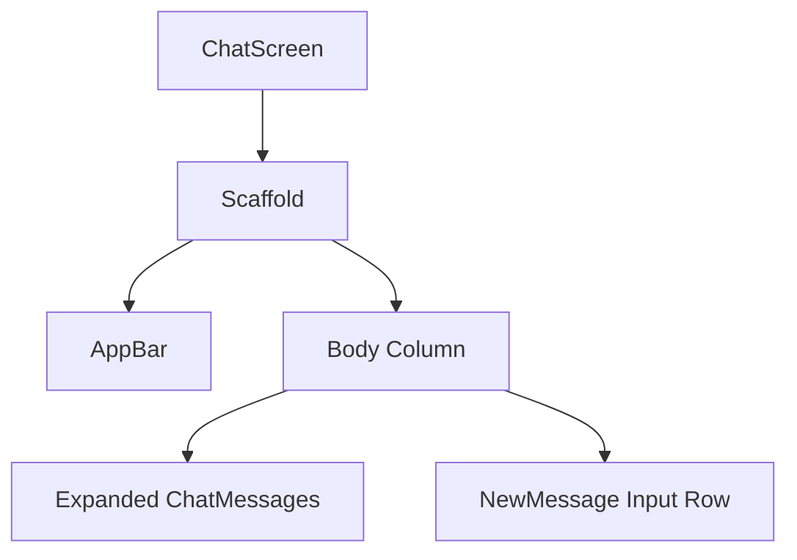
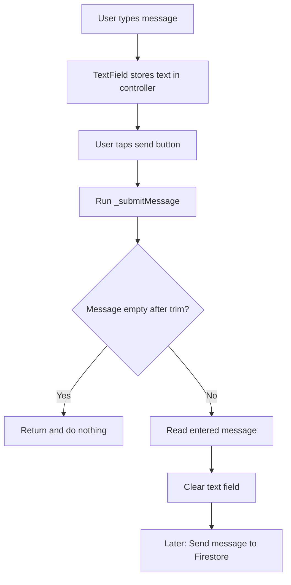
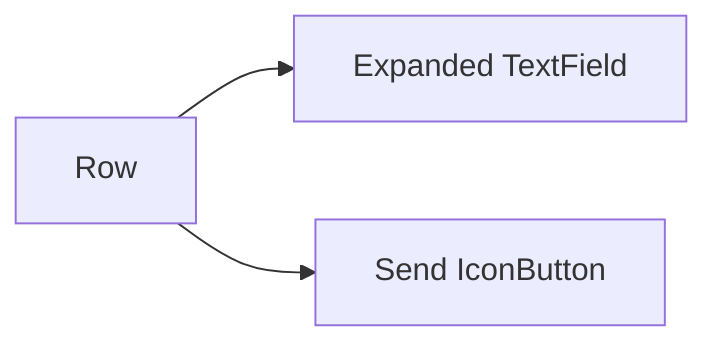
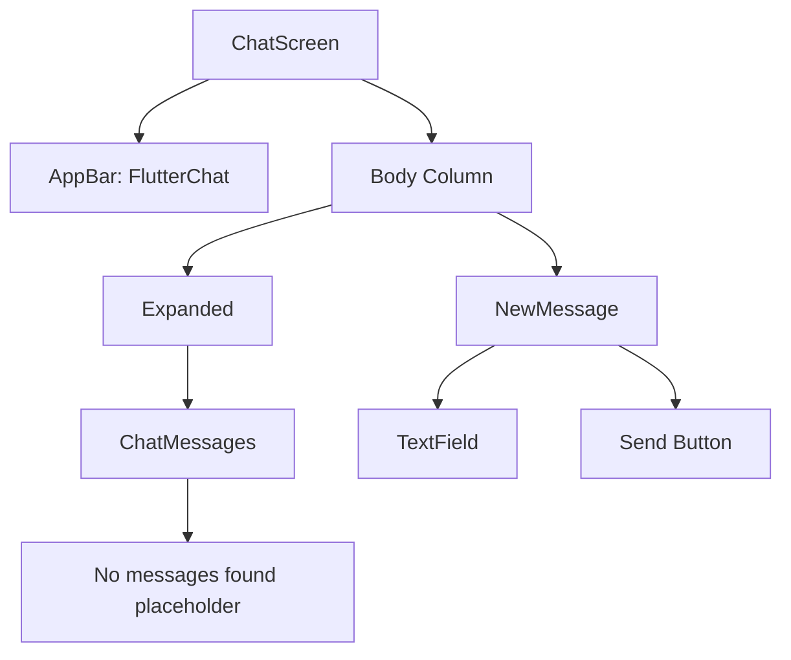

# Adding ChatMessages and Input Widgets

## Overview

This lecture starts building the actual chat screen UI.

So far, the app already has a complete authentication flow:

* Users can sign up
* Users can log in
* Users can log out
* Users can upload a profile image
* User data is stored in Firestore

Now the app needs a real chat interface.

The chat screen will be split into two main widgets:

* `ChatMessages` — displays the list of chat messages
* `NewMessage` — provides an input field and send button for writing a new message

At this stage, these widgets are UI-only. The actual Firestore message sending and loading logic will be added later.

---

## Goal

The goal is to replace the temporary placeholder text on the `ChatScreen` with a proper chat layout.

The final screen should contain:

```text
AppBar
Chat messages area
Message input field + send button
```

The `ChatMessages` widget will take up most of the available space.

The `NewMessage` widget will stay at the bottom.

---

## Chat Screen Layout



---

## Why Split the Chat UI Into Widgets?

Instead of putting all UI code directly inside `ChatScreen`, the chat UI is split into smaller widgets.

This keeps the code cleaner and easier to maintain.

| Widget         | Responsibility                    |
| -------------- | --------------------------------- |
| `ChatScreen`   | Main screen structure and app bar |
| `ChatMessages` | Display chat messages             |
| `NewMessage`   | Handle message text input         |

This separation makes it easier to add Firestore logic later.

---

## Creating `chat_messages.dart`

Create a new file:

```text id="w43yfu"
lib/widgets/chat_messages.dart
```

This widget will later display the list of chat messages.

For now, it only shows placeholder text.

---

## `ChatMessages` Widget

```dart id="wkaeq4"
import 'package:flutter/material.dart';

class ChatMessages extends StatelessWidget {
  const ChatMessages({super.key});

  @override
  Widget build(BuildContext context) {
    return const Center(
      child: Text('No messages found.'),
    );
  }
}
```

---

## Why `ChatMessages` Is a StatelessWidget

At this point, `ChatMessages` does not manage local state.

Later, messages will be loaded from Firestore through a stream.

The widget itself does not need to manually call `setState()` to update the message list.

That is why `StatelessWidget` is enough for now.

---

## Creating `new_message.dart`

Create another file:

```text id="77qyp3"
lib/widgets/new_message.dart
```

This widget contains:

* A `TextField`
* A send `IconButton`
* A `TextEditingController`
* Logic for reading and clearing the input

---

## `NewMessage` Widget

```dart id="0jizjq"
import 'package:flutter/material.dart';

class NewMessage extends StatefulWidget {
  const NewMessage({super.key});

  @override
  State<NewMessage> createState() {
    return _NewMessageState();
  }
}

class _NewMessageState extends State<NewMessage> {
  final _messageController = TextEditingController();

  void _submitMessage() {
    final enteredMessage = _messageController.text;

    if (enteredMessage.trim().isEmpty) {
      return;
    }

    _messageController.clear();

    // Later: Send message to Firestore.
  }

  @override
  void dispose() {
    _messageController.dispose();
    super.dispose();
  }

  @override
  Widget build(BuildContext context) {
    return Padding(
      padding: const EdgeInsets.only(
        left: 15,
        right: 1,
        bottom: 14,
      ),
      child: Row(
        children: [
          Expanded(
            child: TextField(
              controller: _messageController,
              textCapitalization: TextCapitalization.sentences,
              autocorrect: true,
              enableSuggestions: true,
              decoration: const InputDecoration(
                labelText: 'Send a message...',
              ),
            ),
          ),
          IconButton(
            color: Theme.of(context).colorScheme.primary,
            icon: const Icon(Icons.send),
            onPressed: _submitMessage,
          ),
        ],
      ),
    );
  }
}
```

---

## Why `NewMessage` Is a StatefulWidget

`NewMessage` uses a `TextEditingController`.

The controller keeps track of what the user enters into the text field.

Because the widget manages this controller and later may also manage input-related UI state, it is implemented as a `StatefulWidget`.

---

## Message Input Flow



---

## TextEditingController

The `TextEditingController` is used to read and control the text field value.

```dart id="c67sn8"
final _messageController = TextEditingController();
```

To read the entered text:

```dart id="34d6rv"
final enteredMessage = _messageController.text;
```

To clear the text field:

```dart id="q2os1i"
_messageController.clear();
```

---

## Disposing the Controller

Whenever a controller is created in a state class, it should be disposed when the widget is removed.

```dart id="k287bu"
@override
void dispose() {
  _messageController.dispose();
  super.dispose();
}
```

This prevents memory leaks.

---

## Validating the Message

Empty messages should not be sent.

That is why the message is trimmed before checking whether it is empty.

```dart id="6wcwmj"
if (enteredMessage.trim().isEmpty) {
  return;
}
```

This prevents users from sending messages like:

```text id="a7xju2"
"     "
```

A message with only spaces is treated as empty.

---

## TextField Configuration

The message input field is configured like this:

```dart id="d858n7"
TextField(
  controller: _messageController,
  textCapitalization: TextCapitalization.sentences,
  autocorrect: true,
  enableSuggestions: true,
  decoration: const InputDecoration(
    labelText: 'Send a message...',
  ),
)
```

### Explanation

| Property             | Purpose                              |
| -------------------- | ------------------------------------ |
| `controller`         | Reads and clears the entered message |
| `textCapitalization` | Capitalizes the start of sentences   |
| `autocorrect`        | Enables automatic correction         |
| `enableSuggestions`  | Enables keyboard suggestions         |
| `decoration`         | Shows the input label                |

---

## Why Wrap TextField With Expanded?

The `TextField` is placed inside a `Row`.

A `TextField` inside a `Row` can cause layout problems if it has no width constraint.

Wrapping it with `Expanded` allows it to take up the available horizontal space.

```dart id="nmtoke"
Expanded(
  child: TextField(
    controller: _messageController,
  ),
)
```

The send button then sits next to it.

---

## NewMessage Layout



---

## Adding Padding Around the Input Row

The `Padding` widget adds spacing around the message input area.

```dart id="mw8gom"
padding: const EdgeInsets.only(
  left: 15,
  right: 1,
  bottom: 14,
),
```

This prevents the input field and send button from touching the screen edges.

---

## Send Button

The send button uses Flutter's built-in send icon.

```dart id="b3fgjo"
IconButton(
  color: Theme.of(context).colorScheme.primary,
  icon: const Icon(Icons.send),
  onPressed: _submitMessage,
)
```

When pressed, it calls:

```dart id="t1o98c"
_submitMessage
```

Later, this method will send the message to Firestore.

---

## Updating the ChatScreen

Now update `chat.dart`.

Instead of showing a placeholder `Center`, the `ChatScreen` should show a `Column`.

The column contains:

1. `ChatMessages`
2. `NewMessage`

---

## `chat.dart`

```dart id="g2l89i"
import 'package:firebase_auth/firebase_auth.dart';
import 'package:flutter/material.dart';

import 'package:flutter_chat/widgets/chat_messages.dart';
import 'package:flutter_chat/widgets/new_message.dart';

class ChatScreen extends StatelessWidget {
  const ChatScreen({super.key});

  @override
  Widget build(BuildContext context) {
    return Scaffold(
      appBar: AppBar(
        title: const Text('FlutterChat'),
        actions: [
          IconButton(
            onPressed: () {
              FirebaseAuth.instance.signOut();
            },
            icon: Icon(
              Icons.exit_to_app,
              color: Theme.of(context).colorScheme.primary,
            ),
          ),
        ],
      ),
      body: const Column(
        children: [
          Expanded(
            child: ChatMessages(),
          ),
          NewMessage(),
        ],
      ),
    );
  }
}
```

---

## Why Use Expanded Around ChatMessages?

The `Column` contains two widgets:

* The message list
* The input row

Without `Expanded`, the message area may not take up the available screen space correctly.

```dart id="nrbxke"
Expanded(
  child: ChatMessages(),
)
```

This makes `ChatMessages` fill the available vertical space.

The `NewMessage` widget stays at the bottom.

---

## Final Chat Screen Structure



---

## Current Result

After adding these widgets, the chat screen shows:

```text id="v6ghcn"
No messages found.

[Send a message...] [Send button]
```

The user can type a message and tap the send button.

At this stage, the message is only read and the input field is cleared.

It is not sent to Firestore yet.

---

## Testing the UI

To test the UI:

1. Run the app.
2. Log in or sign up.
3. Open the `ChatScreen`.
4. Type a message in the text field.
5. Tap the send icon.
6. The text field should clear.

This confirms that the input controller and submit method work.

---

## Optional: Enable Send Button Only When Text Exists

A more polished version can disable the send button when the input is empty.

Example:

```dart id="baactf"
var _enteredMessage = '';

TextField(
  controller: _messageController,
  onChanged: (value) {
    setState(() {
      _enteredMessage = value;
    });
  },
)

IconButton(
  icon: const Icon(Icons.send),
  onPressed: _enteredMessage.trim().isEmpty ? null : _submitMessage,
)
```

This makes the UI more responsive because the send button only becomes active when the user enters text.

---

## Common Mistakes

### 1. Forgetting to dispose the controller

Always dispose `TextEditingController`.

```dart id="hanv5l"
@override
void dispose() {
  _messageController.dispose();
  super.dispose();
}
```

---

### 2. Not wrapping TextField with Expanded

A `TextField` inside a `Row` should usually be wrapped with `Expanded`.

```dart id="qn1g2r"
Expanded(
  child: TextField(),
)
```

---

### 3. Sending empty messages

Always trim and validate the input.

```dart id="3c1p1t"
if (enteredMessage.trim().isEmpty) {
  return;
}
```

---

### 4. Forgetting to clear the input

After submitting a message, clear the text field.

```dart id="kbyh62"
_messageController.clear();
```

---

### 5. Putting all chat UI in `ChatScreen`

For maintainability, split the UI into separate widgets.

```text id="p4qssr"
ChatScreen
├── ChatMessages
└── NewMessage
```

---

## Summary

This lecture adds the basic UI structure for the chat feature.

Two new widgets are created:

```text id="cx6miv"
ChatMessages
NewMessage
```

`ChatMessages` currently displays a placeholder message.

`NewMessage` contains a text field and a send button.

The text input is managed with a `TextEditingController`, and the message is cleared after submission.

The `ChatScreen` now combines both widgets in a `Column`, with `ChatMessages` wrapped in `Expanded` so it fills the available space.

The next step is to send the entered message to Firestore.
