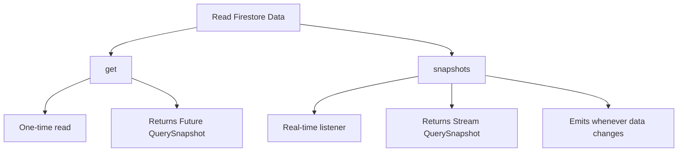
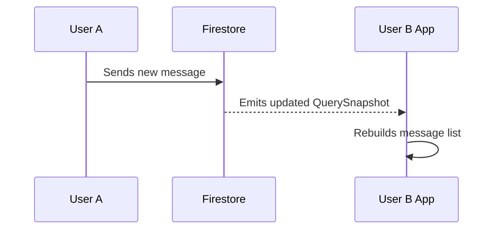
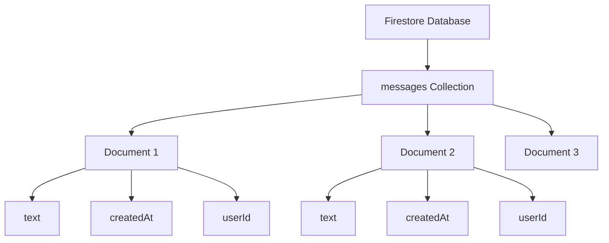
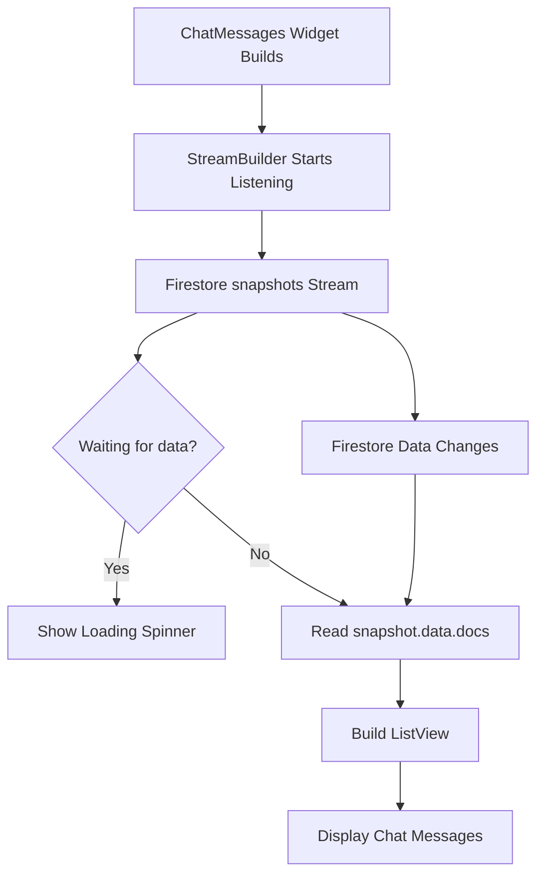
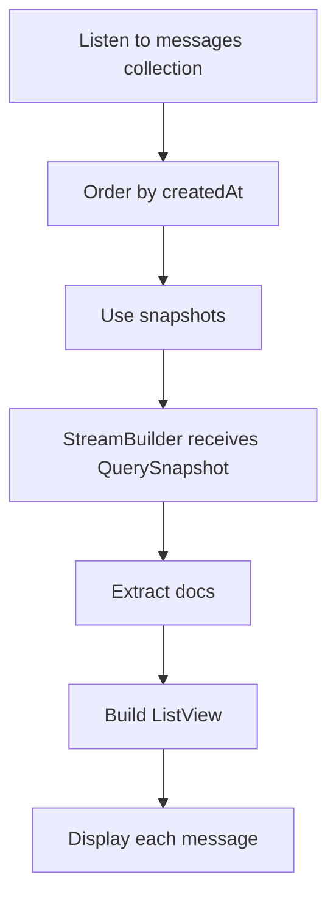

# A Note About Reading Data From Firestore

## Overview

This lecture introduces an important concept before reading chat messages from Cloud Firestore.

Firestore data can be read in two main ways:

1. As a one-time request using `get()`
2. As a real-time stream using `snapshots()`

For a chat app, real-time updates are especially important because new messages should appear automatically without requiring the user to refresh the screen.

Before implementing the chat message list, it is important to understand how Firestore returns collection data and document data in Flutter.

---

## Why This Matters

The chat app will soon read messages from Firestore.

To display messages correctly, we need to understand:

* How to access a Firestore collection
* How to read documents from that collection
* How to extract field data from each document
* How to listen for real-time changes
* How to use Firestore streams with `StreamBuilder`

---

## Firestore Read Options



---

## One-Time Reads With `get()`

The `get()` method reads data once.

It returns a `Future`.

This is useful when you only need the data at one specific moment.

Example:

```dart id="firestore-get-example"
final snapshot = await FirebaseFirestore.instance
    .collection('messages')
    .get();
```

This gives you a `QuerySnapshot`.

A `QuerySnapshot` contains all documents returned by the query.

---

## Example: Reading Once

```dart id="read-once-example"
import 'package:cloud_firestore/cloud_firestore.dart';

Future<void> readMessagesOnce() async {
  final snapshot = await FirebaseFirestore.instance
      .collection('messages')
      .get();

  for (final doc in snapshot.docs) {
    print(doc.id);
    print(doc.data());
    print(doc['text']);
  }
}
```

---

## Real-Time Reads With `snapshots()`

The `snapshots()` method creates a real-time listener.

It returns a `Stream`.

This stream emits a new `QuerySnapshot` whenever the data changes.

Example:

```dart id="firestore-snapshots-example"
final messagesStream = FirebaseFirestore.instance
    .collection('messages')
    .snapshots();
```

For a chat app, this is usually the better choice because new messages should appear automatically.

---

## Why Use `snapshots()` for Chat?

A chat app needs live updates.

If one user sends a message, all users should see that message without manually refreshing.

With `snapshots()`, Firestore automatically notifies the app when data changes.



---

## QuerySnapshot

When reading a collection, Firestore returns a `QuerySnapshot`.

A `QuerySnapshot` represents the result of a collection query.

It contains a list of document snapshots.

```dart id="query-snapshot-docs"
final docs = snapshot.docs;
```

Each item in `docs` is a document snapshot.

---

## Firestore Data Structure



---

## DocumentSnapshot

Each document in a collection is represented as a document snapshot.

A document snapshot contains:

* The document ID
* The document fields
* Metadata about the document

You can access the document ID with:

```dart id="doc-id-example"
doc.id
```

You can access all document data with:

```dart id="doc-data-example"
doc.data()
```

You can access one specific field with:

```dart id="doc-field-example"
doc['text']
```

---

## Example Firestore Message Document

A message document may look like this:

```json id="message-document-example"
{
  "text": "Hello everyone!",
  "createdAt": "Timestamp",
  "userId": "firebase-user-id",
  "username": "max",
  "userImage": "https://..."
}
```

The document ID is separate from these fields.

Firestore may generate the document ID automatically when `.add()` is used.

---

## `get()` vs `snapshots()`

| Method        | Returns                 | Use Case                     |
| ------------- | ----------------------- | ---------------------------- |
| `get()`       | `Future<QuerySnapshot>` | Read data once               |
| `snapshots()` | `Stream<QuerySnapshot>` | Listen for real-time updates |

For chat messages, use:

```dart id="chat-snapshots"
FirebaseFirestore.instance
    .collection('messages')
    .snapshots();
```

---

## Reading Ordered Messages

Chat messages should usually be ordered by creation time.

Example:

```dart id="ordered-messages-stream"
final messagesStream = FirebaseFirestore.instance
    .collection('messages')
    .orderBy('createdAt', descending: true)
    .snapshots();
```

This reads the newest messages first.

---

## Using Firestore With StreamBuilder

Because `snapshots()` returns a stream, it works well with `StreamBuilder`.

```dart id="stream-builder-firestore"
StreamBuilder(
  stream: FirebaseFirestore.instance
      .collection('messages')
      .orderBy('createdAt', descending: true)
      .snapshots(),
  builder: (ctx, snapshot) {
    if (snapshot.connectionState == ConnectionState.waiting) {
      return const Center(
        child: CircularProgressIndicator(),
      );
    }

    final loadedMessages = snapshot.data!.docs;

    return ListView.builder(
      itemCount: loadedMessages.length,
      itemBuilder: (ctx, index) {
        final chatMessage = loadedMessages[index].data();

        return Text(chatMessage['text']);
      },
    );
  },
);
```

---

## StreamBuilder Flow



---

## Accessing Message Data

Inside the `ListView.builder`, each document can be accessed by index.

```dart id="access-message-doc"
final chatMessage = loadedMessages[index].data();
```

Then fields can be read like this:

```dart id="access-message-fields"
final messageText = chatMessage['text'];
final userId = chatMessage['userId'];
final username = chatMessage['username'];
```

---

## Important Null Safety Note

When using `snapshot.data`, make sure data exists before accessing it.

A common pattern is:

```dart id="null-safety-snapshot"
if (!snapshot.hasData || snapshot.data!.docs.isEmpty) {
  return const Center(
    child: Text('No messages found.'),
  );
}
```

Then it is safe to access:

```dart id="safe-docs-access"
final loadedMessages = snapshot.data!.docs;
```

---

## Recommended Chat Message Read Flow



---

## Potential Issues

When reading Firestore data, you may run into setup or query issues.

Common causes include:

* Firestore rules blocking reads
* Missing authentication
* Missing indexes for complex queries
* Incorrect collection name
* Incorrect field name
* App not restarted after adding packages
* Firestore not enabled in Firebase Console

---

## Firestore Index Note

Simple queries usually work immediately.

However, if you combine `orderBy()` with filters such as `where()`, Firestore may require an index.

When this happens, Firebase usually prints an error message with a direct link to create the required index.

---

## Firestore Reads and Cost

Firestore charges based on read and write operations.

A real-time listener may count document reads whenever data is initially loaded or updated.

For a small course app, this is usually not a problem.

For production apps, data structure and query design matter.

---

## Helpful Q&A Resources

If you face issues while reading data from Firestore in the next lectures, check the related course Q&A threads:

```text id="qa-links"
https://www.udemy.com/course/learn-flutter-dart-to-build-ios-android-apps/learn/lecture/37736704#questions/19981674

https://www.udemy.com/course/learn-flutter-dart-to-build-ios-android-apps/learn/lecture/37736700#questions/19980322
```

These threads may contain solutions for common Firestore reading problems.

---

## Summary

Firestore data can be read in two main ways.

Use `get()` for a one-time read:

```dart id="summary-get"
collectionRef.get()
```

Use `snapshots()` for real-time updates:

```dart id="summary-snapshots"
collectionRef.snapshots()
```

For chat messages, `snapshots()` is the preferred approach because the UI should update automatically whenever a new message is added.

A Firestore collection read returns a `QuerySnapshot`, which contains multiple document snapshots in `snapshot.docs`.

Each document snapshot contains the document ID and the stored key-value data.

Understanding this structure prepares the app for the next step: displaying chat messages from Firestore in real time.
