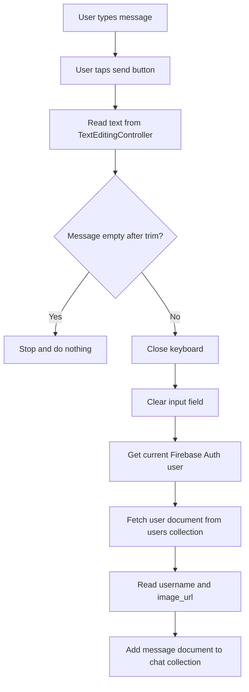
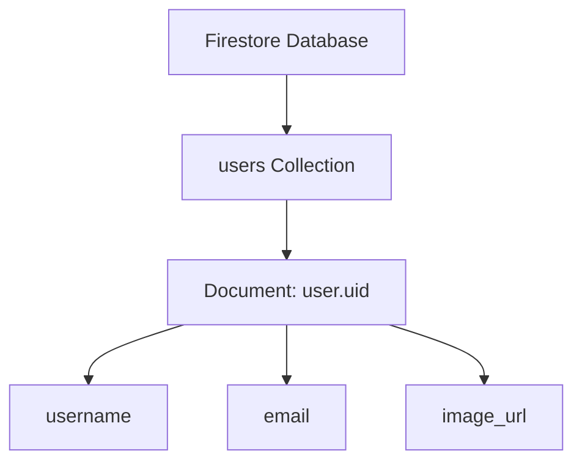
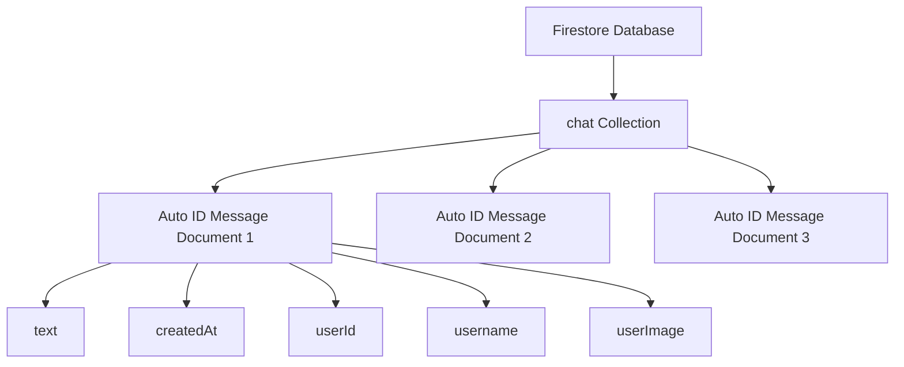
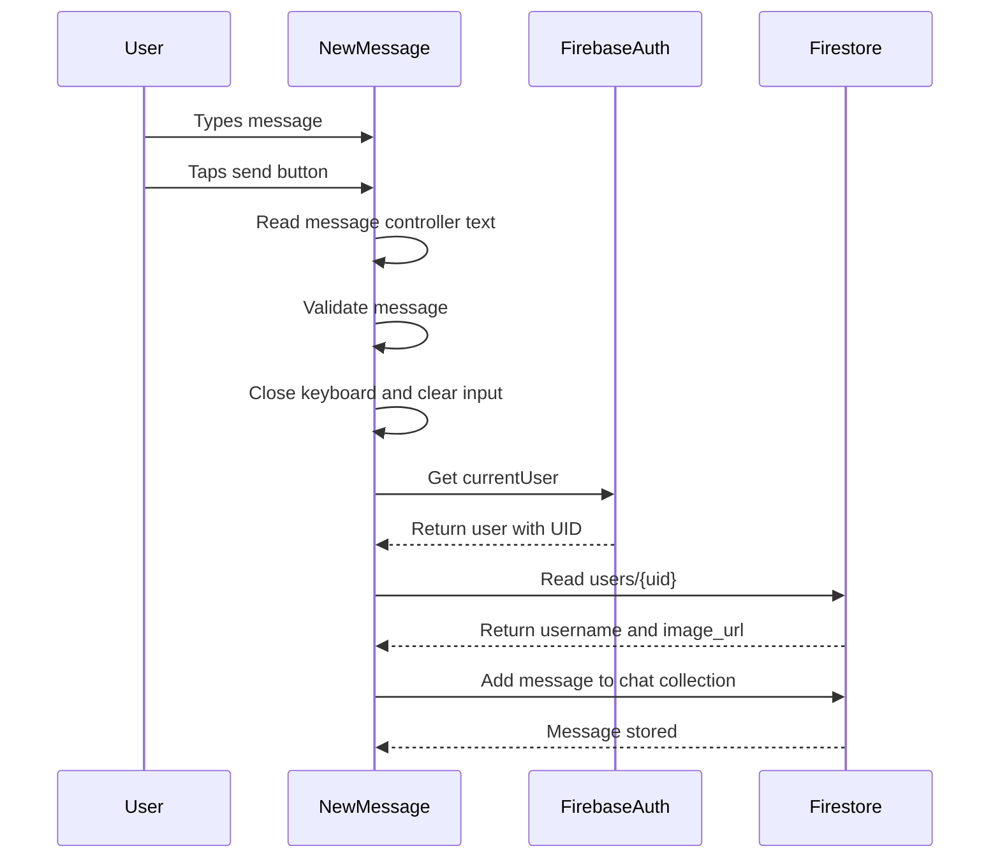
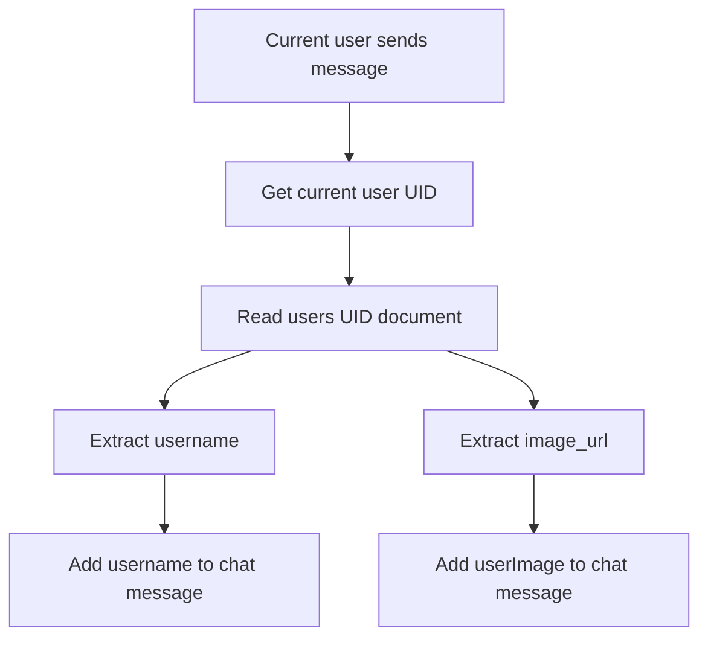
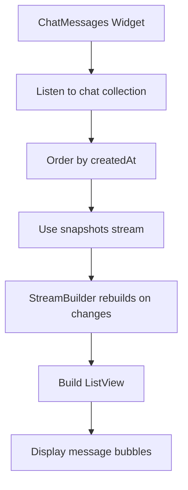

# Sending and Reading Data To and From Firestore

## Overview

This lecture implements sending chat messages to Cloud Firestore.

Previously, the app had a `NewMessage` widget with a text field and a send button. The user could type a message, press the button, and the input field would be cleared.

Now, the entered message is actually sent to Firestore.

Each message document stores:

* The message text
* The creation timestamp
* The sender's user ID
* The sender's username
* The sender's profile image URL

The username and profile image URL are loaded from the `users` collection before the message is stored in the `chat` collection.

---

## Goal

The goal is to store every submitted chat message in Firestore.

When a user sends a message, the app should:

1. Read the entered message from the `TextEditingController`.
2. Validate that the message is not empty.
3. Close the keyboard.
4. Clear the input field.
5. Get the currently logged-in user.
6. Fetch that user's profile data from Firestore.
7. Add a new document to the `chat` collection.

---

## Message Sending Flow



---

## Required Imports

In `new_message.dart`, add the Firebase imports.

```dart id="required-imports"
import 'package:cloud_firestore/cloud_firestore.dart';
import 'package:firebase_auth/firebase_auth.dart';
import 'package:flutter/material.dart';
```

These imports are needed because:

| Import                 | Purpose                             |
| ---------------------- | ----------------------------------- |
| `cloud_firestore.dart` | Send and read Firestore data        |
| `firebase_auth.dart`   | Access the currently logged-in user |
| `material.dart`        | Build the Flutter UI                |

---

## Getting the Entered Message

The message is read from the `TextEditingController`.

```dart id="entered-message"
final enteredMessage = _messageController.text;
```

Before sending it, check whether it is empty.

```dart id="empty-message-check"
if (enteredMessage.trim().isEmpty) {
  return;
}
```

Using `trim()` prevents users from sending messages that contain only spaces.

---

## Closing the Keyboard

After a valid message is submitted, the keyboard should close.

```dart id="unfocus-keyboard"
FocusScope.of(context).unfocus();
```

This removes focus from the text field and hides the keyboard on mobile devices.

---

## Clearing the Input Field

After the message is submitted, clear the text field.

```dart id="clear-message-controller"
_messageController.clear();
```

This improves the user experience because the input field is immediately reset after sending.

---

## Why Clear and Unfocus Before Sending?

The app clears the input field and closes the keyboard before the Firestore request completes.

This is a good user experience because:

* The UI reacts immediately.
* The user cannot accidentally send the same message twice.
* The keyboard does not stay open unnecessarily.
* The message is already stored in a local variable before the field is cleared.

```dart id="clear-before-send"
final enteredMessage = _messageController.text;

if (enteredMessage.trim().isEmpty) {
  return;
}

FocusScope.of(context).unfocus();
_messageController.clear();
```

---

## Getting the Current User

To know who sent the message, get the current Firebase Auth user.

```dart id="current-user"
final user = FirebaseAuth.instance.currentUser!;
```

The exclamation mark is used because the `ChatScreen` is only shown when the user is already logged in.

Therefore, inside the chat screen, `currentUser` should not be `null`.

---

## Fetching User Profile Data

The username and profile image URL are not stored in Firebase Authentication.

They were stored manually in Firestore during signup.

To retrieve them, read the current user's document from the `users` collection.

```dart id="fetch-user-data"
final userData = await FirebaseFirestore.instance
    .collection('users')
    .doc(user.uid)
    .get();
```

This fetches the document:

```text id="user-doc-path"
users/{currentUserUid}
```

---

## Reading Data From the User Document

The result of `.get()` is a document snapshot.

To access the actual stored fields, call:

```dart id="user-data-map"
userData.data()
```

This returns a map containing the user's profile data.

Example:

```dart id="read-user-fields"
final username = userData.data()!['username'];
final userImage = userData.data()!['image_url'];
```

The keys must match the keys used when storing the user data during signup.

---

## User Profile Document Structure



Example user document:

```json id="user-doc-json"
{
  "username": "max1",
  "email": "max@example.com",
  "image_url": "https://firebase-storage-download-url.com/user_images/uid.jpg"
}
```

---

## Adding a Message to Firestore

To send a new message, add a document to the `chat` collection.

```dart id="add-chat-message"
await FirebaseFirestore.instance.collection('chat').add({
  'text': enteredMessage,
  'createdAt': Timestamp.now(),
  'userId': user.uid,
  'username': userData.data()!['username'],
  'userImage': userData.data()!['image_url'],
});
```

The `add()` method creates a new document with an automatically generated ID.

This is useful for chat messages because every message should be a new document.

---

## Why Use `add()` for Chat Messages?

For user profiles, we used:

```dart id="set-user-doc"
.doc(user.uid).set(...)
```

That makes sense because each user should have one document with a known ID.

For chat messages, we use:

```dart id="add-message-doc"
.collection('chat').add(...)
```

This makes sense because:

* Every message is a new document.
* We do not need to manually name each message.
* Firestore can generate a unique ID automatically.
* Many messages can belong to the same collection.

---

## `set()` vs `add()`

| Method                | Document ID                | Best Use Case          |
| --------------------- | -------------------------- | ---------------------- |
| `.doc(id).set({...})` | You choose the ID          | User profile documents |
| `.add({...})`         | Firestore generates the ID | Chat messages          |

---

## Chat Message Document Structure

Each message document contains both message data and sender data.

```json id="chat-message-json"
{
  "text": "Hello!",
  "createdAt": "Timestamp",
  "userId": "firebase-user-id",
  "username": "max1",
  "userImage": "https://firebase-storage-download-url.com/user_images/uid.jpg"
}
```

---

## Firestore Chat Collection Structure



---

## Complete `new_message.dart`

```dart id="complete-new-message"
import 'package:cloud_firestore/cloud_firestore.dart';
import 'package:firebase_auth/firebase_auth.dart';
import 'package:flutter/material.dart';

class NewMessage extends StatefulWidget {
  const NewMessage({super.key});

  @override
  State<NewMessage> createState() {
    return _NewMessageState();
  }
}

class _NewMessageState extends State<NewMessage> {
  final _messageController = TextEditingController();

  void _submitMessage() async {
    final enteredMessage = _messageController.text;

    if (enteredMessage.trim().isEmpty) {
      return;
    }

    FocusScope.of(context).unfocus();
    _messageController.clear();

    final user = FirebaseAuth.instance.currentUser!;

    final userData = await FirebaseFirestore.instance
        .collection('users')
        .doc(user.uid)
        .get();

    await FirebaseFirestore.instance.collection('chat').add({
      'text': enteredMessage,
      'createdAt': Timestamp.now(),
      'userId': user.uid,
      'username': userData.data()!['username'],
      'userImage': userData.data()!['image_url'],
    });
  }

  @override
  void dispose() {
    _messageController.dispose();
    super.dispose();
  }

  @override
  Widget build(BuildContext context) {
    return Padding(
      padding: const EdgeInsets.only(
        left: 15,
        right: 1,
        bottom: 14,
      ),
      child: Row(
        children: [
          Expanded(
            child: TextField(
              controller: _messageController,
              textCapitalization: TextCapitalization.sentences,
              autocorrect: true,
              enableSuggestions: true,
              decoration: const InputDecoration(
                labelText: 'Send a message...',
              ),
            ),
          ),
          IconButton(
            color: Theme.of(context).colorScheme.primary,
            icon: const Icon(Icons.send),
            onPressed: _submitMessage,
          ),
        ],
      ),
    );
  }
}
```

---

## Message Submit Sequence



---

## Understanding the Firestore Write

```dart id="firestore-write-breakdown"
await FirebaseFirestore.instance.collection('chat').add({
  'text': enteredMessage,
  'createdAt': Timestamp.now(),
  'userId': user.uid,
  'username': userData.data()!['username'],
  'userImage': userData.data()!['image_url'],
});
```

This code stores:

| Field       | Value                                     |
| ----------- | ----------------------------------------- |
| `text`      | The entered chat message                  |
| `createdAt` | Current timestamp                         |
| `userId`    | Firebase UID of the sender                |
| `username`  | Sender's username from Firestore          |
| `userImage` | Sender's profile image URL from Firestore |

---

## Why Store Username and Image on the Message?

The username and profile image are already stored in the `users` collection.

However, storing them directly on the message document makes displaying messages easier later.

When building the message list, the app can read each message document and immediately access:

```dart id="message-display-fields"
message['username']
message['userImage']
message['text']
```

This avoids needing to fetch the user document again for every message while rendering the chat list.

---

## Trade-Off: Duplicate Data

Storing username and user image on each message duplicates some data.

This is common in NoSQL databases like Firestore.

The benefit is faster and simpler reads.

The downside is that if the user later changes their username or profile image, older messages may still contain the old values unless they are updated.

---

## Reading From Firestore With `get()`

This lecture also demonstrates a one-time Firestore read.

```dart id="firestore-get-user-doc"
final userData = await FirebaseFirestore.instance
    .collection('users')
    .doc(user.uid)
    .get();
```

This reads one document once.

It returns a document snapshot.

Then `.data()` extracts the stored key-value data.

---

## One-Time Read vs Real-Time Read

| Method         | Returns                    | Used Here For                                  |
| -------------- | -------------------------- | ---------------------------------------------- |
| `.get()`       | `Future<DocumentSnapshot>` | Fetching current user profile once             |
| `.snapshots()` | `Stream<QuerySnapshot>`    | Later: listening to chat messages in real time |

For sending a message, `.get()` is enough because we only need the current user's profile data once.

For displaying chat messages, `snapshots()` will be better because the UI should update whenever new messages are added.

---

## Reading User Data Flow



---

## Avoiding `context` After `await`

In Flutter, using `context` after an `await` may produce a warning if the widget could have been removed from the tree.

To avoid that, this lecture moves:

```dart id="context-before-await"
FocusScope.of(context).unfocus();
_messageController.clear();
```

before the `await` operations.

This avoids using `context` after asynchronous work has started.

---

## Why Use `Timestamp.now()`?

Firestore provides the `Timestamp` type through the `cloud_firestore` package.

```dart id="timestamp-now"
'createdAt': Timestamp.now(),
```

This stores the message creation time.

Later, messages can be sorted by this field.

Example:

```dart id="order-messages"
FirebaseFirestore.instance
    .collection('chat')
    .orderBy('createdAt', descending: true)
    .snapshots();
```

---

## Future Message Display Flow

The next step is to read messages from Firestore and display them in `ChatMessages`.



---

## Testing the Feature

To test message sending:

1. Run the app.
2. Log in with a user that has profile data in Firestore.
3. Enter a message in the chat input field.
4. Tap the send button.
5. The keyboard should close.
6. The input field should clear.
7. Open Firebase Console.
8. Go to **Firestore Database**.
9. Refresh the data viewer.
10. Confirm that a `chat` collection exists.
11. Open the new message document.
12. Check that it contains `text`, `createdAt`, `userId`, `username`, and `userImage`.

---

## Expected Firestore Result

```text id="expected-firestore-result"
Firestore Database
│
├── users
│   └── user_uid
│       ├── username: max1
│       ├── email: max@example.com
│       └── image_url: https://...
│
└── chat
    └── auto_generated_message_id
        ├── text: Hello!
        ├── createdAt: Timestamp
        ├── userId: user_uid
        ├── username: max1
        └── userImage: https://...
```

---

## Common Mistakes

### 1. Forgetting the Firestore import

```dart id="mistake-firestore-import"
import 'package:cloud_firestore/cloud_firestore.dart';
```

---

### 2. Forgetting the Firebase Auth import

```dart id="mistake-auth-import"
import 'package:firebase_auth/firebase_auth.dart';
```

---

### 3. Sending empty messages

Always validate the message before sending.

```dart id="mistake-empty-message"
if (enteredMessage.trim().isEmpty) {
  return;
}
```

---

### 4. Clearing the controller before saving the text

This is wrong:

```dart id="wrong-clear-first"
_messageController.clear();
final enteredMessage = _messageController.text;
```

The message would be empty.

Correct order:

```dart id="correct-read-first"
final enteredMessage = _messageController.text;
_messageController.clear();
```

---

### 5. Using `set()` instead of `add()` for chat messages

Using `set()` with the same document ID can overwrite existing messages.

For chat messages, use:

```dart id="use-add-chat"
FirebaseFirestore.instance.collection('chat').add({...});
```

---

### 6. Fetching a missing user document

This code assumes the current user's profile document exists:

```dart id="assume-user-doc"
userData.data()!['username']
```

If a user was created before the Firestore user profile logic was added, that document may be missing.

In that case, test with a newly created user or add fallback handling.

---

## Optional: Safer User Data Handling

A safer version checks whether user data exists before sending the message.

```dart id="safer-user-data"
final userData = await FirebaseFirestore.instance
    .collection('users')
    .doc(user.uid)
    .get();

final data = userData.data();

if (data == null) {
  return;
}

await FirebaseFirestore.instance.collection('chat').add({
  'text': enteredMessage,
  'createdAt': Timestamp.now(),
  'userId': user.uid,
  'username': data['username'],
  'userImage': data['image_url'],
});
```

This prevents a crash if the user profile document does not exist.

---

## Summary

This lecture implements sending chat messages to Firestore.

When the user submits a message, the app reads the text from the controller, validates it, clears the input, and closes the keyboard.

Then it gets the currently logged-in user from Firebase Auth and fetches the user's profile data from the `users` collection in Firestore.

Finally, it adds a new document to the `chat` collection with:

```dart id="summary-chat-data"
{
  'text': enteredMessage,
  'createdAt': Timestamp.now(),
  'userId': user.uid,
  'username': userData.data()!['username'],
  'userImage': userData.data()!['image_url'],
}
```

This prepares the app for the next step: reading all chat messages from Firestore and displaying them in the `ChatMessages` widget.
