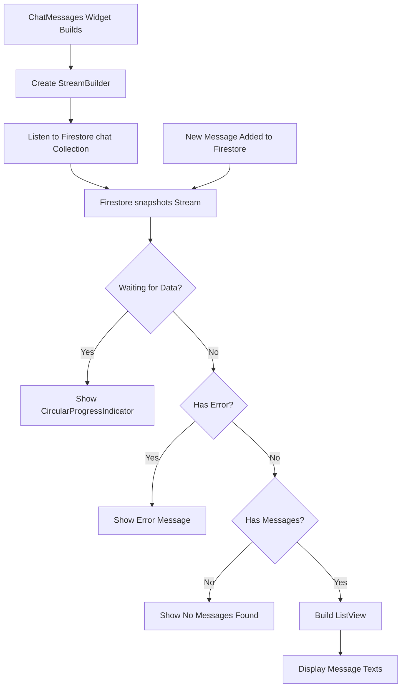
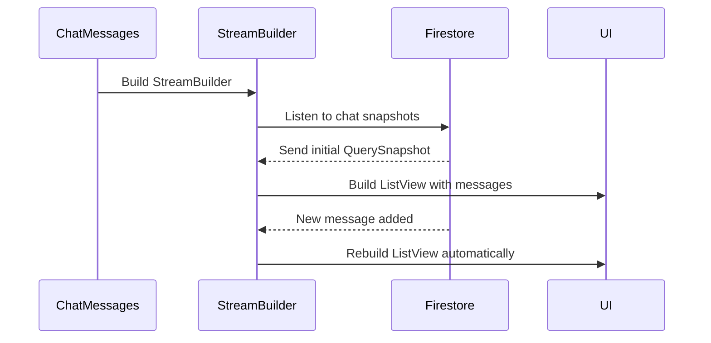
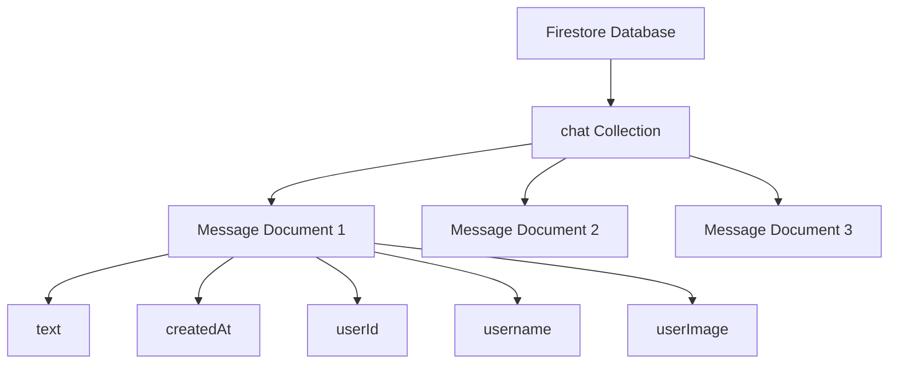
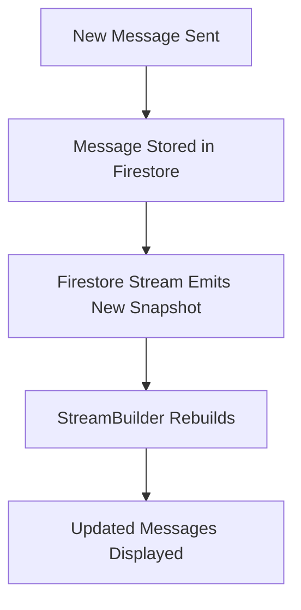

# Loading and Displaying Chat Messages as a Stream

## Overview

This lecture implements real-time loading and displaying of chat messages from Cloud Firestore.

Previously, messages could be sent to Firestore and stored inside the `chat` collection. Now, the app needs to read those messages and display them inside the `ChatMessages` widget.

To do this, the app uses a `StreamBuilder` together with Firestore's `snapshots()` method.

This allows the chat UI to update automatically whenever a new message is added to Firestore.

---

## Goal

The goal is to replace the temporary placeholder text:

```dart
Text('No messages found.')
```

with a real-time list of chat messages loaded from Firestore.

The app should:

1. Listen to the `chat` collection.
2. Receive messages as a stream.
3. Show a loading spinner while waiting.
4. Show a fallback message if there are no messages.
5. Show an error message if something goes wrong.
6. Display all loaded messages in a `ListView`.
7. Automatically update when new messages are added.

---

## Real-Time Message Loading Flow



---

## Why Use `StreamBuilder`?

A chat app should update in real time.

If one user sends a new message, the message list should update automatically without requiring a refresh.

Firestore supports this through the `snapshots()` method.

```dart
FirebaseFirestore.instance
    .collection('chat')
    .snapshots()
```

This returns a stream.

Whenever the `chat` collection changes, the stream emits a new snapshot, and the `StreamBuilder` rebuilds the UI.

---

## `get()` vs `snapshots()`

| Method        | Returns                 | Use Case                     |
| ------------- | ----------------------- | ---------------------------- |
| `get()`       | `Future<QuerySnapshot>` | Read data once               |
| `snapshots()` | `Stream<QuerySnapshot>` | Listen for real-time changes |

For chat messages, `snapshots()` is the better option because messages should update live.

---

## Firestore Stream

Inside `chat_messages.dart`, the stream is created from the `chat` collection.

```dart
FirebaseFirestore.instance
    .collection('chat')
    .snapshots()
```

This listens to all documents in the `chat` collection.

---

## Ordering Messages

Messages should be displayed in a predictable order.

Since every message document has a `createdAt` field, we can sort by that field.

```dart
FirebaseFirestore.instance
    .collection('chat')
    .orderBy('createdAt', descending: false)
    .snapshots()
```

This sorts messages from oldest to newest.

That means older messages appear at the top and newer messages appear at the bottom.

---

## Alternative Chat Ordering Pattern

Many chat apps use this pattern:

```dart
FirebaseFirestore.instance
    .collection('chat')
    .orderBy('createdAt', descending: true)
    .snapshots()
```

Together with:

```dart
reverse: true
```

This is useful when you want the newest messages to visually appear at the bottom while Firestore returns the newest messages first.

Both approaches can work.

For this lecture's basic version, sorting with `descending: false` is enough.

---

## StreamBuilder Structure

```dart
StreamBuilder(
  stream: FirebaseFirestore.instance
      .collection('chat')
      .orderBy('createdAt', descending: false)
      .snapshots(),
  builder: (ctx, chatSnapshots) {
    // Return different widgets based on stream state.
  },
)
```

The `builder` function receives:

| Value           | Meaning                                |
| --------------- | -------------------------------------- |
| `ctx`           | Build context                          |
| `chatSnapshots` | Current stream snapshot from Firestore |

---

## Handling the Loading State

When the stream is still waiting for its first data, show a loading spinner.

```dart
if (chatSnapshots.connectionState == ConnectionState.waiting) {
  return const Center(
    child: CircularProgressIndicator(),
  );
}
```

This gives feedback while Firestore is loading the initial messages.

---

## Handling Errors

Firestore reads may fail.

For example:

* Firestore rules block the request
* The user is not authenticated
* The collection path is wrong
* The network is unavailable

So it is useful to check for errors.

```dart
if (chatSnapshots.hasError) {
  return const Center(
    child: Text('Something went wrong...'),
  );
}
```

---

## Handling Empty Messages

If the `chat` collection has no documents, show a fallback message.

```dart
if (!chatSnapshots.hasData || chatSnapshots.data!.docs.isEmpty) {
  return const Center(
    child: Text('No messages found.'),
  );
}
```

This prevents the app from trying to build a list with no data.

---

## Accessing Loaded Messages

After the loading, error, and empty states are handled, the app can safely access the loaded documents.

```dart
final loadedMessages = chatSnapshots.data!.docs;
```

Each item in `loadedMessages` is a Firestore document snapshot.

---

## Reading Message Text

Each document contains a map of data.

To access the message text:

```dart
loadedMessages[index].data()['text']
```

A safer typed version is:

```dart
final chatMessage =
    loadedMessages[index].data() as Map<String, dynamic>;

return Text(chatMessage['text']);
```

---

## Building the Message List

The message list is displayed with `ListView.builder`.

```dart
return ListView.builder(
  itemCount: loadedMessages.length,
  itemBuilder: (ctx, index) {
    final chatMessage =
        loadedMessages[index].data() as Map<String, dynamic>;

    return Text(chatMessage['text']);
  },
);
```

`ListView.builder` is efficient because it only builds visible list items.

---

## Complete `chat_messages.dart`

```dart
import 'package:cloud_firestore/cloud_firestore.dart';
import 'package:flutter/material.dart';

class ChatMessages extends StatelessWidget {
  const ChatMessages({super.key});

  @override
  Widget build(BuildContext context) {
    return StreamBuilder(
      stream: FirebaseFirestore.instance
          .collection('chat')
          .orderBy('createdAt', descending: false)
          .snapshots(),
      builder: (ctx, chatSnapshots) {
        if (chatSnapshots.connectionState == ConnectionState.waiting) {
          return const Center(
            child: CircularProgressIndicator(),
          );
        }

        if (chatSnapshots.hasError) {
          return const Center(
            child: Text('Something went wrong...'),
          );
        }

        if (!chatSnapshots.hasData || chatSnapshots.data!.docs.isEmpty) {
          return const Center(
            child: Text('No messages found.'),
          );
        }

        final loadedMessages = chatSnapshots.data!.docs;

        return ListView.builder(
          itemCount: loadedMessages.length,
          itemBuilder: (ctx, index) {
            final chatMessage =
                loadedMessages[index].data() as Map<String, dynamic>;

            return Text(chatMessage['text']);
          },
        );
      },
    );
  }
}
```

---

## Improved Version With Padding

A slightly nicer version adds padding around the list.

```dart
return ListView.builder(
  padding: const EdgeInsets.only(
    bottom: 40,
    left: 13,
    right: 13,
  ),
  itemCount: loadedMessages.length,
  itemBuilder: (ctx, index) {
    final chatMessage =
        loadedMessages[index].data() as Map<String, dynamic>;

    return Text(chatMessage['text']);
  },
);
```

---

## ChatMessages Widget Flow



---

## Firestore Data Structure

The `chat` collection contains many message documents.



Example message document:

```json
{
  "text": "Hello!",
  "createdAt": "Timestamp",
  "userId": "firebase-user-id",
  "username": "max1",
  "userImage": "https://..."
}
```

---

## Why `createdAt` Is Important

The `createdAt` field allows messages to be sorted by time.

Without it, Firestore does not guarantee that messages will always appear in the correct order.

```dart
.orderBy('createdAt', descending: false)
```

This ensures that messages are displayed from oldest to newest.

---

## Real-Time UI Update

The biggest benefit of using `snapshots()` is that the UI updates automatically.

When a message is added with:

```dart
FirebaseFirestore.instance.collection('chat').add({...});
```

the `StreamBuilder` receives a new snapshot.

Then the `ListView` rebuilds and shows the new message.

No manual `setState()` is needed in `ChatMessages`.

---

## Why No Manual State Is Needed

The `StreamBuilder` handles updates automatically.



Because of this, `ChatMessages` can remain a `StatelessWidget`.

---

## Common Mistakes

### 1. Forgetting the Firestore import

```dart
import 'package:cloud_firestore/cloud_firestore.dart';
```

---

### 2. Forgetting to use `snapshots()`

For real-time updates, use:

```dart
.snapshots()
```

not:

```dart
.get()
```

---

### 3. Not checking the loading state

Always handle the initial waiting state.

```dart
if (chatSnapshots.connectionState == ConnectionState.waiting) {
  return const Center(
    child: CircularProgressIndicator(),
  );
}
```

---

### 4. Accessing `data` too early

Do not access:

```dart
chatSnapshots.data!.docs
```

before checking that data exists.

Use:

```dart
if (!chatSnapshots.hasData || chatSnapshots.data!.docs.isEmpty) {
  return const Center(
    child: Text('No messages found.'),
  );
}
```

---

### 5. Forgetting to order messages

Without `orderBy`, message order may not be reliable.

```dart
.orderBy('createdAt', descending: false)
```

---

### 6. Using the wrong collection name

The collection name must match the name used when sending messages.

If messages are stored in:

```dart
.collection('chat')
```

then they must also be loaded from:

```dart
.collection('chat')
```

---

## Testing the Feature

To test real-time message loading:

1. Run the app.
2. Log in.
3. Send a message.
4. The message should appear in the list automatically.
5. Open Firebase Console.
6. Go to Firestore Database.
7. Confirm the message exists in the `chat` collection.
8. Send another message.
9. The UI should update without restarting the app.

---

## Current Result

After this lecture, the app can:

* Send chat messages to Firestore
* Listen to chat messages in real time
* Display stored message text in the chat screen
* Automatically update when new messages are added

At this point, the messages are still displayed as simple `Text` widgets.

Later, they can be improved into styled message bubbles with usernames and profile images.

---

## Summary

This lecture loads and displays chat messages from Firestore as a real-time stream.

The `ChatMessages` widget uses:

```dart
FirebaseFirestore.instance
    .collection('chat')
    .orderBy('createdAt', descending: false)
    .snapshots()
```

inside a `StreamBuilder`.

The `StreamBuilder` automatically rebuilds whenever Firestore emits new data.

The loaded documents are displayed with `ListView.builder`.

This creates the first working real-time chat message list.
