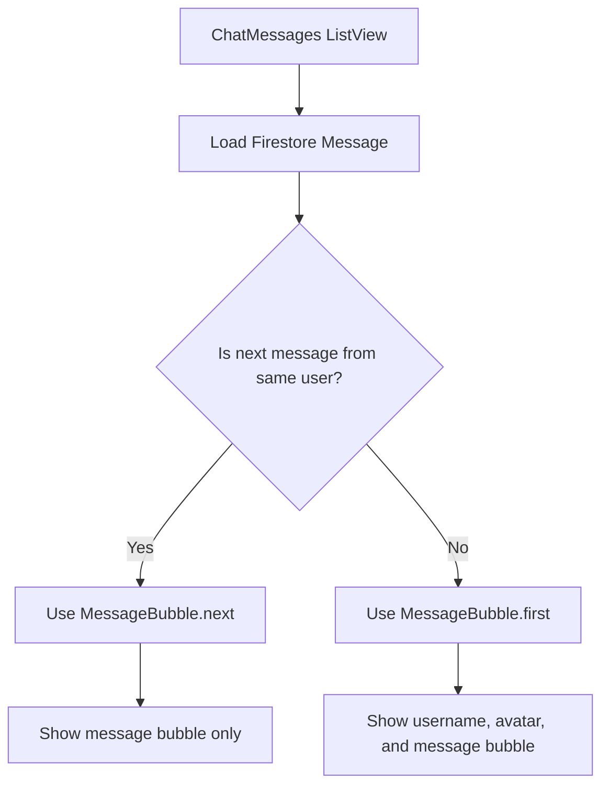
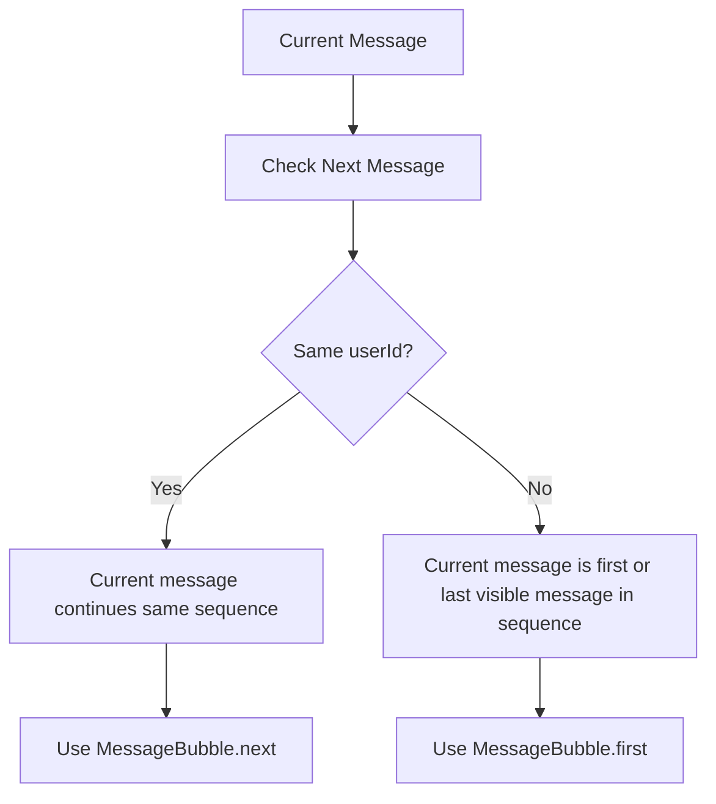
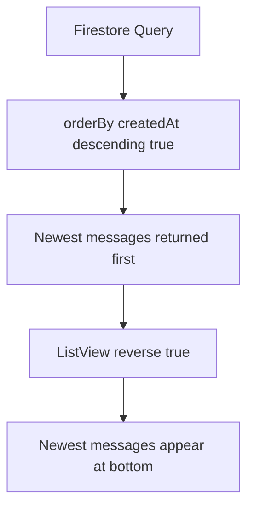
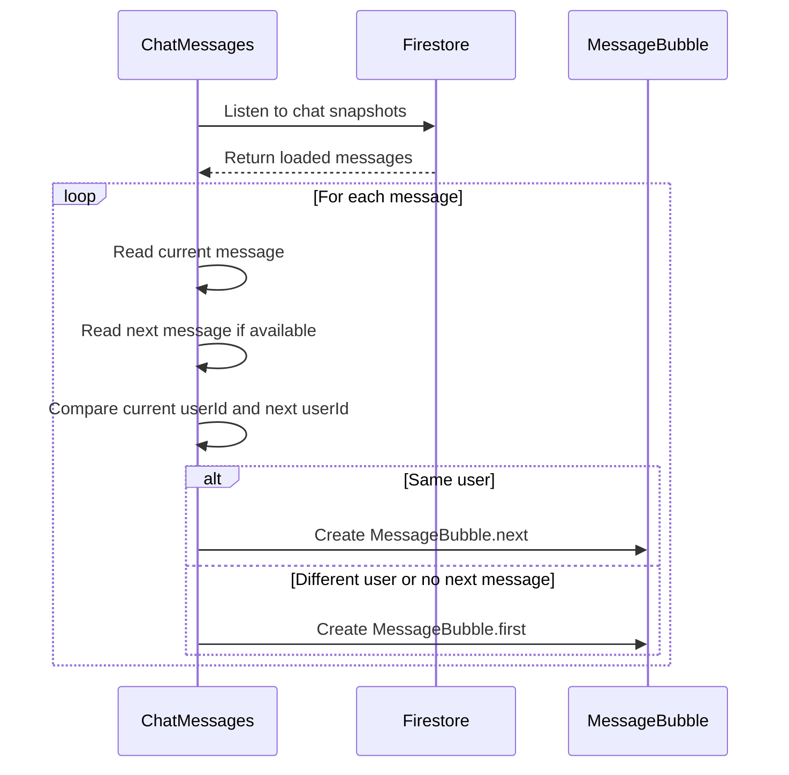
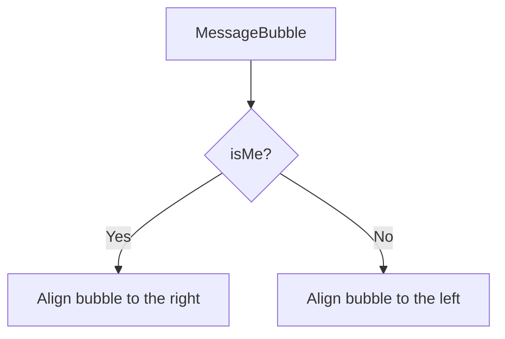
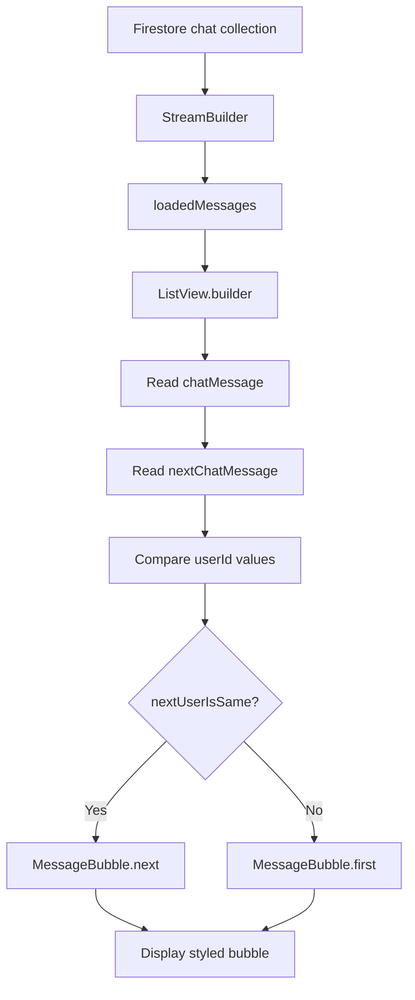

# Styling Chat Message Bubbles

## Overview

This lecture improves the chat UI by replacing plain text messages with styled chat message bubbles.

Previously, messages were loaded from Firestore and displayed as simple `Text` widgets. Now, each message will be shown inside a custom `MessageBubble` widget.

The message bubble displays:

* The chat message text
* The sender's username
* The sender's profile image
* Different alignment depending on whether the message was sent by the current user
* Grouped styling for consecutive messages from the same user

Messages sent by the current user appear on the right side.

Messages sent by other users appear on the left side.

---

## Goal

The goal is to make the chat screen look more like a real chat app.

Instead of this:

```text
Hello!
How are you?
Another message
```

The app should show styled bubbles like this:

```text
Other User
[avatar]  Hello!

                         My message  [avatar]
                         Another one
```

---

## Chat Bubble Layout



---

## Why Use a Separate `MessageBubble` Widget?

A chat bubble has a lot of styling logic.

It needs to decide:

* Which side of the screen the message appears on
* Which color the bubble should use
* Whether to show the username
* Whether to show the user image
* Whether this message starts a new sequence
* Which bubble corners should be rounded

Putting all of that directly inside `ChatMessages` would make the code harder to read.

So, the styling is moved into a reusable `MessageBubble` widget.

---

## Creating `message_bubble.dart`

Create a new file:

```text
lib/widgets/message_bubble.dart
```

This file contains the `MessageBubble` widget.

---

## `MessageBubble` Widget

```dart
import 'package:flutter/material.dart';

// A MessageBubble for showing a single chat message on the ChatScreen.
class MessageBubble extends StatelessWidget {
  // Create a message bubble which is meant to be the first in the sequence.
  const MessageBubble.first({
    super.key,
    required this.userImage,
    required this.username,
    required this.message,
    required this.isMe,
  }) : isFirstInSequence = true;

  // Create a message bubble that continues the sequence.
  const MessageBubble.next({
    super.key,
    required this.message,
    required this.isMe,
  })  : isFirstInSequence = false,
        userImage = null,
        username = null;

  // Whether or not this message bubble is the first in a sequence of messages
  // from the same user.
  final bool isFirstInSequence;

  // Image of the user to be displayed next to the bubble.
  // Not required if the message is not the first in a sequence.
  final String? userImage;

  // Username of the user.
  // Not required if the message is not the first in a sequence.
  final String? username;

  final String message;

  // Controls how the MessageBubble will be aligned.
  final bool isMe;

  @override
  Widget build(BuildContext context) {
    final theme = Theme.of(context);

    return Stack(
      children: [
        if (userImage != null)
          Positioned(
            top: 15,
            right: isMe ? 0 : null,
            child: CircleAvatar(
              backgroundImage: NetworkImage(
                userImage!,
              ),
              backgroundColor: theme.colorScheme.primary.withAlpha(180),
              radius: 23,
            ),
          ),
        Container(
          margin: const EdgeInsets.symmetric(horizontal: 46),
          child: Row(
            mainAxisAlignment:
                isMe ? MainAxisAlignment.end : MainAxisAlignment.start,
            children: [
              Column(
                crossAxisAlignment:
                    isMe ? CrossAxisAlignment.end : CrossAxisAlignment.start,
                children: [
                  if (isFirstInSequence) const SizedBox(height: 18),
                  if (username != null)
                    Padding(
                      padding: const EdgeInsets.only(
                        left: 13,
                        right: 13,
                      ),
                      child: Text(
                        username!,
                        style: const TextStyle(
                          fontWeight: FontWeight.bold,
                          color: Colors.black87,
                        ),
                      ),
                    ),
                  Container(
                    decoration: BoxDecoration(
                      color: isMe
                          ? Colors.grey[300]
                          : theme.colorScheme.secondary.withAlpha(200),
                      borderRadius: BorderRadius.only(
                        topLeft: !isMe && isFirstInSequence
                            ? Radius.zero
                            : const Radius.circular(12),
                        topRight: isMe && isFirstInSequence
                            ? Radius.zero
                            : const Radius.circular(12),
                        bottomLeft: const Radius.circular(12),
                        bottomRight: const Radius.circular(12),
                      ),
                    ),
                    constraints: const BoxConstraints(maxWidth: 200),
                    padding: const EdgeInsets.symmetric(
                      vertical: 10,
                      horizontal: 14,
                    ),
                    margin: const EdgeInsets.symmetric(
                      vertical: 4,
                      horizontal: 12,
                    ),
                    child: Text(
                      message,
                      style: TextStyle(
                        height: 1.3,
                        color: isMe
                            ? Colors.black87
                            : theme.colorScheme.onSecondary,
                      ),
                      softWrap: true,
                    ),
                  ),
                ],
              ),
            ],
          ),
        ),
      ],
    );
  }
}
```

---

## Two Constructors

The `MessageBubble` widget has two named constructors.

### `MessageBubble.first`

This constructor is used when the message is the first message in a sequence from a user.

```dart
MessageBubble.first(
  userImage: chatMessage['userImage'],
  username: chatMessage['username'],
  message: chatMessage['text'],
  isMe: authenticatedUser.uid == currentMessageUserId,
)
```

It shows:

* User image
* Username
* Message bubble

---

### `MessageBubble.next`

This constructor is used when the message continues a sequence from the same user.

```dart
MessageBubble.next(
  message: chatMessage['text'],
  isMe: authenticatedUser.uid == currentMessageUserId,
)
```

It only shows the message bubble.

The username and avatar are not repeated.

---

## Message Sequence Logic



---

## Why Check the Next Message?

The message list is reversed and ordered by newest messages first.

Because of that, when rendering a message, the app checks the next item in the list to know whether the following visible message belongs to the same user.

If the next message belongs to the same user, the current message is part of the same visual group.

If not, the current message should show the avatar and username.

---

## Updating the Message List Padding

In `chat_messages.dart`, add padding to the `ListView.builder`.

```dart
return ListView.builder(
  padding: const EdgeInsets.only(
    bottom: 40,
    left: 13,
    right: 13,
  ),
  reverse: true,
  itemCount: loadedMessages.length,
  itemBuilder: (ctx, index) {
    // Build message bubbles here.
  },
);
```

The bottom padding adds space between the message list and the input field.

The left and right padding prevent bubbles from touching the screen edges.

---

## Why Use `reverse: true`?

A chat UI usually keeps the newest messages at the bottom.

By setting:

```dart
reverse: true
```

the list starts from the bottom instead of the top.

This makes the chat feel more natural.

---

## Ordering Firestore Messages

Since the list is reversed, the Firestore query should order messages in descending order.

```dart
FirebaseFirestore.instance
    .collection('chat')
    .orderBy('createdAt', descending: true)
    .snapshots()
```

Combined with `reverse: true`, this keeps the latest message visually at the bottom.

---

## Ordering Flow



---

## Getting the Current User

The app needs to know whether each message belongs to the currently logged-in user.

At the beginning of the `build()` method in `ChatMessages`, get the authenticated user:

```dart
final authenticatedUser = FirebaseAuth.instance.currentUser!;
```

This user is used later to calculate `isMe`.

```dart
final isMe = authenticatedUser.uid == currentMessageUserId;
```

---

## Updated `chat_messages.dart`

```dart
import 'package:cloud_firestore/cloud_firestore.dart';
import 'package:firebase_auth/firebase_auth.dart';
import 'package:flutter/material.dart';

import 'package:flutter_chat/widgets/message_bubble.dart';

class ChatMessages extends StatelessWidget {
  const ChatMessages({super.key});

  @override
  Widget build(BuildContext context) {
    final authenticatedUser = FirebaseAuth.instance.currentUser!;

    return StreamBuilder(
      stream: FirebaseFirestore.instance
          .collection('chat')
          .orderBy('createdAt', descending: true)
          .snapshots(),
      builder: (ctx, chatSnapshots) {
        if (chatSnapshots.connectionState == ConnectionState.waiting) {
          return const Center(
            child: CircularProgressIndicator(),
          );
        }

        if (chatSnapshots.hasError) {
          return const Center(
            child: Text('Something went wrong...'),
          );
        }

        if (!chatSnapshots.hasData || chatSnapshots.data!.docs.isEmpty) {
          return const Center(
            child: Text('No messages found.'),
          );
        }

        final loadedMessages = chatSnapshots.data!.docs;

        return ListView.builder(
          padding: const EdgeInsets.only(
            bottom: 40,
            left: 13,
            right: 13,
          ),
          reverse: true,
          itemCount: loadedMessages.length,
          itemBuilder: (ctx, index) {
            final chatMessage =
                loadedMessages[index].data() as Map<String, dynamic>;

            final nextChatMessage = index + 1 < loadedMessages.length
                ? loadedMessages[index + 1].data() as Map<String, dynamic>
                : null;

            final currentMessageUserId = chatMessage['userId'];
            final nextMessageUserId = nextChatMessage != null
                ? nextChatMessage['userId']
                : null;

            final nextUserIsSame = nextMessageUserId == currentMessageUserId;

            if (nextUserIsSame) {
              return MessageBubble.next(
                message: chatMessage['text'],
                isMe: authenticatedUser.uid == currentMessageUserId,
              );
            } else {
              return MessageBubble.first(
                userImage: chatMessage['userImage'],
                username: chatMessage['username'],
                message: chatMessage['text'],
                isMe: authenticatedUser.uid == currentMessageUserId,
              );
            }
          },
        );
      },
    );
  }
}
```

---

## Message Bubble Decision Flow



---

## How `isMe` Works

The message bubble needs to know whether the message was sent by the logged-in user.

```dart
isMe: authenticatedUser.uid == currentMessageUserId
```

If this is `true`, the message is aligned to the right.

If this is `false`, the message is aligned to the left.

---

## Bubble Alignment



---

## Bubble Styling

The bubble uses a `Container` with a `BoxDecoration`.

```dart
Container(
  decoration: BoxDecoration(
    color: isMe
        ? Colors.grey[300]
        : theme.colorScheme.secondary.withAlpha(200),
    borderRadius: BorderRadius.only(
      topLeft: !isMe && isFirstInSequence
          ? Radius.zero
          : const Radius.circular(12),
      topRight: isMe && isFirstInSequence
          ? Radius.zero
          : const Radius.circular(12),
      bottomLeft: const Radius.circular(12),
      bottomRight: const Radius.circular(12),
    ),
  ),
)
```

The color and border radius change based on:

* Whether the message belongs to the current user
* Whether the message is first in a sequence

---

## Avatar Display Logic

The avatar is only shown if `userImage` is not `null`.

```dart
if (userImage != null)
  Positioned(
    top: 15,
    right: isMe ? 0 : null,
    child: CircleAvatar(
      backgroundImage: NetworkImage(userImage!),
      radius: 23,
    ),
  ),
```

This means avatars are shown only for `MessageBubble.first`.

They are not shown for `MessageBubble.next`.

---

## Username Display Logic

The username is only shown if `username` is not `null`.

```dart
if (username != null)
  Padding(
    padding: const EdgeInsets.only(
      left: 13,
      right: 13,
    ),
    child: Text(
      username!,
      style: const TextStyle(
        fontWeight: FontWeight.bold,
        color: Colors.black87,
      ),
    ),
  ),
```

This avoids repeating the same username above every message in a sequence.

---

## First vs Next Bubble

| Bubble Type           | Shows Avatar | Shows Username | Used When                             |
| --------------------- | -----------: | -------------: | ------------------------------------- |
| `MessageBubble.first` |          Yes |            Yes | First visible message in a sequence   |
| `MessageBubble.next`  |           No |             No | Continuing message from the same user |

---

## Example Visual Grouping

```text
Max
[avatar] Hello there!
         How are you?
         This is another message.

Anna
[avatar] Hi Max!
         I am good.
```

The avatar and username appear once per sequence.

---

## Why Use `Stack`?

The `MessageBubble` widget uses a `Stack` so the avatar can be positioned near the bubble.

```dart
return Stack(
  children: [
    if (userImage != null)
      Positioned(...),
    Container(...),
  ],
);
```

This allows the avatar to visually sit beside the bubble without affecting the main bubble layout too much.

---

## Why Use `BoxConstraints`?

The message bubble should not stretch across the entire screen.

```dart
constraints: const BoxConstraints(maxWidth: 200),
```

This keeps long messages readable and makes the layout look like a real chat app.

---

## Final Chat Message Rendering Flow



---

## Testing the Styled Chat UI

To test the feature:

1. Run the app.
2. Log in with an existing user.
3. Send a few messages.
4. Messages from the current user should appear on the right.
5. Log out.
6. Create or log in with another user.
7. Send more messages.
8. Messages from the second user should appear on the right for that user.
9. Messages from the first user should appear on the left.
10. Avatars and usernames should appear at the start of message groups.

---

## Common Mistakes

### 1. Forgetting to import `MessageBubble`

```dart
import 'package:flutter_chat/widgets/message_bubble.dart';
```

---

### 2. Forgetting to import Firebase Auth

`ChatMessages` needs the current user.

```dart
import 'package:firebase_auth/firebase_auth.dart';
```

---

### 3. Using username instead of userId for grouping

Two users could have the same username.

Use the unique Firebase UID instead.

```dart
final currentMessageUserId = chatMessage['userId'];
final nextMessageUserId = nextChatMessage?['userId'];
```

---

### 4. Forgetting `reverse: true`

Without `reverse: true`, messages may start at the top instead of the bottom.

```dart
reverse: true
```

---

### 5. Ordering messages incorrectly

When using `reverse: true`, use:

```dart
.orderBy('createdAt', descending: true)
```

This keeps the newest messages at the bottom visually.

---

### 6. Mixing up `username` and `userImage`

Make sure the correct Firestore fields are passed to the correct parameters.

```dart
MessageBubble.first(
  userImage: chatMessage['userImage'],
  username: chatMessage['username'],
  message: chatMessage['text'],
  isMe: authenticatedUser.uid == currentMessageUserId,
)
```

---

## Summary

This lecture styles the chat messages by introducing a reusable `MessageBubble` widget.

Instead of displaying plain text, each Firestore message is now rendered as a chat bubble.

The app checks whether consecutive messages belong to the same user and chooses between:

```dart
MessageBubble.first(...)
```

and:

```dart
MessageBubble.next(...)
```

The first bubble in a sequence shows the sender's username and profile image.

Following bubbles from the same user only show the message text.

Messages from the current user are aligned to the right, while messages from other users are aligned to the left.

This completes the main chat UI. The next major feature is adding push notifications.
